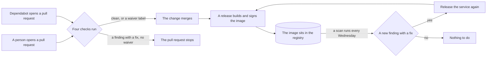
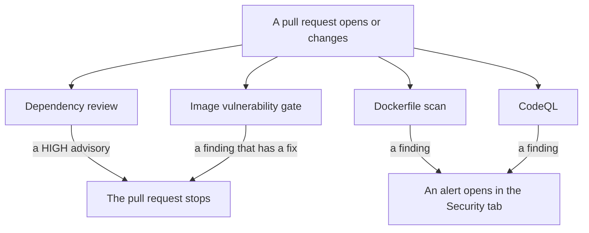
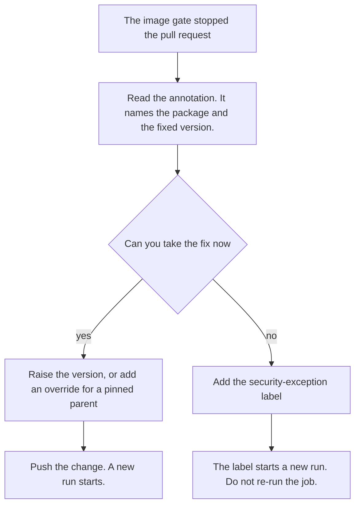
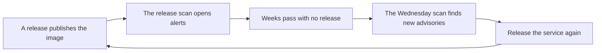
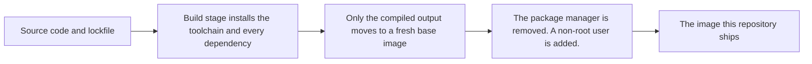
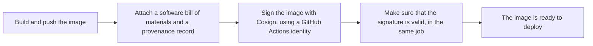

# Security process

This document explains how this repository manages three things: known vulnerabilities, dependency versions, and the images it builds and ships. It tells you what runs, when it runs, and what to do when a check stops your pull request.

To report a vulnerability, read [SECURITY.md](./SECURITY.md). This document does not cover disclosure.

## The whole process, at a glance

A pull request can come from a person or from Dependabot. Four checks run on it. Two checks can stop it. A merged change later becomes part of a release. A release builds an image, signs it, and pushes it to three registries. After that, a scan reads the published image every week, for as long as the image stays there.

| When | What happens |
|---|---|
| Every pull request | Four checks run. Two can stop the merge. |
| Friday, 06:00 Europe/Berlin | Dependabot opens up to 5 pull requests for each ecosystem. |
| Every release | The image is built, signed, and pushed. Two more scans run against it. |
| Wednesday, 06:00 UTC | A scan reads every published image again. |
| All the time | Dependabot re-reads the lockfiles on `main` for new advisories. |

This document covers the three parts of that picture in turn.

## 1. Vulnerability management

**Vulnerability management looks for known problems.** A published advisory names a package, a version range, and a severity. Four checks do this search.

### What runs on your pull request

Four checks run on every pull request. Two of them can stop it.

| Check | It reads | It stops the merge |
|---|---|---|
| Dependency review | the dependencies your pull request adds or changes, for npm and for Python | yes, at HIGH severity |
| Image vulnerability gate | the container image your pull request builds, before any push | yes, when a finding has a fix |
| Dockerfile scan | our own Dockerfiles | no |
| CodeQL | our source code, in three languages: GitHub Actions, JavaScript and TypeScript, and Python | no |

Every check runs on a stacked pull request. No check carries a branch filter.

#### Why the checks do not overlap

Two facts keep the four checks apart.

A Dockerfile is a build input. It never appears inside the image it builds. No image scan can read a Dockerfile.

An image holds software that no lockfile lists. Examples are a base operating system package, and a file that a build step adds by hand. No lockfile scan can find these.

### What to do when a check stops your pull request

#### The image vulnerability gate stopped it

The gate stops only on a finding that has a fix. Each finding gets one annotation. The annotation names the package, the version you have, and the version with the fix.

1. Read the annotation on the failed check.
2. Raise the version in the lockfile.
3. If a parent package pins the version exactly, add a pnpm override instead.
4. If you cannot take the fix now, add the `security-exception` label.

**Do not use Re-run jobs.** A re-run reads the event data of the first run. It never reads a label that you added after that run. Adding the label starts a new run by itself.

A finding with no fix does not stop the pull request. It becomes a warning.

#### The dependency review stopped it

The dependency review stops the merge when your change adds a dependency with a HIGH advisory. It writes a comment on the pull request that names the advisory.

1. Raise the version of the dependency you added.
2. If you cannot raise it, add the `security-exception` label.

#### An alert opened, and the pull request still merges

The Dockerfile scan and CodeQL open an alert. They stop nothing. Fix the finding, or dismiss the alert and give a reason.

### After a release

The release image scan runs after the image reaches the registry. It stops nothing. It is the only scan that opens and closes the image alerts on `main`.

An image does not change after we publish it. New vulnerabilities appear against it while nobody pushes a commit. The registry image scan finds them every Wednesday, at 06:00 UTC.

A second scan of the same image only adds findings. It never removes them. **To clear a finding in a published image, release the service again.** A fix in the tree does not change the image that we already published.

### Where each vulnerability result appears

| Result | Where to look |
|---|---|
| Dependency review | a check on the pull request, and a comment when it fails |
| Image vulnerability gate | a check on the pull request, with one annotation for each finding |
| Dockerfile scan | Security tab, code scanning, category `trivy-config` |
| CodeQL | Security tab, code scanning, one category for each language |
| Release image scan | Security tab, code scanning, category `trivy-image/<service>` |
| Registry image scan | Actions tab, a red run each Wednesday, with a table in the run summary |
| Dependabot alerts | Security tab, Dependabot |

## 2. Dependency management

**Dependency management looks for newer versions.** It does not ask whether a version is safe. The checks in [Vulnerability management](#1-vulnerability-management) ask that question, on the pull request Dependabot opens.

### Dependabot raises versions

Dependabot watches six kinds of dependency, called ecosystems. It reads `.github/dependabot.yaml` for the list.

| Ecosystem | What it covers | Label |
|---|---|---|
| npm | the root `pnpm-lock.yaml`, and every `package.json` | `npm` |
| uv | Python dependencies, under `packages/mcp-credential-auth` and every service | `uv` |
| docker | the base image in each Dockerfile | `docker` |
| github-actions | the actions this repository calls | `github-actions` |
| terraform | Terraform providers and modules, under each service | `terraform` |
| helm | Helm chart dependencies, under each service | `helm` |

Every pull request that Dependabot opens carries two labels: the ecosystem label above, and `dependencies`.

### When Dependabot opens a pull request

Dependabot looks for a newer version in each ecosystem on a schedule: Friday, at 06:00 Europe/Berlin. It can also open a pull request outside this time. A change to a manifest or a lock file on `main` can give it a new reason to run sooner.

Three settings shape what Dependabot does with what it finds:

- **A 3-day cooldown.** Dependabot waits 3 days after a version is out before it proposes that version. A version with a same-day problem does not reach you the same day.
- **A limit of 5 open pull requests, for each ecosystem.** Once 5 are open, Dependabot waits for one to close before it opens another.
- **One dependency for each pull request.** Dependabot does not combine unrelated packages into one change.

Dependabot does not rebase a pull request on its own. If `main` moves past it, update the branch yourself. You can also close the pull request, and wait for Dependabot to open it again.

### When your pull request changes a dependency

The dependency review runs immediately, on npm and on Python dependencies. See [The dependency review stopped it](#the-dependency-review-stopped-it) for what it does and how to respond.

### Dependabot alerts

Apart from opening pull requests, Dependabot also reads the lockfiles already on `main`, all the time. When a new advisory appears for a version you already merged, an alert opens in the Security tab, under Dependabot. Raise the version to close it.

## 3. Image and build management

**Image and build management covers how we build an image, and how we prove it is the exact image we shipped.** No vulnerability scan and no version check answers either question.

### How an image is built

Every service with a `deploy/Dockerfile` builds in two stages. The first stage installs the full toolchain and every dependency. The second stage starts from a fresh base image and copies in only the compiled output.

Four practices apply to every service:

- **The base image is pinned to one exact digest**, not to a tag such as `slim` or `latest`. A tag can point to a different image tomorrow. A digest cannot.
- **The build step removes the package manager from the final stage.** A Python image removes `pip`, and makes sure that Python can no longer import it. A Node.js image removes `npm` and `npx`. Code that reaches the running container then has no package manager to pull in more code.
- **The final stage runs `apt-get upgrade`** before it copies in application files. This step takes the newest operating system patches available at build time.
- **The container runs as a non-root user**, never as `root`.

### How a release is signed and proven

A release builds the image again, from the same Dockerfile. It pushes the image to three registries: GHCR (GitHub's container registry), and the Azure registries `uniquecr` and `getunique`. The matching Helm chart goes out to the same three destinations.

The build step attaches two records to the image itself:

- **A software bill of materials (SBOM).** It lists every package the image contains.
- **A provenance record.** It names the workflow, the commit, and the repository that produced the image.

After the push, the pipeline signs the image with [Cosign](https://github.com/sigstore/cosign). It uses a keyless GitHub Actions identity, not a stored key. The same job then makes sure that the new signature is valid, against that identity and against `main`.

Signing does not stop a deploy on its own. It gives anyone who deploys this image a way to make sure that it came from this repository. They run the same `cosign verify` command, with the same identity.

The pull request build, described in [What runs on your pull request](#what-runs-on-your-pull-request), skips signing. A pull request never pushes an image, so there is nothing yet to sign.

### License scanning

A release also scans the finished image for its open-source licenses. This scan fails nothing, and it writes no alert to the Security tab. Read its output in the log of the `security-trivy-license-scan` job, on the release workflow run.

### A published image is fixed

Signing proves what we shipped. It does not keep that image free of new findings. Once a version ships, its image does not change again. See [After a release](#after-a-release) for how this repository finds, and clears, a finding in an image already shipped.

## Labels

Two labels waive a check. A label that waives a check is named `<what>-exception`.

| Label | It waives |
|---|---|
| `security-exception` | the dependency review, and it reports image gate findings as warnings |
| `title-exception` | the pull request title check and the scope check |

`security-exception` waives two controls, not one. Use it only when you accept both.

`title-exception` is not a security waiver. It waives a naming check, unrelated to this document.

## Files

| File | What it holds |
|---|---|
| `.github/dependabot.yaml` | the ecosystems, the schedule, and the labels for dependency updates |
| `.github/workflows/dependency-review.yaml` | the dependency gate |
| `.github/workflows/_template-containerize.yaml` | the pull request image build, and the call to the gate |
| `.github/actions/container-image-vuln-gate/action.yml` | the gate itself |
| `.github/workflows/security-trivy-repo.yaml` | the Dockerfile scan |
| `.github/workflows/security-trivy-registry.yaml` | the Wednesday scan of published images |
| `.github/workflows/_template-cd.yaml` | the release build: push, sign, attest, the release image scan, and the license scan |
| `services/*/deploy/Dockerfile` | how each image is built and hardened |
