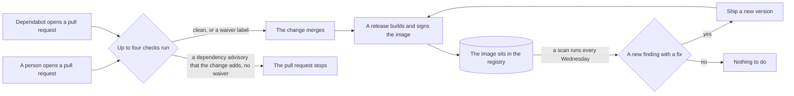
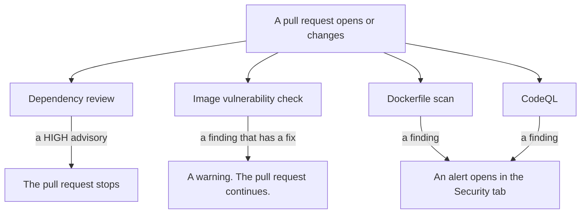
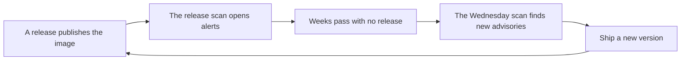
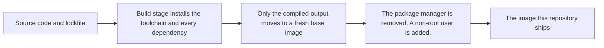
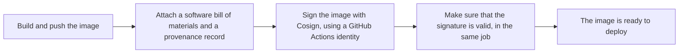

# Security process

This document explains how this repository manages three things: known vulnerabilities, dependency versions, and the images it builds and ships. It tells you what runs, when it runs, and what to do when a check stops your pull request.

To report a vulnerability, read [SECURITY.md](./SECURITY.md). This document does not cover disclosure.

## The whole process, at a glance

A pull request can come from a person or from Dependabot. Up to four checks run on it. One check can stop it. A merged change later becomes part of a release. A release builds an image, signs it, and pushes it to two registries. After that, a scan reads the published image every week, for as long as the image stays there.

```mermaid
flowchart LR
  author[A person opens a pull request] --> checks
  dependabot[Dependabot opens a pull request] --> checks
  checks{Up to four checks run} -->|clean, or a waiver label| merge[The change merges]
  checks -->|a dependency advisory that the change adds, no waiver| stop[The pull request stops]
  merge --> release[A release builds and signs the image]
  release --> registry[(The image sits in the registry)]
  registry -->|a scan runs every Wednesday| found{A new finding with a fix}
  found -->|yes| again[Ship a new version]
  found -->|no| quiet[Nothing to do]
  again --> release
```

| When | What happens |
|---|---|
| A pull request | Up to four checks run. The files that you change decide which. One can stop the merge. |
| Friday, 06:00 Europe/Berlin | Dependabot opens up to 5 pull requests for each ecosystem. |
| Every release | The image is built, signed, and pushed. Two more scans run against it. |
| Wednesday, 06:00 UTC | A scan reads every published image again. |
| All the time | Dependabot re-reads the lockfiles on `main` for new advisories. |

This document covers the three parts of that picture in turn.

## 1. Vulnerability management

A published advisory names a package, a version range, and a severity. Four checks search for a match against these advisories.

### What runs on your pull request

Up to four checks run on a pull request. One of them can stop it. The files that you change decide which checks run.

```mermaid
flowchart TD
  pr[A pull request opens or changes] --> deps[Dependency review]
  pr --> gate[Image vulnerability check]
  pr --> docker[Dockerfile scan]
  pr --> codeql[CodeQL]

  deps -->|a HIGH advisory| stop[The pull request stops]
  gate -->|a finding that has a fix| warn[A warning. The pull request continues.]
  docker -->|a finding| alert[An alert opens in the Security tab]
  codeql -->|a finding| alert
```

| Check | It reads | It stops the merge |
|---|---|---|
| Dependency review | the dependencies your pull request adds or changes, for npm and for Python | yes, at HIGH severity |
| Image vulnerability check | the container image your pull request builds, before any push | no, it reports a warning |
| Dockerfile scan | our own Dockerfiles | no |
| CodeQL | our source code: our workflow files, our JavaScript and TypeScript, and our Python | no |

This table shows which files start each check.

| Check | It runs when your pull request changes |
|---|---|
| Dependency review | `pnpm-lock.yaml`, a `package.json` or `uv.lock` under `services/`, or a file under `packages/` |
| Image vulnerability check | a file under `services/` or `packages/`, `pnpm-lock.yaml`, or a workflow file that builds or scans images |
| Dockerfile scan | any file |
| CodeQL | any file |

A file under `services/` starts the image build, even a docs file. The build only reports, so it does not stop the pull request.

Every check runs on a stacked pull request. No check carries a branch filter.

The Dockerfile scan runs twice: on your pull request, and again on every push to `main`. A merge is also a push, so the scan repeats right after your change lands.

GitHub Actions runs every check in this document. GitHub Actions is the platform, not a check.

#### Why the checks do not overlap

Two facts keep the four checks apart.

- **A Dockerfile is a build input.** It never appears inside the image it builds. No image scan can read a Dockerfile.
- **An image holds software that no lockfile lists.** Examples are a base operating system package, and a file that a build step adds by hand. No lockfile scan can find these.

#### Why only the dependency review stops a pull request

A pull request answers for what it changes. The dependency review compares your lockfile with the base branch. It stops the merge only for an advisory that your change adds.

The image scan reads the whole image. This includes packages that your change did not touch. A new advisory can change its result with no change from you. An author cannot fix an operating system package. So the image scan reports and never stops a pull request.

The image build uses fresh operating system packages. The final stage runs again on each build, with no build cache. A release does the same, so the pull request image shows what a release gets.

### The severity threshold

A threshold applies to every check in this document except CodeQL. The severity decides whether a check reports a finding, stops a pull request, or opens an alert. Some checks also need a fix to exist:

- The severity must be CRITICAL or HIGH.
- The image vulnerability check, the registry scan, and the release image scan also need a fix to exist.

| Check | Severity threshold | A fix must exist |
|---|---|---|
| Image vulnerability check | CRITICAL, HIGH | yes |
| Dockerfile scan | CRITICAL, HIGH | no condition set |
| Registry scan | CRITICAL, HIGH | yes |
| Release image scan | CRITICAL, HIGH | yes |
| Dependency review | HIGH and above, set by `fail-on-severity: high` | no condition set |
| License scan | UNKNOWN, HIGH, CRITICAL | not applicable |

Trivy is the tool behind the image vulnerability check, the Dockerfile scan, the registry scan, and the release image scan. No part of this document tracks a MEDIUM or LOW finding.

The license scan sets a wider threshold because an unclassified license is itself the finding. See [License scanning](#license-scanning).

The image vulnerability check reports only a finding that has a fix. It never stops a pull request.

### What to do when a check stops your pull request

#### The dependency review stopped it

The dependency review stops the merge when your change adds a dependency with a HIGH advisory. It writes a comment on the pull request that names the advisory.

1. Raise the version of the dependency you added.
2. If a parent package pins the version exactly, add a pnpm override instead.
3. If you cannot take the fix now, add the `security-exception` label.

**Do not use Re-run jobs.** A re-run reads the event data of the first run. It never reads a label that you added after that run. If you add the label, a new run starts by itself.

#### A finding was reported, and the pull request still merges

The Dockerfile scan and CodeQL open an alert. The image vulnerability check writes a summary and one warning for each finding. They stop nothing. Fix an alert, or dismiss it and give a reason. You do not need to act on an image warning. The weekly scan and the next release handle it.

### After a release

The release image scan runs after the image reaches the registry. It stops nothing. The weekly image scan uploads to the same alert category. Together they open and close the image alerts on `main`.

An image does not change after we publish it. New vulnerabilities appear against it while nobody pushes a commit. The registry image scan finds them every Wednesday, at 06:00 UTC. It turns the run red and opens an alert in the Security tab.

A second scan of the same image only adds findings. It never removes them. **To clear a finding in a published image, ship a new version.** A release builds the final stage again, so the new image takes new operating system patches and the locked dependencies on `main`. A fix in the tree does not change the image that we already published. This includes a finding you waived with `security-exception` before merge. See [Labels](#labels).

The manual re-run workflow of a service refuses a version that already has an image. An image never changes behind its tag.

A finding in an operating system package needs no code change, so no commit starts a release. The Rebuild Service workflow closes this gap. It opens one pull request for each service that you name. Each pull request changes only the date file `services/<service>/deploy/rebuild-date`.

1. Run the Rebuild Service workflow. Enter the service names, or `all`.
2. Merge the pull request that the workflow opens for each service.
3. Merge the release pull request that release-please opens.

To accept a finding in the weekly scan, add it to `.github/trivyignore.yaml`. Give the entry an `expired_at` date. Trivy ignores the entry after that date.

```mermaid
flowchart LR
  release[A release publishes the image] --> scan[The release scan opens alerts]
  scan --> quiet[Weeks pass with no release]
  quiet --> weekly[The Wednesday scan finds new advisories]
  weekly --> rebuild[Ship a new version]
  rebuild --> release
```

### Where each vulnerability result appears

| Result | Where to look |
|---|---|
| Dependency review | a check on the pull request, and a comment when it fails |
| Image vulnerability check | a summary on the pull request check, with one warning for each finding |
| Dockerfile scan | Security tab, code scanning, category `trivy-config` |
| CodeQL | Security tab, code scanning, one category for each language |
| Release image scan | Security tab, code scanning, category `trivy-image/<service>` |
| Registry image scan | Actions tab, a red run each Wednesday with a table in the run summary, and the Security tab under the same category |
| Dependabot alerts | Security tab, Dependabot |

## 2. Dependency management

Dependency management does not ask whether a version is safe. The checks in [Vulnerability management](#1-vulnerability-management) ask that question, on the pull request Dependabot opens.

### Dependabot raises versions

Dependabot watches six kinds of dependency, called ecosystems. It reads `.github/dependabot.yaml` for the list.

| Ecosystem | What it covers | Label |
|---|---|---|
| npm | the root `pnpm-lock.yaml`, and every `package.json` | `npm` |
| uv | Python dependencies, under `packages/mcp-credential-auth` and every service | `uv` |
| docker | the base image in each Dockerfile | `docker` |
| github-actions | the actions this repository calls | `github-actions` |
| terraform | Terraform providers and modules, under each service | `terraform` |
| helm | Helm chart dependencies, under each service | `helm` |

Every pull request that Dependabot opens carries two labels: the ecosystem label above, and `dependencies`.

### When Dependabot opens a pull request

Dependabot looks for a newer version in each ecosystem on a schedule: Friday, at 06:00 Europe/Berlin. It can also open a pull request outside this time. A change to a manifest or a lock file on `main` can give it a new reason to run sooner.

Three settings shape what Dependabot does with what it finds:

- **A 3-day cooldown.** Dependabot waits 3 days after a version is out before it proposes that version. A version with a same-day problem does not reach you the same day.
- **A limit of 5 open pull requests, for each ecosystem.** Once 5 are open, Dependabot waits for one to close before it opens another.
- **One dependency for each pull request.** Dependabot does not combine unrelated packages into one change.

Dependabot does not rebase a pull request on its own. If `main` moves past it, do one of the following:

- Update the branch yourself.
- Close the pull request, and wait for Dependabot to open it again.

### When your pull request changes a dependency

The dependency review runs immediately, on npm and on Python dependencies. See [The dependency review stopped it](#the-dependency-review-stopped-it) for what it does and how to respond.

### Dependabot alerts

Apart from opening pull requests, Dependabot also reads the lockfiles already on `main`, all the time. When a new advisory appears for a version you already merged, an alert opens in the Security tab, under Dependabot. Raise the version to close it.

## 3. Image and build management

No vulnerability scan and no version check covers how an image is built, or whether it is the image this repository shipped.

### How an image is built

Every service with a `deploy/Dockerfile` builds in stages. The early stages install the full toolchain and every dependency. The last stage starts from a fresh base image and copies in only the compiled output. A Python service has two stages. A Node.js service has five.

```mermaid
flowchart LR
  source[Source code and lockfile] --> build[Build stage installs the toolchain and every dependency]
  build --> copy[Only the compiled output moves to a fresh base image]
  copy --> harden[The package manager is removed. A non-root user is added.]
  harden --> image[The image this repository ships]
```

Four practices apply to every service:

- **The base image is pinned to one exact digest**, not to a tag such as `slim` or `latest`. A tag can point to a different image tomorrow. A digest cannot.
- **The build step removes the package manager from the final stage.** A Python image removes `pip`, and makes sure that Python can no longer import it. A Node.js image removes `npm` and `npx`. Code that reaches the running container then has no package manager to pull in more code.
- **The final stage runs `apt-get upgrade`** before it copies in application files. The pull request build and the release build run the final stage again on every build, with no build cache. Each build takes the newest operating system patches that exist at that time.
- **The container runs as a non-root user**, never as `root`.

### How a release is signed and proven

A release builds the image again, from the same Dockerfile. It pushes the image to two registries: GHCR (GitHub's container registry) and the Azure registry `uniquecr`. The matching Helm chart goes to those two registries and to the Azure registry `getunique`.

```mermaid
flowchart LR
  build[Build and push the image] --> attach[Attach a software bill of materials and a provenance record]
  attach --> sign[Sign the image with Cosign, using a GitHub Actions identity]
  sign --> verify[Make sure that the signature is valid, in the same job]
  verify --> done[The image is ready to deploy]
```

The build step attaches two records to the image itself:

- **A software bill of materials (SBOM).** It lists every package the image contains.
- **A provenance record.** It names the workflow, the commit, and the repository that produced the image.

After the push, the pipeline signs the image with [Cosign](https://github.com/sigstore/cosign). It uses a keyless GitHub Actions identity, not a stored key. The same job then makes sure that the new signature is valid, against that identity and against `main`.

Signing does not stop a deploy on its own. Anyone who deploys this image can run the same `cosign verify` command, with the same identity, to make sure that it came from this repository.

The pull request build, described in [What runs on your pull request](#what-runs-on-your-pull-request), skips signing. A pull request never pushes an image, so there is nothing yet to sign.

### License scanning

A release also scans the finished image for its open-source licenses. This scan fails nothing, and it writes no alert to the Security tab. Read its output in the log of the `security-trivy-license-scan` job, on the release workflow run.

It uses a wider threshold than the other scans: UNKNOWN, HIGH, and CRITICAL. See [The severity threshold](#the-severity-threshold).

### A published image is fixed

Signing proves where an image came from, not that the image stays free of new findings. Once a version ships, its image does not change again. See [After a release](#after-a-release) for how this repository finds, and clears, a finding in an image already shipped.

## Labels

One label waives a check: `security-exception`. Adding it needs write access to this repository, and no separate approval.

| Label | It waives |
|---|---|
| `security-exception` | the dependency review |

`security-exception` waives one control. The dependency review does not run.

Use it only when you accept the advisory.

**`security-exception` only changes what happens on your pull request.** It does not reach the release image scan or the registry image scan. Once you merge and release, the same finding can open a fresh alert in the Security tab, with no link back to this label.

## Files

| File | What it holds |
|---|---|
| `.github/dependabot.yaml` | the ecosystems, the schedule, and the labels for dependency updates |
| `.github/workflows/dependency-review.yaml` | the dependency review |
| `.github/workflows/_template-containerize.yaml` | the pull request image build and the report of its findings |
| `.github/workflows/security-trivy-repo.yaml` | the Dockerfile scan |
| `.github/workflows/security-trivy-registry.yaml` | the Wednesday scan of published images, with its alert upload |
| `.github/workflows/rebuild-service.yaml` | the workflow that opens a rebuild pull request for a service |
| `.github/trivyignore.yaml` | the findings that the Wednesday scan accepts, each with an expiry date |
| `.github/workflows/_template-cd.yaml` | the release build: the re-run guard, push, sign, attest, the release image scan, and the license scan |
| `services/*/deploy/Dockerfile` | how each image is built and hardened |
