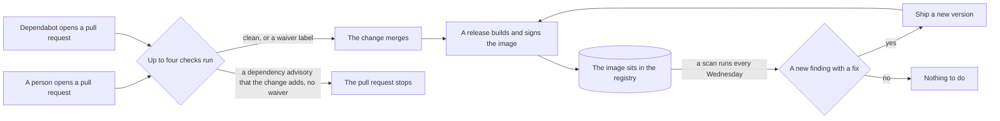
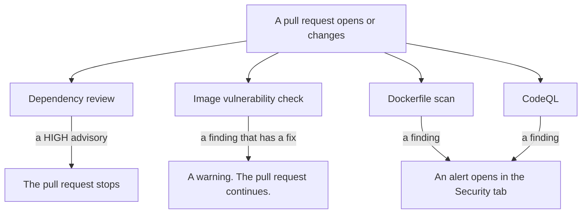
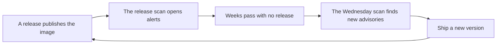

# Security process

This document explains how this repository manages three things: known vulnerabilities, dependency versions, and the images it builds and ships. It tells you what runs, when it runs, and what to do when a check stops your pull request. It also tells you what to do when a published image has a finding.

To report a vulnerability, read [SECURITY.md](./SECURITY.md). This document does not cover disclosure.

Section 1 shows the whole process. Sections 2 to 6 follow a change from pull request to published image. Section 7 lists every waiver.

## 1. The process at a glance

A pull request can come from a person or from Dependabot. Up to four checks run on it. One check can stop it. A merged change later becomes part of a release. A release builds an image, signs it, and pushes it to two registries. After that, a scan reads the latest image of each service every week.

```mermaid
flowchart LR
  author[A person opens a pull request] --> checks
  dependabot[Dependabot opens a pull request] --> checks
  checks{Up to four checks run} -->|clean, or a waiver label| merge[The change merges]
  checks -->|a dependency advisory that the change adds, no waiver| stop[The pull request stops]
  merge --> release[A release builds and signs the image]
  release --> registry[(The image sits in the registry)]
  registry -->|a scan runs every Wednesday| found{A new finding with a fix}
  found -->|yes| again[Ship a new version]
  found -->|no| quiet[Nothing to do]
  again --> release
```

| When | What happens |
|---|---|
| A pull request | Up to four checks run. The files that you change decide which. One can stop the merge. |
| Friday, 06:00 Europe/Berlin | Dependabot opens up to 5 pull requests for each ecosystem. |
| Every release | The image is built, signed, and pushed. Two more scans run against it. |
| Wednesday, 06:00 UTC | A scan reads the latest image of each service. |
| All the time | Dependabot re-reads the lockfiles on `main` for new advisories. |

## 2. The checks and scans

Seven checks and scans look for known problems. Some match packages against published advisories. The Dockerfile scan and CodeQL look for flaws in our own files and code.

| Name | Runs when | Reads | Reports | Stops a pull request | Where to look |
|---|---|---|---|---|---|
| Dependency review | a pull request changes `pnpm-lock.yaml`, a `package.json` or `uv.lock` under `services/`, or a file under `packages/` | the npm and Python dependencies that the pull request adds or changes | HIGH and above, set by `fail-on-severity: high` | yes | a check on the pull request, and a comment when it fails |
| Image vulnerability check | a pull request changes a file under `services/` or `packages/`, `pnpm-lock.yaml`, or a workflow file that builds or scans images | the image that the pull request builds, before any push | CRITICAL and HIGH, with a fix | no | a summary on the pull request check, with one warning for each finding |
| Dockerfile scan | a pull request changes any file, and every push to `main` | our own Dockerfiles | CRITICAL and HIGH | no | Security tab, code scanning, category `trivy-config` |
| CodeQL | a pull request changes any file | our workflow files, our JavaScript and TypeScript, and our Python | every finding | no | Security tab, code scanning, one category for each language |
| Release image scan | every release | the image after it reaches the registry | CRITICAL and HIGH, with a fix | no | Security tab, code scanning, category `trivy-image/<service>` |
| Registry image scan | every Wednesday, 06:00 UTC | the latest image of each service | CRITICAL and HIGH, with a fix | no, but the run turns red | Actions tab, a red run with a table in the run summary, and the Security tab under category `trivy-image/<service>` |
| License scan | every release | the finished image, for open-source licenses | UNKNOWN, HIGH, and CRITICAL | no | the log of the `security-trivy-license-scan` job on the release run |

These rules apply to the table:

- The image vulnerability check, the release image scan, and the registry image scan skip a finding that has no fix.
- The dependency review and the Dockerfile scan set no condition on a fix.
- A merge is also a push, so the Dockerfile scan repeats right after your change lands.
- Trivy is the tool behind five of the seven. They are the image vulnerability check, the Dockerfile scan, the release image scan, the registry image scan, and the license scan.
- The license scan also reports UNKNOWN, because an unclassified license is itself the finding. It writes no alert to the Security tab.
- The registry image scan reads only the latest version of each service. It does not read an older version.
- No part of this document tracks a MEDIUM or LOW finding.
- Dependabot alerts are a separate source. They appear in the Security tab, under Dependabot.
- GitHub Actions runs every check and scan in this document. It is the platform, not a check.
- Every check runs on a stacked pull request. No check carries a branch filter.

### Why the scans do not overlap

Two facts keep the scans apart.

- **A Dockerfile is a build input.** It never appears inside the image it builds. No image scan can read a Dockerfile.
- **An image holds software that no lockfile lists.** Examples are a base operating system package, and a file that a build step adds by hand. No lockfile scan can find these.

## 3. Pull requests

Up to four checks run on a pull request. The files that you change decide which checks run. The table in [The checks and scans](#2-the-checks-and-scans) gives the details.

```mermaid
flowchart TD
  pr[A pull request opens or changes] --> deps[Dependency review]
  pr --> gate[Image vulnerability check]
  pr --> docker[Dockerfile scan]
  pr --> codeql[CodeQL]

  deps -->|a HIGH advisory| stop[The pull request stops]
  gate -->|a finding that has a fix| warn[A warning. The pull request continues.]
  docker -->|a finding| alert[An alert opens in the Security tab]
  codeql -->|a finding| alert
```

### Why only the dependency review stops a pull request

A pull request answers for what it changes. The dependency review compares your lockfile with the base branch. It stops the merge only for an advisory that your change adds.

The image scan reads the whole image. This includes packages that your change did not touch. A new advisory can change its result with no change from you. An author cannot fix an operating system package. So the image scan reports and never stops a pull request.

The image build takes fresh operating system packages, so it shows what a release gets. See [How an image is built](#how-an-image-is-built).

A file under `services/` starts the image build, even a docs file. The build only reports, so it does not stop the pull request.

### If the dependency review stops your pull request

The dependency review stops the merge when your change adds a dependency with a HIGH advisory. It writes a comment on the pull request that names the advisory.

1. Raise the version of the dependency you added.
2. If a parent package pins the version exactly, add a pnpm override instead.
3. If you cannot take the fix now, add the `security-exception` label. See [Waivers](#7-waivers).

**Do not use Re-run jobs.** A re-run reads the event data of the first run. It never reads a label that you added after that run. If you add the label, a new run starts by itself.

### If a check reports and the pull request still merges

The Dockerfile scan and CodeQL open an alert. The image vulnerability check writes a summary and one warning for each finding. They stop nothing. Fix an alert, or dismiss it and give a reason. You do not need to act on an image warning. The weekly scan and the next release handle it.

## 4. Dependency management

Dependency management does not ask whether a version is safe. The dependency review asks that question, on the pull request Dependabot opens. See [Pull requests](#3-pull-requests).

### Dependabot raises versions

Dependabot watches five kinds of dependency, called ecosystems. It reads `.github/dependabot.yaml` for the list.

| Ecosystem | What it covers | Label |
|---|---|---|
| npm | the root `pnpm-lock.yaml`, and every `package.json` | `npm` |
| uv | Python dependencies, under `packages/mcp-credential-auth` and every service | `uv` |
| docker | the base image tag and digest in each Dockerfile | `docker` |
| github-actions | the actions this repository calls | `github-actions` |
| terraform | Terraform providers and modules, under each service | `terraform` |

Every pull request that Dependabot opens carries two labels: the ecosystem label above, and `dependencies`.

Dependabot does not watch Helm charts. Its Helm job fails on the OCI repository of the `base` chart. Update the version of that chart by hand.

### When Dependabot opens a pull request

Dependabot looks for a newer version in each ecosystem on a schedule, Friday at 06:00 Europe/Berlin. It can also open a pull request outside this time. A change to a manifest or a lock file on `main` can give it a new reason to run sooner.

Three settings shape what Dependabot does with what it finds:

- **A 3-day cooldown.** Dependabot waits 3 days after a version is out before it proposes that version. A version with a same-day problem does not reach you the same day.
- **A limit of 5 open pull requests, for each ecosystem.** Once 5 are open, Dependabot waits for one to close before it opens another.
- **One dependency for each pull request.** Dependabot does not combine unrelated packages into one change.

Dependabot does not rebase a pull request on its own. If `main` moves past it, do one of the following:

- Update the branch yourself.
- Close the pull request, and wait for Dependabot to open it again.

### Dependabot alerts

Dependabot also reads the lockfiles already on `main`, all the time. When a new advisory appears for a version you already merged, an alert opens in the Security tab, under Dependabot. Raise the version to close it.

## 5. Images and releases

No vulnerability scan and no version check covers how an image is built, or whether it is the image this repository shipped.

### How an image is built

Every service with a `deploy/Dockerfile` builds in stages. The early stages install the full toolchain and every dependency. The last stage starts from a fresh base image and copies in only the compiled output. A Python service has two stages. A Node.js service has five.

Four practices apply to every service:

- **The base image is pinned to one exact digest**, not to a tag such as `slim` or `latest`. A tag can point to a different image tomorrow. A digest cannot.
- **The build step removes the package manager from the final stage.** A Python image removes `pip`, and makes sure that Python can no longer import it. A Node.js image removes `npm` and `npx`. Code that reaches the running container then has no package manager to pull in more code.
- **The final stage runs `apt-get upgrade`** before it copies in application files. The pull request build and the release build run the final stage again on every build, with no build cache. Each build takes the newest operating system patches that exist at that time.
- **The container runs as a non-root user**, never as `root`.

### How a release works

A release starts when a `feat`, `fix`, or `build` commit changes a file in the service folder. release-please then opens a release pull request. The release starts when you merge that pull request.

The release does these steps:

1. It builds the image again, from the same Dockerfile. The build attaches a software bill of materials and a provenance record.
2. It pushes the image to two registries, GHCR and the Azure registry `uniquecr`. GHCR is the GitHub container registry.
3. It signs the image with Cosign, then makes sure that the signature is valid.
4. It pushes the matching Helm chart to those two registries and to the Azure registry `getunique`.
5. It runs the release image scan and the license scan against the image.

The build attaches two records to the image itself:

- **A software bill of materials, or SBOM.** It lists every package the image contains.
- **A provenance record.** It names the workflow, the commit, and the repository that produced the image.

The pipeline signs the image with [Cosign](https://github.com/sigstore/cosign). It uses a keyless GitHub Actions identity, not a stored key. The same job makes sure that the signature is valid, against that identity and against `main`.

A signature does not stop a deploy on its own. Anyone who deploys this image can run the same `cosign verify` command, with the same identity, to make sure that it came from this repository. A signature proves where an image came from. It does not prove that the image stays free of new findings.

The pull request build skips signing. A pull request never pushes an image, so there is nothing yet to sign.

The manual re-run workflow of a service refuses a version that already has an image. An image never changes behind its tag.

### Which changes start a release

release-please reads a commit by the files it changes. A change starts a release only when it changes a file in the service folder.

| Change | Starts a release on its own |
|---|---|
| A `feat`, `fix`, or `build` commit that changes a file in the service folder | yes |
| A Dependabot update of a base image, which changes a Dockerfile | yes |
| A Python lockfile update, which changes `uv.lock` in the service folder | yes |
| The Rebuild Service workflow, which changes `rebuild-date` in the service folder | yes |
| A Node.js lockfile update, because `pnpm-lock.yaml` sits at the repository root | no |
| A new operating system patch, because no file changes | no |

## 6. When a published image has a finding

An image does not change after we publish it. New vulnerabilities appear against it while nobody pushes a commit. The registry image scan finds them every Wednesday, at 06:00 UTC. It turns the run red and opens an alert in the Security tab. The release image scan uploads to the same alert category. Together they open and close the image alerts on `main`.

A second scan of the same image only adds findings. It never removes them. **To clear a finding in a published image, ship a new version.** A release builds the final stage again, so the new image takes new operating system patches and the locked dependencies on `main`. A fix in the tree does not change the image that we already published.

```mermaid
flowchart LR
  release[A release publishes the image] --> scan[The release scan opens alerts]
  scan --> quiet[Weeks pass with no release]
  quiet --> weekly[The Wednesday scan finds new advisories]
  weekly --> rebuild[Ship a new version]
  rebuild --> release
```

### What to do

Find the cause of the finding, then follow the matching row.

| Cause of the finding | What to do |
|---|---|
| A Python dependency | Raise the version in the service `uv.lock`. Merge the pull request. The merge starts a release. |
| A Node.js dependency | Raise the version in `pnpm-lock.yaml`, or add a pnpm override. The merge starts no release, so run the Rebuild Service workflow next. |
| An operating system package | Run the Rebuild Service workflow. The new build takes the patch. |
| The base image | Merge the Dependabot pull request for the base image. It changes a Dockerfile, so it starts a release. |
| A finding with no fix | Do nothing. The image scans skip it. |

### The Rebuild Service workflow

The Rebuild Service workflow starts a release when no file in the service folder changes. It opens one pull request for each service that you name. Each pull request changes only the date file `services/<service>/deploy/rebuild-date`.

1. Run the Rebuild Service workflow. Enter the service names, or `all`.
2. Merge the pull request that the workflow opens for each service.
3. Merge the release pull request that release-please opens.

## 7. Waivers

| Waiver | How to set it | What it does |
|---|---|---|
| The `security-exception` label | Add the label to the pull request. It needs write access to this repository, and no separate approval. | The dependency review does not run. |
| An entry in `.github/trivyignore.yaml` | Add the finding, and give the entry an `expired_at` date. | The registry image scan ignores the finding until that date. |
| A dismissed alert | Dismiss the alert in the Security tab, and give a reason. | The alert closes. |

Use the label only when you accept the advisory.

**The label only changes what happens on your pull request.** It does not reach the release image scan or the registry image scan. Once you merge and release, the same finding can open a fresh alert in the Security tab, with no link back to this label.

A finding that you waive with the label before merge stays in the published image. Only a new version clears it. See [When a published image has a finding](#6-when-a-published-image-has-a-finding).

## Files

| File | What it holds |
|---|---|
| `.github/dependabot.yaml` | the ecosystems, the schedule, and the labels for dependency updates |
| `.github/workflows/dependency-review.yaml` | the dependency review |
| `.github/workflows/_template-containerize.yaml` | the pull request image build and the report of its findings |
| `.github/workflows/security-trivy-repo.yaml` | the Dockerfile scan |
| `.github/workflows/security-trivy-registry.yaml` | the Wednesday scan of published images, with its alert upload |
| `.github/workflows/rebuild-service.yaml` | the workflow that opens a rebuild pull request for a service |
| `.github/trivyignore.yaml` | the findings that the Wednesday scan accepts, each with an expiry date |
| `.github/workflows/_template-cd.yaml` | the release build: the re-run guard, push, sign, attest, the release image scan, and the license scan |
| `services/*/deploy/Dockerfile` | how each image is built and hardened |
