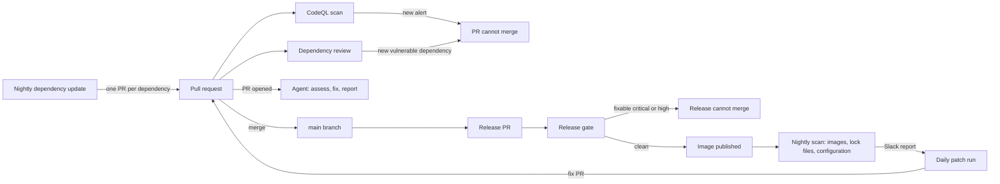

<!-- confluence-page-id: <NO CONFLUENCE ID REQUEST> -->
<!-- confluence-space-key: <NO CONFLUENCE ID REQUEST> -->

# Security process

This repository handles three kinds of security findings: code, dependencies, and images. This document shows how they connect. We follow the Confluence page "Vulnerability Patch Management Process", with the deviations listed below.

To report a vulnerability, read [SECURITY.md](./SECURITY.md). This document does not cover disclosure.

## The whole process

```mermaid
flowchart LR
  pr[Pull request] --> codeql[CodeQL scan]
  pr --> review[Dependency review]
  codeql -->|new alert| prStop[PR cannot merge]
  review -->|new vulnerable dependency| prStop
  nightlyUpdate[Nightly dependency update] -->|one PR per dependency| pr
  pr -->|PR opened| agent[Agent: assess, fix, report]
  pr -->|merge| main[main branch]
  main --> releasePr[Release PR]
  releasePr --> gate[Release gate]
  gate -->|fixable critical or high| relStop[Release cannot merge]
  gate -->|clean| published[Image published]
  published --> nightlyScan["Nightly scan: images, lock files, configuration"]
  nightlyScan -->|Slack report| patchRun[Daily patch run]
  patchRun -->|fix PR| pr
```

## The three kinds

| Kind | Tool | What blocks | Read |
|---|---|---|---|
| Code | CodeQL | A PR that adds an alert | [Code vulnerabilities](./docs/security/code-vulnerabilities.md) |
| Dependencies | Nightly update, lock file scan, dependency review | A PR that adds a vulnerable dependency | [Dependencies](./docs/security/dependencies.md) |
| Images | Trivy | A release PR with a fixable critical or high finding | [Image vulnerabilities](./docs/security/image-vulnerabilities.md) |

## The nightly timetable

| Time (UTC) | What runs |
|---|---|
| 02:00 | The dependency update opens its PRs. Each new PR starts an agent run. |
| 03:00 | The Trivy scan reads the published images, the lock files of `main`, and the Dockerfiles. It posts the Slack report. |
| 05:00 | The patch run reads the findings and opens fix PRs. The cache warming also runs. |

## Who starts what

| Part | What it is | It starts when |
|---|---|---|
| Nightly dependency job | The workflow `deps-nightly.yaml` | 02:00 UTC |
| Nightly Trivy scan | The workflow `security-trivy-nightly.yaml` | 03:00 UTC |
| CI | The test, lint, and build workflows, the dependency review, and CodeQL | A PR opens or changes |
| Gatekeeper | The check that waits for all other checks | A PR opens or changes |
| Release gate | The workflow `security-release-gate.yaml` | A release PR opens or changes |
| PR automation | The Cursor automation `connectors-dependency-pr-assess` | A PR opens |
| Cron automation | The Cursor automation `connectors-vulna-patchy` | 05:00 UTC |
| The skill | `vulna-squash`: the instructions that both automations run | An automation starts |
| Review | The skill `dependency-pr-review` | The skill `vulna-squash` runs it, or a person runs it on a dependency PR |
| A person | An engineer with write access | A report, a Slack message, or a red check |

## Labels

| Label | Set by | Read by | Meaning |
|---|---|---|---|
| `dependencies` | Nightly job | PR automation, gatekeeper title check, person | The PR comes from the nightly job. |
| `npm`, `uv`, `github-actions`, `docker`, `terraform` | Nightly job | A person | The ecosystem of the update. |
| `superseded` | Nightly job | Nightly job | The job closed this PR for a newer version. A person did not reject it. |
| `dependency-dashboard` | Nightly job | Person | The one issue that lists the plan and the open dependency PRs. |
| `ai-assisted` | Agent | Agent, nightly job | The agent handled the PR and posted its report. |
| `human-required` | Agent | Agent, nightly job, person | The agent cannot finish the PR. A person logs the Jira ticket and finishes the PR. |
| `security-exception` | Person | Release gate, dependency review | Skip the gate on this PR. |
| `title-exception` | Person | Gatekeeper title check | Skip the PR title check. |

## Where the state lives

| State | Where |
|---|---|
| The result of an agent run | The report comment on the PR, and the labels |
| What needs an image release | The Slack report and the Security tab |
| Which version a person rejected | A closed PR |
| Who skipped the release gate | The bot comment on the release PR |
| Which dependencies stay fixed | The pins: `override-dependencies` and `pnpm.overrides` |

## Setup that needs an admin

| What | Why |
|---|---|
| The secret `SLACK_SECURITY_WEBHOOK_URL` | The nightly scan posts the Slack report. Without it, the scan posts nothing. |
| The variable `DEPS_APP_CLIENT_ID` and the secret `DEPS_APP_PRIVATE_KEY` of a GitHub App with `contents`, `pull-requests`, and `workflows` write access | The nightly dependency update opens PRs with it. Without it, the job writes only its plan. |
| The check `release-gate` in the list `required_status_checks` of the ruleset code. See [The ruleset](./docs/security/code-vulnerabilities.md#the-ruleset). | A release PR cannot merge before the gate has run. Today the ruleset requires only `gatekeeper`. |
| The two Cursor automation files in the monorepo. Apply them with the Cursor Terraform. See [Cursor automations](#cursor-automations). | Cursor needs access to this repository and to the Slack channel `C0C1PR9CNMP`. Without the automations, no agent run starts. |

## Cursor automations

The monorepo defines the two automations in `.cursor/automations/workflows/*.yaml`. Terraform applies them. This repository does not define them. Both use the repository `Unique-AG/connectors`, the branch `main`, and the Slack channel `C0C1PR9CNMP`. Memory is off.

| Name | Trigger | Prompt |
|---|---|---|
| `connectors-vulna-patchy` | Cron `0 5 * * *` (05:00 UTC) | Run the skill `vulna-squash` in mode `findings`. |
| `connectors-dependency-pr-assess` | "Pull request opened" | Run the skill `vulna-squash` in mode `pr` for the PR of this event. |

The prompt names the skill only. All steps live in the skill. Cursor loads the skill from the repository that it checks out, so the skill lives here, in `agentic/skills/vulna-squash/`.

## DEVIATION from monorepo setup

We are a smaller team that iterates faster. Two rules differ from the monorepo and from the policy page.

1. **No image gate on pull requests.** Only the dependency review and CodeQL block a PR. The release gate blocks the release instead. A PR still builds the image, but it does not scan it. The release PR and the nightly scan do.
2. **Anyone with write access can skip the release gate.** The policy page asks for two approvals. We ask for the label `security-exception`. A bot comment on the release PR records who set it. See [Skip the release gate](./docs/security/image-vulnerabilities.md#skip-the-release-gate).
