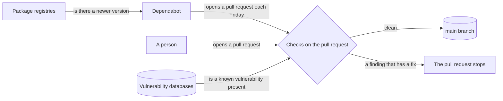
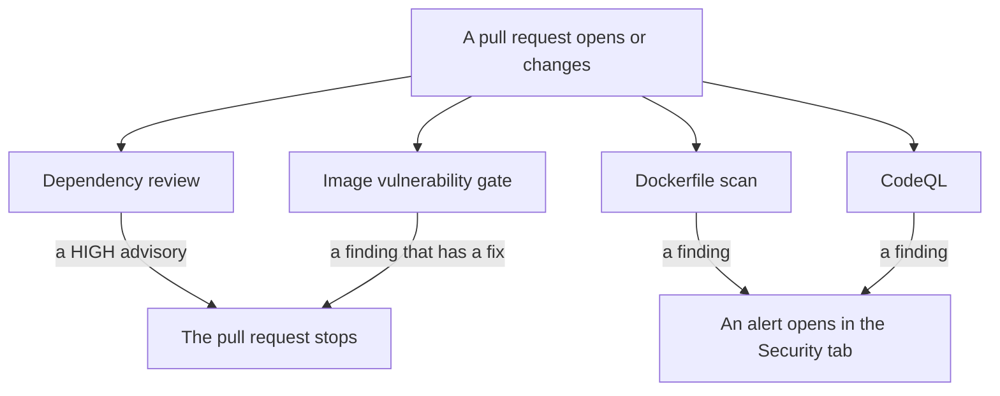
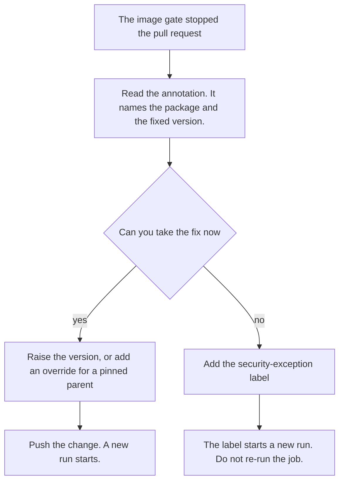
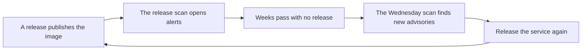

# Security scanning

This document explains how this repository looks for vulnerabilities. It tells you what runs, when it runs, and what to do when a check stops your pull request.

To report a vulnerability, read [SECURITY.md](./SECURITY.md). This document does not cover disclosure.

## Two tracks

Security work here has two tracks. Each track has one owner. No track examines what another track owns.

**Track A raises versions.** Dependabot owns it. It asks the package registries whether a newer version exists.

**Track B finds known vulnerabilities.** Four scans own it. They ask the vulnerability databases whether a known vulnerability is present.

The tracks are not parallel. Track A produces pull requests, and Track B examines them. A version bump therefore passes the same checks as a change you write yourself.

## When each check runs

There are four rhythms. No security scan runs every day.

| Rhythm | What runs | Effect |
|---|---|---|
| Every pull request | Dependency review, image vulnerability gate, Dockerfile scan, CodeQL | The first two stop a pull request. The last two open an alert. |
| Friday 06:00 Europe/Berlin | Dependabot opens pull requests | It opens up to 5 pull requests for each ecosystem. |
| Wednesday 06:00 UTC | Registry image scan | It fails its own run. It opens no alert. |
| Each release | Release image scan | It runs after the push, so it stops nothing. It opens alerts on `main`. |
| Continuous | Dependabot alerts | GitHub re-reads our lockfiles when a new advisory appears. |

Dependabot appears twice, and that is correct. Its weekly job opens pull requests. Its alerts run all the time against the lockfiles already on `main`.

## What runs on your pull request

Four checks run. Two of them can stop the merge.

| Check | It reads | It stops the merge |
|---|---|---|
| Dependency review | the dependencies your pull request adds or changes, for npm and for Python | yes, at HIGH |
| Image vulnerability gate | the container image your pull request builds, before any push | yes, when a finding has a fix |
| Dockerfile scan | our own Dockerfiles | no |
| CodeQL | our source code | no |

Every check runs on a stacked pull request. No check carries a branch filter.

### Why the checks do not overlap

Two facts keep them apart.

A Dockerfile is a build input. It never appears inside the image it builds. No image scan can read it.

An image holds software that no lockfile lists. Examples are a globally installed pnpm, the packages that pip vendors, and the packages of the base operating system. No lockfile scan can find them.

## What to do when a check stops your pull request

### The image vulnerability gate stopped it

The gate stops only on a finding that has a fix. Each finding gets one annotation. The annotation names the package, the version you have, and the version that carries the fix.

1. Read the annotation on the failed check.
2. Raise the version in the lockfile.
3. If a parent package pins the version exactly, add a pnpm override instead.
4. If you cannot take the fix now, add the `security-exception` label.

**Do not use Re-run jobs.** A re-run reads the event data of the first run. It never sees a label that you added after that run. Adding the label starts a new run by itself.

A finding with no fix does not stop the pull request. It becomes a warning.

### The dependency review stopped it

The dependency review stops the merge when your change adds a dependency with a HIGH advisory. It writes a comment on the pull request that names the advisory.

1. Raise the version of the dependency you added.
2. If you cannot raise it, add the `security-exception` label.

### An alert opened, and the pull request still merges

The Dockerfile scan and CodeQL open an alert. They stop nothing. Fix the finding, or dismiss the alert and give a reason.

## Where each result appears

Each scan writes to one place. There is one place to look for each kind of result.

| Result | Where to look |
|---|---|
| Dependency review | a check on the pull request, and a comment when it fails |
| Image vulnerability gate | a check on the pull request, with one annotation for each finding |
| Dockerfile scan | Security tab, code scanning, category `trivy-config` |
| CodeQL | Security tab, code scanning, one category for each language |
| Release image scan | Security tab, code scanning, category `trivy-image/<service>` |
| Registry image scan | Actions tab, a red run each Wednesday, with a table in the run summary |
| Dependabot alerts | Security tab, Dependabot |
| Dependabot updates | the pull request list, each Friday |

## Labels

Two labels waive a check. A label that waives a check is named `<what>-exception`.

| Label | It waives |
|---|---|
| `security-exception` | the dependency review, and it reports image gate findings as warnings |
| `title-exception` | the pull request title check and the scope check |

`security-exception` waives two controls, not one. Use it only when you accept both.

Dependabot also applies one label for each ecosystem. The label is exactly the `package-ecosystem` value from `.github/dependabot.yaml`: `npm`, `uv`, `docker`, `github-actions`, `terraform`, `helm`. Every Dependabot pull request also carries `dependencies`.

## After a release

The release image scan runs after the image reaches the registry. It therefore stops nothing. It is the only scan that opens and closes the image alerts on `main`.

An image does not change after we publish it. New vulnerabilities appear against it while nobody pushes a commit. The registry image scan finds them every Wednesday.

A second scan of the same image only adds findings. It never removes them. **To clear a finding in a published image, release the service again.** A fix in the tree does not change the image that we already published.

## Files

| File | What it holds |
|---|---|
| `.github/dependabot.yaml` | the ecosystems, the schedule, and the labels for Track A |
| `.github/workflows/dependency-review.yaml` | the dependency gate |
| `.github/workflows/_template-containerize.yaml` | the image build, and the call to the gate |
| `.github/actions/container-image-vuln-gate/action.yml` | the gate itself |
| `.github/workflows/security-trivy-repo.yaml` | the Dockerfile scan |
| `.github/workflows/security-trivy-registry.yaml` | the Wednesday scan of published images |
| `.github/workflows/_template-cd.yaml` | the release image scan |
