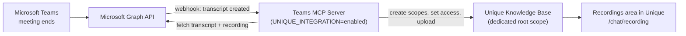

<!-- confluence-page-id: 2534866977 -->
<!-- confluence-space-key: PUBDOC -->

!!! note "Beta"
    **Recordings & Transcripts is in beta.** It is suitable for production use, with the following caveats:

    - **Breaking changes**: APIs, configuration, and behaviour may still change between versions; review release notes before upgrading
    - **Evolving feature set**: capabilities may be added, changed, or removed as the feature matures
    - **Support**: no formal SLA applies to beta software; issues are handled on a best-effort basis

## Is this feature for you?

!!! important "This feature copies meeting content into the Unique knowledge base"
    Recordings & Transcripts stores a **copy** of your Microsoft Teams meeting transcripts — and, where available, the meeting **video recordings** — inside the Unique knowledge base. If your organisation's policy does not allow meeting recordings or transcripts to be stored in Unique, this feature is not for you.

    You can still use the [Teams MCP Server](https://unique-ch.atlassian.net/wiki/spaces/PUBDOC/pages/1802633229/Teams-MCP) for Teams chat and channel messaging. In its default chat-only mode it ingests nothing at all — every message is fetched live from Microsoft Graph and no copy is kept in Unique.

| | Recordings & Transcripts | Teams MCP in chat-only mode |
|---|---|---|
| **Meeting content copied into Unique?** | **Yes** — transcripts and recordings are stored in the knowledge base | Not applicable — no meeting capture |
| **Teams messages copied into Unique?** | No — never, in either case | No — fetched live on every call |
| **Requires knowledge-base storage** | Yes | No |
| **Requires admin consent for meeting scopes** | Yes | No |
| **Extra infrastructure** | RabbitMQ, a Zitadel service account, a dedicated root scope | None beyond the server itself |

## Overview

Recordings & Transcripts gives users a searchable library of their Microsoft Teams meetings inside Unique. It has two halves, and both must be in place for the feature to work:

1. **Capture** — the [Teams MCP Server](https://unique-ch.atlassian.net/wiki/spaces/PUBDOC/pages/1802633229/Teams-MCP), running with the knowledge-base integration enabled, receives a webhook from Microsoft Graph whenever a meeting transcript becomes available. It fetches the transcript (and the video recording, if one exists), creates a folder structure in the Unique knowledge base, applies participant-based access, and uploads both files.
2. **Presentation** — the **Recordings** area in Unique (reachable from the main navigation, at `/chat/recording`) lists everything that was captured. Users can filter the list, watch the recording with the transcript synchronised alongside it, read AI-generated reports, share a meeting with colleagues, and open a chat about it.

Because capture happens through Teams MCP, **Teams MCP is a hard prerequisite** — there is no other supported way to populate the Recordings area today.

## Requirements

| Requirement | Details |
|-------------|---------|
| **Teams MCP Server** | Deployed with `UNIQUE_INTEGRATION=enabled`, a dedicated root scope, and a Zitadel service account — see the [Operator Manual](./operator.md) |
| **Microsoft Teams** | Meeting transcription enabled by policy; recordings require the meeting to actually be recorded |
| **Microsoft Entra ID** | Admin consent for `OnlineMeetingTranscript.Read.All` and `OnlineMeetingRecording.Read.All` — see [Grant admin consent](./operator.md#Grant-admin-consent) |
| **Graph transcript API access** | Tenant-wide Teams meeting setting `EnableGraphTranscriptAccess` must be **On** — separate from Entra consent; Unique cannot enable it via OAuth — see [Teams Graph transcript API access](./operator.md#Teams-Graph-transcript-API-access) |
| **Unique platform** | The Recordings area enabled via feature flag, pointed at the same root scope Teams MCP ingests into |
| **Knowledge-base storage** | Capacity for VTT transcripts and MP4 recordings; recordings are the dominant cost |

## What users see

### Recordings list

The **Recordings** entry in the main navigation opens a table of every captured meeting the user has access to:

- **Filters** — free-text search on the meeting title, plus filters for date, host, and participants
- **Columns** — title and duration, date, host, participants, and a per-row action menu
- **Actions** — **Share** to grant colleagues access, and **Delete** for users who hold knowledge-base write or admin permission
- Rows load progressively as the user scrolls

### Recording detail

Selecting a meeting opens its detail view:

- **Video playback** when a recording was captured, with the transcript panel synchronised to the playhead
- **Transcript** with speaker labels, in-transcript search, and click-to-seek — available even when no video exists
- **Meeting metadata** — date, duration, and the full participant list
- **Reports** — AI-generated summaries produced from the transcript, each expandable, with a refresh action for reports that are still being generated
- **Open chat** — starts a Unique chat in the configured space with the meeting as context

### Sharing and access

Access is derived from the meeting itself: the **organiser** receives read and write access, **participants** receive read access, and users are matched to Unique accounts by email or username. Anyone with access can additionally share a meeting from the list, granting **Can view**, **Can edit**, or **Can manage** to individual users or groups, or copy a direct link.

!!! note "Participants must exist in Unique"
    Access is only granted to meeting participants who resolve to a Unique account. External guests and participants without a Unique account are skipped — the meeting is still captured, they simply do not receive access to it.

## What is stored

| Artifact | Format | Indexed for search | Notes |
|---|---|---|---|
| Transcript | WebVTT (`text/vtt`) | Yes — fully ingested and searchable by Unique AI | The searchable representation of the meeting |
| Recording | MP4 (`video/mp4`) | No — stored for playback only | Uploaded with `SKIP_INGESTION`; no transcription or indexing is performed on the video |
| Reports | Unique report artifacts | Yes | Generated from the transcript by the platform's reporting engine |

Everything is written beneath a single dedicated root scope, one folder per meeting and one child scope per session, so a recurring series collapses into one folder with a child per occurrence. Content is attributed to the `Microsoft Teams` source, and the transcript and its recording are linked by a shared correlation id. See the [Technical Manual](./technical.md#knowledge-base-data-model) for the exact layout and metadata.

## User workflow

1. **Connect** (one-time) — the user connects their Microsoft account to the Teams MCP Server and grants consent
2. **Enable ingestion** (one-time) — the user calls the `start_kb_integration` tool, or the operator enables `UNIQUE_AUTO_START_INGESTION` so that connecting is enough
3. **Attend meetings** (ongoing) — any meeting with transcription enabled is captured automatically once the transcript becomes available; there is normally a delay of several minutes after the meeting ends
4. **Use the library** (ongoing) — the meeting appears in the Recordings area, is searchable by Unique AI, and remains available even if the user later disconnects their Microsoft account

To capture a meeting that predates the integration, or one that was missed, the user can ingest it explicitly with the `ingest_meeting` tool — see [Ingestion tools](./technical.md#ingestion-tools).

## Limitations and constraints

### Capture is forward-only

Meetings are captured from the moment a user enables ingestion. There is **no backfill** of earlier meetings and **no delta sync** to catch up on missed ones, because Microsoft Graph does not offer either capability to applications using delegated permissions. If a webhook subscription lapses, transcripts produced during the gap are lost permanently and must be pulled in individually with `ingest_meeting`. The full reasoning is in [Microsoft Graph constraints](./technical.md#microsoft-graph-constraints).

### Not supported

- **Real-time transcription** — only completed transcripts are processed, not live captions
- **Selective capture** — every meeting with transcription enabled is captured; there is no filter by organiser, meeting type, or title
- **Transcript formats other than VTT** — meetings whose transcript is not available as VTT are skipped silently
- **Very large recordings** — there is no application-level size limit, so a multi-hour recording may time out during download and be skipped; the transcript is still captured
- **Sources other than Microsoft Teams** — the Recordings area only shows content captured from Teams
- **On-demand report generation from the UI** — reports appear when the platform generates them; the user cannot trigger a new report from the Recordings area

### Retention

Deleting a meeting from the Recordings area removes the transcript, the correlated recording, and its reports from the Unique knowledge base. Disabling ingestion with `stop_kb_integration` stops future capture but **does not** delete anything already captured. Note that Microsoft applies its own expiration policy to transcripts and recordings on the Teams side (Microsoft's default is 120 days), which is independent of what Unique stores.

## Related Documentation

- [Operator Manual](./operator.md) — prerequisites, configuration, enablement checklist, and troubleshooting
- [Technical Manual](./technical.md) — architecture, ingestion pipeline, subscription lifecycle, tools, and data model
- [FAQ](./faq.md) — frequently asked questions

### Teams MCP

- [Teams MCP](https://unique-ch.atlassian.net/wiki/spaces/PUBDOC/pages/1802633229/Teams-MCP) — the MCP server that captures transcripts, and its chat and channel messaging tools
- [Teams MCP - Operator Manual](https://unique-ch.atlassian.net/wiki/spaces/PUBDOC/pages/1801683279/Teams+MCP+-+Operator+Manual) — deploying and operating the server
- [Teams MCP - Authentication](https://unique-ch.atlassian.net/wiki/spaces/PUBDOC/pages/1803026436/Teams+MCP+-+Authentication) — Entra ID app registration and admin consent
- [Teams MCP - Permissions](https://unique-ch.atlassian.net/wiki/spaces/PUBDOC/pages/1802240023/Teams+MCP+-+Permissions) — Microsoft Graph permissions with least-privilege justification

## Standard References

- [Microsoft Graph API](https://learn.microsoft.com/en-us/graph/overview) - Microsoft Graph documentation
- [Microsoft Graph Change Notifications](https://learn.microsoft.com/en-us/graph/webhooks) - Webhook subscription model
- [Limits and specifications for Microsoft Teams](https://learn.microsoft.com/en-us/microsoftteams/limits-specifications-teams) - Meeting and transcript expiration
- [WebVTT](https://developer.mozilla.org/en-US/docs/Web/API/WebVTT_API) - The transcript format
