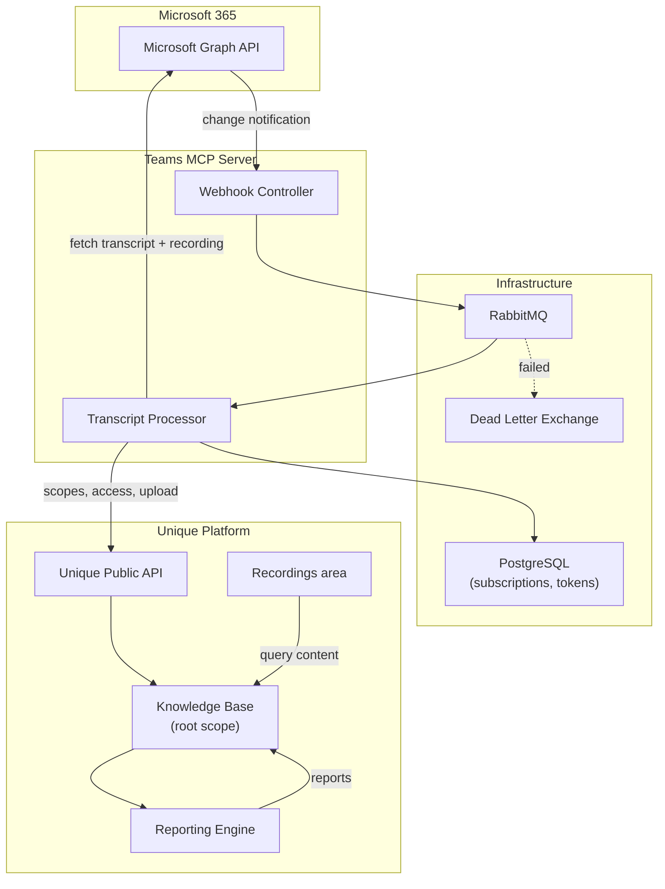
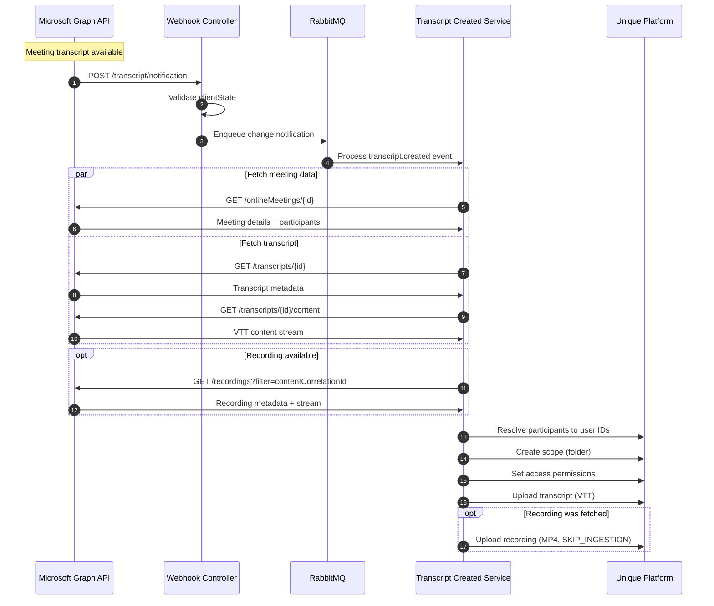
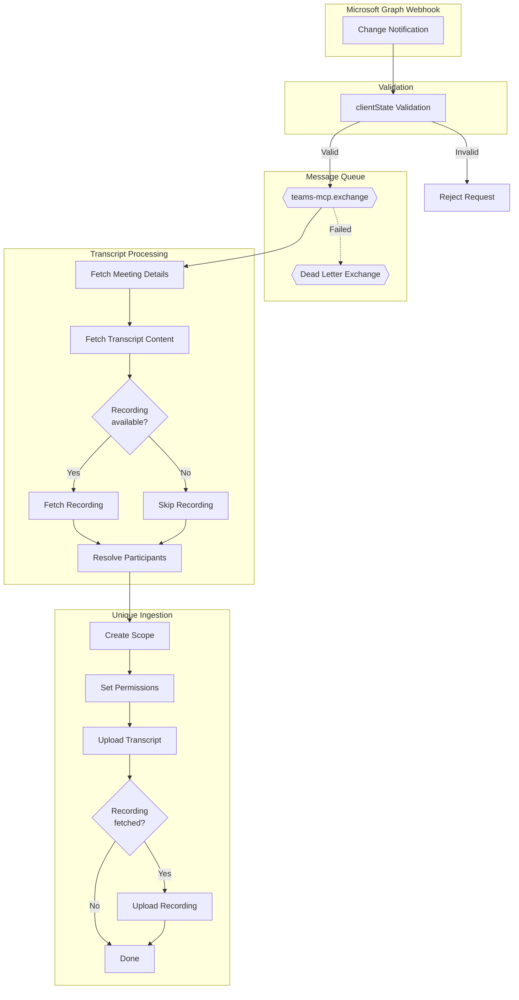
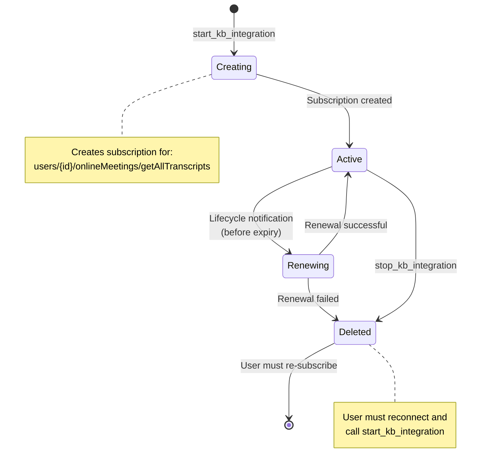
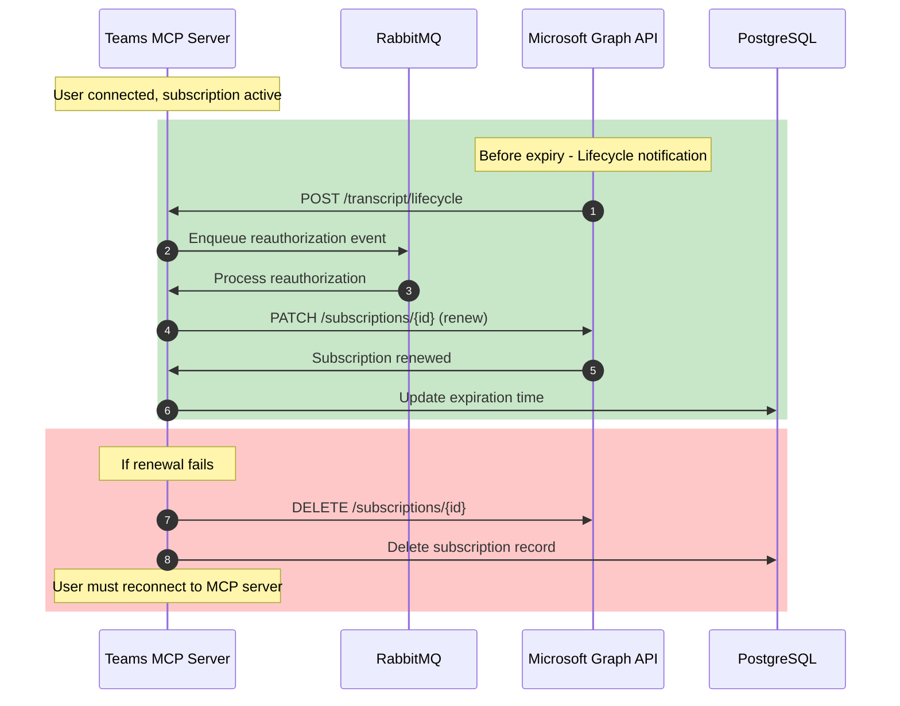

<!-- confluence-page-id: 2399993877 -->
<!-- confluence-space-key: PUBDOC -->

This page documents how meeting transcripts and recordings get from Microsoft Teams into the Unique knowledge base, and how the Recordings area reads them back out. For the server that performs the capture — its OAuth model, token handling, chat tools, and deployment — see the [Teams MCP - Technical Manual](https://unique-ch.atlassian.net/wiki/spaces/PUBDOC/pages/1802633247/Teams+MCP+-+Technical+Manual).

## Architecture

Capture is webhook-driven and asynchronous. Presentation is a normal read path against the knowledge base.



RabbitMQ is not optional for this feature. Microsoft requires a webhook endpoint to respond within **10 seconds**, while processing a transcript — database lookups, several Graph calls, participant resolution, and uploads — routinely takes 30 seconds or more. The queue decouples the two: the controller validates the notification, enqueues it, and returns `202 Accepted` immediately.

## Ingestion pipeline

When a meeting transcript becomes available, Microsoft Graph sends a change notification. The recording, if one exists, is located by correlating on `contentCorrelationId`.





**Webhook validation:** Microsoft Graph returns the `clientState` value supplied at subscription time with every notification. The server rejects any notification whose `clientState` does not match the configured `MICROSOFT_WEBHOOK_SECRET`.

**Recording handling:** the recording is located by `contentCorrelationId`. If it is unavailable the transcript is still ingested — recording failures are logged but never fail transcript processing. Recordings are uploaded with `SKIP_INGESTION`, so no chunking, embedding, or indexing is performed on the video file.

**Exchanges and queues:**

| Exchange | Type | Purpose |
|----------|------|---------|
| `unique.teams-mcp.main` | topic | Primary message routing |
| `unique.teams-mcp.dead` | topic | Failed message storage (DLX) |

| Queue | Purpose |
|-------|---------|
| `unique.teams-mcp.transcript.change-notifications` | Transcript processing |
| `unique.teams-mcp.transcript.lifecycle-notifications` | Subscription renewal and removal |
| `unique.teams-mcp.dead` | Dead letter collection |

**Failure handling:** a message that fails processing is nacked and routed to a Dead Letter Exchange, where it accumulates indefinitely — there is no automatic TTL or retry. Because no delta sync exists, a message in the DLQ is the only copy of that notification: discarding it without successful processing means the transcript is never ingested.

## Knowledge base data model

### Scope layout

Meetings are written beneath the configured root scope as a two-level structure:

```
<root scope>
└── <meeting subject> (<short hash of meeting id>)
    ├── 2026-07-20 14-03-11        ← one child scope per session
    │   ├── transcript (VTT)
    │   ├── recording (MP4)
    │   └── reports
    └── 2026-07-27 14-01-58
```

The subject folder is keyed on the meeting id, so every occurrence of a recurring series collapses into one folder while two unrelated meetings that happen to share a title stay separate. Each session gets its own child scope named from the session start time, so same-day occurrences cannot collide.

### Content attributes

| Attribute | Value |
|---|---|
| Source kind | `MICROSOFT_365_TEAMS` |
| Source name | `Microsoft Teams` |
| Transcript MIME type | `text/vtt` |
| Recording MIME type | `video/mp4` |
| Recording ingestion mode | `SKIP_INGESTION` (stored, not indexed) |

Metadata stamped on the ingested content includes `content_correlation_id` (shared by the transcript, its recording, and its reports), `subject`, `organizer_email`, `participant_emails`, `start_datetime`, and `end_datetime`.

### Access control

Access is applied at the scope level as part of ingestion:

- The meeting **organiser** receives **read and write** access
- Meeting **participants** receive **read** access
- Participants are resolved to Unique accounts by email or username; those that do not resolve are skipped

Later sharing from the Recordings area adds access on top of this, mapped as **Can view** → read, **Can edit** → write, **Can manage** → manage.

### How the Recordings area reads the data

The Recordings area queries the knowledge base rather than Teams MCP — it has no dependency on the server being reachable once content has been ingested:

1. The list query selects content with source kind `MICROSOFT_365_TEAMS` whose MIME type is `text/vtt` (the transcript is the primary record of a meeting)
2. The video is resolved by looking up content that shares the transcript's `content_correlation_id`
3. Reports are resolved the same way, filtered to report artifacts
4. Transcript, report, and video payloads are fetched as files; the video is streamed via a short-lived URL

Because every read is a normal knowledge-base read, standard access control applies: users only ever see the meetings they were granted access to.

## Subscription lifecycle

A Microsoft Graph webhook subscription must be active for meetings to be captured automatically. The server manages the whole lifecycle and exposes it through the tools described in [Ingestion tools](#Ingestion-tools).

!!! note "Transcripts only"
    This subscription covers meeting transcript capture. Teams chat and channel messages are read live through Microsoft Graph and are never subscribed to or ingested. The `ingest_meeting` tool does not require a subscription — it pulls a single meeting's transcript on demand.



### Creation

Ingestion is **opt-in per user**: a subscription is created when the user calls `start_kb_integration`, not automatically on connect — unless the operator sets `UNIQUE_AUTO_START_INGESTION`, which enqueues a subscription for every user at login.

1. `start_kb_integration` invokes the subscription create service
2. A Graph subscription is created for the resource `users/{providerUserId}/onlineMeetings/getAllTranscripts` with `changeType: created`
3. The subscription registers both a `notificationUrl` (transcript notifications) and a `lifecycleNotificationUrl` (lifecycle events), authenticated with the `clientState` webhook secret
4. The subscription record is stored in the database with the Graph subscription id and its expiration time

The expiration time is set to the next occurrence of the configured off-peak UTC hour (`MICROSOFT_SUBSCRIPTION_EXPIRATION_TIME_HOURS_UTC`), which batches all renewals into one predictable window.

### Renewal

Subscriptions are **renewed**, never recreated:



Microsoft sends a `reauthorizationRequired` lifecycle notification before expiry (timing is not guaranteed, but notifications arrive at least ~15 minutes ahead). The server PATCHes the subscription with a new expiration and updates its record.

Recreation is deliberately avoided because it **loses transcripts**: Microsoft Graph only notifies about transcripts created while a subscription is active, so the gap between a `DELETE` and the following `POST` is a permanent hole. Renewal keeps the subscription continuously active, preserves the subscription id, and costs fewer API calls.

The database is the source of truth: a lifecycle notification for a subscription id that has no matching record is ignored.

### Status

| Status | Meaning | Action |
|--------|---------|--------|
| `active` | Subscription valid, more than 15 minutes until expiry | None required |
| `expiring_soon` | 15 minutes or less until expiry | Renewal is automatic; no action needed |
| `expired` | Subscription has lapsed | Call `start_kb_integration` |
| `not_configured` | No subscription exists | Call `start_kb_integration` |

### Subscription failure handling

Microsoft Graph sends lifecycle notifications when a subscription's state changes. The server acts on two of them automatically and discards the rest.

| Condition | What happens | User action required? |
|-----------|-------------|----------------------|
| `reauthorizationRequired` lifecycle event | Server PATCHes the subscription with a new expiration time | No |
| `subscriptionRemoved` lifecycle event | Server deletes the local record (Graph has already removed it) — capture stops | Yes — call `start_kb_integration` |
| Other lifecycle events (e.g. `missed`) | Discarded and logged; no recovery action is taken | No, but missed transcripts are not recovered |
| Subscription expired (missed renewal) | Status reports `expired`; no notifications arrive | Yes — call `start_kb_integration` |
| No subscription exists | Status reports `not_configured` | Yes — call `start_kb_integration` |

!!! warning "No automatic gap recovery"
    There is no catch-up pass for transcripts missed while a subscription was lapsed, or after a `missed` lifecycle event. To capture a specific meeting whose transcript was not ingested, use `ingest_meeting` with the meeting's join URL.

## Ingestion tools

These four MCP tools are registered **only** when `UNIQUE_INTEGRATION=enabled`. Chat-only deployments do not expose them. For the eight chat and messaging tools, see [Teams MCP - Tools](https://unique-ch.atlassian.net/wiki/spaces/PUBDOC/pages/2398519349/Teams+MCP+-+Tools).

| Tool | Mutating | Description |
|------|----------|-------------|
| [`ingest_meeting`](#ingest_meeting) | Yes | Ingest a specific meeting's transcript on demand |
| [`verify_kb_integration_status`](#verify_kb_integration_status) | No | Check the capture subscription status |
| [`start_kb_integration`](#start_kb_integration) | Yes | Start automatic capture |
| [`stop_kb_integration`](#stop_kb_integration) | Yes | Stop automatic capture |

### `ingest_meeting`

Ingest a specific Teams meeting's transcript on demand, identified by its join URL. Use this to capture a meeting that predates the integration, or to re-pull a single occurrence. The caller must be the organiser or an invited attendee. Ingestion runs asynchronously; the tool returns once the transcript is queued.

!!! note "Interactive transcript selection"
    When a recurring meeting has multiple transcripts and no `date` is given, the tool prompts the user to choose via MCP elicitation. If the client does not support elicitation, pass an explicit `date` (`YYYY-MM-DD`).

**Input parameters:**

| Parameter | Type | Required | Default | Description |
|-----------|------|----------|---------|-------------|
| `joinUrl` | string (URL) | Yes | — | The Teams meeting join URL (`joinWebUrl`). You must be the organizer or an invited attendee. |
| `date` | string (ISO date) | No | — | Day (`YYYY-MM-DD`, UTC) to pick a transcript when a recurring meeting has several. |

**Returns:** `success`, a human-readable `message`, `meeting` (`id`, `subject`, `joinUrl` — or `null` if not found), and `queued` (array of `{ transcriptId, createdDate }` for each transcript queued for ingestion).

**Example:**

```json
{
  "success": true,
  "message": "Queued 1 transcript(s) for ingestion. They will appear in the knowledge base shortly.",
  "meeting": { "id": "MSo...", "subject": "Q2 Planning", "joinUrl": "https://teams.microsoft.com/l/meetup-join/..." },
  "queued": [{ "transcriptId": "MSMjMCMj...", "createdDate": "2024-06-01T10:05:00.000Z" }]
}
```

### `verify_kb_integration_status`

Check whether automatic capture is active, expiring soon, expired, or not configured.

**Input parameters:** None

**Returns:** `status` (`active` \| `expiring_soon` \| `expired` \| `not_configured`), a `message`, and `subscription` (`id`, `expiresAt`, `minutesUntilExpiration`, `createdAt`, `updatedAt` — or `null` when not configured). See [Status](#Status) for the meaning of each value.

### `start_kb_integration`

Start automatic capture of meeting transcripts. Safe to call at any time — it is idempotent and inspects the existing subscription before acting:

- **No subscription exists:** creates a new subscription (`created`)
- **Valid subscription, more than 15 minutes until expiry:** returns `already_active`, no changes made
- **Valid subscription, expiring within 15 minutes:** returns `expiring_soon`, no changes made — automatic renewal is either in progress or imminent, so a new subscription is deliberately not forced (avoids racing an in-flight renewal)
- **Expired subscription:** deletes the lapsed record and creates a fresh subscription (`created`)

**Input parameters:** None

**Returns:** `success`, a `message`, and `subscription` (`id`, `expiresAt`, `minutesUntilExpiration`, `status` — one of `created`, `already_active`, `expiring_soon`).

### `stop_kb_integration`

Stop automatic capture. Deletes the local subscription record (the source of truth) and then issues `DELETE /subscriptions/{id}` to Microsoft Graph.

**Previously ingested transcripts and recordings remain in the Unique knowledge base** — this tool does not delete content. To resume capture, call `start_kb_integration` again.

**Input parameters:** None

**Returns:** `success`, a `message`, and `subscription` (`id`, `status` — `removed` or `not_found` — or `null` when nothing was active).

!!! note "Graph deletion is best-effort"
    Because the database is the source of truth, the local record is removed first. If the subsequent Graph `DELETE` fails, the orphaned Graph subscription is harmless: any later notification it produces is discarded because no matching record exists.

## Microsoft Graph constraints

The following limits originate in the Microsoft Graph API and cannot be worked around while using **delegated permissions**. Delegated permissions are what allow a user to connect their own Microsoft account without IT involvement; switching to application permissions would lift these limits but would require tenant administrators to configure [Application Access Policies](https://learn.microsoft.com/en-us/graph/cloud-communication-online-meeting-application-access-policy) via PowerShell for every individual user.

### No delta sync

Microsoft Graph exposes delta APIs for transcripts and recordings:

```
GET /users/{userId}/onlineMeetings/getAllTranscripts(...)/delta
GET /users/{userId}/onlineMeetings/getAllRecordings(...)/delta
```

They support both full initial synchronisation and incremental sync, but only with application permissions:

| Permission type | Support |
|---|---|
| Delegated (work or school account) | **Not supported** |
| Delegated (personal Microsoft account) | **Not supported** |
| Application | `OnlineMeetingTranscript.Read.All` / `OnlineMeetingRecording.Read.All` |

Capture therefore relies entirely on real-time change notifications, which cover everything going forward but cannot recover anything missed during a subscription gap.

Source: [callTranscript: delta](https://learn.microsoft.com/en-us/graph/api/calltranscript-delta) · [callRecording: delta](https://learn.microsoft.com/en-us/graph/api/callrecording-delta)

### No historical or full sync

The only API that lists transcripts across all of a user's meetings without knowing meeting ids in advance is `getAllTranscripts`:

```
GET /users/{userId}/onlineMeetings/getAllTranscripts(meetingOrganizerUserId='{userId}',startDateTime=...)
```

It, too, requires application permissions. With delegated permissions the only available path is `GET /users/{userId}/onlineMeetings/{meetingId}/transcripts`, which needs the meeting id up front — so bulk enumeration of past meetings is impossible. Meetings that took place before a user enabled capture can only be ingested one at a time with `ingest_meeting`.

Source: [onlineMeeting: getAllTranscripts](https://learn.microsoft.com/en-us/graph/api/onlinemeeting-getalltranscripts)

**Additional limits on historical data, even with application permissions:**

- Transcripts are only accessible for meetings that have not expired. One-time meetings expire 60 days after their scheduled time; recurring meetings with no end date expire one year after the last activity.
- Recording and transcript files are subject to the tenant's admin-configured expiration policy (Microsoft's default: 120 days after creation).

Source: [Limits and specifications for Microsoft Teams](https://learn.microsoft.com/en-us/microsoftteams/limits-specifications-teams)

## Required Microsoft Graph permissions

Capture requires three delegated scopes **in addition to** the chat and messaging scopes every Teams MCP server requests. A chat-only deployment requests none of these three — they exist only when `UNIQUE_INTEGRATION=enabled`.

| Permission | Type | ID | Admin consent | Why it is needed |
|------------|------|-----|---------------|------------------|
| `OnlineMeetings.Read` | Delegated | `9be106e1-f4e3-4df5-bdff-e4bc531cbe43` | No | Read online meeting metadata by id |
| `OnlineMeetingTranscript.Read.All` | Delegated | `30b87d18-ebb1-45db-97f8-82ccb1f0190c` | **Yes** | Read transcript content |
| `OnlineMeetingRecording.Read.All` | Delegated | `190c2bb6-1fdd-4fec-9aa2-7d571b5e1fe3` | **Yes** | Read recording content |

Grant admin consent for the two privileged scopes with the URL in [Grant admin consent](./operator.md#Grant-admin-consent).

### Least-privilege justification

#### `OnlineMeetings.Read`

| Aspect | Detail |
|--------|--------|
| **Purpose** | Read meeting metadata (subject, start/end time, participants) |
| **Used For** | Fetching meeting details when a transcript notification arrives |
| **Why Not Less** | No narrower permission exists for reading meeting data |
| **Why Not `OnlineMeetings.ReadWrite`** | We don't create or modify meetings, only read them |

#### `OnlineMeetingTranscript.Read.All`

| Aspect | Detail |
|--------|--------|
| **Purpose** | Read transcripts from all meetings the user can access |
| **Used For** | Downloading VTT transcript content for ingestion |
| **Why Not Less** | No per-meeting transcript permission exists; `.All` is the minimum |
| **Why Not Application Permission** | Would require tenant admin to create Application Access Policies per-user; impractical for self-service MCP connections |
| **Admin Consent** | Required because transcripts may contain sensitive meeting content |

#### `OnlineMeetingRecording.Read.All`

| Aspect | Detail |
|--------|--------|
| **Purpose** | Read recordings from all meetings the user can access |
| **Used For** | Downloading MP4 recording files to store alongside transcripts |
| **Why Not Less** | No per-meeting recording permission exists; `.All` is the minimum |
| **Why Not Application Permission** | Would require tenant admin to create Application Access Policies per-user; impractical for self-service MCP connections |
| **Admin Consent** | Required because recordings contain audio/video of meetings |

The chat and messaging scopes, and the rationale for using delegated rather than application permissions throughout, are in [Teams MCP - Permissions](https://unique-ch.atlassian.net/wiki/spaces/PUBDOC/pages/1802240023/Teams+MCP+-+Permissions).

## Related Documentation

- [Recordings & Transcripts](./README.md) — what the feature is and who it is for
- [Operator Manual](./operator.md) — configuration and enablement
- [FAQ](./faq.md) — frequently asked questions
- [Teams MCP - Technical Manual](https://unique-ch.atlassian.net/wiki/spaces/PUBDOC/pages/1802633247/Teams+MCP+-+Technical+Manual) — the server's architecture, flows, and security model
- [Teams MCP - Flows](https://unique-ch.atlassian.net/wiki/spaces/PUBDOC/pages/1800962147/Teams+MCP+-+Flows) — user connection, OAuth, and token refresh sequences
- [Teams MCP - Security](https://unique-ch.atlassian.net/wiki/spaces/PUBDOC/pages/1802993676/Teams+MCP+-+Security) — token encryption, webhook validation, and threat model

## Standard References

- [Microsoft Graph Change Notifications](https://learn.microsoft.com/en-us/graph/webhooks) - Subscription and notification model
- [Microsoft Graph Webhooks - Lifecycle Notifications](https://learn.microsoft.com/en-us/graph/webhooks#lifecycle-notifications) - Renewal and lifecycle events
- [Microsoft Graph Permissions Reference](https://learn.microsoft.com/en-us/graph/permissions-reference) - Permission details
- [OnlineMeetingTranscript.Read.All](https://graphpermissions.merill.net/permission/OnlineMeetingTranscript.Read.All) - Third-party permission explorer
- [OnlineMeetingRecording.Read.All](https://graphpermissions.merill.net/permission/OnlineMeetingRecording.Read.All) - Third-party permission explorer
