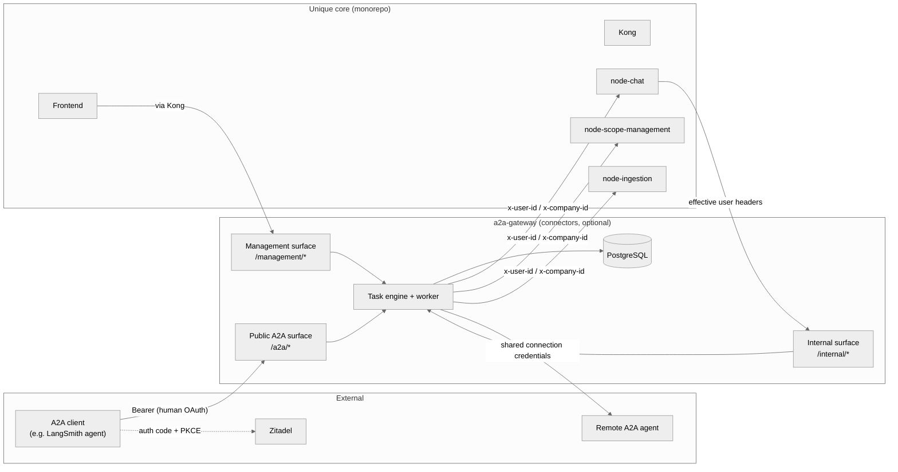
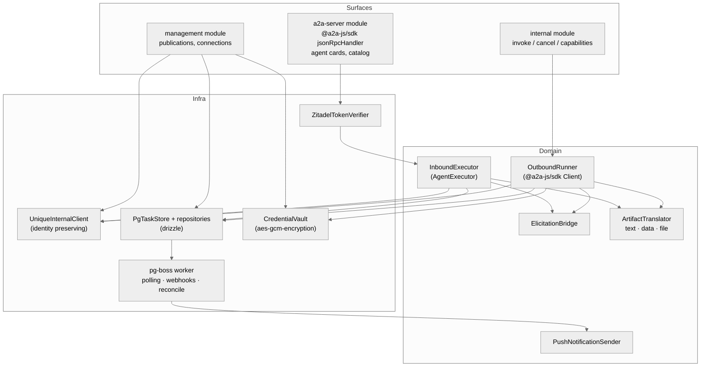

# Architecture

## Context

## Ownership boundaries

| Concern | Owner |
| --- | --- |
| Spaces (assistants), chats, messages, files, elicitations, lifecycle, permissions, roles | **core** |
| Feature flag + entitlement evaluation | **core** (gateway trusts core's decision on its internal surface; re-checks on management/public surfaces via core) |
| Publication of a native space (enabled, agent-card customisation, publication id) | **gateway** |
| Remote connections (URL, credential reference, negotiated capabilities) | **gateway** |
| A2A protocol state: contexts, tasks, artifacts, push-notification configs, mappings to chat/message ids | **gateway** |
| External-space execution routing (which space is external, which connection it uses) | **core** stores `executionProvider = A2A` + `connectionId`; gateway owns the connection |
| Agent execution, LLM, tools | **core** — the gateway never runs an LLM |

Rules:

- One published space = one logical A2A agent. Publication id is opaque; never expose the `assistantId`.
- External A2A spaces are **never** publishable (enforced in gateway DB constraint and core).
- Every invocation and every task/artifact read is authorised against core under the effective human; the catalog is a cache, not an authority.
- Gateway outage must not lose configuration: configuration lives in the gateway DB; core only keeps the reference (`connectionId`) and the space type.

## Components (gateway)

- **a2a-server**: `@a2a-js/sdk` `DefaultRequestHandler` + `jsonRpcHandler`, one handler instance, agent resolved from the `publicationId` path segment. `TaskStore` is our Postgres implementation scoped by `(companyId, userId)`.
- **InboundExecutor**: maps A2A message → Unique chat message via `UniqueInternalClient`, relays run events as task status/artifact events.
- **OutboundRunner**: invoked by core on the internal surface; drives the remote agent via SDK `Client` (send/stream/poll/cancel) and writes results back into the Unique chat under the effective user.
- **ElicitationBridge**: `input-required`/`auth-required` ⇄ Unique `Elicitation` (FORM/URL).
- **Worker** (same image, `WORKER_ENABLED`): outbound task polling for peers without streaming, push-notification delivery with retries, reconciliation (deleted spaces, expired tasks, retention).

## Deployment

- Independently deployable Helm chart under `services/a2a-gateway/deploy`, same pattern as `teams-mcp`.
- Requires: PostgreSQL, cluster-local reach to `node-chat`, `node-scope-management`, `node-ingestion`; Zitadel issuer reachable; egress to configured remote agents only.
- Public ingress only for `/a2a/*`. `/management/*` is exposed through Kong (JWT validated by Kong). `/internal/*` is cluster-local only (NetworkPolicy from `node-chat`).
- No gateway → no A2A: core gates every A2A UI/API on `A2A_GATEWAY_URL` being configured **and** the gateway's `/internal/capabilities` answering **and** the tenant feature/entitlement.
