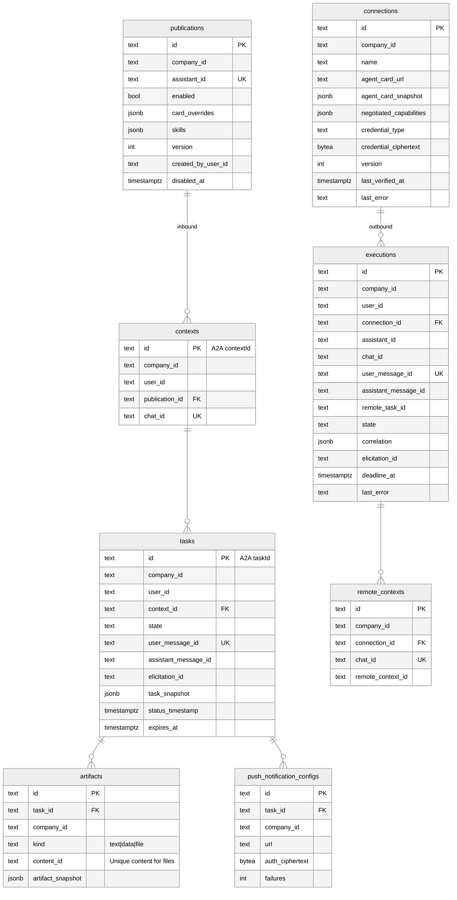

# Data model

PostgreSQL, drizzle-orm (convention: `teams-mcp`). Every table has `company_id`, `created_at`, `updated_at`; all queries filter on `company_id`. Ids are `typeid` strings with table prefixes.

## Invariants

- `publications.assistant_id` unique per company; publishing is refused when core reports `executionProvider = A2A` (checked on write and re-checked by reconcile).
- `contexts.chat_id` unique; `tasks.user_message_id` unique; `executions.user_message_id` unique → idempotent retries never start a second run.
- Task visibility = `(company_id, user_id)`. `ListTasks` paginates by `(status_timestamp desc, id desc)` like the SDK in-memory store.
- Exactly one task per context may be non-terminal (partial unique index on `context_id where state not in terminal`).
- `credential_ciphertext` / `auth_ciphertext` are AES-GCM via `@unique-ag/aes-gcm-encryption`; plaintext never leaves the `CredentialVault`.
- `version` on `publications`/`connections` for optimistic concurrency (`If-Match`).

## Lifecycle fields

| Purpose | Field(s) |
| --- | --- |
| Recovery after crash | `tasks.state`, `executions.state`, `status_timestamp`; worker re-polls non-terminal executions older than `RECOVERY_AFTER` |
| Retention | `tasks.expires_at` (`TASK_RETENTION_DAYS`), artifacts cascade; `executions` kept for attribution (`EXECUTION_RETENTION_DAYS`) |
| Revocation | `publications.disabled_at` → running tasks finish, new sends rejected; core space deletion → reconcile disables publication |
| Attribution / quotas | `executions.user_id`, `tasks.user_id`, counters derived by query, no content stored beyond `task_snapshot` (which excludes Unique-internal fields) |

## Task store

`PgTaskStore implements TaskStore` from `@a2a-js/sdk` (`save`, `load`, `list` with `ServerCallContext`): `context.user` → `(companyId, userId)`; `task_snapshot` is the protocol `Task` as served to clients, the mapping columns are ours.

## Worker jobs (pg-boss, same database)

| Job | Trigger | Idempotency key |
| --- | --- | --- |
| `outbound.poll` | remote without streaming, or stream dropped | `executionId` |
| `push.deliver` | task status change with configs | `taskId:statusTimestamp:configId` |
| `reconcile.publications` | schedule | singleton |
| `retention.expire` | schedule | singleton |
