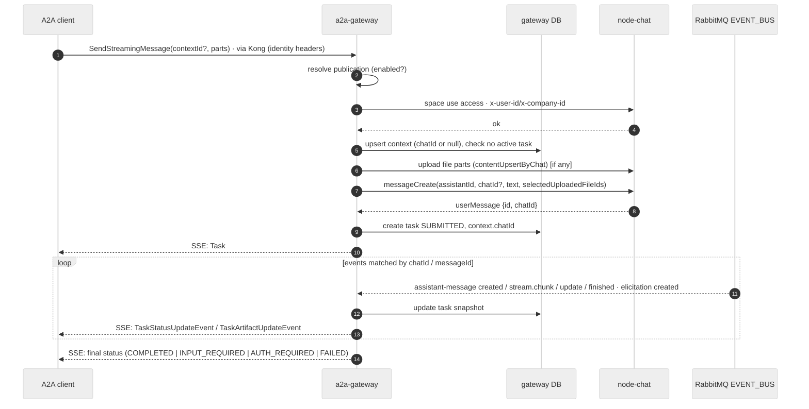
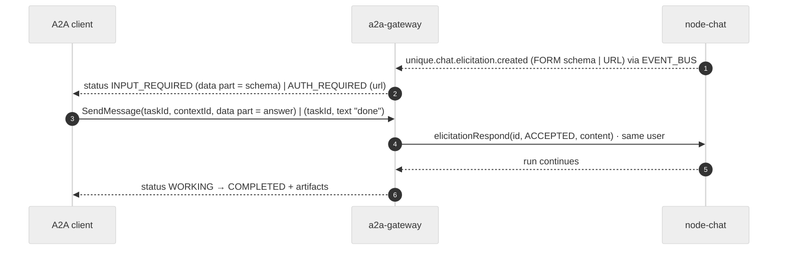

# Flows

## Inbound: `SendStreamingMessage` on a published space



Non-streaming `SendMessage`: same, but the gateway waits (bounded by `SYNC_WAIT_MAX`) and returns the `Task`; if the run is still active the task is returned in `WORKING` and the client polls `GetTask`/`SubscribeToTask`.

## Inbound: multi-turn with elicitation



Declined or expired elicitation → `FAILED` with `ErrorInfo.reason = ELICITATION_DECLINED | ELICITATION_EXPIRED`. Follow-ups after a terminal task start a **new** task in the same context.

## Inbound: `CancelTask`

`CancelTask(taskId)` → authorise `(companyId, userId)` → `messageStopStreaming(chatId, assistantMessageId)` → task `CANCELED` when core confirms `stoppedStreamingAt`; if the task is already terminal → `TASK_NOT_CANCELABLE`.

## Outbound: direct chat in an A2A External Agent space

```mermaid
%%{init: {'theme': 'neutral'}}%%
sequenceDiagram
    autonumber
    actor U as User
    participant Chat as node-chat
    participant GW as a2a-gateway
    participant R as Remote agent

    U->>Chat: send message
    Chat->>Chat: create user + assistant shell message, authz, gates
    Chat->>GW: POST /internal/executions {connectionId, chatId, messages, parts} · user headers
    GW->>GW: load connection + negotiated caps, resolve remote contextId for chatId
    GW-->>Chat: 202 {executionId}
    Note over GW: absurd task outbound.run starts
    alt streaming supported
        GW->>R: SendStreamingMessage(contextId?, parts) · connection credential
        R-->>GW: SSE task events
    else
        GW->>R: SendMessage
        GW->>GW: worker polls GetTask until terminal
    end
    loop per event
        GW->>Chat: message update (text so far) · user headers
    end
    alt INPUT_REQUIRED / AUTH_REQUIRED
        GW->>Chat: elicitationCreate(FORM schema | URL) + message text
        Note over GW: task suspends on awaitEvent(elicitation:executionId)
        U->>Chat: answers elicitation
        Chat->>GW: POST /internal/executions/{id}/elicitation-response
        GW->>GW: emitEvent → task resumes
        GW->>R: SendMessage(taskId, answer)
    end
    R-->>GW: COMPLETED + artifacts
    GW->>Chat: download remote files → upload to chat; final message update (text, references, files), completedAt
```

`U` stops the message → core → `POST /internal/executions/{id}/cancel` → `CancelTask` on remote → message marked stopped.

## Outbound: sub-agent call from a native space

Unchanged for core: the Conduct `SubAgentTool` sends a message with `correlation` to the external space via the existing space-message path. `node-chat` sees `executionProvider = A2A` and dispatches to the gateway exactly like direct chat; the sub-agent tool keeps polling the latest message. Elicitations bubble up through existing correlation handling; the gateway never approves.

## Push notifications (inbound)

`CreateTaskPushNotificationConfig(taskId, url, authentication)` → egress guard → stored encrypted. On every status change the worker POSTs the `Task` (status only, no artifacts) with the configured `Authorization`; retries with backoff, disabled after `PUSH_MAX_FAILURES`.

## Recovery

- Gateway restart during inbound task: task stays `WORKING`; the new replica's bus queue receives subsequent events; on reconnect `GetTask`/`SubscribeToTask` re-derive missed state from core message state — no second `messageCreate` (unique `user_message_id`).
- Gateway restart during outbound execution: absurd re-runs the task from its last checkpoint (`sent` → `polling`/`awaiting`); if the remote lacks `GetTask` continuity the execution fails with a clear message in the chat.
- Missed bus events (queue is per replica, auto-delete): the reconciliation job compares non-terminal tasks/executions against core message state every `RECONCILE_INTERVAL`.
- Core unreachable: inbound requests fail with `-32603` + `ErrorInfo.reason = UPSTREAM_UNAVAILABLE`; outbound updates are retried, then the execution fails.
