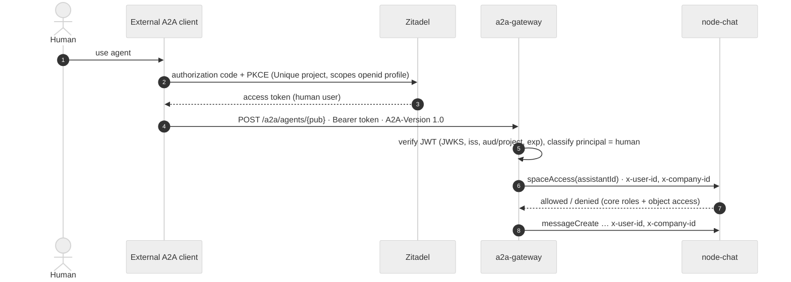
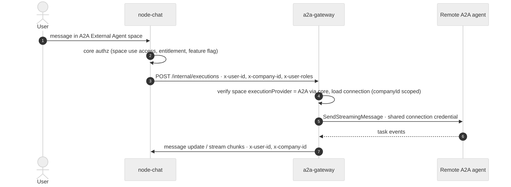

# Identity and trust

## Inbound: external client → published space

- Principal = the **human** encoded in the token (`sub`, `urn:zitadel:iam:user:resourceowner:id` → `companyId`). Never taken from the request body or A2A metadata.
- Machine/service principals are rejected (KRA-22 defines the reliable classification: Zitadel user type via introspection or claim set; until decided → reject tokens without a human profile claim set).
- Token validity is required per **request** (`SendMessage`, `GetTask`, SSE open). A running task continues when the token expires because core calls use the header identity, not the token. Reconnect requires a fresh token for the **same `sub`**.
- Roles are not forwarded from the gateway; `node-chat`'s guard resolves them from scope-management for `x-user-id`+`x-company-id` without `x-service-id` (same path `unique-api` uses).
- Push-notification webhooks: outbound only, credentials from `TaskPushNotificationConfig.authentication`, URL passes egress policy, payload = task id + state (no content).

## Outbound: Unique user → remote agent

- Shared connection credentials (per connection, per company): `none | bearer | api_key | oauth2_client_credentials`. Encrypted at rest with `@unique-ag/aes-gcm-encryption`; never returned by any API; never logged.
- The remote agent sees **no** Unique user identity (no per-user OAuth in this delivery). Attribution stays in the gateway (`executions.userId`).
- Sub-agent calls arrive as ordinary messages with `correlation` (parent chat/message/assistant) — same path, same authz, correlation stored on the execution.

## Trust boundaries

| Boundary | Trust | Control |
| --- | --- | --- |
| Internet → `/a2a` | untrusted | JWT verification, rate limits, body size limit, JSON-RPC schema validation (SDK), per-tenant quotas |
| Internet → `/a2a/.../agent-card.json` | untrusted, unauthenticated | only admin-approved fields; no ids beyond `publicationId`; cache headers |
| Kong → `/management` | Kong-stamped identity | object-level check against core for every write; role check for connections |
| `node-chat` → `/internal` | trusted network (NetworkPolicy) | headers accepted only from cluster; no fallback identity; deny if `x-user-id`/`x-company-id` missing |
| gateway → core | gateway is a trusted internal caller like `unique-api` | forwards effective identity only; never `x-service-id` for user-bound calls; NetworkPolicy allow-list |
| gateway → remote agent | untrusted peer | HTTPS only, cert validation, host allow-list or private-range/metadata block, no blind redirects, timeouts, size caps, response parts validated against declared modes |
| remote agent → Unique | untrusted content | text/data/files treated as data; files size/type validated before upload; no HTML rendering |
| gateway DB | tenant data | every row carries `companyId`; every query filters on it; task visibility `(companyId, userId)` |

Threats explicitly covered:

- **Identity confusion**: caller-supplied `userId`/`companyId` in A2A metadata is ignored; only the verified token or the cluster-stamped headers count.
- **Cross-tenant task access**: `GetTask`/`ListTasks`/`SubscribeToTask` scoped by `(companyId, userId)`; unknown = `TASK_NOT_FOUND`, never `FORBIDDEN`.
- **Stale catalog**: catalog entries cached, but every invocation re-checks space access and publication state in real time.
- **Republication**: DB constraint + core check prevent publishing a space with `executionProvider = A2A`.
- **Credential exfiltration**: credentials write-only, encrypted, redacted in logs and errors; connection test never echoes secrets.
- **SSRF via connection URL / push URL / file URI**: shared egress guard (SECURITY-RULES §3).
- **Silent approval**: elicitations are never auto-approved by the gateway; `autoApproveElicitation` is never set.
- **Content in logs**: log ids and states only (SECURITY-RULES §6).
