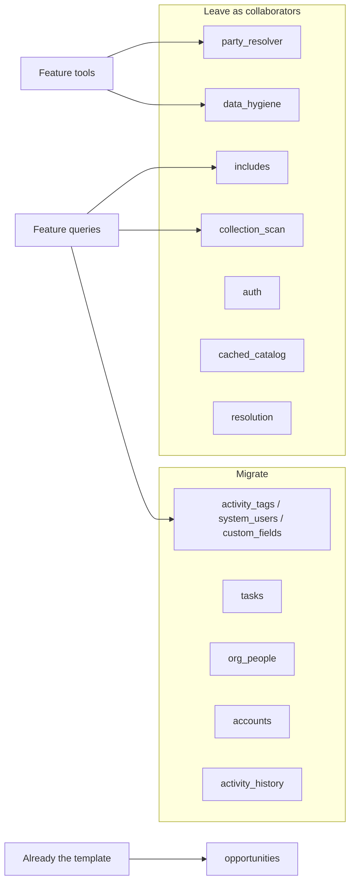
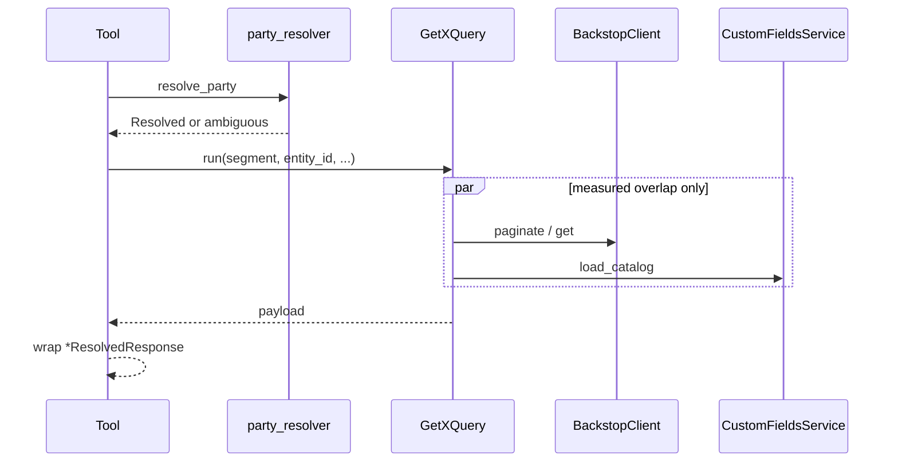

# Feature architecture migration

How to move every remaining MCP domain feature onto the layout in
[`features/opportunities/`](src/backstop_mcp/features/opportunities/) and
[`AGENT_README.md`](AGENT_README.md). When those two disagree, **opportunities wins**.

This is a structural refactor. Same HTTP, same published schemas, same output assertions.
No new tools. No writes against `BACKSTOP_BASE_URL`. Do not rename opportunities
`resource_utils/` as part of this work.

Ship **one PR per wave**. Do not land a half-renamed feature.

After each finished wave (or signed-off slice), **clean unused functions** the move left
behind (old `fetch_*`, private parse/map helpers with no remaining callers, `__all__`
names nothing imports). Then **commit and push** the branch so the work is on the remote,
not only the local checkout. Do not wait for the next wave. Do not delete a collaborator
another feature still calls.

Implement with a medium/fast model (one wave or coherent slice at a time). After each
reasonable change, **stop**: Opus (1M) reviews the slice against
[`AGENT_README.md`](AGENT_README.md) and this file, then **you** review the change
yourself. Do not start the next slice until both have signed off.
See [Review after each change](#review-after-each-change).

---

## What this is (and is not)

| Do | Do not |
|---|---|
| Turn `fetch_x.py` into `GetXQuery.run` | Invent empty `commands/` or `utils/` packages |
| Keep one-query helpers as private methods; inline one-use strings | Module-level `_params` / `_SORT` next to the class |
| Return the published `*Response` from `run` when the query *is* the tool answer | Contort a query so it can attach `resolved` / status the tool owns |
| Type every Backstop GET as `*Attributes` / `BackstopApiResource[...]` | Paginate or `get` with `dict[str, object]` or a published `*Response` as `schema=` |
| Move large `*ResolvedResponse` out of the tool | Change filters, page sizes, or undocumented paths |
| Enter packages through `__init__` | Import `features.<pkg>.queries.get_*` from outside `queries/` |
| Test `Query.run` and the tool | Export a private helper so a test can call it |
| Add `@lru_cache` factories to `teardown.PROVIDERS` | List uncached mapper/util factories there |
| Match opportunities logs (dotted events + `extra`) | Add OpenTelemetry spans — opportunities has none today |
| Keep `resolve_party` / `resolve_product` on the tool | Push party/product resolve into a query just to return the tool type |
| After the wave, delete functions with no remaining callers | Leave `fetch_*` or a private helper "in case" |

---

## Scope



### Migrate

| Feature | Why | Size |
|---|---|---|
| `activity_tags`, `system_users`, `custom_fields` | Catalog walks still live in `fetch_*.py` | Fold into `*Service`; move tool `*Response` |
| `tasks` | One fetch + tool-owned responses | First full query rewrite |
| `org_people` | Three `fetch_*` + two tool-owned `*ResolvedResponse` | Three queries |
| `accounts` | Eight fetch/resolve modules, five tools | Largest read surface |
| `activity_history` | Six fetch/aggregate modules, three tools | Three queries + utils |

### Leave alone

| Package | Why |
|---|---|
| `opportunities` | Template. Do not rename `resource_utils/` here. |
| `party_resolver` | Tools own resolve/elicitation. Queries must not. Keep `resolve_party` / `resolve_parties` / `fetch_party_name` as package-exported functions. |
| `data_hygiene` | `EmploymentIndexFactory` is already a process-wide service. |
| `includes` | Include-plan vocabulary, not a Backstop-entity feature. Call sites follow `Included` (requested shared include API). |
| `collection_scan` | Shared scan/aggregate helpers. Opportunities already imports it. |
| `auth`, `cached_catalog.py`, `resolution.py`, `entity_types.py` | Infrastructure / shared vocabulary. |

---

## Target shape (copy this, not `org_people`)

```
features/<name>/
  __init__.py              public door: __all__ is the whole contract
  dependencies.py          factories; @lru_cache only for process-wide services
  api_responses.py         *Attributes / wire resources
  responses.py             *Response published models  (or responses/ if already a package)
  internal_dto.py          *Dto classes only — skip if none
  queries/
    __init__.py
    get_<name>_query.py    Get<Name>Query — one logical read
  utils/                   only when a helper is reused inside the feature
    __init__.py
    map_<x>_to_response_util.py
  tools/
    get_<name>.py          MCP endpoint; name matches the file
  <name>_service.py        only if there is a long-lived catalog
```

Do not add `commands/` — there are no writes. New features use `utils/`. Opportunities still
uses `resource_utils/`; do not add a second helpers package beside it.

A feature that is only a couple of functions does not need empty `queries/` / `utils/`.
Add a package when a second query or a shared helper appears.

---

## Recipe

Apply this on every migrated feature. Catalog features skip the query class (see Wave 1);
they still type the walk as `*Attributes` (they already do).

### 1. Query class

`fetch_x.py` → `queries/get_x_query.py`.

```python
class GetXQuery:
    def __init__(self, *, client: BackstopClient, ...) -> None:
        self._client = client

    async def run(self, *, ...) -> PublishedResponse | QueryPayload:
        ...
```

- One logical read: "this party's tasks", "this person", "this activity".
- Inject the real collaborator (`CustomFieldsService`, `EmploymentIndexFactory`, `BackstopClient`).
- Names read as the same thing: `GetXQuery` / `get_x_query_factory` / `get_x_query` / `self._get_x_query`.
- Small `Literal[...]` types live on the query that owns them, then get re-exported from `queries/__init__.py` and the feature `__init__`.
- Helpers that only this query calls are **private methods**, not module-level `_params` / `_fields`.
- Inline strings and fieldsets used once. Do not invent `_SORT = "sort"`.
- Name the check (`raise_if_invalid_series`, `_has_completed_status`), not a longer restatement of the arguments.
- Follow [AGENT_README — Local helpers](AGENT_README.md#local-helpers-do-this-on-the-first-draft) on the first draft.

### 2. What `run` returns

Return the tool's published model from the query **when that is already the whole answer**.
Do not invent a second payload type, and do not make the query resolve a party (or elicit)
just so `run` can return `*ResolvedResponse`.

Opportunities already does both, and that is the standard:

| Query | Returns | Why |
|---|---|---|
| `GetOpportunitiesByIdsQuery` | `GetOpportunitiesByIdsResponse` | No party wrap. The tool returns `run` as-is. |
| `SearchOpportunitiesQuery` | `SearchOpportunitiesResolvedResponse` | Same — firm-wide walk, no resolve. |
| `GetOpportunitiesQuery` | `PartyOpportunitiesResponse` | Tool still owns `resolve_party` and attaches `resolved` / `status`. |

Same rule on the features we migrate:

| Query | Returns | Tool still does |
|---|---|---|
| `GetCapitalFlowsQuery` | `CapitalFlowsResolvedResponse` | Nothing — no party. `return await query.run(...)`. |
| `GetActivityDetailQuery` | `ActivityDetailResponse` | Parse the handle, then `return await query.run(...)`. |
| `SearchActivitiesQuery` | `SearchActivitiesResolvedResponse` (or the unavailable variant) | Optional party resolve *before* `run` if the tool needs an id; do not stuff resolve into the query. |
| `GetTasksForPartyQuery` | listing payload (rows + counts + `scan_truncated`) | `resolve_party`, then wrap `TasksResolvedResponse`. |
| `GetPersonQuery` / `GetOrganizationQuery` / `GetHoldingsQuery` / `GetActivityHistoryQuery` | query payload | `resolve_party` (and includes / paging), then wrap. |

Do not name the query payload the same as the tool wrap (`PartyOpportunitiesResponse` vs
`OpportunitiesResolvedResponse`). Do not have the query return `TasksResolvedResponse` with
`resolved` left blank or forged.

### 3. Type the Backstop wire

`client.get` / `client.paginate` always take a typed `*Attributes` (or
`BackstopApiResource[*Attributes]` / `BackstopApiResourceDocument[*Attributes]`). Every
field optional, every scalar lenient (`LenientStr`, `LenientDate`, …), `extra="ignore"`.
A required field or a strict type fails the whole page on one bad record.

This is a migration duty, not a follow-up. If today's fetch feeds a published `*Response`
or a `dict[str, object]` into `schema=`, add `api_responses.py` in that wave and map
Attributes → published `*Response`. Add a `*Dto` only when a second caller or a
non-published shape needs it.

### Wave 2 lesson — no DTO hop

`GetTasksForPartyQuery` first copied the old fetch: wire → `TaskDto` → `TasksListingDto`
→ `TaskRowResponse`. Nothing else read those DTOs. Map
`BackstopApiResource[*Attributes]` straight onto the published row / listing payload.
Skip `internal_dto.py` when that file would only exist to hold that hop. Later waves
follow this, not the Wave 3 target tree's leftover `*Dto` names.

Do **not**:

- `schema=BackstopApiResourceDocument[PersonRecordResponse]` (org_people today)
- `schema=BackstopApiResource[ContactCardResponse]` (employees walk today)
- `schema=dict[str, object]` or walk `raw.get("attributes")` by string key
- `cast(dict[str, object], …)` around relationship blobs that have an `*Attributes` type

`extra="allow"` stays only on published passthrough models (`PersonRecordResponse`,
`OrganizationRecordResponse`). Those are built **after** the wire is typed. Known fields
come from `*Attributes`; instance-specific extras can still be copied onto the published
model. The GET itself is never untyped.

Wire aliases are `validation_alias`, not `alias`, so `model_dump` stays snake_case.

### 4. Published models

Move tool-owned `*ResolvedResponse` (and other large `*Response`) into `responses.py` or the
existing `responses/` package. The tool keeps only the small union:

```python
type GetXResponse = PartyAmbiguousResponse | NotFoundResponse | XResolvedResponse
```

Every published field keeps its `Field(description=...)`. `tests/server/tools/test_output_descriptions.py`
reads those strings.

### 5. Types

Move `Literal[...]` aliases off `internal_dto.py` onto the query. Keep real `*Dto` classes.

Known aliases to move:

| Feature | Alias | Goes on |
|---|---|---|
| `tasks` | `TaskFilter` (today on the tool), `TaskStatus` in `internal_dto` | `GetTasksForPartyQuery` |
| `accounts` | `TimeSeriesEntityType`, `AccountSeries`, `ProductSeries` | `time_series_name.py` (query + response + tool share them; query file would cycle with `responses`) |
| `accounts` | `HoldingsSource` | `GetHoldingsQuery` |
| `activity_history` | `BackstopActivityType` / `ActivityType` / `Segment` | `activity_type.py` (query + responses + `_page_input`; query file would cycle with `responses`) |
| `activity_history` | `ActivityAggregateBy` | `SearchActivitiesQuery` or the aggregate util |

### 6. Utils

Only when a **second caller** exists inside the feature. If only one query (or one tool)
calls it, keep it on that query / next to that tool until a second caller appears. Do not
create `utils/<name>.py` as part of folding a `fetch_*`.

### 7. Tool

Stay the conversation layer: elicitation, `resolve_party`, id coercion, then **one**
`query.run(...)`.

When `run` already returns the published model, the tool returns it:

```python
return await get_capital_flows_query.run(start_date=start_date, end_date=end_date)
```

When the tool still owns resolve, it wraps — that is the correct shape, not a compromise:

```python
from backstop_mcp.features.tasks import GetTasksForPartyQuery, TasksResolvedResponse
from backstop_mcp.features.tasks.dependencies import get_tasks_for_party_query_factory

result = await resolve_party(...)
if not isinstance(result, Resolved):
    return unresolved_party_response(result)
fetched = await get_tasks_for_party_query.run(
    search_type=party.search_type,
    entity_id=party.id,
    status=status,
)
return TasksResolvedResponse(
    resolved=ResolvedPartyResponse.from_party(party),
    tasks=fetched.tasks,
    total=fetched.total,
    open_count=fetched.open_count,
    completed_count=fetched.completed_count,
    scan_truncated=fetched.scan_truncated,
)
```

`dependencies.py` is a vocabulary module — tools may import that file. They still import
types and query classes from the feature package.

### 8. `__init__.py`

`__all__` is the whole public door. Export query classes, `@lru_cache` factories, published
responses, owned types. **Drop every `fetch_*` export.**

From outside (other features, `teardown.py`, non-tool tests):

```python
from backstop_mcp.features.tasks import GetTasksForPartyQuery, TasksResolvedResponse
```

Inside the feature, import sibling **packages**, not sibling files:

```python
from backstop_mcp.features.tasks.queries import GetTasksForPartyQuery
```

Never `from backstop_mcp.features.tasks.queries.get_tasks_for_party_query import …`
from outside `queries/`. `teardown.py` imports factories from the feature package, never
from `dependencies.py`.

### 9. Factories and teardown

```python
@lru_cache(maxsize=1)
def get_x_query_factory(
    client: BackstopClient = Depends(get_backstop_client_for_current_caller),
    ...
) -> GetXQuery:
    return GetXQuery(client=client, ...)
```

- `@lru_cache(maxsize=1)` for process-wide services and query factories that hold them.
- Mapper/util factories stay **uncached** (same as `get_map_opportunity_to_response_util_factory`).
- Every cached factory goes in [`teardown.PROVIDERS`](src/backstop_mcp/teardown.py).
  `tests/test_teardown.py` fails when the two disagree.

### 10. Logs

Match opportunities. Dotted event names, structured `extra`, no interpolated messages.

```python
logger.info(
    "tasks.get.start",
    extra={"segment": party.search_type, "entity_id": party.id, "status": status},
)
logger.info(
    "tasks.fetched",
    extra={"entity_id": entity_id, "total": listing.total},
)
```

Log at tool start and when a query finishes. Warn when a record is dropped, a catalog miss
is flagged, or a scan ceiling is hit. Do not add a counter on every tool call.

### 11. Tests

Public surface only: `Query.run` and the tool function.

```
tests/features/<name>/
  conftest.py                         construct queries the way the factory does
  test_<name>_query.py                from backstop_mcp.features.<name> import GetXQuery
  tools/
    test_get_<name>.py                may import features.<name>.tools.get_<name>
```

- Mock Backstop via respx. Do not mock the mapper or private methods.
- Construct the query with the same collaborators the factory would inject.
- Pass tools their collaborators as kwargs.
- Present tense, no "should": `test_catalog_failure_keeps_the_deals_and_flags_unavailable`.
- Existing `test_fetch_*.py` become `test_*_query.py`. Keep the same respx pages and output checks.

Copy the construction style from
[`tests/features/opportunities/conftest.py`](tests/features/opportunities/conftest.py).

### 12. Gate (every PR)

From `services/backstop-mcp`:

```bash
uv run pytest tests/features/<name> tests/test_layering.py tests/test_teardown.py tests/server/tools/test_output_descriptions.py
uv run ruff format <touched> && uv run ruff check <touched> && uv run basedpyright <touched>
```

[`server/tools/registry.py`](src/backstop_mcp/server/tools/registry.py) still imports the
same tool modules. MCP tool names stay unchanged.

---

## Waves

### Wave 1 — Catalog trio

`activity_tags`, `system_users`, `custom_fields` already have `*Service` + `dependencies.py`.
The leftover `fetch_*.py` is the `CachedCatalog(fetch=...)` callback. **Do not invent
`GetCustomFieldDefinitionsQuery`.** Fold the walk into the service, the way
`OpportunityStagesService` owns its walk.

#### `activity_tags`

| Action | Detail |
|---|---|
| Delete | `fetch_activity_tags.py` |
| Move walk | into `activity_tags_service.py` as the `CachedCatalog(fetch=...)` callback (private function in that file is fine) |
| Move | `ListActivityTagsResponse` from `tools/list_activity_tags.py` → `responses.py` (file already exists; `ActivityTagResponse` is already there) |
| Tests | `tests/features/activity_tags/tools/test_list_activity_tags.py` pins `_FETCH_LOGGER` to the old module — update the logger name |

#### `system_users`

| Action | Detail |
|---|---|
| Delete | `fetch_system_users.py` |
| Move walk | into `system_users_service.py` |
| Add | `responses.py` with `ListSystemUsersResponse` (today it lives in the tool) |
| Tests | `tests/features/system_users/tools/test_list_system_users.py` |

#### `custom_fields`

| Action | Detail |
|---|---|
| Delete | `fetch_custom_field_definitions.py`, `fetch_custom_field_groups.py` |
| Move walks | into `custom_fields_service.py` and `custom_field_groups_service.py` |
| Move | `ListCustomFieldsResponse` and `ListCustomFieldGroupsResponse` from the tools → `responses.py` |
| Keep | `CustomFieldsService`, `CustomFieldGroupsService`, `get_custom_fields_service`, `CustomFieldFilters` — later waves inject these |
| Tests | `tests/features/custom_fields/tools/test_list_custom_fields.py` pins `_FETCH_LOGGER`; `test_custom_fields_service.py` / `test_cached_catalog.py` import through `__init__` already |

No new `queries/` package. No new teardown entries — the services are already listed.

---

### Wave 2 — `tasks` (first full query)

This wave proves the recipe. Do it carefully; later waves copy it.

#### Today

```
tasks/
  __init__.py                 exports fetch_tasks_for_party, TaskDto, …
  api_responses.py
  internal_dto.py             TaskDto, TasksListingDto, TaskStatus
  fetch_tasks_for_party.py
  tools/get_tasks_for_party.py   owns TaskRowResponse, TasksResolvedResponse, TaskFilter
```

The fetch walks `/tasks` with both `entityType` + `entityId` (either alone is silently
ignored). Status is not filterable on the wire; the **tool** splits open/completed after
the walk. Move that split onto `GetTasksForPartyQuery.run` so the tool only resolves + wraps.

`run` cannot return `TasksResolvedResponse` without forging `resolved`. Return a listing
payload (mapped `TaskRowResponse` rows + counts + `scan_truncated`). The tool attaches
`resolved`. Wire is already `TaskAttributes` — keep it.

#### Target

```
tasks/
  __init__.py
  api_responses.py            TaskAttributes (already typed — keep)
  responses.py                TaskRowResponse, TasksResolvedResponse, PartyTasksResponse
  dependencies.py             get_tasks_for_party_query_factory  (@lru_cache)
  queries/
    __init__.py
    get_tasks_for_party_query.py   GetTasksForPartyQuery, TaskFilter, MAX_TASK_SCAN_RECORDS
  tools/get_tasks_for_party.py     resolve_party + wrap query payload
```

No `utils/` — nothing is reused yet. The wrap is in recipe §7.

#### Teardown

Add `get_tasks_for_party_query_factory` to `PROVIDERS`. Import it from
`backstop_mcp.features.tasks`, not `dependencies.py`.

#### Tests

| Today | After |
|---|---|
| `tests/features/tasks/tools/test_get_tasks_for_party.py` | keep; import query/responses from the package |
| (no query test) | add `tests/features/tasks/test_tasks_for_party_query.py` if the walk/split deserves a direct `run` test; otherwise the tool test is enough if it already covers the split |

---

### Wave 3 — `org_people`

#### Today

```
org_people/
  fetch_person.py
  fetch_organization.py
  fetch_people_for_organization.py
  responses.py                  PersonRecordResponse, OrganizationRecordResponse,
                                OrgPeopleResolvedResponse, PersonAtOrganizationResponse
  tools/get_person.py           owns PersonResolvedResponse
  tools/get_organization.py     owns OrganizationResolvedResponse
  tools/get_people_for_party.py
```

#### Target

```
org_people/
  __init__.py
  dependencies.py
  api_responses.py              PersonAttributes, OrganizationAttributes, EmployeeAttributes
  responses.py                  + PersonResolvedResponse, OrganizationResolvedResponse
  queries/
    __init__.py
    get_person_query.py
    get_organization_query.py
    get_people_for_organization_query.py
  tools/get_person.py
  tools/get_organization.py
  tools/get_people_for_party.py
```

Add `api_responses.py` in this wave. Today `fetch_person` / `fetch_organization` deserialize
into `PersonRecordResponse` / `OrganizationRecordResponse`, and the employees walk uses
`BackstopApiResource[ContactCardResponse]`. That is the published layer used as a wire schema.
Split it:

- `schema=BackstopApiResourceDocument[PersonAttributes]` (lenient, `extra="ignore"`)
- map Attributes → `PersonRecordResponse` (`extra="allow"` passthrough stays on the published
  model; copy known fields from Attributes, then extras from the raw attributes object if
  passthrough must survive)
- employees: `EmployeeAttributes` (or a people-card Attributes), not `ContactCardResponse`

Queries return payloads (person/org record + includes / custom fields; people rows +
omit counts). Map Attributes → published `PersonRecordResponse` /
`PersonAtOrganizationResponse` — no `OrgPeopleListingDto` / `PersonAtOrganizationDto`.
Tools wrap `PersonResolvedResponse` / `OrganizationResolvedResponse` /
`OrgPeopleResolvedResponse`. Do not have `GetPersonQuery` call `resolve_party` so it
can return the tool type.

No `utils/` unless a second caller appears. No `internal_dto.py` unless a real `*Dto`
appears.

| Old | New | Inject |
|---|---|---|
| `fetch_person` | `GetPersonQuery` | `BackstopClient`, `EmploymentIndexFactory`, `CustomFieldsService` (same instances the tool passes today) |
| `fetch_organization` | `GetOrganizationQuery` | same |
| `fetch_people_for_organization` | `GetPeopleForOrganizationQuery` | `EmploymentIndexFactory` |

Tools keep `resolve_party` and include-name coercion. `GetPersonQuery.run` does the GET +
employment projection + custom-field join.

Cached factories: `get_person_query_factory`, `get_organization_query_factory`,
`get_people_for_organization_query_factory` → `teardown.PROVIDERS`.

#### Tests

| Today | After |
|---|---|
| `test_fetch_people_for_organization.py` | `test_people_for_organization_query.py` — call `GetPeopleForOrganizationQuery.run` |
| `tools/test_get_person.py` | keep; import `PersonResolvedResponse` from the package |
| `tools/test_get_organization.py` | keep |
| `tools/test_get_people_for_party.py` | keep |
| `conftest.py` | add `make_get_*_query` helpers like opportunities |

`test_fetch_people_for_organization.py` currently `import_module`s the fetch module for a
logger test — switch that to the query module's logger.

---

### Wave 4 — `accounts`

Largest surface. `responses/` is already a package — extend it; do not flatten it.

**`resolve_product` / `resolve_product_query` stay as resolve helpers.** They elicit.
`resolve_product_query` is a filter-string helper, not a `*Query` class. Do not rename it
into `queries/` or people will confuse it with `GetProductQuery`.

`fetch_party_name` stays on `party_resolver`. Tools that need a display name keep calling it
after resolve.

#### Today (Wave 4 landed)

```
accounts/
  dependencies.py
  time_series_name.py           TimeSeriesEntityType / series enums (shared; not internal_dto)
  resolve_product.py            stays at feature root (elicitation)
  queries/                      all five Get*Query
  utils/fetch_series.py
  utils/split_open.py
  responses/                    + capital_flows.py, product.py
  tools/                        same five files, thinner
```

`Included` in `backstop_client` is the shared include API (requested). Leave-alone
packages (`opportunities`, `org_people`, `includes`, `data_hygiene`) call that, not a
per-feature copy.

#### Target

```
accounts/
  __init__.py
  dependencies.py
  api_responses.py
  internal_dto.py               *Dto only
  resolve_product.py            stays at feature root (elicitation collaborator)
  responses/                    + capital_flows.py, product.py
    __init__.py
    shared.py
    party_accounts.py
    product_investors.py
    time_series.py
    capital_flows.py            CapitalFlowRowResponse, CapitalFlowsResolvedResponse
    product.py                  ProductRecordResponse, ProductResolvedResponse
  queries/
    __init__.py
    get_holdings_query.py
    get_accounts_for_product_query.py
    get_capital_flows_query.py
    get_product_query.py
    get_time_series_query.py
  utils/
    __init__.py
    fetch_series.py
    split_open.py
  tools/                        same five files, thinner
```

| Old | New | Notes |
|---|---|---|
| `fetch_holdings` | `GetHoldingsQuery` | What `get_accounts_for_party` calls. Table vs documented path stays **one** logical "party holdings". |
| `fetch_holdings_table` | private on `GetHoldingsQuery` | Do not make it a second query. |
| `fetch_accounts_for_party` | private on `GetHoldingsQuery` | Only caller is the documented fallback. |
| `fetch_accounts_for_product` | `GetAccountsForProductQuery` | `get_product_investors` |
| `fetch_capital_flows` | `GetCapitalFlowsQuery` | No party. `run` returns `CapitalFlowsResolvedResponse`; the tool returns it. Type relationship chips as `*Attributes` — drop the `cast(dict[str, object], …)` walks in `fetch_capital_flows.py`. |
| `fetch_product` + `fetch_product_catalog` | `GetProductQuery` | Catalog load stays on this query unless a second caller needs it independently. Query payload; tool wraps after `resolve_product`. |
| `fetch_time_series` | `GetTimeSeriesQuery` | `require_series_for_entity` can stay a function on that query or a tiny util if both product and time-series tools need it. |
| `fetch_series` | `utils/fetch_series_util.py` | Second caller: documented holdings fallback. |
| `split_open` | `utils/split_open_util.py` | Used by party-accounts and product-investors. |

`HoldingsSource` lives on `GetHoldingsQuery`. Series name aliases live in
`time_series_name.py` (named after `TimeSeriesName`) because the query, published response,
and tool all need them — parking them on the query file cycles with `responses`.

Cached factories → `teardown.PROVIDERS`:

- `get_holdings_query_factory`
- `get_accounts_for_product_query_factory`
- `get_capital_flows_query_factory`
- `get_product_query_factory`
- `get_time_series_query_factory`

#### Tests

| Today | After |
|---|---|
| `test_fetch_holdings.py` | `test_holdings_query.py` |
| `test_fetch_holdings_table.py` | fold into `test_holdings_query.py` (table path is private) |
| `test_fetch_accounts_for_party.py` | fold into `test_holdings_query.py` |
| `test_fetch_accounts_for_product.py` | `test_accounts_for_product_query.py` |
| `test_fetch_time_series.py` | `test_time_series_query.py` |
| `test_resolve_product.py` | keep — still tests the resolve helper |
| `test_split_open.py` | keep; import `split_open` from the package (`utils` re-exported via `__init__`) |
| `test_holdings_table_recordings.py` | keep; drive through `GetHoldingsQuery.run` |
| `tools/test_get_*.py` | keep |

`GetHoldingsQuery` still chooses table-api vs accounts-api. Do not "fix" the undocumented
table path while moving files.

---

### Wave 5 — `activity_history`

#### Today (Wave 5 landed)

```
activity_history/
  activity_type.py              ActivityType / BackstopActivityType / Segment
  entity_activity_type.py       EntityActivityType
  aggregate_entity_activities.py
  extract_gist_from_html.py
  settings.py
  dependencies.py               three query factories
  queries/                      GetActivityHistoryQuery, GetActivityDetailQuery, SearchActivitiesQuery
  responses.py                  + PartyRecordResponse (party GET schema)
  tools/_page_input.py          elicitation / continuation
  tools/get_activity_history.py
  tools/get_activity_detail.py
  tools/search_activities.py
```

`ActivityType` / `Segment` live in `activity_type.py` for the same reason series names do:
the history query imports published group models. `EntityActivityType` lives in
`entity_activity_type.py` — the search tool publishes that vocabulary; the query file is
the POST walker, not the type list.

Landed decisions (do not revert on review):

- One-caller helpers are **private methods on the query**, not module-level `_` functions and
  not a new `utils/` file. History grouping is `_group_page` / `_occurred_date` / `_date_range`.
  Search body build / row projection / `PartyBean_{id}` are `_request_body` / `_project_rows` /
  `_party_bean`. Single-use `_` constants (`_timestamp`, include-field names, path) are inlined.
- History pages map **Attributes → published Response** in one pass
  (`ActivityRecordResponse.from_attributes` / `EmailRecordResponse.from_attributes`).
  Regarding parses on `ActivityRegardingResponse.from_stored`. Do not reintroduce a DTO hop
  or `to_timeline_record` / `from_item` on this path.
- `party_bean` is **not** a public helper. The tool passes a raw `party_id`; the query encodes
  `associatedWiths`. The standalone `TestPartyBean` was removed on purpose; the tool test that
  pins `PartyBean_{id}` on the wire stays.
- Unreadable search rows use `EntityActivityAttributes.safe_model_validate` (None, same as
  `ResourceRef`). Do not put a `try`/`ValidationError` back in `_project_rows`.
- `_page_input.py` stays on the tool. Do not push paging/elicitation into a query.
- Gist and aggregate stay at the feature root — each still has one production home
  (`responses` / the search tool).

#### Target

```
activity_history/
  __init__.py
  dependencies.py               + query factories
  api_responses.py
  responses.py
  internal_dto.py               *Dto only
  settings.py
  queries/
    __init__.py
    get_activity_history_query.py
    get_activity_detail_query.py
    search_activities_query.py
  utils/
    __init__.py
    aggregate_entity_activities_util.py
    group_activity_page_util.py
    extract_gist_from_html_util.py
  tools/_page_input.py          stays
  tools/get_activity_history.py
  tools/get_activity_detail.py
  tools/search_activities.py
```

| Old | New | Notes |
|---|---|---|
| `fetch_activities_page` (+ activity/email page) | private on `GetActivityHistoryQuery` | Only `get_activity_history` calls them. |
| `fetch_activity_detail` + attendees + meeting | `GetActivityDetailQuery` | No party. `run` returns `ActivityDetailResponse`; the tool parses the handle and returns `run`. Keep the existing `asyncio.gather` of three GETs **inside** `run`. |
| `fetch_entity_activities` | `SearchActivitiesQuery` | Return `SearchActivitiesResolvedResponse` when that is the whole answer. Party resolve, if the tool needs an id first, stays on the tool. |
| `aggregate_entity_activities` | `utils/aggregate_entity_activities_util.py` | Used by the search tool/query. |
| `group_activity_page` | `utils/group_activity_page_util.py` | Used by history query. If only that query calls it after the move, it can stay private on the query instead — do not invent a util for one caller. |
| `extract_gist_from_html` | `utils/extract_gist_from_html_util.py` | Used by page mapping and detail. |
| `tools/_page_input.py` | stays | Private tool helper. Layering already allows `_`-prefixed. **Do not** push paging/elicitation into the query. |
| `get_activity_history_settings` | stays | Already in `teardown.PROVIDERS`. |

`search_activities` uses `POST /entity-activities`. That is existing behavior, not a new write.
Do not exercise it against the live tenant from a probe. Do not add other POSTs.

Cached factories → `teardown.PROVIDERS`:

- `get_activity_history_query_factory`
- `get_activity_detail_query_factory`
- `get_search_activities_query_factory`

#### Tests

| Today | After |
|---|---|
| `test_fetch_activities_page.py` | `test_activity_history_query.py` — enter through `run` |
| (no fetch_activity_detail test) | `test_activity_detail_query.py` — enter through `run` |
| `test_fetch_entity_activities.py` | `test_search_activities_query.py` |
| `test_aggregate_entity_activities.py` | keep; import util from the package |
| `test_group_activity_page.py` | keep |
| `test_extract_gist_from_html.py` | keep |
| `test_internal_dto.py`, `test_responses.py` | keep |
| `tools/test_get_*.py`, `tools/test_search_activities.py` | keep |

---

### Wave 6 — Layering docs (after the last `fetch_*` is gone)

[`tests/test_layering.py`](tests/test_layering.py) rule 6 still cites `fetch_series.py` holds
`fetch_series` as the naming example. Update that docstring (and the synthetic test fixture
around line 800) so new work cannot treat `fetch_*` as the standard.

Do **not** forbid the old filename in the linter until nothing uses it. After wave 5, nothing
should.

---

## Data flow (unchanged)



Queries do not resolve a party and do not publish MCP annotations. Tools do both.

Do not add `asyncio.gather`, parallel page fetches, or a second in-memory index "just in
case". Keep the overlaps that are already there and documented (custom-field catalog vs
walk; activity-detail's three GETs).

---

## Review after each change

Implementation can stay on a medium/fast model. Direction review does not.

After every **reasonable change** — a finished wave, or a coherent slice inside a large
wave (`GetHoldingsQuery` before the rest of accounts; `GetActivityDetailQuery` before
search) — stop. Two reviews, in order, before the next slice:

1. **Opus (1M)** — high-reasoning pass against AGENT_README and this plan. Not the
   implementer. It does not rewrite the wave. It answers: *are we still migrating toward
   opportunities, and do we still respect AGENT_README and this plan?*
2. **You** — read the same diff (and Opus's verdict). Confirm the direction, the
   behavior, and that nothing "helpful" landed. Opus approve is not a substitute for
   this. The next slice starts only after you sign off.

### When to review

| After | Why that cut |
|---|---|
| Wave 1 (catalog trio) | First structural move; logger/teardown drift shows up here |
| Wave 2 (`tasks`) | First full query/tool/response rewrite — the template later waves copy |
| Wave 3 (`org_people`) | Wire split (`*Attributes` vs passthrough `*Response`) is easy to get wrong |
| Wave 4, after `GetHoldingsQuery` | Table vs documented path; do not wait for the whole accounts PR |
| Wave 4, rest of accounts | `resolve_product` still a resolve helper; capital-flows returns the published model |
| Wave 5, after `GetActivityDetailQuery` | Query returns `ActivityDetailResponse`; gather stays inside `run` |
| Wave 5, rest of activity_history | `_page_input` still on the tool; search POST left as-is |
| Wave 6 | Layering example no longer cites `fetch_*` |

A "reasonable change" is one feature (or one query inside a large feature) that still
compiles and whose tests were updated. Not every file save. Not a half-renamed package.

### What the reviewer reads

In this order:

1. This file — the wave's target tree, return-type rule, and wire-typing rule.
2. [`AGENT_README.md`](AGENT_README.md) — feature shape, imports, models, queries/tools,
   tests. When AGENT_README and another feature disagree, **opportunities wins**. When
   AGENT_README and this plan disagree on *this migration*, this plan wins for sequencing
   and return-type / wire-typing; AGENT_README wins for everything else.
3. [`features/opportunities/`](src/backstop_mcp/features/opportunities/) — the living
   reference (logs, no spans; `resource_utils/` stays; factories / teardown).
4. The diff for this slice only, plus the feature `__init__.py`, `dependencies.py`,
   tools, queries, and the matching tests.

Do not ask the reviewer to re-read the whole repo. 1M context is for holding the guide
+ the slice, not for a second implementation.

### Reviewer prompt

Give the reviewer this (paste the wave name and the diff scope):

```
You are reviewing a backstop-mcp architecture migration slice. You do not implement.

Read:
- services/backstop-mcp/FEATURE_MIGRATION.md (this wave + recipe §§1–3 and §7)
- services/backstop-mcp/AGENT_README.md
- services/backstop-mcp/src/backstop_mcp/features/opportunities/ (shape only)
- the diff for this slice

Decide: does this slice move toward the opportunities architecture and respect
AGENT_README + FEATURE_MIGRATION.md?

Answer with:
1. Verdict: approve / approve-with-nits / send-back
2. Goal: what still looks like the old fetch_* layout, if anything
3. Violations: concrete file:line against AGENT_README or the plan
4. Drift: behavior, filters, page sizes, or "improvements" that were not in the plan
5. Next slice: safe to start, or what must be fixed first

Do not suggest a different architecture. Do not add commands/, spans, or extra gather.
```

### Review checklist

The reviewer walks these. A send-back is any **must**; nits are **should**.

**Goal**

- [ ] This slice is the wave (or named sub-slice) in this plan, not a drive-by refactor
- [ ] No `fetch_*` remains in this feature's `__all__` once the wave claims to be done
- [ ] Unused functions the wave replaced are gone (old fetch wrappers, private parse/map helpers, zero callers)
- [ ] Tools still own resolve / elicitation; queries do not

**AGENT_README**

- [ ] Package entered through `__init__`; no `features.<pkg>.queries.get_*` from outside `queries/`
- [ ] File named after the symbol (`get_x_query.py` → `GetXQuery`)
- [ ] Class / factory / parameter / attribute read as the same name
- [ ] `*Attributes` (lenient, `extra="ignore"`) → `*Dto` if any → `*Response`
- [ ] `schema=` is never a published `*Response` or `dict[str, object]`
- [ ] `run` returns the published `*Response` only when that is the whole answer
- [ ] No empty `commands/` or `utils/`; no second helpers package
- [ ] Tests hit `Query.run` / the tool; no private helper made public for a test
- [ ] Cached factories exported from the package and listed in `teardown.PROVIDERS`
- [ ] Logs match opportunities (dotted events + `extra`); no new spans or vanity metrics

**Plan / behavior**

- [ ] Same HTTP, same published fields, same output assertions
- [ ] No "fixed" filters, page sizes, or undocumented holdings / entity-activities paths
- [ ] No live `POST` / `PATCH` / `PUT` / `DELETE` against `BACKSTOP_BASE_URL`
- [ ] MCP tool names and `registry.py` imports unchanged

### After Opus, you review

Opus's verdict is an input, not a merge. You then read the slice yourself:

- Skim the feature tree against this wave's target (queries / responses / tool wrap).
- Read the tool and `run` — resolve stayed on the tool; `schema=` is `*Attributes`.
- Glance at the test diff — same assertions, public surface only.
- Confirm the wave did not leave unused functions (grep the old `fetch_*` / helper names).
- Decide whether you agree with Opus (including nits you want fixed now vs later).

Your sign-off is what unblocks the next slice. If you send it back, the implementer
fixes and both reviewers look again.

### After both reviews

- **Opus approve + you sign off** — commit and push this wave, then start the next slice.
- **Opus approve-with-nits + you agree** — nits can land with the next slice or a tiny
  follow-up; do not block unless you say they should. Still commit and push the signed-off
  wave before opening the next one.
- **Either send-back** — implementer fixes the listed violations on this slice. Opus
  looks again, then you do. Do not open Wave N+1 with a send-back open.

The pytest / ruff / basedpyright gate still runs on every slice. A green suite is not a
substitute for either review: layering tests still *allow* the old shapes.

---

## Per-PR checklist

- [ ] No `fetch_*` left in this feature's `__all__`
- [ ] Unused functions cleaned up (no zero-caller leftovers from this wave)
- [ ] `__all__` exports query classes, cached factories, published responses, owned types
- [ ] Every `schema=` is `*Attributes` / `BackstopApiResource[*Attributes]` — no `*Response`, no `dict[str, object]`
- [ ] `run` returns the published `*Response` when that is the whole answer; otherwise a query payload the tool wraps
- [ ] Tool files own only the small response union (or `return await query.run(...)` when there is no wrap)
- [ ] `registry.py` still imports the same tool modules; MCP names unchanged
- [ ] Cached factories listed in `teardown.PROVIDERS` (imported from the feature package)
- [ ] Uncached util factories **not** in `PROVIDERS`
- [ ] Tests enter through `__init__` except tool-module tests
- [ ] `uv run pytest tests/features/<name> tests/test_layering.py tests/test_teardown.py tests/server/tools/test_output_descriptions.py`
- [ ] ruff format / ruff check / basedpyright on what you touched
- [ ] No `POST` / `PATCH` / `PUT` / `DELETE` against `BACKSTOP_BASE_URL` from probes
- [ ] High-reasoning review (Opus, 1M) approved this slice against AGENT_README + this plan
- [ ] You reviewed the same slice after Opus and signed off
- [ ] Wave committed and pushed to the remote branch (do not leave it only local)

---

## Guardrails

- Behavior-preserving. Do not "fix" filters, page sizes, or the undocumented holdings /
  entity-activities paths while moving files. Typing the wire is not a behavior change:
  lenient `*Attributes` replace untyped dicts / Response-as-schema, then map to the same
  published models.
- No `commands/`. Never POST/PATCH/PUT/DELETE against the live tenant, including from
  throwaway scripts. (`search_activities` already POSTs `/entity-activities` in production
  code — leave that as-is; do not add more.)
- `features/` must not import `server/`. `backstop_client/` must not import `features/` or
  `config`. Features must not import `teardown`.
- Never mutate a function argument. Use `assert` for internal invariants; `raise` at the
  system boundary.
- Read the `backstop-api` skill before changing how a Backstop entity is fetched. Live
  `GET`s only; write probes to `agent-explore/.probe-cache/`.
