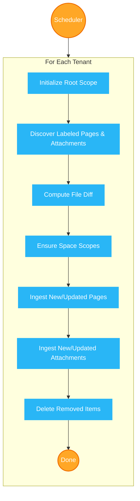
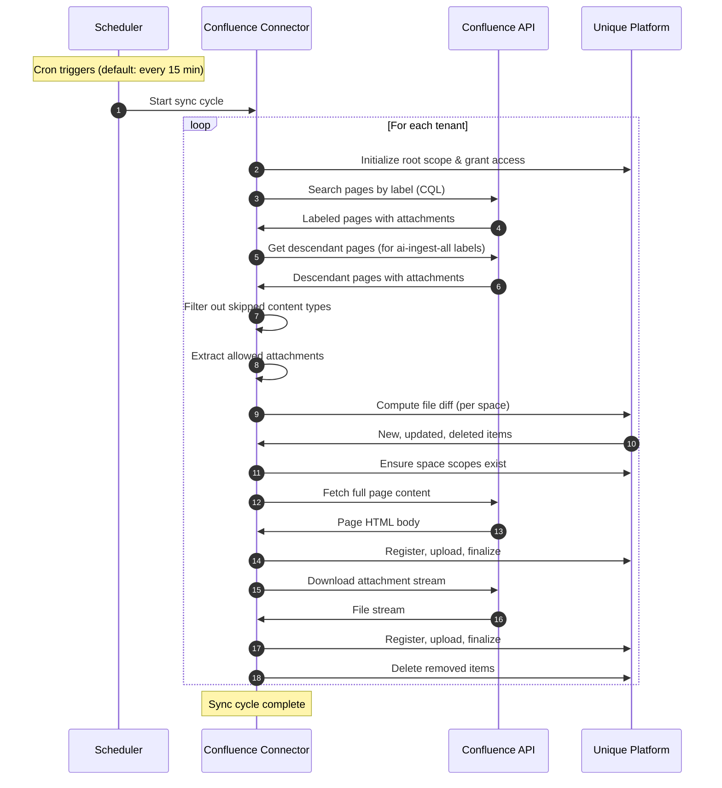

<!-- confluence-page-id: -->
<!-- confluence-space-key: PUBDOC -->

> **Pre-release Notice:** The Confluence Connector v2 is currently in alpha (`2.0.0-alpha.4`). Configuration options and behavior may change before the stable release.

## Overview

The Confluence Connector is a service that synchronizes page content and file attachments from Confluence to the Unique knowledge base for RAG ingestion. It supports both Confluence Cloud and Confluence Data Center deployments.

For deployment, configuration, and operational details, see the [IT Operator Guide](./operator/README.md).

## Quick Summary

**What it does:** Synchronizes labeled Confluence pages and their attachments to Unique's AI knowledge base

**Supported platforms:** Confluence Cloud and Confluence Data Center

**Authentication:** OAuth 2.0 two-legged (Cloud and Data Center) or Personal Access Token (Data Center only)

**Scheduling:** Configurable automated scans (default: every 15 minutes)

**Multi-tenancy:** Multiple Confluence instances can be managed in a single deployment

**Deployment:** Kubernetes-based containerized application

## Requirements

### Confluence

| Requirement | Details |
|---|---|
| **Confluence Cloud** | Active instance with an Atlassian Cloud ID |
| **Confluence Data Center** | Self-hosted instance with REST API access |
| **Authentication** | OAuth 2.0 application credentials or a Personal Access Token (Data Center only) |
| **Permissions** | Read access to spaces and pages that should be synchronized |

**Prerequisites:**

- Ability to create and apply labels on Confluence pages
- An OAuth 2.0 application configured in Confluence (or a PAT for Data Center)
- A configured scope in the Unique platform to receive ingested content

### Authentication Methods

The connector supports OAuth 2.0 two-legged (2LO) for both Confluence Cloud and Data Center, and Personal Access Token (PAT) for Data Center. For Unique platform communication, `cluster_local` mode is available for in-cluster deployments and `external` mode for out-of-cluster deployments via Zitadel OAuth. See the [Authentication Guide](./operator/authentication.md) for full setup instructions, credential management, and token flows.

## Features

### Core Capabilities

**Label-Driven Page Discovery**

- Pages are discovered via configurable Confluence labels and ingested in HTML format (Confluence storage representation)
- The `ai-ingest` label (configurable per tenant) marks individual pages for synchronization
- The `ai-ingest-all` label (configurable per tenant) marks a page and all its descendant pages for synchronization
- The recommended convention is `ai-ingest` / `ai-ingest-all`, but operators must explicitly set these label names in their tenant configuration
- Only pages in global spaces are scanned (Cloud also includes collaboration spaces)

**Automatic Change Detection**

- A per-space [file diff mechanism](./technical/flows.md#file-diff-mechanism) compares discovered items against the state stored in Unique, ingesting only new or modified items and removing deleted ones
- [Safety checks](./technical/flows.md#safety-checks) prevent accidental full deletion of content

**Attachment Ingestion**

- File attachments on labeled pages are discovered and ingested alongside page content
- Attachment ingestion can be enabled or disabled
- Configurable file size limit (default: 200 MB)
- Configurable allowed file extensions (defaults listed below)

**Default Allowed Attachment Extensions**

Configurable allowed file types (default: pdf, docx, xlsx, ppt, pptx, txt, csv, html). See [Configuration](./operator/configuration.md#attachment-configuration) for details.

**Skipped Content Types**

Content types `database`, `whiteboard`, and `embed` are explicitly skipped (no body available via API). Folders have no body and are effectively skipped by the empty-body filter. Descendants of skipped types (such as sub-pages under a database) are still discovered and ingested. Live Docs pass through as regular pages. See the [Content Type Ingestion Map](./technical/flows.md#content-type-ingestion-map) for the full breakdown by platform.

**Scope Management**

- A pre-existing root scope is configured per tenant (must be created in Unique before the connector starts), with child scopes automatically created per Confluence space
- See [Scope Management](./technical/README.md#scope-management) for the full conceptual overview and [scope mechanics](./technical/flows.md#scope-management) for implementation details

**Scheduled Synchronization**

- Sync runs on a configurable cron schedule (default: `*/15 * * * *`, every 15 minutes)
- An initial sync is triggered immediately on startup for each tenant
- Concurrent sync runs for the same tenant are prevented (the second run is skipped)

### Advanced Features

**Multi-Tenancy**

- Multiple Confluence instances (tenants) can be configured in a single deployment, each with independent configuration, authentication, and sync schedules. See [Architecture -- Multi-Tenancy Model](./technical/architecture.md#multi-tenancy-model) for the isolation model and per-tenant service details.

**Concurrency Control**

- Configurable page ingestion concurrency (default: 1)
- Configurable API rate limits for both Confluence and Unique APIs

**Observability**

- Structured JSON logging via pino
- OpenTelemetry metrics integration
- Prometheus metrics endpoint

**Security**

- OAuth 2.0 two-legged (2LO) authentication for Cloud and Data Center
- Personal Access Token (PAT) support for Data Center
- Configurable rate limiting for Confluence and Unique API calls

**v1-Compatible Key Format**

- Optional `useV1KeyFormat` setting for backward compatibility with Confluence Connector v1 ingestion keys

## How It Works

### High-Level Sync Flow

### Content Sync Flow

See [Technical Reference](./technical/README.md) for detailed architecture and flow documentation.

### User Workflow

1. **Administrator Setup** (One-time)
   - Deploy the connector
   - Configure tenant YAML with Confluence credentials and Unique API endpoints
   - Set up the root scope in Unique

2. **Confluence Users** (Ongoing)
   - Apply the `ai-ingest` label to individual pages they want synchronized
   - Apply the `ai-ingest-all` label to a parent page to synchronize it and all its descendants

3. **Automated Processing**
   - The connector scans for labeled pages on the configured schedule
   - Discovers pages and their attachments
   - Computes a diff against previously ingested content
   - Ingests new and updated content, removes deleted content

## Limitations and Constraints

### Not Supported

- Real-time synchronization (periodic scanning only)
- Permission synchronization (content sync only)
- Confluence databases, whiteboards, and embeds (these content types are automatically skipped)
- Recursive/hierarchical ingestion mode (only flat mode is available)

### Considerations

| Constraint | Impact | Mitigation |
|---|---|---|
| **Pages must be explicitly labeled** | No automatic sync of unlabeled content | Document the labeling workflow for end users |
| **Single ingestion mode (flat)** | All pages from a space are ingested into a single scope per space | Organize content into separate spaces if scope separation is needed |
| **Horizontal scaling not supported** | Single instance deployment | Adequate resource allocation; per-tenant concurrency tuning |
| **Concurrent sync prevention** | If a sync cycle for a tenant is still running when the next is scheduled, the new cycle is skipped | Adjust cron interval or concurrency settings for large instances |

## Related Documentation

- [FAQ](./faq.md) - Frequently asked questions and troubleshooting

### For IT Operators

- [Operator Guide](./operator/README.md) - Deployment, configuration, and operations
  - [Authentication](./operator/authentication.md) - Confluence and Unique auth setup
  - [Configuration](./operator/configuration.md) - Tenant config, environment variables, YAML settings
  - [Deployment](./operator/deployment.md) - Container and infrastructure setup

### Technical Reference

- [Technical Reference](./technical/README.md) - Architecture, flows, and design decisions
  - [Architecture](./technical/architecture.md) - System components and infrastructure
  - [Flows](./technical/flows.md) - Sync flows, file diff, discovery
  - [Permissions](./technical/permissions.md) - Confluence API and Unique permissions
  - [Security](./technical/security.md) - Security practices and compliance

## Standard References

- [Confluence Cloud REST API](https://developer.atlassian.com/cloud/confluence/rest/v1/intro/) - Atlassian Confluence Cloud API documentation
- [Confluence Data Center REST API](https://docs.atlassian.com/ConfluenceServer/rest/latest/) - Atlassian Confluence Data Center API documentation
- [Atlassian OAuth 2.0 (3LO) apps](https://developer.atlassian.com/cloud/confluence/oauth-2-3lo-apps/) - Atlassian Cloud OAuth app setup (prerequisite for 2LO client credentials)
- [Confluence Query Language (CQL)](https://developer.atlassian.com/cloud/confluence/advanced-searching-using-cql/) - CQL reference for content search queries
