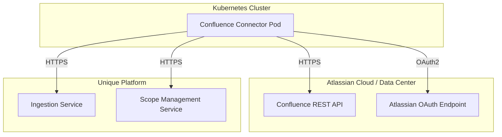
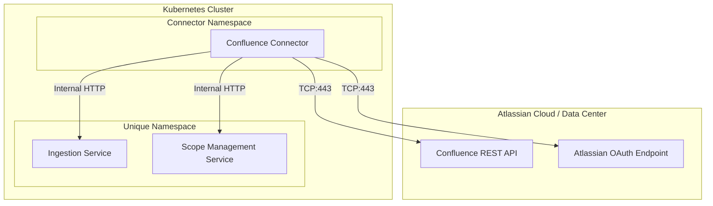

<!-- confluence-page-id: -->
<!-- confluence-space-key: PUBDOC -->

## Overview

This guide provides IT operators with the technical information needed to deploy, configure, and maintain the Confluence Connector.

For end-user and administrator documentation, see the [Confluence Connector Overview](../README.md).

## Documentation

| Document | Description |
|----------|-------------|
| [Deployment](./deployment.md) | Container images, Helm charts, Terraform modules, release policy |
| [Configuration](./configuration.md) | Tenant configuration, environment variables, YAML settings |
| [Authentication](./authentication.md) | Confluence OAuth 2.0 / PAT setup, Unique platform auth |
| [FAQ](../faq.md) | Frequently asked questions and common issues |

## Configuration Approach

The connector uses a **YAML-based tenant configuration file** for all settings. Each file defines exactly one tenant, with its own Confluence connection, Unique platform endpoints, processing schedule, and ingestion settings.

See [Configuration Guide](./configuration.md) for details.

## Architecture Overview

The Confluence Connector runs as a **single pod** that periodically scans Confluence spaces for labeled pages and synchronizes their content (and optionally file attachments) to the Unique knowledge base.

### Cluster-Internal Deployment

When deployed within the same Kubernetes cluster as Unique services:

In cluster-internal mode, Zitadel token validation is not needed. The connector communicates with Unique services using custom request headers for company and user scope.

## Infrastructure Requirements

| Component | Requirement | Notes |
|-----------|-------------|-------|
| **Kubernetes** | 1.25+ | Any Kubernetes distribution |
| **Container Runtime** | Docker / containerd | Standard container runtime |
| **Memory** | 1 Gi | Minimum allocation |
| **CPU** | 1 core | Minimum allocation |

### Network Requirements

| Destination | Port | Protocol | Direction |
|-------------|------|----------|-----------|
| `api.atlassian.com` | 443 | HTTPS | Outbound |
| `auth.atlassian.com` | 443 | HTTPS | Outbound |
| `api.media.atlassian.com` | 443 | HTTPS | Outbound |
| `*.atlassian.net` | 443 | HTTPS | Outbound |
| `{data-center-host}` | 443 | HTTPS | Outbound |
| Unique Ingestion Service | 443 / internal | HTTPS / HTTP | Outbound / Internal |
| Unique Scope Management Service | 443 / internal | HTTPS / HTTP | Outbound / Internal |
| Zitadel IdP | 443 | HTTPS | Outbound (external mode only) |
| DNS | 53 | UDP / TCP | Outbound |

## Deployment Checklist

### 1. Infrastructure

- [ ] Kubernetes namespace created
- [ ] Network egress to Confluence instance allowed (Cloud: `api.atlassian.com`, `auth.atlassian.com`, `api.media.atlassian.com`, and `*.atlassian.net`; Data Center: your instance host)
- [ ] Connectivity to Unique Ingestion Service verified
- [ ] Connectivity to Unique Scope Management Service verified

### 2. Confluence Authentication

- [ ] OAuth 2.0 (2LO) application created in Confluence (recommended for Cloud and Data Center 10.1+), or PAT generated for Data Center versions below 10.1
- [ ] Client ID and client secret noted (OAuth 2.0), or PAT token noted (Data Center < 10.1)
- [ ] Application configured with read access to the Confluence instance

> **Note:** OAuth 2.0 (2LO) is the recommended authentication method. Personal Access Tokens (PATs) are not recommended and should only be used on Confluence Data Center versions below 10.1 where OAuth 2.0 (2LO) is not available.

### 3. Unique Platform

- [ ] Service user created with required permissions
- [ ] Root scope ID obtained for ingestion (must be pre-created in Unique)
- [ ] Company ID and user ID noted (for cluster-local mode), or Zitadel client credentials configured (for external mode)
- [ ] Ingestion Service and Scope Management Service base URLs noted

### 4. Application

- [ ] Tenant configuration YAML file created with all required fields
- [ ] Secrets created in Kubernetes (OAuth client secret, PAT, or Zitadel credentials)
- [ ] Helm chart deployed
- [ ] Confluence labels applied to pages that should be synced

### 5. Verification

- [ ] Connector logs show successful tenant registration
- [ ] Connector logs show successful OAuth token acquisition
- [ ] Labeled pages are being discovered during sync cycles
- [ ] Pages and attachments appear in the Unique knowledge base
