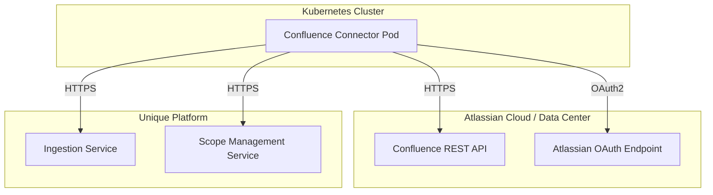
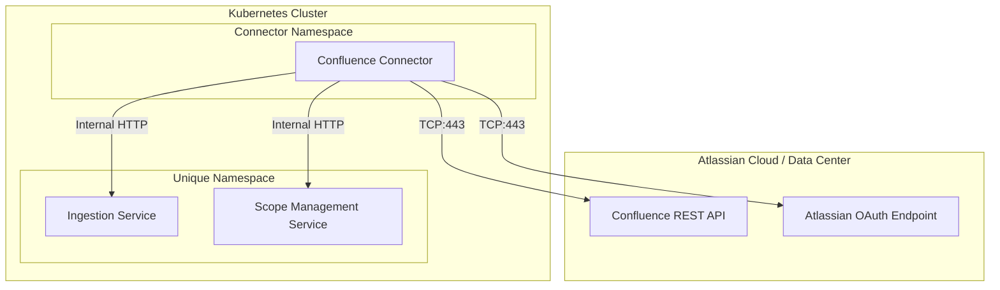

<!-- confluence-page-id: -->
<!-- confluence-space-key: PUBDOC -->

## Overview

This guide provides IT operators with the technical information needed to deploy, configure, and maintain the Confluence Connector v2.

For end-user and administrator documentation, see the [Confluence Connector Overview](../README.md).

> **Pre-release Notice:** The Confluence Connector v2 is currently in alpha (`2.0.0-alpha.4`). Configuration options and behavior may change before the stable release.

## Documentation

| Document | Description |
|----------|-------------|
| [Configuration](./configuration.md) | Tenant configuration, environment variables, YAML settings |
| [Authentication](./authentication.md) | Confluence OAuth 2.0 / PAT setup, Unique platform auth |
| [Deployment](./deployment.md) | Container images, Helm charts, release policy |
| [FAQ](../faq.md) | Frequently asked questions and common issues |

## Configuration Approach

The connector uses **YAML-based tenant configuration files** mounted into the container. Each file defines exactly one tenant, with its own Confluence connection, Unique platform endpoints, processing schedule, and ingestion settings. The tenant name is derived from the filename.

Tenant configuration files are discovered at startup via the glob pattern defined in `TENANT_CONFIG_PATH_PATTERN` (default: `/app/tenant-configs/*-tenant-config.yaml`).

Secrets (such as OAuth client secrets or PATs) are referenced from within the YAML using the `os.environ/ENV_VAR_NAME` pattern, which resolves the value from an environment variable at runtime.

See [Configuration Guide](./configuration.md) for details.

## Architecture Overview

The Confluence Connector runs as a **single pod** that periodically scans Confluence spaces for labeled pages and synchronizes their content (and optionally file attachments) to the Unique knowledge base.

### Cluster-Internal Deployment

When deployed within the same Kubernetes cluster as Unique services:

In cluster-internal mode (`serviceAuthMode: cluster_local`), Zitadel token validation is not needed. The connector communicates with Unique services using custom request headers (`x-company-id`, `x-user-id`) for company and user scope.

## Infrastructure Requirements

| Component | Requirement | Notes |
|-----------|-------------|-------|
| **Kubernetes** | 1.25+ | Any Kubernetes distribution |
| **Container Runtime** | Docker / containerd | Standard container runtime |
| **Memory (requests)** | 512 Mi | As defined in Helm chart defaults |
| **Memory (limits)** | 768 Mi | As defined in Helm chart defaults |
| **CPU (requests)** | 500m | As defined in Helm chart defaults |
| **Max heap size** | 896 MB | 896 MB (Helm chart default; container image default is 1024 MB if `MAX_HEAP_MB` is unset) |

### Ports

| Port | Purpose |
|------|---------|
| 51349 | Application HTTP server |
| 51350 | Prometheus metrics endpoint |

### Network Requirements

| Destination | Port | Protocol | Direction | Notes |
|-------------|------|----------|-----------|-------|
| `api.atlassian.com` | 443 | HTTPS | Outbound | OAuth token endpoint and REST API for Cloud instances |
| `{instance}.atlassian.net` | 443 | HTTPS | Outbound | Confluence Cloud base URL (used for page web links) |
| `{data-center-host}` | 443 | HTTPS | Outbound | Confluence Data Center REST API and OAuth token endpoint |
| Unique Ingestion Service | 443 / internal | HTTPS / HTTP | Outbound / Internal | File upload and ingestion |
| Unique Scope Management Service | 443 / internal | HTTPS / HTTP | Outbound / Internal | Scope creation and management |
| Zitadel IdP | 443 | HTTPS | Outbound | Only when `serviceAuthMode: external` |
| DNS | 53 | UDP / TCP | Outbound | Name resolution |

## Deployment Checklist

### 1. Infrastructure

- [ ] Kubernetes namespace created
- [ ] Network egress to Confluence instance allowed (Cloud: `api.atlassian.com` and `*.atlassian.net`; Data Center: your instance host)
- [ ] Connectivity to Unique Ingestion Service verified
- [ ] Connectivity to Unique Scope Management Service verified

### 2. Confluence Authentication

- [ ] OAuth 2.0 (2LO) application created in Confluence (or PAT generated for Data Center)
- [ ] Client ID and client secret noted (or PAT token)
- [ ] Application granted read access to the target spaces and pages

### 3. Unique Platform

- [ ] Service user created with required permissions
- [ ] Root scope ID obtained for ingestion (must be pre-created in Unique)
- [ ] Company ID and user ID noted (for `cluster_local` mode), or Zitadel client credentials configured (for `external` mode)
- [ ] Ingestion Service and Scope Management Service base URLs noted

### 4. Application

- [ ] Tenant configuration YAML file created with all required fields
- [ ] `ingestSingleLabel` and `ingestAllLabel` set to the desired Confluence label names (these are required fields)
- [ ] Secrets created in Kubernetes (OAuth client secret, PAT, or Zitadel credentials)
- [ ] Tenant config ConfigMap created (`confluence-connector-tenant-config`)
- [ ] Helm chart deployed
- [ ] `TENANT_CONFIG_PATH_PATTERN` set correctly (default: `/app/tenant-configs/*-tenant-config.yaml`)

### 5. Verification

- [ ] Connector logs show successful tenant registration
- [ ] Connector logs show successful OAuth token acquisition
- [ ] Labeled pages are being discovered during sync cycles
- [ ] Pages and attachments appear in the Unique knowledge base
- [ ] Prometheus metrics are accessible on port 51350
