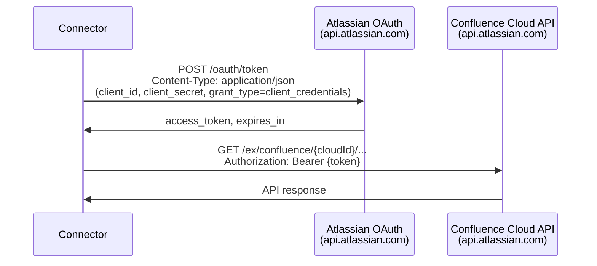
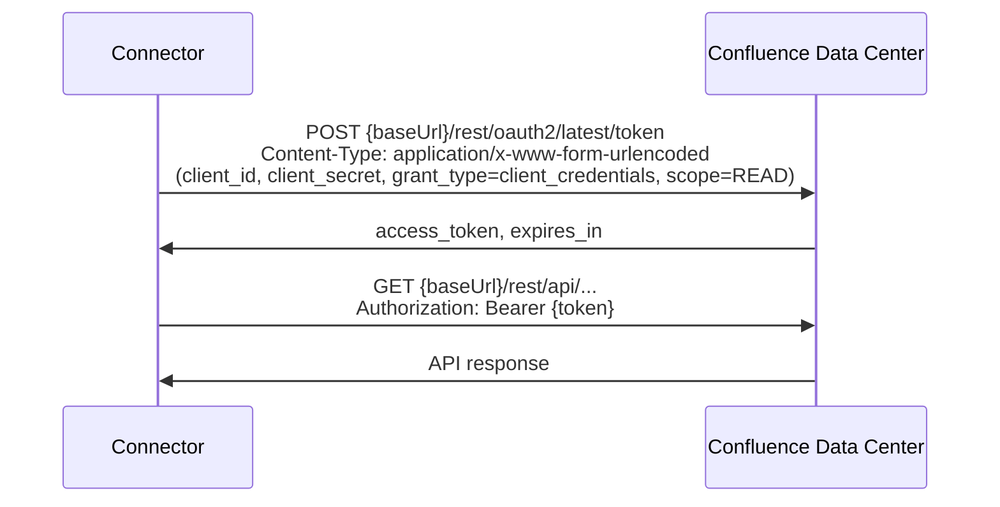
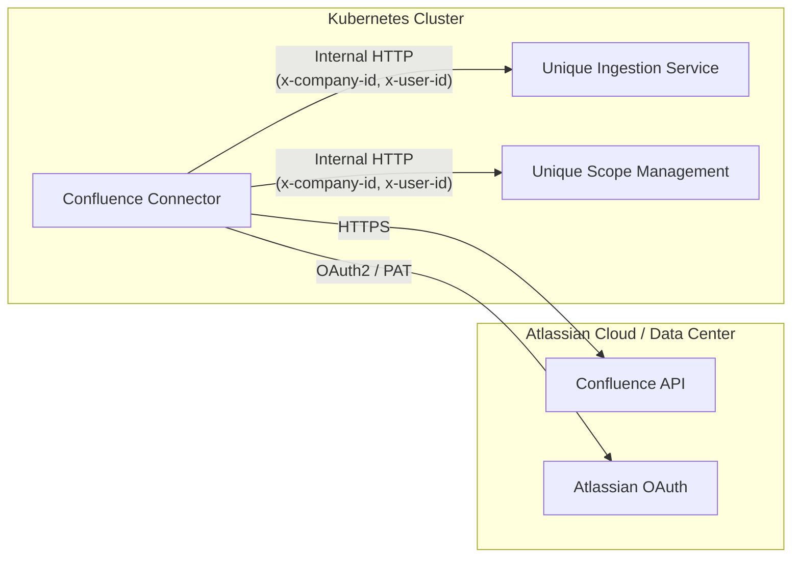
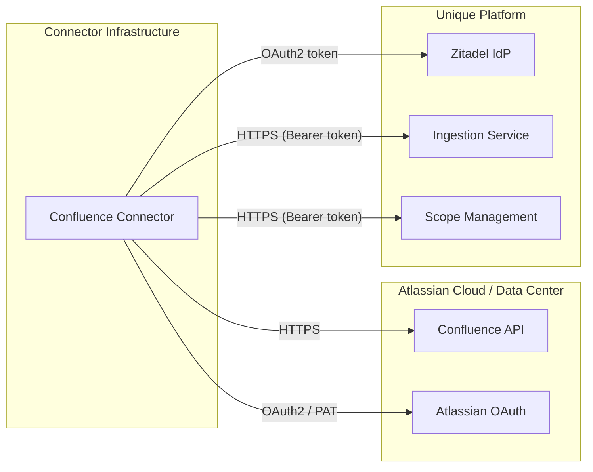

<!-- confluence-page-id: -->
<!-- confluence-space-key: PUBDOC -->

## Overview

The Confluence Connector authenticates in two directions:

1. **Confluence authentication** -- to read pages and attachments from Confluence Cloud or Data Center.
2. **Unique platform authentication** -- to ingest content into the Unique knowledge base.

This guide covers both authentication paths, including credential setup, secret management, and token flows.

## Confluence Authentication Methods

| Instance Type | Auth Method | Config Value (`auth.mode`) | Description |
|---|---|---|---|
| **Cloud** | OAuth 2.0 (2LO) | `oauth_2lo` | Client credentials flow via `https://api.atlassian.com/oauth/token` |
| **Data Center** | OAuth 2.0 (2LO) | `oauth_2lo` | Client credentials flow via `{baseUrl}/rest/oauth2/latest/token` |
| **Data Center** | Personal Access Token | `pat` | Static token-based authentication |

- Confluence Cloud supports **only** OAuth 2.0 two-legged (2LO).
- Confluence Data Center supports **both** OAuth 2.0 (2LO) and Personal Access Token (PAT).

## Unique Platform Authentication Methods

The connector's tenant YAML field for selecting the Unique auth mode is `serviceAuthMode` (not `authMode`).

> **Note:** The Helm chart `values.yaml` uses `unique.authMode`, which the Helm template maps to `serviceAuthMode` in the generated tenant config YAML.

| Auth Mode | Config Value (`serviceAuthMode`) | Description |
|---|---|---|
| **Cluster-local** | `cluster_local` | For connectors running in the same Kubernetes cluster as Unique. Uses service headers (`x-company-id`, `x-user-id`) instead of OAuth tokens. |
| **External** | `external` | For connectors running outside the cluster. Authenticates via Zitadel OAuth client credentials. |

## Setup Steps

### 1. Create a Unique Service User

The connector requires a service user in the Unique platform (Zitadel). This user identity is referenced:

- In `cluster_local` mode: as the `x-user-id` header value in `serviceExtraHeaders`. This **must** be the ID of an actual service user in Zitadel -- it cannot be an arbitrary value.
- In `external` mode: implicitly via the Zitadel client credentials (`zitadelClientId` / `zitadelClientSecret`).

The service user needs permissions to:

- Read and write knowledge base content (ingestion)
- Manage scopes (create child scopes, grant access)

For detailed instructions on creating and configuring a service user, see:
- [How To Configure A Service User](https://unique-ch.atlassian.net/wiki/spaces/PUBDOC/pages/1411023075/How+To+Configure+A+Service+User)
- [Understand Roles and Permissions](https://unique-ch.atlassian.net/wiki/spaces/PUBDOC/pages/1411023168)

### 2. Create the Root Scope in Unique

The connector requires a pre-existing root scope in Unique. The root scope ID is configured in the tenant YAML under `ingestion.scopeId`.

At startup, the connector first grants itself `MANAGE`, `READ`, and `WRITE` access on the root scope (the service account needs permission to query scopes), then verifies the scope exists (via `scopes.getById`). If the scope does not exist, the connector fails with an assertion error.

The connector automatically:

1. Grants itself `MANAGE`, `READ`, and `WRITE` access on the root scope.
2. Asserts that the root scope exists.
3. Creates child scopes for each Confluence space (using the space key as the scope name).
4. Sets `inheritAccess: true` on child scopes so they inherit access from the root.

### 3. Set Up Confluence Authentication

#### Option A: OAuth 2.0 (2LO) -- Cloud

1. Create an OAuth 2.0 application in the [Atlassian Developer Console](https://developer.atlassian.com/console/myapps/).
2. Configure the application with:
   - **Grant type:** Client credentials
   - **Scopes:** Read access to Confluence content (pages and attachments in the target spaces)
3. Note the **Client ID** and **Client Secret**.
4. Note the **Cloud ID** (UUID) for your Atlassian site.

**Required tenant YAML fields:**

```yaml
confluence:
  instanceType: cloud
  baseUrl: https://your-domain.atlassian.net
  cloudId: your-cloud-id
  auth:
    mode: oauth_2lo
    clientId: your-oauth-client-id
    clientSecret: os.environ/CONFLUENCE_CLIENT_SECRET
```

The `clientSecret` field uses the `os.environ/` prefix to resolve the value from an environment variable at runtime (see [Secret Resolution](#secret-resolution)).

#### Option B: OAuth 2.0 (2LO) -- Data Center

1. Create an OAuth 2.0 application in Confluence Data Center administration.
2. Configure the application with:
   - **Grant type:** Client credentials
   - **Scope:** `READ` access
3. Note the **Client ID** and **Client Secret**.

**Required tenant YAML fields:**

```yaml
confluence:
  instanceType: data-center
  baseUrl: https://confluence.your-company.com
  auth:
    mode: oauth_2lo
    clientId: your-confluence-app-client-id
    clientSecret: os.environ/CONFLUENCE_CLIENT_SECRET
```

#### Option C: Personal Access Token -- Data Center Only

1. In Confluence Data Center, go to **Profile** > **Personal Access Tokens**.
2. Create a new token with read access to the target spaces.
3. Note the generated token value.

**Required tenant YAML fields:**

```yaml
confluence:
  instanceType: data-center
  baseUrl: https://confluence.your-company.com
  auth:
    mode: pat
    token: os.environ/CONFLUENCE_PAT
```

The `token` field uses the `os.environ/` prefix to resolve the value from an environment variable at runtime (see [Secret Resolution](#secret-resolution)).

### 4. Set Up Unique Platform Authentication

#### Option A: Cluster-Local

Use this mode when the connector is deployed in the same Kubernetes cluster as the Unique platform.

**Required tenant YAML fields:**

```yaml
unique:
  serviceAuthMode: cluster_local
  serviceExtraHeaders:
    x-company-id: your-company-id
    x-user-id: your-user-id
  ingestionServiceBaseUrl: http://node-ingestion-service:8080
  scopeManagementServiceBaseUrl: http://scope-management-service:8080
```

| Header | Description |
|---|---|
| `x-company-id` | The company ID in the Unique platform |
| `x-user-id` | The user ID of the service user in Zitadel. Must be an actual service user -- not an arbitrary value. |

Both headers are validated at config load time. The schema requires that `serviceExtraHeaders` contains both `x-company-id` and `x-user-id`.

#### Option B: External (Zitadel)

Use this mode when the connector is deployed outside the Unique platform's Kubernetes cluster.

**Required tenant YAML fields:**

```yaml
unique:
  serviceAuthMode: external
  zitadelOauthTokenUrl: https://auth.your-unique-instance.com/oauth/v2/token
  zitadelProjectId: your-zitadel-project-id
  zitadelClientId: confluence-connector
  zitadelClientSecret: os.environ/ZITADEL_CLIENT_SECRET
  ingestionServiceBaseUrl: https://ingestion.your-unique-instance.com
  scopeManagementServiceBaseUrl: https://scope-management.your-unique-instance.com
```

| Field | Description |
|---|---|
| `zitadelOauthTokenUrl` | Zitadel OAuth token endpoint URL |
| `zitadelProjectId` | Zitadel project ID (resolved via `os.environ/` if prefixed) |
| `zitadelClientId` | Zitadel client ID for the connector's service user |
| `zitadelClientSecret` | Zitadel client secret (resolved via `os.environ/` if prefixed) |

## Secret Resolution

The connector supports resolving secret values from environment variables at runtime. In the tenant YAML, any field using the `envRequiredSecretSchema` validator accepts the format:

```
os.environ/ENV_VAR_NAME
```

At startup, the connector replaces this with the value of the referenced environment variable. If the variable is not set or is empty, config validation fails.

Secret values are wrapped in a `Redacted` class that prevents them from appearing in logs or JSON serialization (they render as `[Redacted]`).

**Fields that support `os.environ/` resolution:**

| Field | Example Environment Variable |
|---|---|
| `confluence.auth.clientSecret` | `CONFLUENCE_CLIENT_SECRET` |
| `confluence.auth.token` (PAT) | `CONFLUENCE_PAT` |
| `unique.zitadelClientSecret` | `ZITADEL_CLIENT_SECRET` |
| `unique.zitadelProjectId` | `ZITADEL_PROJECT_ID` |

### Providing Secrets in Kubernetes

Use Kubernetes Secrets to inject environment variables into the connector pod. The Helm chart supports this via the `connector.envVars` field in `values.yaml`:

```yaml
connector:
  envVars:
    - name: CONFLUENCE_CLIENT_SECRET
      valueFrom:
        secretKeyRef:
          name: confluence-connector-secret
          key: CONFLUENCE_CLIENT_SECRET
    - name: ZITADEL_CLIENT_SECRET
      valueFrom:
        secretKeyRef:
          name: confluence-connector-secret
          key: ZITADEL_CLIENT_SECRET
```

## Helm Chart Field Mapping

The Helm chart `values.yaml` uses `unique.authMode`, which the Helm template maps to `serviceAuthMode` in the generated tenant config. The following table shows how Helm values map to the actual tenant config fields:

| Helm `values.yaml` Field | Tenant Config YAML Field |
|---|---|
| `unique.authMode` | `unique.serviceAuthMode` |
| `unique.zitadel.oauthTokenUrl` | `unique.zitadelOauthTokenUrl` |
| `unique.zitadel.projectId` | `unique.zitadelProjectId` |
| `unique.zitadel.clientId` | `unique.zitadelClientId` |
| (hardcoded in template) | `unique.zitadelClientSecret: "os.environ/ZITADEL_CLIENT_SECRET"` |
| `unique.serviceExtraHeaders` | `unique.serviceExtraHeaders` |

## Token Flows

### Confluence Cloud OAuth 2.0 (2LO)



**Token endpoint:** `https://api.atlassian.com/oauth/token`

**Request format:** JSON body with `grant_type`, `client_id`, `client_secret`.

### Confluence Data Center OAuth 2.0 (2LO)



**Token endpoint:** `{baseUrl}/rest/oauth2/latest/token`

**Request format:** URL-encoded form body with `grant_type`, `client_id`, `client_secret`, and `scope=READ`.

### Confluence Data Center PAT

No token exchange is required. The PAT is sent directly as a `Bearer` token in the `Authorization` header on every API request.

### Token Caching

OAuth 2.0 tokens are cached in memory with a 5-minute buffer before expiry (`DEFAULT_BUFFER_MS = 5 * 60 * 1000`). Concurrent token requests are deduplicated -- only one token fetch runs at a time, and concurrent callers await the same in-flight promise.

PAT tokens are not cached (the static token is returned directly).

## Hosting Models

### Cluster-Local Deployment

The connector runs inside the same Kubernetes cluster as the Unique platform. It communicates with Unique services over internal cluster networking using service headers instead of OAuth tokens.



### External Deployment

The connector runs outside the Unique platform's Kubernetes cluster. It authenticates with Unique via Zitadel OAuth.



## Configuration Summary

### Confluence Configuration Fields

| Field | Required | Auth Mode | Type | Description |
|---|---|---|---|---|
| `confluence.auth.mode` | Yes | All | `oauth_2lo` or `pat` | Authentication method |
| `confluence.auth.clientId` | Yes | `oauth_2lo` | String | OAuth 2.0 application client ID |
| `confluence.auth.clientSecret` | Yes | `oauth_2lo` | String (`os.environ/` supported) | OAuth 2.0 client secret |
| `confluence.auth.token` | Yes | `pat` | String (`os.environ/` supported) | Personal Access Token |
| `confluence.cloudId` | Yes | Cloud only | String | Atlassian Cloud ID (UUID) |
| `confluence.baseUrl` | Yes | All | URL | Confluence instance base URL (no trailing slash) |
| `confluence.ingestSingleLabel` | Yes | All | String | Label for single-page sync (required, no default) |
| `confluence.ingestAllLabel` | Yes | All | String | Label for all-descendants sync (required, no default) |
| `confluence.apiRateLimitPerMinute` | Yes | All | Number | Number of Confluence API requests allowed per minute (required, no default) |

### Unique Configuration Fields

| Field | Required | Auth Mode | Type | Description |
|---|---|---|---|---|
| `unique.serviceAuthMode` | Yes | All | `cluster_local` or `external` | Unique platform auth mode |
| `unique.serviceExtraHeaders` | Yes | `cluster_local` | Object | Must contain `x-company-id` and `x-user-id` |
| `unique.zitadelOauthTokenUrl` | Yes | `external` | URL | Zitadel OAuth token endpoint |
| `unique.zitadelProjectId` | Yes | `external` | String (`os.environ/` supported) | Zitadel project ID |
| `unique.zitadelClientId` | Yes | `external` | String | Zitadel client ID |
| `unique.zitadelClientSecret` | Yes | `external` | String (`os.environ/` supported) | Zitadel client secret |
| `unique.ingestionServiceBaseUrl` | Yes | All | URL | Unique Ingestion Service URL (no trailing slash) |
| `unique.scopeManagementServiceBaseUrl` | Yes | All | URL | Unique Scope Management Service URL (no trailing slash) |
| `unique.apiRateLimitPerMinute` | No | All | Number | Number of Unique API requests allowed per minute (default: 100) |

## Troubleshooting

### OAuth Token Acquisition Failure

**Symptom:** `Failed to acquire Confluence {instanceType} token via OAuth 2.0 2LO` in logs.

**Causes:**
- Incorrect `clientId` or `clientSecret`
- OAuth application not configured for client credentials grant
- Network connectivity issues to the token endpoint
- For Cloud: incorrect or missing `cloudId`
- For Data Center: incorrect `baseUrl` (the token endpoint is derived as `{baseUrl}/rest/oauth2/latest/token`)

**Resolution:**
1. Verify `clientId` and `clientSecret` are correct
2. Confirm the OAuth application is configured for the client credentials grant type
3. Check network egress to the token endpoint (Cloud: `api.atlassian.com:443`, Data Center: your instance host)
4. Verify the environment variable referenced by `os.environ/` is set and non-empty

### PAT Authentication Failure

**Symptom:** `401 Unauthorized` responses from Confluence Data Center.

**Causes:**
- Token expired or revoked
- Token does not have read access to the target spaces
- Incorrect environment variable reference

**Resolution:**
1. Verify the PAT is still valid in Confluence Data Center administration
2. Regenerate the token if expired
3. Confirm the environment variable referenced by `os.environ/` is set and non-empty

### Root Scope Assertion Failure

**Symptom:** `Root scope with ID {scopeId} not found` assertion error at startup.

**Cause:** The `ingestion.scopeId` references a scope that does not exist in the Unique platform.

**Resolution:**
1. Create the root scope in the Unique platform before starting the connector
2. Verify the scope ID in the tenant configuration matches the actual scope ID

### Cluster-Local Header Validation Failure

**Symptom:** Config validation error: `serviceExtraHeaders must contain x-company-id and x-user-id headers`.

**Cause:** The `serviceExtraHeaders` object is missing one or both required headers.

**Resolution:**
1. Ensure both `x-company-id` and `x-user-id` are present in `serviceExtraHeaders`
2. The `x-user-id` must be the ID of an actual service user in Zitadel

### TLS Certificate Validation Errors

**Symptom:** `UNABLE_TO_VERIFY_LEAF_SIGNATURE`, `SELF_SIGNED_CERT_IN_CHAIN`, or similar TLS errors when connecting to Confluence or Unique APIs.

**Cause:** The pod's default trust store does not include the CA that signed the endpoint certificates. This typically happens in environments with a corporate proxy that re-signs TLS traffic or a custom PKI.

**Resolution:** Provide a CA bundle via the `NODE_EXTRA_CA_CERTS` environment variable:

```yaml
connector:
  env:
    NODE_EXTRA_CA_CERTS: /app/certs/ca-bundle.pem
```

Mount the PEM file containing the additional CA certificates into the pod and point the variable to its path.

### Secret Resolution Failure

**Symptom:** Config validation fails with an empty string error for a secret field.

**Cause:** The environment variable referenced by `os.environ/VAR_NAME` is not set or is empty.

**Resolution:**
1. Verify the Kubernetes Secret exists and contains the expected key
2. Verify the `envVars` entry in the Helm chart references the correct secret name and key
3. Check that the `os.environ/` prefix in the tenant YAML matches the environment variable name exactly
