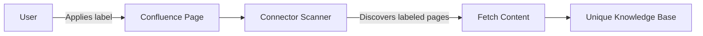

<!-- confluence-page-id: -->
<!-- confluence-space-key: PUBDOC -->

The Confluence Connector is a Node.js-based service that synchronizes page content and file attachments from Confluence to the Unique platform. It supports both Confluence Cloud and Confluence Data Center deployments.

**Core Capabilities:**

- Discovers pages via Confluence Query Language (CQL) label searches
- Fetches page content in HTML (Confluence storage representation) and downloads file attachments
- Computes per-space file diffs against previously ingested state to detect new, updated, and deleted items
- Ingests content into the Unique knowledge base via the Unique API
- Manages scope hierarchies automatically (root scope plus one child scope per Confluence space)
- Operates on a configurable cron schedule (default: every 15 minutes)

## Documentation

| Document | Description |
|----------|-------------|
| [Architecture](./architecture.md) | System components, multi-tenancy, connectivity |
| [Flows](./flows.md) | Content sync, file diff mechanism, discovery, ingestion |
| [Permissions](./permissions.md) | Confluence API and Unique platform permissions |
| [Security](./security.md) | Security practices, data handling |

## Key Concepts

### Pull-Based Architecture

The Confluence Connector **pulls** content from Confluence on a scheduled basis:

- The connector queries the Confluence REST API for labeled pages using CQL
- Content is fetched, diffed, and ingested into Unique
- Scheduling is controlled via a per-tenant cron expression (default: `*/15 * * * *`)

### Label-Driven Page Discovery

Pages are not automatically synced. Users must apply configurable Confluence labels to mark individual pages or entire page trees for synchronization:

See [Flows -- Discovery Phase](./flows.md#discovery-phase) for details.

### File Diff Mechanism

The connector computes diffs per Confluence space by comparing discovered items against the state stored in Unique, categorizing each item as new, updated, or deleted based on its key and `updatedAt` timestamp. See [Flows -- File Diff Mechanism](./flows.md#file-diff-mechanism) for details.

## Related Documentation

- [Operator Guide](../operator/README.md) - Deployment, configuration, and operations
- [FAQ](../faq.md) - Frequently asked questions
- [Confluence Connector Overview](../README.md) - End-user documentation

## Standard References

- [Confluence Cloud REST API](https://developer.atlassian.com/cloud/confluence/rest/v1/intro/) - Atlassian Confluence Cloud API documentation
- [Confluence Data Center REST API](https://docs.atlassian.com/ConfluenceServer/rest/latest/) - Atlassian Confluence Data Center API documentation
- [Atlassian OAuth 2.0 (3LO) apps](https://developer.atlassian.com/cloud/confluence/oauth-2-3lo-apps/) - Atlassian Cloud OAuth app setup (prerequisite for 2LO client credentials)
- [Confluence Query Language (CQL)](https://developer.atlassian.com/cloud/confluence/advanced-searching-using-cql/) - CQL reference for content search queries
