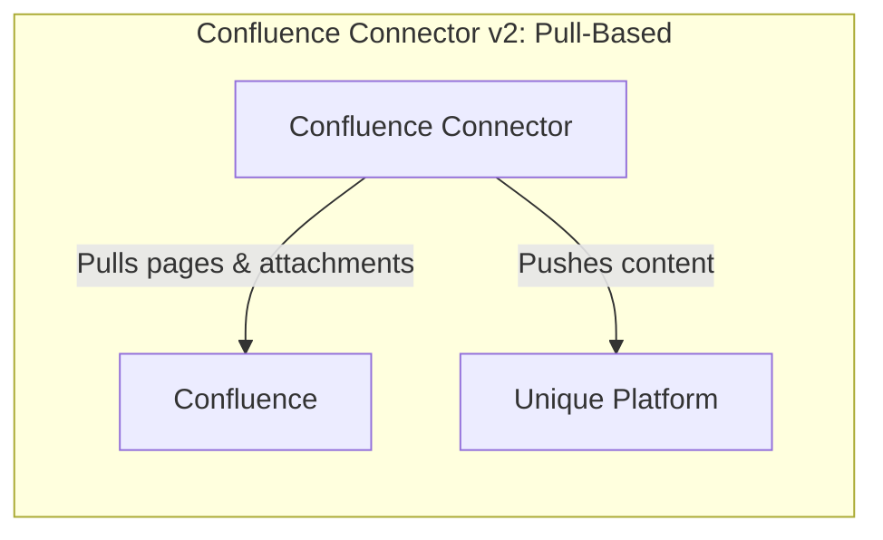

<!-- confluence-page-id: -->
<!-- confluence-space-key: PUBDOC -->

# Technical Reference

The Confluence Connector v2 (`@unique-ag/confluence-connector`) is a Node.js service built on NestJS that synchronizes page content and file attachments from Confluence to the Unique platform for RAG ingestion. It supports both Confluence Cloud and Confluence Data Center deployments.

**Core Capabilities:**

- Discovers pages via Confluence Query Language (CQL) label searches
- Fetches page content in HTML (Confluence storage representation) and downloads file attachments
- Computes per-space file diffs against previously ingested state to detect new, updated, and deleted items
- Ingests content into the Unique knowledge base via the Unique API (register, upload, finalize)
- Manages scope hierarchies automatically (root scope plus one child scope per Confluence space)
- Operates on a configurable cron schedule (default: every 15 minutes)

## Documentation

| Document | Description |
|----------|-------------|
| [Architecture](./architecture.md) | System components, module structure, multi-tenancy model |
| [Flows](./flows.md) | Content sync, file diff mechanism, discovery, ingestion |
| [Permissions](./permissions.md) | Confluence API and Unique platform permissions |
| [Security](./security.md) | Security practices, authentication strategies, data handling |

## Key Concepts

### Pull-Based Architecture

The Confluence Connector v2 **pulls** content from Confluence on a scheduled basis:

- The connector queries the Confluence REST API for labeled pages using CQL
- Content is fetched, diffed, and ingested into Unique
- Scheduling is controlled via a per-tenant cron expression (default: `*/15 * * * *`)

### Label-Driven Page Discovery

Pages are not automatically synced. Users must apply configurable Confluence labels (`ingestSingleLabel` and `ingestAllLabel`) to mark individual pages or entire page trees for synchronization. Both labels are required fields in the tenant configuration with no schema default. See [Flows -- Discovery Phase](./flows.md#discovery-phase) for the full CQL-based discovery flow, including descendant resolution, deduplication, and attachment extraction.

The scanner filters by [space type](../operator/configuration.md#space-scanning) and skips certain [content types](../README.md#core-capabilities) (databases, whiteboards, embeds).

### File Diff Mechanism

The connector computes diffs per Confluence space by comparing discovered items against the state stored in Unique, categorizing each item as new, updated, or deleted based on its key and `updatedAt` timestamp. Two [safety checks](./flows.md#safety-checks) prevent accidental full deletion by aborting the sync when the diff results indicate a likely error in discovery or key format.

See [Flows -- File Diff Mechanism](./flows.md#file-diff-mechanism) for the full details including state comparison diagrams, item attributes, partial key format, and change detection logic.

### Scope Management

Each tenant has a root scope that must pre-exist in the Unique platform. The connector grants itself access to the configured root scope and then verifies it exists at the start of every sync cycle. Child scopes are created automatically for each Confluence space, using the space key as the scope name. Scopes are created with `inheritAccess: true`, so they inherit access from the root scope.

Scope external IDs follow the format: `confc:<tenantName>:<spaceKey>`.

### Multi-Tenancy

Multiple Confluence instances (tenants) can be configured in a single deployment. Each tenant is isolated via `AsyncLocalStorage` and has its own dedicated service instances, API clients, and sync schedule. See [Architecture -- Multi-Tenancy Model](./architecture.md#multi-tenancy-model) for the full isolation model and per-tenant component details.

Tenant configuration files are loaded from YAML files matching the glob pattern set in `TENANT_CONFIG_PATH_PATTERN` (e.g., `/app/tenant-configs/*-tenant-config.yaml`). See the [Operator Guide](../operator/README.md) for configuration details.

### Authentication

The connector authenticates in two directions: toward Confluence (OAuth 2.0 2LO or PAT) and toward the Unique platform (`cluster_local` via service headers or `external` via Zitadel OAuth). In `cluster_local` mode, upload URLs are rewritten to the ingestion service's scoped upload endpoint to avoid hairpinning through the gateway. See the [Authentication Guide](../operator/authentication.md) for full details on each method, credential setup, and token flows.

### API Clients

The connector uses two concrete implementations of the abstract `ConfluenceApiClient`:

| Client | Instance Type | API Base | Space Type Filter |
|---|---|---|---|
| `CloudConfluenceApiClient` | Cloud | `https://api.atlassian.com/ex/confluence/<cloudId>` | `global`, `collaboration` |
| `DataCenterConfluenceApiClient` | Data Center | `<baseUrl>` (direct) | `global` |

Both clients use CQL to search for labeled pages and fetch descendants. Key differences:

- **Attachment pagination**: Cloud uses the v2 REST API (`/wiki/api/v2/pages/<id>/attachments`) for pages with more than 25 attachments (v1 pagination returns 410 Gone). Data Center follows v1 `_links.next` pagination links.
- **Attachment download**: Cloud uses `/wiki/rest/api/content/<pageId>/child/attachment/<attachmentId>/download` through the Atlassian API gateway. Data Center uses `_links.download` directly.
- **Page URLs**: Cloud builds URLs from `_links.webui`. Data Center uses `/pages/viewpage.action?pageId=<id>`.

### Ingestion Pipeline

Content flows through a 3-step pipeline for each item (page or attachment):

1. **Register**: `registerContent` sends metadata including key, title, mimeType, scopeId, sourceKind, and other metadata to the Unique ingestion API
2. **Upload**: The content is uploaded via HTTP PUT to the returned `writeUrl` (page HTML as a buffer, attachments as a stream)
3. **Finalize**: `finalizeIngestion` triggers downstream processing in Unique

Pages are ingested as `text/html`. Attachments use their original media type. Both use `sourceKind` values:
- Cloud: `ATLASSIAN_CONFLUENCE_CLOUD`
- Data Center: `ATLASSIAN_CONFLUENCE_ONPREM`

Ingestion concurrency is controlled by the `processing.concurrency` setting (default: 1). Progress is logged every 100 items.

### v1-Compatible Key Format

By default, ingestion keys include a tenant name prefix: `<tenantName>/<spaceId>_<spaceKey>/<pageId>`. When `useV1KeyFormat` is enabled, the tenant prefix is omitted: `<spaceId>_<spaceKey>/<pageId>`. This is for backward compatibility with content previously ingested by Confluence Connector v1.

## Related Documentation

- [Operator Guide](../operator/README.md) - Deployment, configuration, and operations
- [FAQ](../faq.md) - Frequently asked questions
- [Confluence Connector Overview](../README.md) - End-user documentation

## Standard References

- [Confluence Cloud REST API](https://developer.atlassian.com/cloud/confluence/rest/v1/intro/) - Atlassian Confluence Cloud API documentation
- [Confluence Data Center REST API](https://docs.atlassian.com/ConfluenceServer/rest/latest/) - Atlassian Confluence Data Center API documentation
- [Atlassian Cloud Authentication](https://developer.atlassian.com/cloud/confluence/security-for-connect-apps/) - Atlassian authentication documentation
- [Confluence Query Language (CQL)](https://developer.atlassian.com/cloud/confluence/advanced-searching-using-cql/) - CQL reference for content search queries
