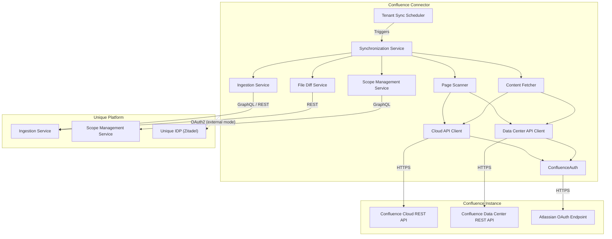
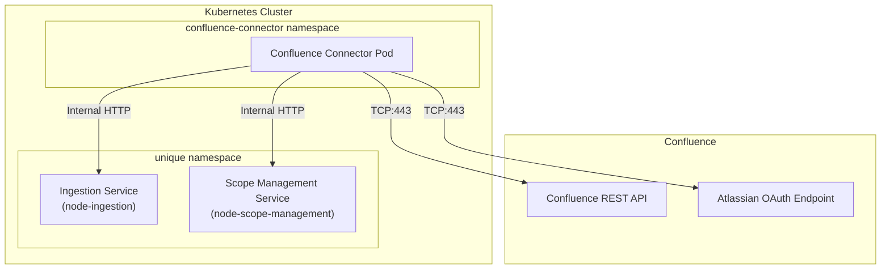
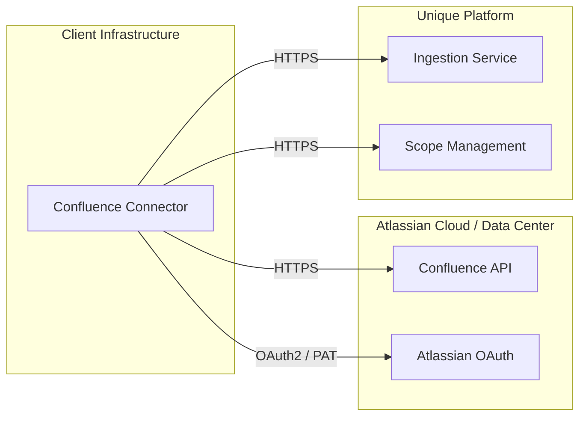

<!-- confluence-page-id: -->
<!-- confluence-space-key: PUBDOC -->

## High-Level Architecture

> Only one API client is active per tenant: `CloudConfluenceApiClient` for Cloud instances or `DataCenterConfluenceApiClient` for Data Center instances.

## Key Components

### In Short

- The system discovers labeled pages and file attachments from Confluence via CQL queries, computes per-space file diffs against previously ingested state, and pushes new/updated content into the Unique platform
- All communication is encrypted via HTTPS (TCP:443) for external endpoints; cluster-internal communication uses HTTP
- Both Confluence Cloud and Confluence Data Center deployments are supported
- Page discovery is label-driven: users apply configurable Confluence labels to mark pages for synchronization
- Labels are REQUIRED fields in tenant configuration -- there is no schema default

### Confluence Cloud

- Accessed via the Atlassian API gateway over the internet
- The connector initiates outbound HTTPS requests to the Atlassian API
- **Traffic:**
  - UDP/TCP:53 (DNS) - for name resolution
  - TCP:443 (HTTPS) - for API communication
- **Direction:** Outbound (Egress) from the connector

### Confluence Data Center

- Accessed directly at the configured `baseUrl`
- The connector initiates outbound HTTPS requests to the Data Center instance
- **Traffic:**
  - UDP/TCP:53 (DNS) - for name resolution
  - TCP:443 (HTTPS) - for API communication (port depends on instance configuration)
- **Direction:** Outbound (Egress) from the connector

### Confluence Connector (Internal Service, Node.js)

- Fetches content and attachments from Confluence Cloud or Data Center REST APIs
- Processes and forwards content to Unique platform APIs
- Handles authentication via OAuth 2.0 (Cloud and Data Center) or PAT (Data Center below 10.1)
- **Traffic:**
  - Outbound HTTPS to Confluence API (TCP:443)
  - Internal HTTP or external HTTPS to Unique platform
  - DNS lookups (UDP/TCP:53)

### Unique Platform (Internal Service)

- Receives processed content from the connector via GraphQL and REST APIs
- **Traffic:**
  - Internal HTTP or external HTTPS to Unique Ingestion Service (GraphQL and REST)
  - Internal HTTP or external HTTPS to Unique Scope Management Service (GraphQL)
  - DNS lookups (UDP/TCP:53)

### Unique IDP (Identity Provider)

- Manages authentication for Unique platform APIs
- **Traffic:**
  - TCP:443 (HTTPS) for token retrieval (only in `external` auth mode)
  - UDP/TCP:53 (DNS) for resolution

## Cluster-Internal Deployment

When deployed inside the same Kubernetes cluster as Unique services:

In cluster-internal mode (`serviceAuthMode: cluster_local`):

- Zitadel token validation is not needed
- Services communicate within the cluster via internal HTTP
- Company and user scope is maintained via request headers:
  - `x-company-id`
  - `x-user-id`
- Upload URLs are rewritten to the ingestion service's scoped upload endpoint to avoid hairpinning through the gateway

## Multi-Tenancy Support

Multiple Confluence instances (tenants) can be configured in a single deployment. Each tenant is isolated via `AsyncLocalStorage` and has its own service instances, API clients, authentication strategy, and sync schedule. The `TenantRegistry` initializes all per-tenant services at startup.

Tenant configuration files are loaded from YAML files matching the glob pattern set in `TENANT_CONFIG_PATH_PATTERN` (default: `/app/tenant-configs/*-tenant-config.yaml`). Each tenant has a status (`active`, `inactive`, or `deleted`). Only `active` tenants are registered and scheduled. See the [Operator Guide](../operator/README.md) for configuration details.

## Container Platform

The connector runs on any container orchestrator. Unique provides a versioned Helm chart for Kubernetes deployment.

Clients desiring to run the connector outside Kubernetes can use the Helm chart as documentation and inspiration.

## Connectivity

All external communication is encrypted via HTTPS (TCP:443).

### Authentication Endpoints

| Instance Type | Endpoint | Description |
|---------------|----------|-------------|
| Cloud | `https://api.atlassian.com/oauth/token` | Atlassian centralized OAuth 2.0 token endpoint (client credentials grant) |
| Data Center (OAuth) | `<baseUrl>/rest/oauth2/latest/token` | Instance-specific OAuth 2.0 token endpoint (client credentials grant) |
| Data Center (PAT; below 10.1 only, not recommended) | N/A (no token exchange) | Static token sent as Bearer header |
| Unique (external mode) | Configured via `zitadelOauthTokenUrl` (e.g., `https://idp.unique.app/oauth/v2/token`) | Zitadel OAuth 2.0 token endpoint |

The connector initiates outbound requests to these authentication endpoints. No inbound connections are required for authentication.

### Confluence Cloud API Endpoints

| Endpoint | Use Case |
|----------|----------|
| `api.atlassian.com/ex/confluence/<cloudId>/wiki/rest/api/content/search?cql=...` | Search for labeled pages, descendants, and individual page content via CQL |
| `api.atlassian.com/ex/confluence/<cloudId>/wiki/api/v2/pages/<pageId>/attachments` | Fetch page attachments (v2 API, used when the inline attachment count reaches the Confluence-imposed limit) |
| `api.atlassian.com/ex/confluence/<cloudId>/wiki/rest/api/content/<pageId>/child/attachment/<attachmentId>/download` | Download attachment content |

Attachment downloads are served via `api.media.atlassian.com`. The connector's HTTP client follows the redirect automatically. Firewall rules must allow outbound HTTPS to this domain in addition to `api.atlassian.com`.

### Confluence Data Center API Endpoints

| Endpoint | Use Case |
|----------|----------|
| `<baseUrl>/rest/api/content/search?cql=...` | Search for labeled pages and descendants via CQL |
| `<baseUrl>/rest/api/content/<pageId>` | Fetch individual page content (HTML storage representation) |
| `<baseUrl><_links.download>` | Download attachment content (uses download path from API response) |

## Hosting Models

### Self-Hosted (SH)

Client hosts the connector and manages Confluence authentication credentials:

| Aspect | Responsibility |
|--------|---------------|
| Connector hosting | Client |
| Confluence service account or PAT (PAT only for DC < 10.1) | Client |
| Unique deliverable | Container image, Helm chart, documentation |

### Single-Tenant: Client-Hosted

Client uses Unique Single Tenant but hosts the connector:

- Suitable for on-premise Confluence Data Center deployments
- Client manages the connector and Confluence credentials
- Connector connects to Unique via external API (`serviceAuthMode: external`)

### Single-Tenant: Unique-Hosted

Unique hosts the connector on behalf of the client:

- Client creates the service account in their own Atlassian Admin Console and provides the credentials (client ID and client secret) to Unique
- Client provides their Confluence instance details (Cloud ID, base URL, label configuration)
- For Data Center below 10.1: client provides a PAT instead (not recommended)

### Multi-Tenant: Unique-Hosted

Unique hosts a single connector deployment serving multiple tenants:

- Each tenant is configured via a separate tenant YAML file
- Each tenant has its own Confluence instance, credentials, and Unique platform endpoints
- Tenants are isolated at the configuration level (separate scopes, separate sync schedules, separate credentials)
- The connector processes all tenants within a single pod

**Customer onboarding:**

1. Create a new tenant YAML file with the customer's Confluence instance details, credentials, and Unique platform endpoints
2. Mount the file into the connector pod via the tenant config ConfigMap
3. Restart the connector to pick up the new tenant

**Data isolation:** Each tenant has its own root scope and child scopes in the Unique knowledge base. Content from different tenants is never mixed. Credentials are per-tenant and resolved from separate environment variables.

**Compliance:** Some organizations may require dedicated infrastructure for data residency. In that case, deploy a separate connector instance with single-tenant configuration instead.

## System Scalability and Resource Sizing

The Node.js service operates with the following default resource allocation (from Helm chart defaults):

| Resource | Value |
|----------|-------|
| Memory request | 512 Mi |
| Memory limit | 1 Gi |
| CPU request | 1 core |
| Default max heap size | 1024 MB (configurable via `MAX_HEAP_MB`) |
| Helm chart `MAX_HEAP_MB` | 1920 MB |
| Application port | 51349 |
| Metrics port (Prometheus) | 51350 |

The connector is an IO-driven, low CPU workload. Unique AI ingestion services are typically the bottleneck, depending on embedding models used. Ingestion concurrency is controlled by the `processing.concurrency` setting (default: 1).

## Related Documentation

- [Flows](./flows.md) - Content sync, file diff mechanism, discovery, ingestion
- [Permissions](./permissions.md) - Confluence API and Unique platform permissions
- [Security](./security.md) - Security practices, authentication strategies, data handling
- [Operator Guide](../operator/README.md) - Deployment and operations

## Standard References

- [Confluence Cloud REST API](https://developer.atlassian.com/cloud/confluence/rest/v1/intro/) - Atlassian Confluence Cloud API documentation
- [Confluence Data Center REST API](https://docs.atlassian.com/ConfluenceServer/rest/latest/) - Atlassian Confluence Data Center API documentation
- [Atlassian OAuth 2.0 (3LO) apps](https://developer.atlassian.com/cloud/confluence/oauth-2-3lo-apps/) - Atlassian Cloud OAuth app setup (prerequisite for 2LO client credentials)
- [Confluence Query Language (CQL)](https://developer.atlassian.com/cloud/confluence/advanced-searching-using-cql/) - CQL reference for content search queries
