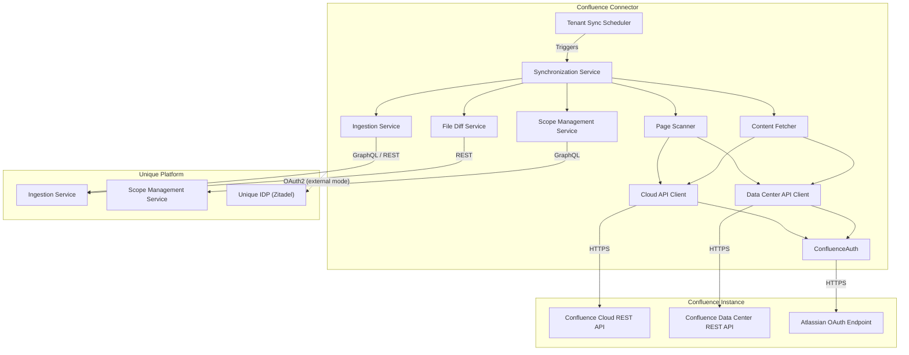
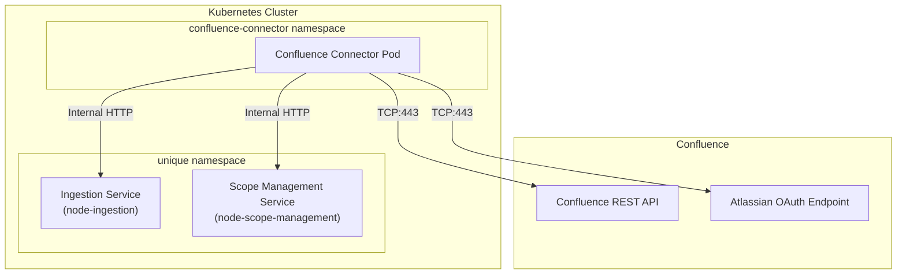
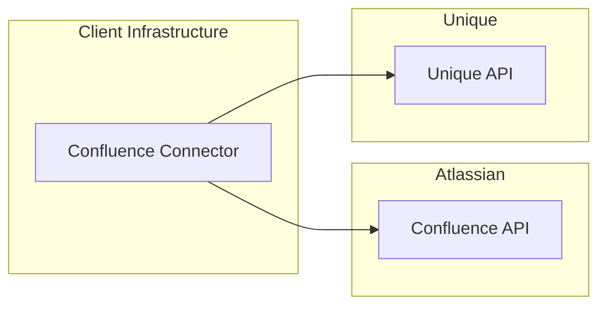

<!-- confluence-page-id: -->
<!-- confluence-space-key: PUBDOC -->

# Architecture

## High-Level Architecture

> Only one API client is active per tenant: `CloudConfluenceApiClient` for Cloud instances or `DataCenterConfluenceApiClient` for Data Center instances.

## Key Components

### In Short

- The system discovers labeled pages and file attachments from Confluence via CQL queries, computes per-space file diffs against previously ingested state, and pushes new/updated content into the Unique platform
- All communication is encrypted via HTTPS (TCP:443) for external endpoints; cluster-internal communication uses HTTP
- Both Confluence Cloud and Confluence Data Center deployments are supported
- Page discovery is label-driven: users apply configurable Confluence labels to mark pages for synchronization
- Labels are REQUIRED fields in tenant configuration -- there is no schema default

### Component Responsibilities

| Component | Class | Responsibility |
|-----------|-------|----------------|
| Tenant Sync Scheduler | `TenantSyncScheduler` | Triggers an initial sync on startup, then registers a cron job per tenant (default: `*/15 * * * *`) |
| Synchronization Service | `ConfluenceSynchronizationService` | Orchestrates the full sync cycle: scope initialization, discovery, file diff, ingestion, and deletion |
| Page Scanner | `ConfluencePageScanner` | Discovers pages via CQL label search and extracts attachments from page responses |
| Content Fetcher | `ConfluenceContentFetcher` | Fetches full page content (HTML storage representation) by page ID |
| File Diff Service | `FileDiffService` | Computes per-space diffs against Unique's stored state to identify new, updated, and deleted items |
| Ingestion Service | `IngestionService` | Executes the 3-step ingestion pipeline (register, upload, finalize) and handles content deletion |
| Scope Management Service | `ScopeManagementService` | Manages the root scope and per-space child scopes (see [Scope Management](./README.md#scope-management)) |
| Cloud API Client | `CloudConfluenceApiClient` | Communicates with Confluence Cloud via the Atlassian API gateway (`api.atlassian.com`) |
| Data Center API Client | `DataCenterConfluenceApiClient` | Communicates directly with a Confluence Data Center instance |

### Multi-Tenancy Model

Multiple Confluence instances (tenants) can be configured in a single deployment. Each tenant is isolated via `AsyncLocalStorage` and has its own service instances, API clients, authentication strategy, and sync schedule. The `TenantRegistry` initializes all per-tenant services at startup.

Tenant configuration files are loaded from YAML files matching the glob pattern set in `TENANT_CONFIG_PATH_PATTERN` (default: `/app/tenant-configs/*-tenant-config.yaml`). Each tenant has a status (`active`, `inactive`, or `deleted`). Only `active` tenants are registered and scheduled. See the [Operator Guide](../operator/README.md) for configuration details.

### Dynamic Configuration

The connector does not support dynamic site configuration. All configuration is static via YAML files. Configuration changes require restarting the connector (or redeploying with updated ConfigMaps in Kubernetes).

However, the set of pages to synchronize is dynamic: it is determined at runtime by which Confluence pages carry the configured labels. Users add or remove labels in Confluence to control what gets synced, without any connector configuration change.

## External Service Details

### Confluence Cloud

- Accessed via the Atlassian API gateway over the internet
- The connector initiates outbound HTTPS requests to the Atlassian API
- **Traffic:**
  - UDP/TCP:53 (DNS) - for name resolution
  - TCP:443 (HTTPS) - for API communication
- **Direction:** Outbound (Egress) from the connector

### Confluence Data Center

- Accessed directly at the configured `baseUrl`
- The connector initiates outbound HTTPS requests to the Data Center instance
- **Traffic:**
  - UDP/TCP:53 (DNS) - for name resolution
  - TCP:443 (HTTPS) - for API communication (port depends on instance configuration)
- **Direction:** Outbound (Egress) from the connector

### Unique Platform

- Receives processed content from the connector via GraphQL and REST APIs
- **Traffic:**
  - Internal HTTP or external HTTPS to Unique Ingestion Service (GraphQL and REST)
  - Internal HTTP or external HTTPS to Unique Scope Management Service (GraphQL)
  - External HTTPS to Zitadel IDP (TCP:443, only in `external` auth mode)
  - DNS lookups (UDP/TCP:53)

## Cluster-Internal Deployment

When deployed inside the same Kubernetes cluster as Unique services:

In cluster-internal mode (`serviceAuthMode: cluster_local`):

- Zitadel token validation is not needed
- Services communicate within the cluster via internal HTTP
- Company and user scope is maintained via request headers:
  - `x-company-id`
  - `x-user-id`
- Upload URLs are rewritten to the ingestion service's scoped upload endpoint to avoid hairpinning through the gateway

## Hosting Models

### Self-Hosted (SH)

| Aspect | Responsibility |
|--------|---------------|
| Connector hosting | Client |
| Confluence service account or PAT (PAT only for DC < 10.1; not recommended) | Client |
| Unique deliverable | Container image, Helm chart, documentation |

### Single-Tenant: Client-Hosted

Client uses Unique Single Tenant but hosts the connector:

- Suitable for on-premise Confluence Data Center deployments
- Client manages the connector and Confluence credentials
- Connector connects to Unique via external API (`serviceAuthMode: external`)

### Single-Tenant: Unique-Hosted

Unique hosts the connector on behalf of the client:

- For Confluence Cloud: Unique provides the OAuth 2.0 service account; client provides Cloud ID, base URL, and label configuration
- For Confluence Data Center: client provides OAuth credentials and instance URL, or PAT for Data Center versions below 10.1 only (not recommended)

### Multi-Tenant: Unique-Hosted

Unique hosts a single connector deployment serving multiple tenants:

- Each tenant is configured via a separate tenant YAML file
- Each tenant has its own Confluence instance, credentials, and Unique platform endpoints
- Tenants are isolated at the configuration level (separate scopes, separate sync schedules)
- The connector processes all tenants within a single pod

## Container Platform

The connector runs on any container orchestrator. Unique provides a versioned Helm chart for Kubernetes deployment.

Clients desiring to run the connector outside Kubernetes can use the Helm chart as documentation and inspiration.

### Container Image

| Property | Value |
|----------|-------|
| Base image | `node:24-bookworm-slim` |
| Process manager | `dumb-init` (PID 1, signal forwarding) |
| Runtime user | `nestjs` (UID 1001, non-root) |
| Entrypoint | `node --enable-source-maps --max-old-space-size=${MAX_HEAP_MB:-1024} dist/main.js` |
| Image repository | `ghcr.io/unique-ag/connectors/services/confluence-connector` |

## Connectivity

All external communication is encrypted via HTTPS (TCP:443).

### Authentication Endpoints

| Instance Type | Endpoint | Description |
|---------------|----------|-------------|
| Cloud | `https://api.atlassian.com/oauth/token` | Atlassian centralized OAuth 2.0 token endpoint (client credentials grant) |
| Data Center (OAuth) | `<baseUrl>/rest/oauth2/latest/token` | Instance-specific OAuth 2.0 token endpoint (client credentials grant) |
| Data Center (PAT; below 10.1 only, not recommended) | N/A (no token exchange) | Static token sent as Bearer header |
| Unique (external mode) | Configured via `zitadelOauthTokenUrl` (e.g., `https://idp.unique.app/oauth/v2/token`) | Zitadel OAuth 2.0 token endpoint |

The connector initiates outbound requests to these authentication endpoints. No inbound connections are required for authentication.

### Confluence Cloud API Endpoints

| Endpoint | Use Case |
|----------|----------|
| `api.atlassian.com/ex/confluence/<cloudId>/wiki/rest/api/content/search?cql=...` | Search for labeled pages, descendants, and individual page content via CQL |
| `api.atlassian.com/ex/confluence/<cloudId>/wiki/api/v2/pages/<pageId>/attachments` | Fetch page attachments (v2 API, used when the inline attachment count reaches the Confluence-imposed limit) |
| `api.atlassian.com/ex/confluence/<cloudId>/wiki/rest/api/content/<pageId>/child/attachment/<attachmentId>/download` | Download attachment content |

### Confluence Data Center API Endpoints

| Endpoint | Use Case |
|----------|----------|
| `<baseUrl>/rest/api/content/search?cql=...` | Search for labeled pages and descendants via CQL |
| `<baseUrl>/rest/api/content/<pageId>` | Fetch individual page content (HTML storage representation) |
| `<baseUrl><_links.download>` | Download attachment content (uses download path from API response) |

### Unique Platform API Endpoints

| Service | Protocol | Operations Used |
|---------|----------|-----------------|
| Ingestion Service | GraphQL | `ingestion.registerContent()` (register content for ingestion) |
| Ingestion Service | REST | `PUT <writeUrl>` (upload content to pre-signed URL) |
| Ingestion Service | GraphQL | `ingestion.finalizeIngestion()` (finalize ingested content) |
| Ingestion Service | REST | `ingestion.performFileDiff()` (compute file diffs per space) |
| Ingestion Service | GraphQL | `files.getByKeys()`, `files.deleteByIds()`, `files.getCountByKeyPrefix()` (query and delete files) |
| Scope Management Service | GraphQL | `users.getCurrentId()` (current user ID) |
| Scope Management Service | GraphQL | `scopes.createFromPaths()`, `scopes.getById()`, `scopes.updateExternalId()`, `scopes.createAccesses()` (scope lifecycle) |

## System Scalability and Resource Sizing

The Node.js service operates with the following default resource allocation (from Helm chart defaults):

| Resource | Value |
|----------|-------|
| Memory request | 512 Mi |
| Memory limit | 768 Mi |
| CPU request | 500m |
| Default max heap size | 1024 MB (configurable via `MAX_HEAP_MB`) |
| Helm chart `MAX_HEAP_MB` | 896 MB |
| Application port | 51349 |
| Metrics port (Prometheus) | 51350 |

The connector is an IO-driven, low CPU workload. Unique AI ingestion services are typically the bottleneck, depending on embedding models used. Ingestion concurrency is controlled by the `processing.concurrency` setting (default: 1).

## Related Documentation

- [Flows](./flows.md) - Content sync, file diff mechanism, discovery, ingestion
- [Permissions](./permissions.md) - Confluence API and Unique platform permissions
- [Security](./security.md) - Security practices, authentication strategies, data handling
- [Operator Guide](../operator/README.md) - Deployment and operations

## Standard References

- [Confluence Cloud REST API](https://developer.atlassian.com/cloud/confluence/rest/v1/intro/) - Atlassian Confluence Cloud API documentation
- [Confluence Data Center REST API](https://docs.atlassian.com/ConfluenceServer/rest/latest/) - Atlassian Confluence Data Center API documentation
- [Atlassian OAuth 2.0 (3LO) apps](https://developer.atlassian.com/cloud/confluence/oauth-2-3lo-apps/) - Atlassian Cloud OAuth app setup (prerequisite for 2LO client credentials)
- [Confluence Query Language (CQL)](https://developer.atlassian.com/cloud/confluence/advanced-searching-using-cql/) - CQL reference for content search queries
