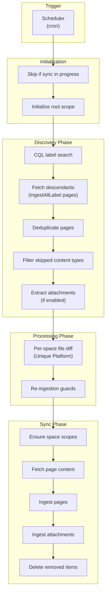
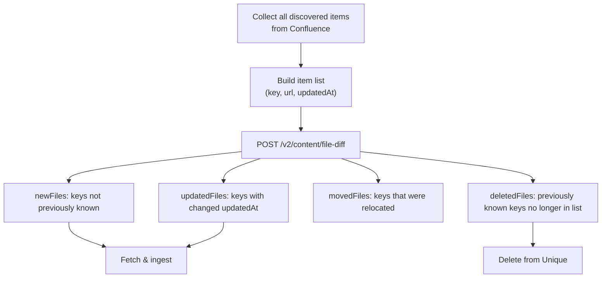
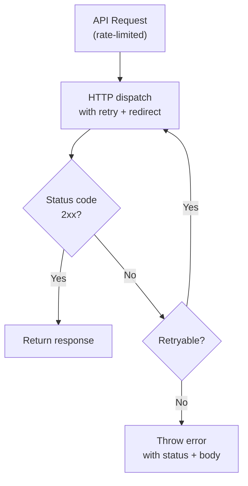

<!-- confluence-page-id: 2150301717 -->
<!-- confluence-space-key: PUBDOC -->

## Content Sync Flow

The content sync flow runs periodically (default: every 15 minutes) to synchronize labeled Confluence pages and their attachments to Unique.

### Overview



### Sequence Diagram

The connector is **stateless** -- it does not maintain local state between sync cycles. Change detection is performed by the Unique platform's file diff API, called once per Confluence space.

```mermaid
sequenceDiagram
    autonumber
    participant Scheduler
    participant Connector as Confluence Connector
    participant Confluence as Confluence API
    participant Unique as Unique Platform

    Note over Scheduler: Cron triggers<br/>(default: every 15 min)
    Scheduler->>Connector: Start sync cycle

    alt Sync already in progress
        Note over Connector: Skip (re-entrancy guard)
    end

    opt Data Center only
        Connector->>Confluence: GET /rest/applinks/1.0/manifest
        Confluence->>Connector: Instance identifier
    end

    Connector->>Unique: Initialize root scope<br/>(grant access, claim or verify ownership)

    rect rgb(200, 210, 240)
        Note over Connector,Confluence: Discovery Phase
        Connector->>Confluence: CQL search: pages with<br/>ingestSingleLabel OR ingestAllLabel
        Confluence->>Connector: Labeled pages<br/>(with inline attachments)

        opt Pages with ingestAllLabel
            Connector->>Confluence: CQL ancestor query<br/>(batches of 100 root IDs)
            Confluence->>Connector: Descendant pages<br/>(with inline attachments)
        end

        Note over Connector: Deduplicate, filter skipped types,<br/>extract attachments (if enabled)
    end

    rect rgb(200, 235, 200)
        Note over Connector,Unique: Processing Phase
        loop For each Confluence space
            Connector->>Unique: POST /v2/content/file-diff<br/>(pages + attachments per space)
            Unique->>Connector: newFiles, updatedFiles,<br/>deletedFiles, movedFiles
            Note over Connector: Safety checks:<br/>abort if accidental full deletion<br/>(movedFiles are not processed)
        end
    end

    rect rgb(240, 210, 200)
        Note over Connector,Unique: Sync Phase — Ingestion
        Connector->>Unique: Ensure space scopes

        loop For each new/updated page (concurrency-limited)
            Connector->>Confluence: GET page by ID<br/>(body.storage)
            Confluence->>Connector: Page HTML content
            Note over Connector: Parse storage XML, locate &lt;ac:image&gt; macros
            opt Image attachments referenced
                opt Some references point to another page
                    Connector->>Confluence: GET /rest/api/content?spaceKey=&amp;title=<br/>(cached per sync)
                    Confluence->>Connector: Target page + its attachments
                end
                Connector->>Confluence: Download each referenced image
                Confluence->>Connector: Image binary streams
                Note over Connector: Base64-encode and splice<br/>&lt;img src="data:..."&gt; in place of macros
            end
            Connector->>Unique: Register content
            Connector->>Unique: PUT buffer upload (text/html)
            Connector->>Unique: Finalize ingestion
        end

        loop For each new/updated remaining attachment (concurrency-limited)
            Note over Connector: Skips image attachments successfully inlined into a page.<br/>Processes non-image attachments and orphan/failed-inline images.
            Connector->>Unique: Register content
            Connector->>Confluence: Get attachment stream
            Confluence->>Connector: File stream
            Connector->>Unique: PUT stream upload (original media type)
            Connector->>Unique: Finalize ingestion
        end
    end

    opt Deleted items exist
        Connector->>Unique: Resolve content keys to IDs
        Connector->>Unique: Delete content by IDs
    end

    rect rgb(255, 235, 200)
        Note over Connector,Unique: Cleanup Phase
        Connector->>Unique: List root scope children
        Unique->>Connector: Existing space scopes
        Note over Connector: Detect scopes for spaces<br/>no longer discovered
        opt Orphaned space scopes exist
            Connector->>Unique: Delete files for each orphaned space
            Connector->>Unique: Delete each orphaned space scope
        end
    end

    Note over Connector: Sync cycle complete
```

### Scope Hierarchy

The connector manages a two-level scope hierarchy:

1. **Root scope** -- Must pre-exist in the Unique platform. Configured via `ingestion.scopeId`. The connector grants itself access at initialization and marks the scope as owned by this Confluence instance on the first sync cycle. Subsequent sync cycles verify that the ownership mark still matches the configured Confluence instance.
2. **Space scopes** -- Created automatically as children of the root scope, one per Confluence space key. Access is inherited from the root scope.

### Root Scope Ownership Validation

To prevent misconfiguration where the same Confluence instance is connected to multiple Unique organizations, or the same root scope is pointed at a different Confluence instance, the connector tags the root scope with an identifier derived from the Confluence instance on the first sync cycle:

- **Cloud:** the identifier is derived from the `cloudId` configured in the tenant YAML.
- **Data Center:** the identifier is fetched from the Data Center's application manifest endpoint (`/rest/applinks/1.0/manifest`). No authentication is required.

On every subsequent sync cycle, the connector reads the ownership mark from the root scope and compares it against the current Confluence instance. A mismatch aborts the tenant sync cycle with a fatal error.

## Discovery Phase

Pages are discovered through a CQL-based label search, then attachments are optionally extracted from the already-fetched page objects.

**Important:** CQL search results are filtered by the authenticated user's permissions. Pages in spaces the service account cannot access are silently excluded from results. On Data Center, the service account's space access can optionally be restricted to specific spaces. When no spaces are specified, the service account has read access to all spaces. If space restrictions are configured, pages in excluded spaces never appear in discovery results and no error is produced.

### CQL Queries

The connector uses Confluence Query Language (CQL) to discover pages. The exact CQL differs by instance type:

| Instance Type | Space Type Filter | CQL Template |
|---|---|---|
| Cloud | `space.type=global OR space.type=collaboration` | `((label="{ingestSingleLabel}") OR (label="{ingestAllLabel}")) AND ({spaceTypeFilter}) AND type != attachment` |
| Data Center | `space.type=global` | Same template, different space type filter |

The space type filter varies by instance type. See the [Configuration Guide](../operator/configuration.md#Space-Scanning) for details on which space types are scanned per platform.

The `type != attachment` clause excludes attachments from top-level CQL results since they are fetched via the `expand=children.attachment` parameter on the page objects themselves.

### Descendant Discovery

Pages labeled with `ingestAllLabel` trigger a descendant search:

1. Collect all page IDs that carry the `ingestAllLabel`
2. Batch IDs into groups of 100
3. For each batch, execute CQL: `ancestor IN ({batch}) AND type != attachment`
4. Deduplicate results with labeled pages by page ID

### Attachment Extraction

When `attachments.mode` is `enabled` (default), attachments are extracted from the already-fetched page objects. Confluence inlines up to 25 attachments per page via the `expand=children.attachment` parameter during the CQL search. If a page has more than 25 attachments, additional attachments are fetched via pagination (Cloud uses the v2 attachments endpoint; Data Center uses v1 pagination via `_links.next`).

An attachment is accepted if:
- Its `mediaType` (reported by the Confluence API) is in the `allowedMimeTypes` list (defaults cover PDF, the major Office formats, plain text, CSV, HTML, PNG, and JPEG)
- Its file size does not exceed `maxFileSizeMb` (default: 200 MB)
- The `maxItemsToScan` capacity has not been exhausted (pages count first, attachments use remaining capacity)

Images embedded in a page body (via the editor's drag/drop, paste, or "Insert image" actions) are stored by Confluence as regular page attachments and surface in the same `expand=children.attachment` results. During page ingestion these images are inlined directly into the page HTML (see the [Page Image Inlining](#page-image-inlining) section below) rather than ingested as separate artifacts. Images that cannot be inlined fall back to the standalone attachment path. Images inserted as external URLs (`<ri:url>`) are not attachments and are not ingested.

When `attachments.imageOcr` is `enabled` (default), each image content registration that still goes through the standalone attachment path (orphan or failed-inline) includes `ingestionConfig.jpgReadMode = DOC_INTELLIGENCE_DEFAULT`, which the Unique ingestion service merges over its environment defaults and the destination scope's own config (request body has highest precedence). This forces OCR-based processing on the worker so chunks are produced; without it, the worker default (`NO_INGESTION`) returns zero chunks and the worker raises `FAILED_IMAGE`. Images inlined into a page are processed via the page artifact and do not go through this OCR path.

### Page Image Inlining

During page ingestion, the connector parses each page's Confluence storage XML and replaces every `<ac:image>` macro that points to a Confluence attachment with an `` element before uploading the page. Two reference shapes are resolved:

- **Current-page attachment:** `<ac:image><ri:attachment ri:filename="..."/></ac:image>` is matched against the page's discovered image attachments by filename.
- **Other-page attachment:** `<ac:image><ri:attachment ri:filename="..."><ri:page ri:space-key="..." ri:content-title="..."/></ri:attachment></ac:image>` triggers an on-demand lookup of the referenced page's attachments. Results are cached for the lifetime of one sync.

A macro is left untouched (and falls back to the standalone attachment path if the underlying attachment is otherwise queued for ingestion) when any of these conditions hold:

- The reference is an external URL (`<ri:url>`). Never fetched.
- The filename does not match any attachment on the resolved page.
- The matched attachment is not an `image/*` MIME type.
- The image size exceeds `attachments.maxFileSizeMb`.
- The image download stream errors.
- The referenced other-page lookup returns no page.

Per-page memory is bounded by the inlined page size, the per-image `attachments.maxFileSizeMb` cap, and `processing.concurrency`. Image downloads within a single page are also concurrency-capped to keep memory usage predictable on image-heavy pages.

### Content Type Ingestion Map

The connector uses label-based discovery via CQL. After fetching, it skips three content types: database, whiteboard, and embed.

Content that passes the filter has its `body.storage` HTML extracted and ingested. Items with empty bodies are skipped. Descendants of skipped content types (such as sub-pages under a database) are still discovered and ingested.

#### Confluence Cloud

| Content Type | Ingested? | Body Available via API? | Notes |
|---|---|---|---|
| Page | **Yes** | Yes (`body.storage` / ADF) | Primary content type. Full body ingestion. |
| Blog Post | **Yes** | Yes (`body.storage` / ADF) | Treated identically to pages by the connector. |
| Attachment | **Yes** (conditional) | No (binary) | Only when `attachments.mode=enabled`. Filtered by MIME type and size. Embedded images (PNG, JPEG) are inlined into the page artifact (see [Page Image Inlining](#page-image-inlining)) rather than ingested as separate attachments. |
| Whiteboard | **No** | No (no body via API) | Explicitly skipped. API returns no body content. Descendants are still discovered. |
| Database | **No** | No (structured data, not exposed) | Explicitly skipped. No body via API. Descendants (sub-pages) are still discovered and ingested. |
| Embed / Smart Link | **No** | No (only has `embedUrl`) | Explicitly skipped. Only contains a URL reference, no renderable body. |
| Folder | **No** (effectively) | No (organizational container) | Not explicitly skipped, but has no body -- skipped by the empty-body filter. Descendants are still discovered. |
| Comment (inline/footer) | **No** | Yes (`body.storage` / ADF) | Not discovered -- comments do not appear in label/ancestor CQL results. |
| Live Doc (page subtype) | **Yes** (as page) | Yes (`body.storage` / ADF) | Subtype of page. Passes through as a regular page. |
| Custom Content (app-defined) | **No** | Yes (`body.storage`) | Not discovered -- uses `ac:key:type` format, not matched by standard CQL. |
| Task (standalone) | **No** | Yes (`body.storage` / ADF) | Not a CQL-searchable content type. Only accessible via `/tasks` v2 endpoint. |

#### Confluence Data Center

| Content Type | Ingested? | Notes |
|---|---|---|
| Page | **Yes** | Primary content type. Full body ingestion (storage format / XHTML). |
| Blog Post | **Yes** | Treated identically to pages by the connector. |
| Attachment | **Yes** (conditional) | Only when `attachments.mode=enabled`. Uses v1 pagination (`_links.next`). |
| Comment (inline/footer) | **No** | Not discovered -- comments do not appear in label/ancestor CQL results. |
| Custom Content (plugin-defined) | **No** | Accessed via plugin-specific REST APIs, not standard `/rest/api/content`. |

Whiteboard, Database, Embed, Folder, and Live Doc are Cloud-only features and do not exist in Data Center.

## File Diff Mechanism

The connector uses the Unique platform's server-side file diff API (`/v2/content/file-diff`) to detect changes between sync cycles. The connector does **not** compute local content hashes -- instead, it sends each item's `key`, `url`, and `updatedAt` timestamp to the diff endpoint, which returns categorized results. The diff is called once per Confluence space.

### Change Detection Logic



### File Diff Item Attributes

Each item sent to the diff API contains:

| Attribute | Description | Used For |
|---|---|---|
| `key` | Unique key identifying the item (derived from page and attachment IDs) | Identity and change tracking |
| `url` | Confluence URL of the page or attachment | Location tracking |
| `updatedAt` | Last modification timestamp from Confluence | Change detection |

### Safety Checks

After each space's file diff is computed, two guards run to prevent accidental full deletion of content. Both abort the current tenant sync cycle when triggered.

| Guard | Trigger Condition | Rationale |
|---|---|---|
| **Zero-submission guard** | Discovery submitted 0 items but the diff contains deletions | Likely a bug in page fetching or an authentication failure that returned no results. Deleting all stored content would be destructive. |
| **Full-deletion guard** | The diff would delete every file stored in Unique for the space and the connector determines the deletion is not a legitimate full content replacement | Likely a key format change (e.g., toggling `useV1KeyFormat`) that causes all existing content to appear unrecognized. If the connector determines the content was genuinely replaced rather than misidentified, the sync proceeds with a warning instead of aborting. |

Partial deletions (removing some but not all files) are always allowed. To intentionally remove all content for a tenant, set the tenant status to `deleted` (see [Configuration -- Tenant Status](../operator/configuration.md#Tenant-Status)).

## Ingestion Pipeline

The ingestion pipeline follows a 3-step process for each item: register, upload, and finalize.

### Page Ingestion

For each new or updated page:

1. **Fetch content** -- The connector retrieves the full page content (HTML storage representation). The page is skipped if it is not found, if fetching fails, or if the page body is empty.
2. **Extract labels** -- Confluence labels are extracted from the page, excluding the configured sync labels. Labels are sorted alphabetically for deterministic ordering.
3. **Register** -- Sends metadata to the Unique ingestion API.
4. **Upload** -- The page body (Confluence storage format HTML) is uploaded to Unique.
5. **Finalize** -- Triggers downstream processing in Unique.

If any step fails for a page, the error is logged and that page is skipped. Other pages continue processing.

### Attachment Ingestion

For each new or updated attachment:

1. **Skip zero-byte** -- Attachments with zero file size are skipped.
2. **Register** -- Sends metadata to the Unique ingestion API.
3. **Download** -- Streams the attachment from Confluence.
4. **Upload** -- The stream is uploaded to Unique with the original content type and content length.
5. **Finalize** -- Triggers downstream processing in Unique.

If any step fails, the stream is destroyed and the error is logged. Other attachments continue processing.

### Deletion

Deleted items identified by the file diff are processed after ingestion:

1. Build content keys for each deleted item
2. Resolve keys to content IDs
3. Delete content by IDs

If no content is found for the given keys, a warning is logged and no deletion occurs.

### Removed Space Cleanup

The file diff runs once per Confluence space that appears in the current discovery results. Spaces that have disappeared from discovery entirely (because the space was deleted in Confluence, or all ingest labels were removed from its pages) are not diffed and would otherwise leave orphaned content and scopes in Unique.

After the per-item deletion step, the connector detects orphaned space scopes by comparing the root scope's children against the set of Confluence space keys discovered during the current sync. For each orphaned space, the connector deletes both the space's files and the space scope itself. A failure for one space does not prevent the cleanup of other orphaned spaces.

### Concurrency and Progress

Ingestion concurrency is controlled by `processing.concurrency` (default: 1). Pages are ingested first, then attachments -- not in parallel. All items in a batch are attempted even if some fail.

Progress is logged periodically. After all items complete, a summary is logged with the total, succeeded, and failed counts.

## Error Handling

### Error Handling Strategy

The connector applies scenario-specific behavior to keep sync cycles stable:

| Scenario | Typical Cause | Connector Behavior |
|---|---|---|
| Sync already in progress | Overlapping cron triggers or long-running sync | Skip the cycle entirely (re-entrancy guard) |
| Root scope not found | Misconfigured `scopeId` or scope deleted | Abort the entire sync cycle |
| Root scope belongs to a different Confluence instance | `scopeId` reused across tenants or the tenant's Confluence instance was reassigned | Abort the entire tenant sync cycle |
| Discovery failure | Error during page or attachment fetching from Confluence | Abort the sync cycle to avoid submitting partial results to file-diff, which could cause unnecessary deletions and re-ingestion costs |
| Accidental full deletion detected | Bug in page fetching or key format change | Abort the entire tenant sync cycle |
| Page unavailable | Page deleted between discovery and content fetch, or transient API error | Log, skip the page, continue other pages |
| Page with empty body | Page has no content (e.g., newly created) | Log, skip the page |
| Attachment with zero bytes | Empty attachment | Log, skip the attachment |
| Page ingestion failure | Upload error, registration error | Clean up partial content from KB, log error, skip the page |
| Attachment ingestion failure | Download error, upload error | Destroy stream, clean up partial content from KB, log error, skip the attachment |
| Content deletion failure | Unique API error | Log error, continue |
| Unhandled sync error | Unexpected exception | Caught at top level, logged, sync state reset |

### Retry Logic



Transient HTTP errors are retried automatically with backoff. Requests follow redirects (up to 10 redirections). Non-2xx responses that exhaust retries are thrown as errors with the status code and response content.

## Related Documentation

- [Technical Reference](./README.md) - Architecture overview, key concepts, ingestion pipeline
- [Architecture](./architecture.md) - System components and infrastructure
- [Configuration](../operator/configuration.md) - Scheduler and processing settings

## Standard References

- [Confluence Cloud REST API](https://developer.atlassian.com/cloud/confluence/rest/v1/intro/) - Atlassian Confluence Cloud API documentation
- [Confluence Data Center REST API](https://developer.atlassian.com/server/confluence/rest/) - Atlassian Confluence Data Center API documentation
- [Confluence Query Language (CQL)](https://developer.atlassian.com/cloud/confluence/advanced-searching-using-cql/) - CQL reference for content search queries
