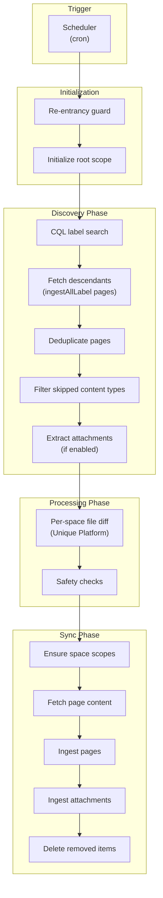
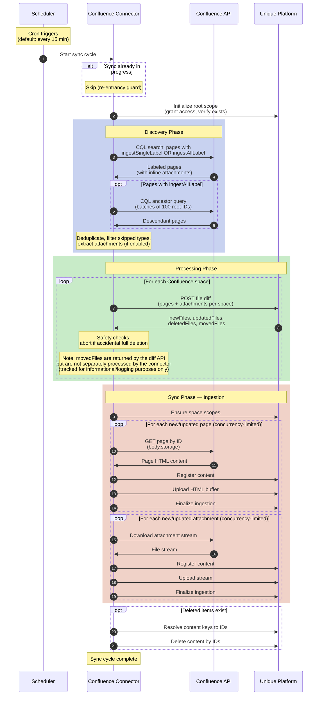
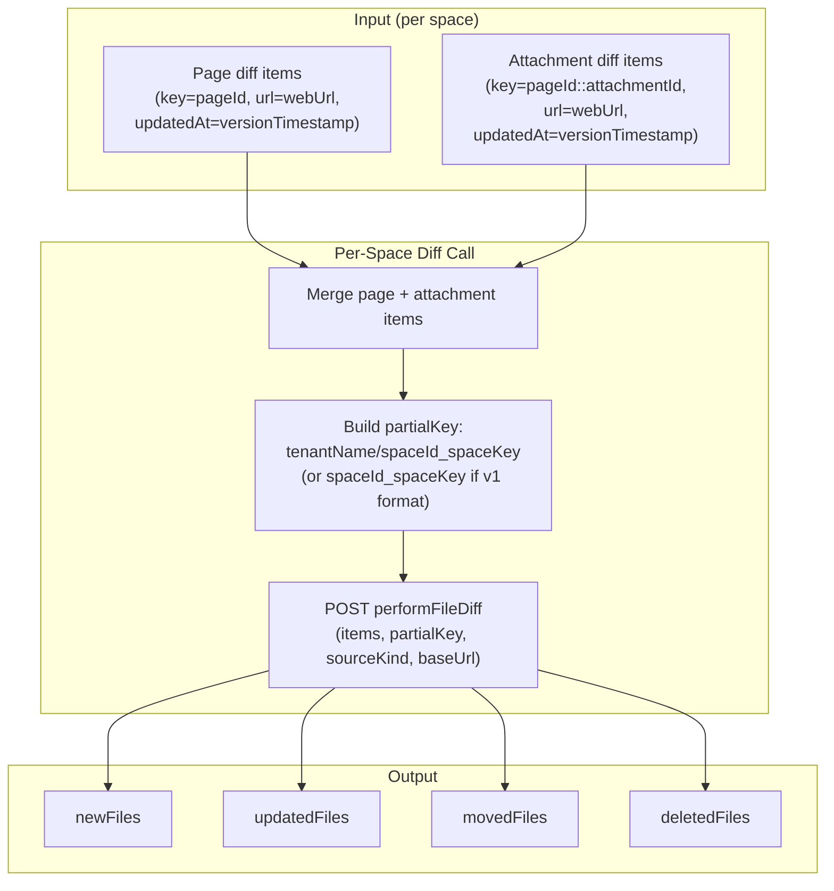
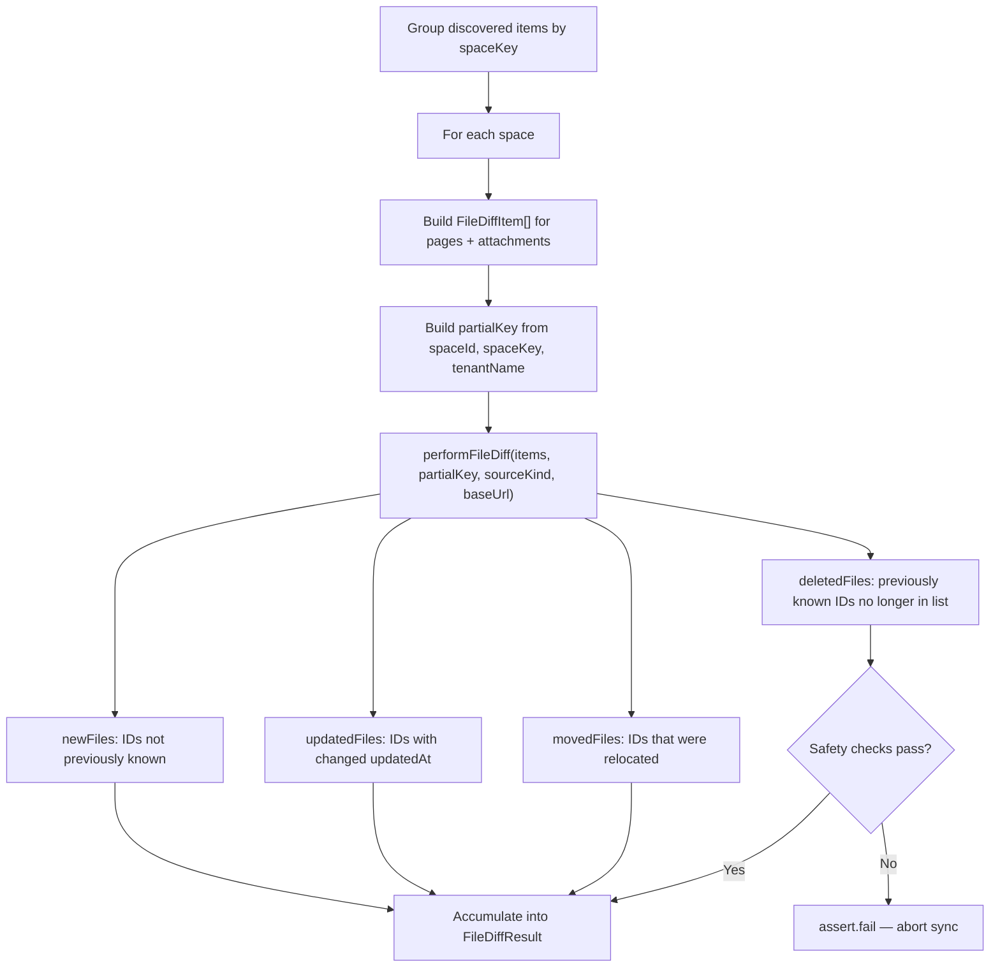
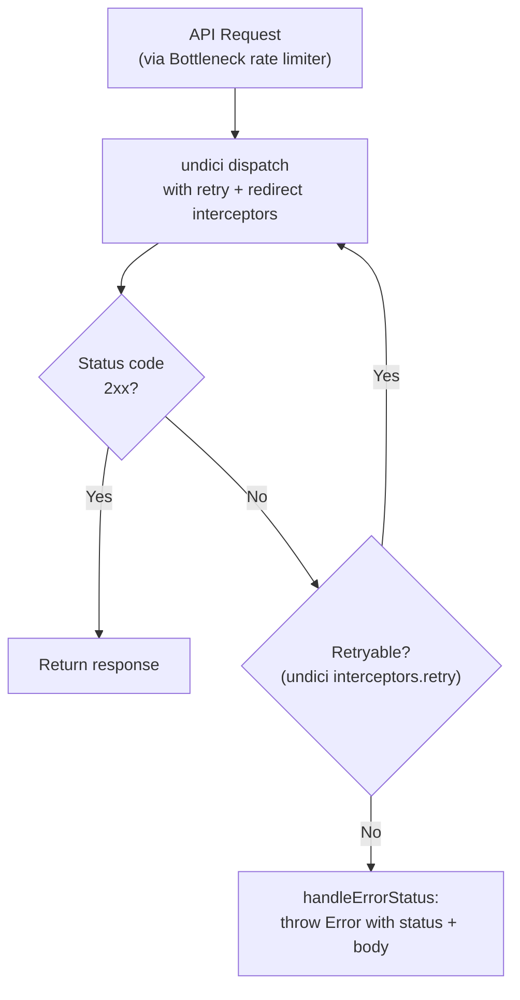

<!-- confluence-page-id: -->
<!-- confluence-space-key: PUBDOC -->

## Content Sync Flow

The content sync flow runs periodically (default: every 15 minutes) to synchronize labeled Confluence pages and their attachments to Unique.

### Overview



### Sequence Diagram

The connector is **stateless** -- it does not maintain local state between sync cycles. Change detection is performed by the Unique platform's file diff API, called once per Confluence space.



### Sync Execution Order

The `synchronize()` method in `ConfluenceSynchronizationService` executes these steps **sequentially**:

1. **Re-entrancy guard** -- If `tenant.isScanning` is already `true`, the sync is skipped entirely. This prevents overlapping sync cycles for the same tenant.
2. **Scope initialization** -- `ScopeManagementService.initialize()` grants the service account MANAGE/READ/WRITE access to the root scope, verifies the root scope exists, traverses parent scopes, and returns the full root scope path.
3. **Discovery** -- `ConfluencePageScanner.discoverPages()` returns all discovered pages and attachments (see [Discovery Phase](#discovery-phase)).
4. **File diff** -- `FileDiffService.computeDiff()` groups items by space key and calls the Unique file diff API once per space (see [File Diff Mechanism](#file-diff-mechanism)).
5. **Scope creation** -- `ScopeManagementService.ensureSpaceScopes()` creates child scopes for each space that has items to ingest, using paths like `/<rootScopePath>/<spaceKey>`.
6. **Page ingestion** -- `fetchAndIngestPages()` fetches full page content and ingests pages with concurrency controlled by `processing.concurrency` (default: 1). Uses `Promise.allSettled` with `p-limit`.
7. **Attachment ingestion** -- `ingestAttachments()` runs **after** page ingestion completes. Same concurrency control. Downloads attachment streams from Confluence and uploads them to Unique.
8. **Deletion** -- Deleted items (identified by the diff) are resolved from content keys to content IDs, then deleted via the Unique API.

Pages and attachments are ingested **sequentially** (pages first, then attachments) -- not in parallel.

## Discovery Phase

The `ConfluencePageScanner` discovers pages through a CQL-based label search, then optionally extracts attachments from the already-fetched page objects.

### Discovery Sequence


### CQL Queries

The connector uses Confluence Query Language (CQL) to discover pages. The exact CQL differs by instance type:

| Instance Type | Space Type Filter | CQL Template |
|---|---|---|
| Cloud | `space.type=global OR space.type=collaboration` | `((label="{ingestSingleLabel}") OR (label="{ingestAllLabel}")) AND ({spaceTypeFilter}) AND type != attachment` |
| Data Center | `space.type=global` | Same template, different space type filter |

The space type filter varies by instance type. See the [Configuration Guide](../operator/configuration.md#space-scanning) for details on which space types are scanned per platform.

The `type != attachment` clause excludes attachments from top-level CQL results since they are fetched via the `expand=children.attachment` parameter on the page objects themselves.

### Descendant Discovery

Pages labeled with `ingestAllLabel` trigger a descendant search:

1. Collect all page IDs that carry the `ingestAllLabel`
2. Batch IDs into groups of 100 (`ANCESTOR_BATCH_SIZE`)
3. For each batch, execute CQL: `ancestor IN ({batch}) AND type != attachment`
4. Deduplicate results with labeled pages using `uniqueBy(page.id)`

### Attachment Extraction

When `attachments.mode` is `enabled` (default), attachments are extracted from the already-fetched page objects -- no additional API calls are made during extraction. Attachments were inlined by the `expand=children.attachment` parameter during the CQL search.

An attachment is accepted if:
- Its file extension is in the `allowedExtensions` list (default: `pdf`, `docx`, `xlsx`, `ppt`, `pptx`, `txt`, `csv`, `html`)
- Its file size does not exceed `maxFileSizeMb` (default: 200 MB)
- The `maxItemsToScan` capacity has not been exhausted (pages count first, attachments use remaining capacity)

If a page has more than 25 attachments (the Confluence inline limit), additional attachments are fetched:
- **Cloud**: Uses the v2 REST API (`/wiki/api/v2/pages/{pageId}/attachments`) because the v1 pagination endpoint returns 410 Gone
- **Data Center**: Follows v1 `_links.next` pagination links

### Content Type Ingestion Map

The connector uses label-based discovery via CQL. After fetching, it explicitly skips three content types defined in `confluence-page-scanner.ts`:

```typescript
const SKIPPED_CONTENT_TYPES = [ContentType.DATABASE, ContentType.WHITEBOARD, ContentType.EMBED];
```

Content that passes the filter has its `body.storage` HTML extracted and ingested. Items with empty bodies are skipped. Descendants of skipped content types (such as sub-pages under a database) are still discovered and ingested.

#### Confluence Cloud

| Content Type | Ingested? | Body Available via API? | Notes |
|---|---|---|---|
| Page | **Yes** | Yes (`body.storage` / ADF) | Primary content type. Full body ingestion. |
| Blog Post | **Yes** | Yes (`body.storage` / ADF) | Treated identically to pages by the connector. |
| Attachment | **Yes** (conditional) | No (binary) | Only when `attachments.mode=enabled`. Filtered by extension and size. |
| Whiteboard | **No** | No (no body via API) | Explicitly skipped. API returns no body content. Descendants are still discovered. |
| Database | **No** | No (structured data, not exposed) | Explicitly skipped. No body via API. Descendants (sub-pages) are still discovered and ingested. |
| Embed / Smart Link | **No** | No (only has `embedUrl`) | Explicitly skipped. Only contains a URL reference, no renderable body. |
| Folder | **No** (effectively) | No (organizational container) | Not in `SKIPPED_CONTENT_TYPES`, but has no body -- skipped by the empty-body filter. Descendants are still discovered. |
| Comment (inline/footer) | **No** | Yes (`body.storage` / ADF) | Not discovered -- comments do not appear in label/ancestor CQL results. |
| Live Doc (page subtype) | **Yes** (as page) | Yes (`body.storage` / ADF) | Subtype of page. Passes through as a regular page. |
| Custom Content (app-defined) | **No** | Yes (`body.storage`) | Not discovered -- uses `ac:key:type` format, not matched by standard CQL. |
| Task (standalone) | **No** | Yes (`body.storage` / ADF) | Not a CQL-searchable content type. Only accessible via `/tasks` v2 endpoint. |

#### Confluence Data Center

| Content Type | Exists in DC? | Ingested? | Notes |
|---|---|---|---|
| Page | Yes | **Yes** | Primary content type. Full body ingestion (storage format / XHTML). |
| Blog Post | Yes | **Yes** | Treated identically to pages by the connector. |
| Attachment | Yes | **Yes** (conditional) | Only when `attachments.mode=enabled`. Uses v1 pagination (`_links.next`). |
| Comment (inline/footer) | Yes | **No** | Not discovered -- comments do not appear in label/ancestor CQL results. |
| Custom Content (plugin-defined) | Yes | **No** | Accessed via plugin-specific REST APIs, not standard `/rest/api/content`. |
| Whiteboard, Database, Embed, Folder, Live Doc | No | N/A | Cloud-only features. Do not exist in Data Center. |

## File Diff Mechanism

The connector computes file diffs **per Confluence space** by comparing discovered items against the state stored in Unique. The connector does not compute local content hashes -- it sends each item's `key`, `url`, and `updatedAt` timestamp to the Unique platform's file diff API.

### State Comparison



### Change Detection Logic



### File Diff Item Attributes

Each item sent to the diff API contains:

| Attribute | Source (Pages) | Source (Attachments) | Used For |
|---|---|---|---|
| `key` | `page.id` | `{pageId}::{attachmentId}` | Identity and change tracking |
| `url` | `page.webUrl` | `attachment.webUrl` | Location tracking |
| `updatedAt` | `page.versionTimestamp` | `attachment.versionTimestamp` (falls back to page version) | Change detection |

### Partial Key Format

The `partialKey` scopes the diff to a single Confluence space and determines the ingestion key prefix:

| Key Format | `partialKey` | Full Ingestion Key (page) | Full Ingestion Key (attachment) |
|---|---|---|---|
| Default | `{tenantName}/{spaceId}_{spaceKey}` | `{tenantName}/{spaceId}_{spaceKey}/{pageId}` | `{tenantName}/{spaceId}_{spaceKey}/{pageId}::{attachmentId}` |
| v1 compatible | `{spaceId}_{spaceKey}` | `{spaceId}_{spaceKey}/{pageId}` | `{spaceId}_{spaceKey}/{pageId}::{attachmentId}` |

### Safety Checks

Two assertions prevent accidental full deletion of a space's content:

1. **Zero-item submission**: If zero items are submitted to the diff but deletions are returned, the sync aborts with `assert.fail`. This guards against bugs in the Confluence page fetching logic.
2. **Full deletion**: If the number of deleted files equals the total file count stored in Unique for that `partialKey` (checked via `getCountByKeyPrefix`), the sync aborts. This guards against unexpected changes in key format or diff logic.

Both checks log an error before aborting. If a user genuinely wants to remove all content from a space, they should leave at least one page labeled for synchronization.

## Ingestion Pipeline

For details on the 3-step ingestion pipeline (register, upload, finalize), key format, and sourceKind values, see [Technical Reference - Ingestion Pipeline](./README.md#ingestion-pipeline) and [Technical Reference - v1-Compatible Key Format](./README.md#v1-compatible-key-format).

### Page Ingestion

For each new or updated page:

1. **Fetch content** -- `ConfluenceContentFetcher.fetchPageContent()` retrieves the full page via `getPageById()` with `body.storage` expansion. Returns `null` (and skips the page) if the page is not found, if fetching fails, or if the page body is empty.
2. **Extract labels** -- Confluence labels are extracted from the page, excluding the `ingestSingleLabel` and `ingestAllLabel` values. Labels are sorted alphabetically for deterministic ordering.
3. **Register** -- Sends metadata to the Unique ingestion API (key, title, mimeType `text/html`, scopeId, sourceKind, metadata including `confluenceLabels`, `spaceKey`, `spaceName`).
4. **Upload** -- The page body (Confluence storage format HTML) is converted to a `Buffer` and uploaded via HTTP PUT to the `writeUrl`.
5. **Finalize** -- Triggers downstream processing in Unique.

If any step fails for a page, the error is logged and that page is skipped. Other pages continue processing.

### Attachment Ingestion

For each new or updated attachment:

1. **Skip zero-byte** -- Attachments with `fileSize === 0` are skipped.
2. **Register** -- Sends metadata to the Unique ingestion API (key, title, original mediaType, scopeId, sourceKind, metadata including `spaceKey`, `spaceName`).
3. **Download** -- Streams the attachment from Confluence. Cloud uses `/wiki/rest/api/content/{pageId}/child/attachment/{attachmentId}/download` through the Atlassian API gateway. Data Center uses `_links.download` directly.
4. **Upload** -- The stream is uploaded via HTTP PUT to the `writeUrl` with the original content type and content length.
5. **Finalize** -- Triggers downstream processing in Unique.

If any step fails, the stream is destroyed and the error is logged. Other attachments continue processing.

### Deletion

Deleted items identified by the file diff are processed after ingestion:

1. Build content keys from `{partialKey}/{id}` for each deleted item
2. Resolve keys to content IDs via `getByKeys()`
3. Delete content by IDs via `deleteByIds()`

If no content is found for the given keys, a warning is logged and no deletion occurs.

### Concurrency and Progress

Ingestion concurrency is controlled by `processing.concurrency` (default: 1). Both page and attachment ingestion use `p-limit` to enforce the concurrency limit and `Promise.allSettled` to ensure all items are attempted even if some fail.

Progress is logged every 100 items (`INGESTION_PROGRESS_LOG_INTERVAL`). After all items complete, a summary is logged with the total, succeeded, and failed counts.

## Scope Management

The connector manages a two-level scope hierarchy:

1. **Root scope** -- Must pre-exist in the Unique platform. Configured via `ingestion.scopeId`. The connector grants itself MANAGE, READ, and WRITE access at initialization.
2. **Space scopes** -- Created automatically as children of the root scope, one per Confluence space key. Created via `createFromPaths()` with `inheritAccess: true`. External IDs follow the format `confc:{tenantName}:{spaceKey}`.

If the root scope has parent scopes, the connector traverses upward and grants READ access to each parent so that the scope path can be resolved.

## Scheduling and Re-Entrancy

The `TenantSyncScheduler` manages sync scheduling:

1. **On module init**: For each registered tenant, an initial sync is triggered immediately (`void this.syncTenant(tenant)`), then a cron job is registered using the tenant's `processing.scanIntervalCron` expression (default: `*/15 * * * *`).
2. **Re-entrancy guard**: Each sync cycle checks `tenant.isScanning`. If a previous cycle is still running, the new cycle is skipped. The flag is set to `true` at the start and reset to `false` in a `finally` block.
3. **Shutdown**: On module destroy, `isShuttingDown` is set to `true` and all cron jobs are stopped. Running sync cycles check this flag before starting.

## Error Handling

### Error Handling Strategy

The connector applies scenario-specific behavior to keep sync cycles stable:

| Scenario | Typical Cause | Connector Behavior |
|---|---|---|
| Sync already in progress | Overlapping cron triggers or long-running sync | Skip the cycle entirely (re-entrancy guard) |
| Root scope not found | Misconfigured `scopeId` or scope deleted | `assert.ok` -- abort the entire sync cycle |
| Accidental full deletion detected | Bug in page fetching or key format change | `assert.fail` -- abort the entire tenant sync cycle (see [Safety Checks](#safety-checks)) |
| Page fetch failure | Page deleted between discovery and content fetch, transient API error | Log error, return `null`, skip the page, continue other pages |
| Page not found | Page deleted between discovery and content fetch | Log warning, return `null`, skip the page |
| Page with empty body | Page has no content (e.g., newly created) | Log, skip the page |
| Attachment with zero bytes | Empty attachment | Log, skip the attachment |
| Page ingestion failure | Upload error, registration error | Log error, skip the page (via `Promise.allSettled`) |
| Attachment ingestion failure | Download error, upload error | Destroy stream, log error, skip the attachment (via `Promise.allSettled`) |
| Content deletion failure | Unique API error | Log error, return 0 deleted count |
| Unhandled sync error | Unexpected exception | Caught at top level, logged, `isScanning` reset via `finally` |

### Rate Limiting

API requests are rate-limited at two levels:

| Level | Mechanism | Configuration |
|---|---|---|
| Confluence API | `RateLimitedHttpClient` using Bottleneck | `confluence.apiRateLimitPerMinute` (required field, no default) |
| Unique API | `RateLimitedHttpClient` using Bottleneck | `unique.apiRateLimitPerMinute` (default: 100) |

The `RateLimitedHttpClient` uses a Bottleneck reservoir that refreshes every 60 seconds. When the reservoir is depleted, requests are queued until the next refresh.

### HTTP Retry Logic

The `RateLimitedHttpClient` uses undici's `interceptors.retry()` interceptor, which provides automatic retry with backoff for transient HTTP errors. Requests also follow redirects via `interceptors.redirect()` (up to 10 redirections).



Non-2xx responses that exhaust retries are thrown as errors by `handleErrorStatus()`, which reads the response body text and throws an `Error` with the status code and response content.

## Related Documentation

- [Technical Reference](./README.md) - Architecture overview, key concepts, ingestion pipeline
- [Architecture](./architecture.md) - System components and module structure
- [Configuration](../operator/configuration.md) - Scheduler and processing settings

## Standard References

- [Confluence Cloud REST API](https://developer.atlassian.com/cloud/confluence/rest/v1/intro/) - Atlassian Confluence Cloud API documentation
- [Confluence Data Center REST API](https://docs.atlassian.com/ConfluenceServer/rest/latest/) - Atlassian Confluence Data Center API documentation
- [Confluence Query Language (CQL)](https://developer.atlassian.com/cloud/confluence/advanced-searching-using-cql/) - CQL reference for content search queries
