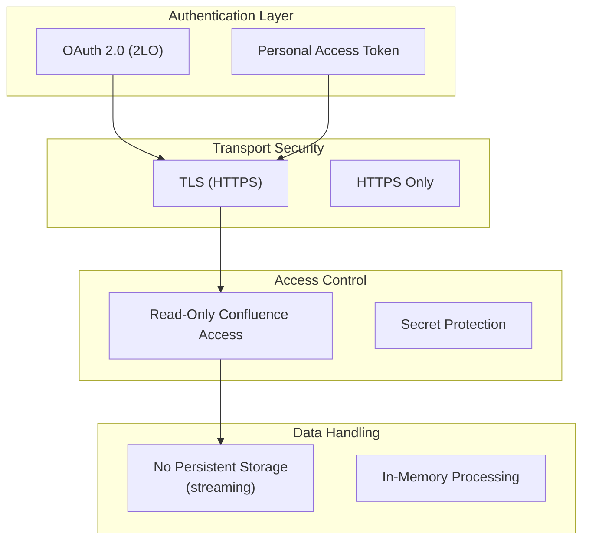

<!-- confluence-page-id: -->
<!-- confluence-space-key: PUBDOC -->

## Overview

This document describes security practices, update policies, and data handling properties of the Confluence Connector.

## Security Updates

Security update cadence and release lifecycle expectations follow the canonical [Upgrade and Release Process](https://unique-ch.atlassian.net/wiki/spaces/PUBDOC/pages/1385366775/Upgrade+and+Release+Process). Review this policy when planning upgrade windows and patch rollouts.

## Security Reports

If you identify a potential vulnerability, report it through your standard Unique support/security contact and include connector version, affected tenant/environment, and reproduction details. Release handling expectations follow the [Upgrade and Release Process](https://unique-ch.atlassian.net/wiki/spaces/PUBDOC/pages/1385366775/Upgrade+and+Release+Process).

## Security Architecture

## Security Principles

### Read-Only Confluence Access

The connector only reads content from Confluence. All Confluence API calls use the `GET` method. No write, update, or delete operations are performed against Confluence.

- **Cloud OAuth 2.0 (2LO):** Access is limited to the permissions of the service account configured in the Atlassian Admin Console.
- **Data Center OAuth 2.0 (2LO):** The token request explicitly includes `scope=READ`, limiting the service account to read-only operations even if the application link grants broader permissions.
- **Data Center PAT (not recommended; Data Center below 10.1 only):** The token inherits the permissions of the user who created it. Operators should create a dedicated user with read-only access. Use OAuth 2.0 (2LO) on Data Center 10.1+ instead.

See [Permissions](./permissions.md) for the full list of API endpoints and their justification.

### Authentication

- **OAuth 2.0 (2LO):** Industry-standard client credentials flow
- **Token caching:** Tokens are cached in memory and refreshed before expiry
- **No shared secrets in transit:** Bearer tokens are sent via the `Authorization` header over HTTPS

See [Authentication](../operator/authentication.md) for setup and token flow details.

### Secret Management

Secrets are protected through multiple layers:

- **Environment variable resolution:** Secret fields in configuration reference environment variables, injected via Kubernetes Secrets at runtime
- **In-memory protection:** Secret values are wrapped so that they cannot be accidentally serialized to logs or JSON output
- **Log redaction:** Authorization headers and secret fields are censored in structured log output

See [Authentication -- Secret Resolution](../operator/authentication.md#secret-resolution) for the full resolution mechanism and supported fields.

### Diagnostics Data Policy

Page and attachment titles are partially masked in logs by default to prevent accidental exposure of sensitive content.

| Policy | Behavior |
|---|---|
| `conceal` (default) | Partially masks diagnostic data (emails, usernames, IDs, titles) |
| `disclose` | Logs diagnostic data in full |

The policy is controlled by the `LOGS_DIAGNOSTICS_DATA_POLICY` environment variable (default: `conceal` in the Helm chart).

### Transport Security

- **TLS:** All external communication encrypted via HTTPS
- **Custom CA support:** Additional CA certificates can be provided for environments with corporate proxies or custom PKI
- **No TLS downgrade:** The connector does not expose configuration to disable TLS verification

### Data Handling

- **Streaming transfers:** Files streamed from Confluence to Unique, not stored locally
- **In-memory processing:** Page content processed in memory and uploaded directly
- **No persistent storage:** No local file storage of Confluence content
- **Data flow:** Confluence API --> Connector (memory/stream) --> Unique Ingestion API

## Container Security

The connector image implements the following security measures:

| Measure | Implementation |
|---|---|
| Non-root execution | Dedicated non-root user |
| Minimal runtime image | Slim base image with only required system packages |
| Signal handling | Proper signal forwarding for graceful shutdown |
| Read-only config | Tenant config volume mounted as read-only |
| Production mode | `NODE_ENV=production` |

## Compliance Considerations

### Data Residency

- The connector does not store Confluence content persistently
- Data flows: Confluence --> Connector (memory/stream) --> Unique
- No intermediate storage or caching of content on disk
- The connector runs where deployed (same cluster as Unique, or externally) -- data residency depends on the deployment location

### Audit Logging

All operations are logged with:

- Timestamp
- Tenant identifier
- Operation type and resource identifiers
- Success/failure status
- Error details (if applicable)
- Item counts for discovery, diff, ingestion, and deletion operations

### Access Controls

| Control | Implementation |
|---|---|
| Authentication | OAuth 2.0 (2LO) client credentials (recommended) or Personal Access Token (Data Center below 10.1 only) |
| Authorization | Read-only Confluence access; scope management and ingestion access on Unique |
| Audit | Structured JSON logging |
| Encryption | TLS in transit |
| Secret protection | Environment variable resolution, in-memory wrapping, log redaction |
| Diagnostics masking | Partial masking of titles and identifiers in logs |

## Best Practices

### For Operators

1. **Use environment variable resolution** for all secret fields and inject values via Kubernetes Secrets
2. **Set diagnostics data policy to `conceal`** (the default) in production to mask diagnostic data in logs
3. **Provide custom CA certificates** if running in environments with corporate proxies or custom PKI
4. **Use OAuth 2.0 (2LO) instead of PAT** -- OAuth tokens expire and are automatically refreshed, while PATs are static and must be manually rotated
5. **Review Confluence access grants** periodically to ensure the connector's service account has read-only access to only the required spaces
6. **Monitor logs** for authentication failures and anomalies
7. **Update promptly** when security patches are released

### For Security Teams

1. **Audit secret injection** -- verify that Kubernetes Secrets are the source for all credential values
2. **Verify non-root execution** -- confirm the container runs as a non-root user
3. **Review tenant configurations** -- ensure no secrets are hardcoded in YAML files
4. **Check diagnostics data policy** -- confirm masking is enabled in production
5. **Test in staging** before production updates

## Related Documentation

- [Authentication](../operator/authentication.md) - Credential setup, secret resolution, token flows
- [Configuration](../operator/configuration.md) - Security-related settings and environment variables
- [Permissions](./permissions.md) - Required Confluence and Unique API permissions
- [Architecture](./architecture.md) - System components and infrastructure

## Standard References

- [Atlassian Security Best Practices](https://www.atlassian.com/trust) - Atlassian security and trust center
- [OWASP Top 10](https://owasp.org/www-project-top-ten/) - Web application security risks
- [CycloneDX](https://cyclonedx.org/) - SBOM specification
- [SPDX](https://spdx.dev/) - Software Package Data Exchange
