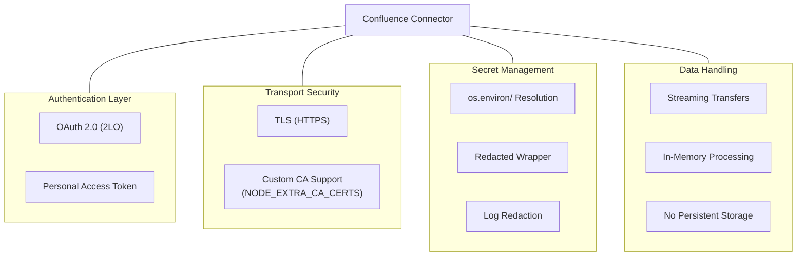

<!-- confluence-page-id: -->
<!-- confluence-space-key: PUBDOC -->

## Overview

This document describes the security architecture, practices, and data handling properties of the Confluence Connector v2. All statements are grounded in the connector's source code and deployment configuration.

## Security Updates

Security update cadence and release lifecycle expectations follow the canonical [Upgrade and Release Process](https://unique-ch.atlassian.net/wiki/spaces/PUBDOC/pages/1385366775/Upgrade+and+Release+Process). Review this policy when planning upgrade windows and patch rollouts.

## Security Reports

If you identify a potential vulnerability, report it through your standard Unique support/security contact and include connector version, affected tenant/environment, and reproduction details. Release handling expectations follow the [Upgrade and Release Process](https://unique-ch.atlassian.net/wiki/spaces/PUBDOC/pages/1385366775/Upgrade+and+Release+Process).

## Security Architecture

## Security Principles

### Read-Only Confluence Access

The connector only reads content from Confluence. All Confluence API calls use the `GET` method. No write, update, or delete operations are performed against Confluence.

- **Cloud OAuth 2.0 (2LO):** The token request sends `grant_type`, `client_id`, and `client_secret` only. Access is limited to the permissions configured on the OAuth 2.0 integration in the Atlassian Developer Console.
- **Data Center OAuth 2.0 (2LO):** The token request explicitly includes `scope=READ`, limiting the service account to read-only operations even if the application link grants broader permissions.
- **Data Center PAT (not recommended; Data Center below 10.1 only):** The token inherits the permissions of the user who created it. Operators should create a dedicated user with read-only access. PATs are static and must be manually rotated. Use OAuth 2.0 (2LO) on Data Center 10.1+ instead.

See [Permissions](./permissions.md) for the full list of API endpoints and their justification.

### Authentication and Token Handling

**OAuth 2.0 token caching:** Tokens are cached in memory with a 5-minute buffer before expiry (`DEFAULT_BUFFER_MS = 5 * 60 * 1000`). Concurrent token requests are deduplicated -- only one token fetch runs at a time, and concurrent callers await the same in-flight promise. On fetch failure, the cached token is set to `null`.

**PAT handling:** The PAT value is extracted from the `Redacted` wrapper at construction time and returned directly from `acquireToken()`. No caching layer is involved.

**Bearer token transmission:** Both OAuth tokens and PATs are sent as `Authorization: Bearer {token}` headers on Confluence API requests.

See [Authentication](../operator/authentication.md) for setup and token flow details.

### Secret Management

The connector implements a 3-layer approach to protecting secrets:

| Layer | Mechanism | Description |
|---|---|---|
| Resolution | `os.environ/` prefix in YAML fields | Environment variables are resolved at config load time. See [Authentication -- Secret Resolution](../operator/authentication.md#secret-resolution) for the full resolution mechanism and supported fields. |
| Wrapping | `Redacted<T>` class | Secret values are wrapped in `Redacted`, which overrides `toString()` and `toJSON()` to return `[Redacted]`. The actual value is accessible only via the `.value` getter. |
| Log redaction | Pino `redact` configuration | `req.headers.authorization` paths are censored via the `Redacted` wrapper in the logger's `redact.censor` function. |

**Fields protected by `Redacted` wrapping:**

| Field | Schema |
|---|---|
| `confluence.auth.clientSecret` | `envRequiredSecretSchema` |
| `confluence.auth.token` (PAT) | `envRequiredSecretSchema` |
| `unique.zitadelClientSecret` | `envRequiredSecretSchema` |
| `unique.zitadelProjectId` | `envRequiredSecretSchema` |

### Diagnostics Data Policy

Page and attachment titles are logged through `createSmeared()` from `@unique-ag/utils`, which partially masks values (e.g., `John Smith` becomes `**** *mith`) when the diagnostics data policy is set to `conceal`.

| Policy | Behavior |
|---|---|
| `conceal` (default) | Partially masks diagnostic data (emails, usernames, IDs, titles) |
| `disclose` | Logs diagnostic data in full |

The policy is controlled by the `LOGS_DIAGNOSTICS_DATA_POLICY` environment variable (default: `conceal` in the Helm chart).

### Transport Security

- **HTTPS:** All communication with Confluence Cloud routes through the Atlassian API gateway (`https://api.atlassian.com`). Data Center connections use the configured `baseUrl`.
- **Custom CA support:** The `NODE_EXTRA_CA_CERTS` environment variable allows operators to provide additional CA certificates for environments with corporate proxies or custom PKI.
- **No TLS downgrade mechanism:** The connector does not expose configuration to disable TLS verification. The only TLS customization is adding trusted CAs via `NODE_EXTRA_CA_CERTS`.

### Data Handling

- **No persistent storage:** The connector does not write Confluence content to disk. Page HTML is converted to an in-memory `Buffer` (`Buffer.from(page.body, 'utf-8')`) and uploaded directly. Attachments are streamed from the Confluence API and piped to the Unique upload endpoint.
- **Pages:** Fetched as HTML (`body.storage`), buffered in memory, uploaded via HTTP PUT.
- **Attachments:** Downloaded as a `Readable` stream from the Confluence API and uploaded as a stream via HTTP PUT. The stream is destroyed on error (`stream?.destroy()`).
- **Data flow:** Confluence API --> Connector (memory/stream) --> Unique Ingestion API. No intermediate storage.
- **Upload URL rewriting:** In `cluster_local` mode, the `writeUrl` returned by the Unique Ingestion API is rewritten to route through the ingestion service's `/scoped/upload` endpoint, avoiding hairpinning through the external gateway.

### Accidental Deletion Safeguards

The file diff service includes two safety checks (zero-item submission guard and full-deletion guard) that abort synchronization to prevent accidental mass deletion caused by bugs in page discovery or key format changes. See the [safety checks](./flows.md#safety-checks) documentation for the full explanation of both guards.

## Container Security

The Dockerfile (`deploy/Dockerfile`) implements the following security measures:

| Measure | Implementation |
|---|---|
| Non-root execution | Dedicated `nestjs` user (UID 1001) in `nodejs` group (GID 1001) |
| Minimal runtime image | `node:24-bookworm-slim` (only `dumb-init`, `openssl`, `ca-certificates`, `curl` installed) |
| Signal handling | `dumb-init` as PID 1 for proper signal forwarding and graceful shutdown |
| Read-only config | Tenant config volume mounted as `readOnly: true` |
| Production mode | `NODE_ENV=production` |

## Compliance Considerations

### Data Residency

- The connector does not store Confluence content persistently
- Data flows: Confluence --> Connector (memory/stream) --> Unique
- No intermediate storage or caching of content on disk
- The connector runs where deployed (same cluster as Unique, or externally) -- data residency depends on the deployment location

### Audit Logging

All operations are logged with structured JSON via Pino, including:

- Tenant name (injected via `AsyncLocalStorage` mixin)
- OpenTelemetry trace ID (used as request ID when available, otherwise `crypto.randomUUID()`)
- Operation type and resource identifiers
- Success/failure status and error details
- Item counts for discovery, diff, ingestion, and deletion operations

### Access Controls

| Control | Implementation |
|---|---|
| Confluence authentication | OAuth 2.0 (2LO) client credentials (recommended) or Personal Access Token (Data Center below 10.1 only; not recommended) |
| Unique authentication | Cluster-local service headers or Zitadel OAuth client credentials |
| Secret protection | `Redacted` wrapper, `os.environ/` resolution, log redaction |
| Authorization header redaction | Pino `redact` configuration on `req.headers.authorization` |
| Diagnostics data masking | `createSmeared()` for titles; `LOGS_DIAGNOSTICS_DATA_POLICY` for policy control |
| Ingestion concurrency | `processing.concurrency` setting (default: 1) limits parallel operations |

## Best Practices

### For Operators

1. **Use `os.environ/` resolution** for all secret fields and inject values via Kubernetes Secrets
2. **Set `LOGS_DIAGNOSTICS_DATA_POLICY` to `conceal`** (the default) in production to mask diagnostic data in logs
3. **Provide `NODE_EXTRA_CA_CERTS`** if running in environments with corporate proxies or custom PKI
4. **Use OAuth 2.0 (2LO) instead of PAT** -- OAuth tokens expire and are automatically refreshed, while PATs are static and must be manually rotated. PATs are not recommended and should only be used on Data Center versions below 10.1 where OAuth 2.0 (2LO) is not available
5. **Review Confluence access grants** periodically to ensure the connector's service account has read-only access to only the required spaces
6. **Monitor logs** for authentication failures, file diff anomalies, and accidental deletion safeguard triggers
7. **Update promptly** when security patches are released

### For Security Teams

1. **Audit secret injection** -- verify that Kubernetes Secrets are the source for `clientSecret`, `token`, and `zitadelClientSecret` values
2. **Verify non-root execution** -- confirm the container runs as UID 1001 (`nestjs` user)
3. **Review tenant configurations** -- ensure no secrets are hardcoded in YAML files (they should use `os.environ/` references)
4. **Check diagnostics data policy** -- confirm `LOGS_DIAGNOSTICS_DATA_POLICY` is set to `conceal` in production
5. **Test in staging** before production updates

## Related Documentation

- [Authentication](../operator/authentication.md) - Credential setup, secret resolution, token flows
- [Configuration](../operator/configuration.md) - Security-related settings and environment variables
- [Permissions](./permissions.md) - Required Confluence and Unique API permissions
- [Architecture](./architecture.md) - System components and module structure

## Standard References

- [Atlassian Security Best Practices](https://www.atlassian.com/trust) - Atlassian security and trust center
- [OWASP Top 10](https://owasp.org/www-project-top-ten/) - Web application security risks
- [CycloneDX](https://cyclonedx.org/) - SBOM specification
- [SPDX](https://spdx.dev/) - Software Package Data Exchange
