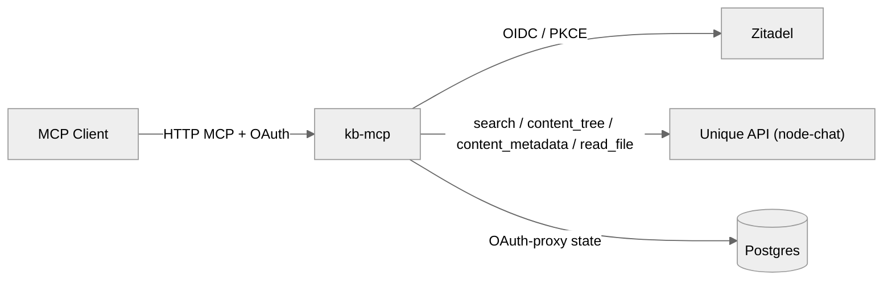

<!-- confluence-page-id: 2744352807 -->
<!-- confluence-space-key: PUBDOC -->

`kb-mcp` is a stateless proxy in front of a tenant's Unique knowledge base: every MCP tool call
resolves to a live call against the Unique API, and no knowledge-base content is stored by `kb-mcp`
itself. The only state `kb-mcp` owns is its own OAuth-proxy bookkeeping in Postgres: client
registrations, tokens, and JTI replay-protection mappings.

## Components

### Component Descriptions

| Component | Purpose |
|---|---|
| MCP server (FastMCP, via `unique-mcp`) | Exposes `/mcp` (HTTP MCP) and `/probe`; owns the OAuth-proxy flow and tool routing |
| Zitadel | OIDC identity provider; `kb-mcp` registers as a public PKCE client, no client secret |
| Unique API (`node-chat`) | Source of truth for knowledge-base search, the content tree, and file content, called live via `unique-toolkit` on every tool invocation |
| Postgres | Durable storage for OAuth-proxy state only; never holds knowledge-base data |

In a Kubernetes deployment, the call to the Unique API is wired through the monorepo-wide
`internalServices.dependencies` convention rather than a hardcoded URL. See
[Deployment: Network Policies](../operator/deployment.md#Network-Policies) for how that generates
both the env var and the matching egress rule.

## Authentication Architecture

`kb-mcp` runs its own OIDC flow, independent of the platform's normal Kong-fronted authentication.
Deployed instances set `routes.auth.jwt: false` at the gateway precisely so the gateway doesn't
also try to authenticate the request.

### Token Isolation

The MCP client authenticates to `kb-mcp` via Zitadel; `kb-mcp` then calls the Unique API using the
identity established through that session, not a service-wide credential. Every outbound call
carries that identity as two headers, `x-user-id` and `x-company-id`, set by `unique-toolkit` from
the resolved settings. `kb-mcp` has no broader access of its own to leak; see
[Permissions](./permissions.md) for how the Unique API turns that identity into a scoped result.
Upstream Unique API
credentials (`UNIQUE_APP_ID`/`UNIQUE_APP_KEY`, sent as `Authorization`/`x-app-id`) are only needed
when the call has to cross the Kong gateway: local development, or a deployment that routes through
Kong rather than calling `node-chat` directly in-cluster. Direct in-cluster calls carry only the two
identity headers: the network policy is what limits who can reach `node-chat` at all, not an app
credential.

### Token Storage

| Token / Secret | Storage | Notes |
|---|---|---|
| Zitadel client id | Chart values / env var | Public PKCE client id, not a secret |
| OAuth-proxy state (client registrations, access/refresh tokens, JTI mappings) | Postgres, encrypted with `ENCRYPTION_KEY` | Or an ephemeral per-process file store in local development (`ALLOW_EPHEMERAL_OAUTH_STORAGE=true`) |
| Downstream OAuth-proxy JWT signing key | `ZITADEL_JWT_SIGNING_KEY` (env var / secret) | Local key material only, never transmitted to Zitadel |

### Token Encryption

`ENCRYPTION_KEY` (a 32-byte hex value, `openssl rand -hex 32`) encrypts OAuth-proxy state at rest
in Postgres. It is unrelated to `ZITADEL_JWT_SIGNING_KEY`, which signs `kb-mcp`'s own downstream JWTs
rather than protecting stored data.

## Network Policy Shape

`kb-mcp` is deployed behind a default-deny `CiliumNetworkPolicy` in every Unique-internal
environment. Ingress is limited to the platform gateway
(`internalServices.dependents.ingressGateway`, on by default in the chart); egress is built up per
overlay for DNS, the Unique API instance it calls, Zitadel/the platform gateway, and its Postgres
host. See [Network Policies](../operator/deployment.md#Network-Policies) in the Operator Guide for
the concrete rules and the `podPort`-vs-`servicePort` gotcha that governs the egress rule to the
Unique API.

## Related Documentation

### For IT Operators
- [Deployment](../operator/deployment.md)
- [Configuration](../operator/configuration.md)

### Technical Reference
- [Flows](./flows.md)
- [Permissions](./permissions.md)
- [Tools](./tools.md)

## Standard References

- [Model Context Protocol specification](https://modelcontextprotocol.io/)
- [OpenID Connect Core 1.0](https://openid.net/specs/openid-connect-core-1_0.html)
- [`unique-mcp` on GitHub](https://github.com/Unique-AG/ai/tree/main/unique_mcp)
- [`unique-toolkit` on GitHub](https://github.com/Unique-AG/ai/tree/main/unique_toolkit)
