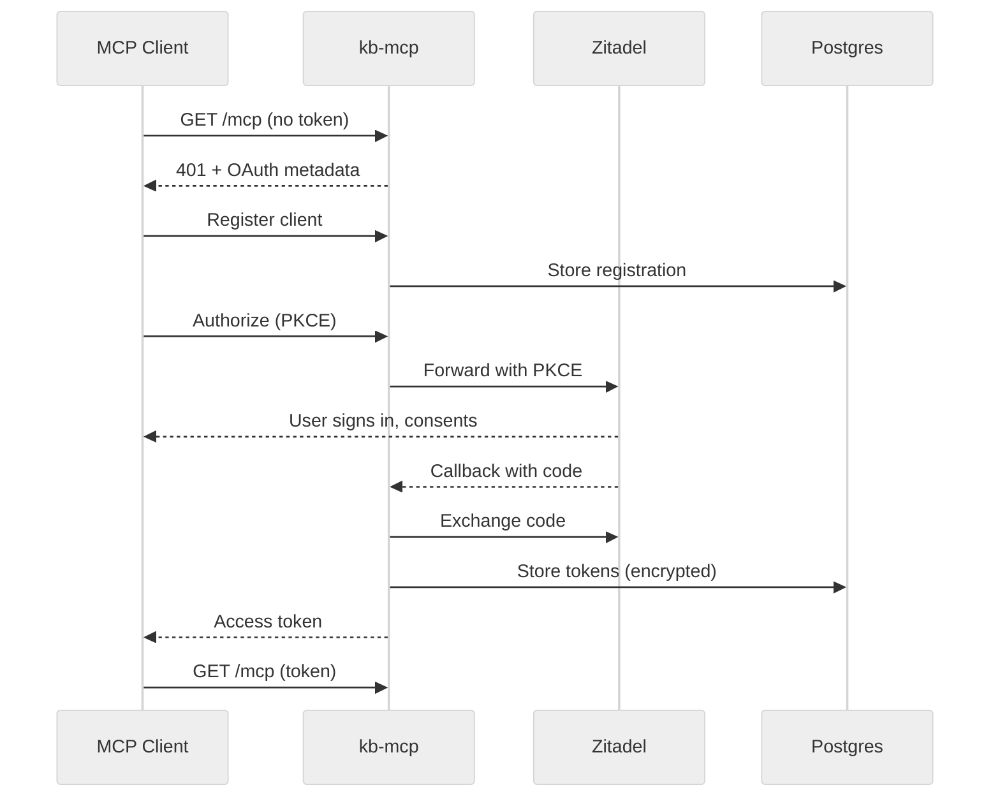
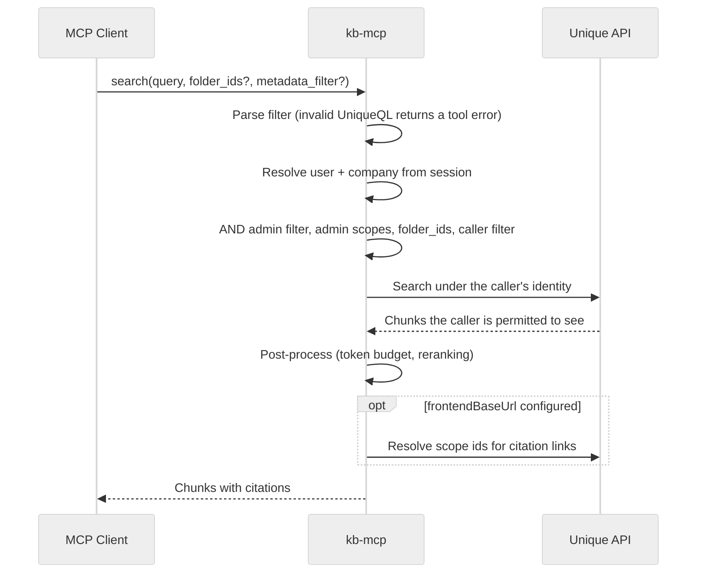

<!-- confluence-page-id: 2744418369 -->
<!-- confluence-space-key: PUBDOC -->

## Connection

An MCP client authenticates once, through kb-mcp's own OAuth proxy. kb-mcp is a public PKCE client
of Zitadel and holds no client secret.

Tokens are encrypted with `ENCRYPTION_KEY` before they reach Postgres. The access token kb-mcp
returns is its own, signed with `ZITADEL_JWT_SIGNING_KEY`. Zitadel never sees that key.

## Tool Call

Every tool call resolves identity from the OIDC session, then queries the Unique API live. `search`
shows the full shape; `content_tree`, `content_metadata`, and `read_file` follow the same first two
steps.

Scope resolution only builds clickable citation links. If it fails, results still return, with
`unique://content/{id}` references instead.

## Content Tree & Content Metadata

`content_tree` and `content_metadata` share one walk of the folder hierarchy, which can outlast a
single call. Rather than block, it returns whatever it has when `KB_MCP_WALK_TIMEOUT_SECONDS`
(default 30) elapses, and the walk continues in the background, so a follow-up call is usually
instant. Passing `folder_path` (`content_tree`) or `folder_ids`/`folder_paths` (`content_metadata`)
roots the walk at that folder instead of walking everything and filtering afterward, which is what
makes a folder-scoped call fast.

Responses are cached in memory per pod, keyed on `(company_id, user_id, folder_scope)`. With
multiple replicas a change can therefore take up to the cache TTL (default 600s) to appear. A
caller's own `metadata_filter` no longer forces a second walk: only the admin filter is baked into
the cached walk.

## Read File

`read_file` downloads content by `content_id` and returns it up to `max_tokens_per_call` (admin
default 8000). Larger files are split into virtual pages of that size, selectable with `start_page`
and `end_page`. A caller may request fewer tokens than the admin default; a larger request is
clamped without error.

## Related Documentation

- [Architecture](./architecture.md) - components and authentication architecture
- [Permissions](./permissions.md) - what a call is allowed to see
- [Tools](./tools.md) - tool arguments and tuning
