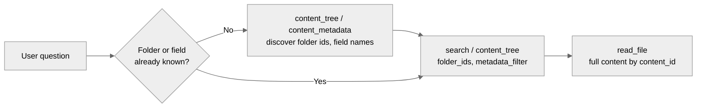

<!-- confluence-page-id: 2744352825 -->
<!-- confluence-space-key: PUBDOC -->

## Tools

`kb-mcp` advertises up to four MCP tools on `/mcp`. `KB_MCP_ENABLED_TOOLS` (env) or
`mcpConfig.enabledTools` (Helm) narrows the set; unset means all four. A restart is required.

Each tool also carries an admin configuration, normally set from inside the Unique AI app rather
than an environment variable; see
[Configuration: Admin Configuration](../operator/configuration.md#Admin-Configuration) for where
that setting actually lives. Admin values are the floor: a caller may narrow them, never widen
them. See [Permissions](./permissions.md).

## How the Calling LLM Picks Arguments

Tool descriptions tell the LLM exactly where an argument's value has to come from, not just its
type. `search`'s `folder_ids`, for example, only accepts a `scope_xxx` id copied verbatim from a
`folder_id` annotation in a prior `content_tree(mode='tree')` result, never a folder name, a path,
or a `scope_xxx` lifted from a citation link (that's the file's own folder, not necessarily the one
the user meant). `metadata_filter`'s `path` is one of the fixed fields (`mimeType`, `key`, `title`,
`validAsOf`) or a custom field name, typically one the LLM already saw in a `content_metadata` call.

That's why a discovery call often precedes the tool that uses its output:

Nothing forces that order. A well-scoped question can call `search` directly with no `folder_ids`
or `metadata_filter` at all: an unrestricted search is the default and correct for most requests.

### `search`

Semantic and internal search over the knowledge base: finds relevant passages by meaning, not
just keyword matches, and returns them as citation-ready chunks.

| Argument | Purpose |
|---|---|
| `search_string` | The natural-language question or phrase to search for |
| `folder_ids`, `include_subfolders` | Restrict to folders; subfolders included by default |
| `metadata_filter` | UniqueQL narrowing, AND-ed with the admin filter |
| `limit`, `score_threshold` | Override the admin defaults for this call |

`KB_MCP_SEARCH_SCOPE_LOOKUP_CONCURRENCY` (default `8`) bounds the parallel scope lookups used to
build citation links.

### `content_tree`

Browses, lists, and fuzzy-searches the folders and files visible to the caller. `mode` picks the
view; only that mode's arguments apply, and passing one that doesn't (e.g. `query` under
`mode='tree'`) is a tool error, not a silent no-op.

| Argument | Applies to | Purpose |
|---|---|---|
| `mode` | all (required) | `tree` for an overview, `list` for a flat listing, `search` for fuzzy filename/path lookup |
| `folder_path` | all | Scope the walk to this folder and everything under it: a path (`Contracts/2024`) or a `scope_xxx` id. Scoping the walk, not filtering it afterward, is what makes a folder-scoped call fast |
| `max_depth` | `tree` | Maximum folder depth to render (1 = top-level only) |
| `folders_only` | `tree` | Omit files, showing just the folder structure (like `tree -d`) |
| `query` | `search` (required) | Fuzzy text to match against file names and/or paths |
| `match_on` | `search` | Match against the file name (`key`), the full path (`path`), or both |
| `case_sensitive` | `search` | Whether fuzzy matching is case-sensitive |
| `min_score` | `search` | Minimum fuzzy-match score in `[0.0, 1.0]`; higher is stricter |
| `limit` | all | Maximum files/matches to return; in `mode='tree'` it caps what's rendered, and the output says so when it truncated |
| `refresh` | all | Drop this caller's cached tree and refetch (~20s); use when the user reports added/deleted/changed files |
| `timeout` | all | Seconds to wait before returning a partial tree; the walk continues in the background |
| `metadata_filter` | all | UniqueQL narrowing, AND-ed with the admin filter (see [Permissions](./permissions.md)) |

Admin defaults: `limit` 50 (1000 for `mode='tree'`), `min_score` 0.6, `match_on` `both`, and a
filter excluding `user-memory` folders.

!!! note "Incomplete vs. truncated"
    Incomplete means the walk is still running; calling again with the same arguments usually
    finishes it. Truncated means the walk finished and `mode='tree'` capped the result at `limit`;
    calling again returns the same thing, raise `limit` or narrow `folder_path` instead.

Results are cached briefly (`KB_MCP_TREE_CACHE_TTL_SECONDS`, default `600`) to keep repeat calls
fast; a change can take up to that long to show up. If the user reports files just added or
changed, call again with `refresh=true` instead of waiting it out. See
[Flows](./flows.md) for how the cache and the admin filter interact.

### `content_metadata`

Discovers what metadata fields and values exist on the knowledge base's visible content, so a
caller can build a `metadata_filter` for `search` or `content_tree` instead of guessing one.
Returns every known field with its distinct values, e.g. `[{"department": ["Legal", "Finance"]}]`,
or with `counts_only`, just the count of distinct values per field.

| Argument | Purpose |
|---|---|
| `folder_ids` | Restrict the catalog to these folders; a `scope_xxx` id from `content_tree`'s output |
| `folder_paths` | Same, by exact path (e.g. `Contracts/2024`) instead of an id; mutually exclusive with `folder_ids` |
| `include_subfolders` | Whether the catalog includes files in subfolders (default `true`) |
| `fields` | Only return these fields, by exact case-sensitive name; omit for every field, `[]` for none |
| `counts_only` | Return each field's distinct-value count instead of the values themselves, e.g. `[{"department": 12}]` |
| `refresh` | Drop this caller's cached snapshot and rescan (~20s) |
| `timeout` | Seconds to wait before returning a partial catalog |

Exhaustive by design: every known field (or every requested one) and every distinct value in scope,
not a sample, with no pagination yet. On a large knowledge base, call `counts_only=true` first to
see what fields exist and how big each is, then `fields` to fetch only the ones needed.

Ten platform-stamped fields (`key`, `url`, `title`, `folderId`, `mimeType`, `companyId`,
`contentId`, `validAsOf`, `folderIdPath`, `externalFileOwner`) are excluded from the catalog by
default, admin-configurable: identifiers, source links, and owners a caller doesn't typically
build a filter around. Excluding a field from the catalog doesn't stop it from being used in a
`metadata_filter` directly, folder and mimetype filtering both work that way already; the catalog
just doesn't advertise them as a starting point.

Unlike `search` and `content_tree`, it takes no caller `metadata_filter`: only the admin one
applies, since the tool exists to discover what a filter could say, not to apply one.

Shares `content_tree`'s walk and cache entirely, described above: both tools are just different
views over the same visible-file snapshot.

### `read_file`

Returns file content by `content_id`, as surfaced by `content_tree` or `search`.

`max_tokens_per_call` (admin default `8000`) bounds one response. Larger files are split into
virtual pages of that size, selected with `start_page` and `end_page`. A caller may request fewer
tokens; a larger request is clamped without error.

## Related Documentation

- [Permissions](./permissions.md) - how admin and caller filters combine
- [Flows](./flows.md) - what happens during a tool call
- [Configuration](../operator/configuration.md) - deployment environment variables
