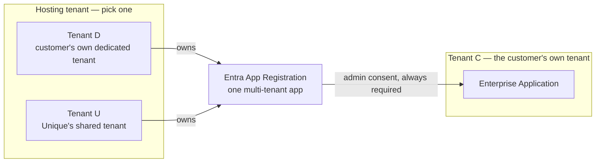

<!-- confluence-page-id: 2760507523 -->
<!-- confluence-space-key: PUBDOC -->

# office-365-mcp

!!! danger "Documentation Disclaimer"
    This feature is `EXPERIMENTAL` and under active development. It may change significantly, be
    discontinued, or have breaking changes without notice.

## Overview

office-365-mcp is a Python MCP server, built on FastMCP, that connects Microsoft 365 to MCP
clients through the Microsoft Graph API. It reaches Outlook mail and calendar, Microsoft Teams,
SharePoint and OneDrive, OneNote, and user identity. The server has 88 tools in total. A
deployment turns on a fixed subset of these 88 tools (never all of them, unless a preset or a
list names every one). This document explains what each tool does, how a deployment picks its
tools, and how sign-in and consent work.

## Tools

office-365-mcp has 88 tools, across six areas: identity, Microsoft Teams, Outlook mail, Outlook
calendar, SharePoint and OneDrive, and OneNote. One tool, `get_me`, is always on, in every
configuration. The Kind column is a hint to the calling client about the kind of change a tool
makes. It does not control access to the tool.

The same hint also sets the error text that the model gets when Microsoft 365 fails or does not
answer. For a tool that makes a change that is not safe to repeat, this text tells the model to
make sure that the change is not already there. If a tool of the deployment can show the change,
the text names that tool. If not, the text tells the model to ask the user.

### Identity

| Tool | Kind | Permission | Admin consent | What it does |
| --- | --- | --- | --- | --- |
| `get_me` | Read | `User.Read` | No | The answer is the signed-in user's own Microsoft 365 profile. It holds the id, display name, given name, surname, email address, sign-in name, job title, office location, telephone numbers, and preferred language. |

### Microsoft Teams

| Tool | Kind | Permission | Admin consent | What it does |
| --- | --- | --- | --- | --- |
| `teams_list_chats` | Read | `Chat.Read` | No | The signed-in user's Teams chats (1:1, group, meeting), newest last message first. |
| `teams_list_my_teams` | Read | `Team.ReadBasic.All` | No | The teams that the signed-in user is a member of. |
| `teams_list_channels` | Read | `Channel.ReadBasic.All` | No | The channels of one team that the signed-in user can access. |
| `teams_browse_channel` | Read | `ChannelMessage.Read.All` | Yes | One Teams channel's posts, with their replies. |
| `teams_search_messages` | Read | `Chat.Read`, `ChannelMessage.Read.All` | Yes | A full-text search across every Teams message, in chats and channels, that the signed-in user can see. |
| `teams_read_message` | Read | `Chat.Read`, `ChannelMessage.Read.All` | Yes | One Microsoft Teams message in full, from a handle that another tool minted. |
| `teams_list_meeting_transcripts` | Read | `OnlineMeetings.Read`, `OnlineMeetingTranscript.Read.All` | Yes | Whether a Teams meeting has a transcript, and a handle for each one. |
| `teams_read_transcript` | Read | `OnlineMeetingTranscript.Read.All` | Yes | One page of a Teams meeting transcript, as timestamped turns with the speaker named, not the whole file at once. |
| `teams_list_meeting_recordings` | Read | `User.Read`, `OnlineMeetings.Read`, `OnlineMeetingRecording.Read.All` | Yes | Whether a meeting recording exists, how long it runs, and who can download it. The answer is metadata only, never the video itself. |
| `teams_send_chat_message` | Write, adds | `ChatMessage.Send` | No | Posts one plain-text message to an existing Teams chat, after the user approves it. |
| `teams_send_channel_message` | Write, adds | `ChannelMessage.Send` | No | Posts one plain-text message to an existing Teams channel, after the user approves it. |

### Outlook mail

| Tool | Kind | Permission | Admin consent | What it does |
| --- | --- | --- | --- | --- |
| `outlook_search_mail` | Read | `Mail.Read`, `Mail.Read.Shared`, `User.Read` | No | Finds a message anywhere in the signed-in user's own mailbox, or, with `mailbox`, a shared or delegated one. Each row gives `importance`, `flag`, `categories`, `is_draft`, `sent_by`, and `reply_to`. The filters `importance` and `has_attachments` narrow the KQL query. The filters `flagged` and `category` apply to the returned rows. The tool computes `more_may_exist` before it applies `flagged` and `category`. |
| `outlook_read_mail` | Read | `Mail.Read`, `Mail.Read.Shared` | No | One message's full text, from a handle that another tool minted, in the signed-in user's own mailbox or, with `mailbox`, a shared or delegated one. The answer gives the name, size, content type, and inline status of each attachment, but never its bytes. It also gives `importance`, `flag`, `categories`, `is_draft`, `sent_by`, `reply_to`, and `internet_message_headers`. The sender side and each server on the path wrote the headers, so they are untrusted data. If `attachments_capped` is true, more attachments exist than the answer lists. |
| `outlook_list_attachments` | Read | `Mail.Read`, `Mail.Read.Shared` | No | The attachments of one message, in the signed-in user's own mailbox or, with `mailbox`, a shared or delegated one. Each row gives the name, size, content type, and inline status of one attachment, and a handle for it. The answer holds no bytes. |
| `outlook_read_attachment` | Read | `Mail.Read`, `Mail.Read.Shared` | No | The file of one mail attachment, as an embedded resource with its real media type, never as base64 text. The tool refuses a file above 10 MB, an attached Outlook item, and a link to a file in cloud storage. |
| `outlook_browse_folders` | Read | `Mail.Read`, `Mail.Read.Shared` | No | One level of the mail folder tree, and a handle for each folder, in the signed-in user's own mailbox or, with `mailbox`, a shared or delegated one. |
| `outlook_find_recipient` | Read | `Mail.Read`, `People.Read`, `User.Read` | No | The email address behind a display name. A draft therefore goes to the real address, not a guess. |
| `outlook_read_thread` | Read | `Mail.Read`, `Mail.Read.Shared` | No | The messages of one conversation, in the signed-in user's own mailbox or, with `mailbox`, a shared or delegated one. Each message has only a short preview of its body. Each message also gives `importance`, `flag`, `categories`, `is_draft`, `sent_by`, and `reply_to`. |
| `outlook_list_mail` | Read | `Mail.Read`, `Mail.Read.Shared` | No | The newest messages of one folder, in receipt order, in the signed-in user's own mailbox or, with `mailbox`, a shared or delegated one. Each row gives `importance`, `flag`, `categories`, `is_draft`, `sent_by`, and `reply_to`. The filters `importance`, `flagged`, `has_attachments`, and `category` apply to the rows that the tool reads. A row with no flag matches neither value of `flagged`. If `capped` is true, more rows can match beyond the result. |
| `outlook_get_mail_tips` | Read | `Mail.Read` | No | The MailTips of one or more recipients, for example an automatic reply, a full mailbox, or a recipient outside the organization. The tool sends nothing and changes nothing. |
| `outlook_list_focused_overrides` | Read | `Mail.Read` | No | The senders that have a fixed inbox tab, Focused or Other, in the signed-in user's own mailbox. |
| `outlook_get_mailbox_settings` | Read | `MailboxSettings.Read` | No | The inbox rules, with the conditions, the exceptions, and every action of each rule. A rule shows only the conditions and exceptions that it sets. The answer also gives the automatic reply, the category names, the time zone, the working hours, the language, and the archive folder. It says what this tool cannot show. |
| `outlook_list_categories` | Read | `MailboxSettings.Read` | No | Every category that this mailbox can use to tag mail, events, and contacts, with each category's name and color. |
| `outlook_list_time_zones` | Read | `User.Read` | No | The time zones that the mailbox server of the signed-in user supports, as Windows names or as IANA names, each with a display label. |
| `outlook_mark_mail` | Write, changes or removes, safe to repeat | `Mail.ReadWrite`, `Mail.ReadWrite.Shared` | No | The read status, the follow-up flag, the importance, and the categories, on one or more messages. The tool can also mark a follow-up complete, or give a flag a start date and a due date. The mailbox is the signed-in user's own mailbox or, with `mailbox`, a shared or delegated one. The tool asks the user to approve a change to a shared or delegated mailbox. |
| `outlook_move_mail` | Write, changes or removes | `Mail.ReadWrite`, `Mail.ReadWrite.Shared` | No | Moves messages into another folder, in the signed-in user's own mailbox or, with `mailbox`, a shared or delegated one. This connector erases mail only by moving it to Deleted Items. The tool asks the user to approve a change to a shared or delegated mailbox. |
| `outlook_copy_mail` | Write, adds | `Mail.ReadWrite`, `Mail.ReadWrite.Shared` | No | Copies messages into another folder, in the signed-in user's own mailbox or, with `mailbox`, a shared or delegated one. The original stays where it is. The tool asks the user to approve a change to a shared or delegated mailbox. |
| `outlook_create_folder` | Write, adds | `Mail.ReadWrite`, `Mail.ReadWrite.Shared` | No | Creates one mail folder, at the top level or inside another folder. The mailbox is the signed-in user's own mailbox or, with `mailbox`, a shared or delegated one. The tool asks the user to approve a change to a shared or delegated mailbox. |
| `outlook_rename_folder` | Write, safe to repeat | `Mail.ReadWrite`, `Mail.ReadWrite.Shared` | No | Changes the name of one mail folder, in the signed-in user's own mailbox or, with `mailbox`, a shared or delegated one. The folder keeps its mail and its subfolders. The tool asks the user to approve a change to a shared or delegated mailbox. |
| `outlook_delete_folder` | Write, changes or removes | `Mail.ReadWrite`, `Mail.ReadWrite.Shared` | No | Moves one mail folder, with all of its items and subfolders, to Deleted Items. The mailbox is the signed-in user's own mailbox or, with `mailbox`, a shared or delegated one. It never erases anything. The tool always asks the user to approve this first, also for the user's own mailbox. It refuses a folder that Outlook creates for every mailbox, such as Inbox. |
| `outlook_set_focused_override` | Write, safe to repeat | `Mail.ReadWrite` | No | Sets the inbox tab, Focused or Other, for all future mail from one sender, in the signed-in user's own mailbox. If the sender already has a fixed tab, the tool changes that tab and keeps the name that Outlook stored with the address. |
| `outlook_draft_mail` | Write, adds | `Mail.ReadWrite`, `Mail.ReadWrite.Shared` | No | A new message, composed into Drafts, in the signed-in user's own mailbox or, with `mailbox`, a shared or delegated one. The draft can have Cc recipients, an importance, and categories. The tool cannot send it. The tool cannot add files, so the user adds a file in Outlook before they send the draft. The tool asks the user to approve a change to a shared or delegated mailbox. |
| `outlook_draft_reply` | Write, adds | `Mail.ReadWrite`, `Mail.ReadWrite.Shared` | No | A reply or a forward, composed into Drafts and left there, in the signed-in user's own mailbox or, with `mailbox`, a shared or delegated one. A forward carries the original message's attachments. The draft can have Cc recipients, an importance, and categories. The tool cannot add new files, so the user adds a file in Outlook before they send the draft. The tool asks the user to approve a change to a shared or delegated mailbox. |
| `outlook_draft_reply_all` | Write, adds | `Mail.ReadWrite`, `Mail.ReadWrite.Shared` | No | A reply to everyone on one message, composed into Drafts and left there. The mailbox is the signed-in user's own mailbox or, with `mailbox`, a shared or delegated one. The draft lists every recipient. The tool cannot add files, so the user adds a file in Outlook before they send the draft. The tool asks the user to approve a change to a shared or delegated mailbox. |
| `outlook_update_draft` | Write, changes or removes, safe to repeat | `Mail.ReadWrite`, `Mail.ReadWrite.Shared` | No | Changes the subject, text, recipients, importance, or categories of one draft that this connector composed. The mailbox is the signed-in user's own mailbox or, with `mailbox`, a shared or delegated one. The tool cannot send the draft. The tool asks the user to approve a change to a shared or delegated mailbox. |
| `outlook_send_draft` | Write, changes or removes | `Mail.Send`, `Mail.ReadBasic`, `Mail.Send.Shared`, `Mail.Read.Shared` | No | The only tool in this connector that puts mail on the wire. It sends a draft that this connector composed, in the signed-in user's own mailbox or, with `mailbox`, a shared or delegated one. The tool asks the user to approve every send. It sends nothing when the draft changed after the user was asked. |
| `outlook_set_automatic_reply` | Write, safe to repeat | `MailboxSettings.ReadWrite` | No | Turns the out-of-office reply on for a fixed period, or off. The reply never runs with no end date. The tool asks the user to approve turning it on. |
| `outlook_disable_mail_rule` | Write, safe to repeat | `MailboxSettings.ReadWrite` | No | Turns one existing inbox rule off, and nothing else. |
| `outlook_create_mail_rule` | Write, adds | `MailboxSettings.ReadWrite`, `Mail.ReadBasic` | No | Creates one inbox rule in the signed-in user's own mailbox. The tool asks the user to approve a rule that forwards or redirects mail, and names every address. The rule cannot erase mail permanently, and its delete action moves mail to Deleted Items. |
| `outlook_update_mail_rule` | Write, safe to repeat | `MailboxSettings.ReadWrite`, `Mail.ReadBasic` | No | Changes the name, the order, the state, the conditions, the exceptions, or the actions of one inbox rule, and keeps the other parts. A given action replaces the same action of the rule. The rule keeps every action that the call does not give, unless `remove_actions` names it. The tool asks the user to approve a change after which the rule runs and forwards or redirects mail. The approval covers the rule as the user saw it. If the rule changes after the question, the tool changes nothing. |
| `outlook_delete_mail_rule` | Write, changes or removes, safe to repeat | `MailboxSettings.ReadWrite` | No | Erases one inbox rule. A rule holds no mail, so no message is erased. The tool always asks the user to approve this first, and this connector cannot restore the rule. |
| `outlook_create_category` | Write, adds | `MailboxSettings.ReadWrite` | No | Creates one category, with a name and a color, in the signed-in user's own list of categories. The new category is on no message until `outlook_mark_mail` puts it there. |

### Outlook calendar

| Tool | Kind | Permission | Admin consent | What it does |
| --- | --- | --- | --- | --- |
| `outlook_list_calendars` | Read | `Calendars.Read`, `Calendars.Read.Shared`, `User.Read` | No | Every calendar that this mailbox reaches — the user's own and each one delegated — and a handle for each one. |
| `outlook_list_calendar_groups` | Read | `Calendars.ReadBasic`, `User.Read` | No | The calendar groups of the signed-in user, with the calendars in each group and a handle for each calendar. Each calendar row gives `is_mine`, which is true when the signed-in user owns the calendar. |
| `outlook_list_calendar_shares` | Read | `Calendars.ReadBasic` | No | The people who can see one calendar that the signed-in user owns, with the role of each person and a handle for each share. For a calendar that another person shares with the user, the list is empty. |
| `outlook_list_events` | Read | `Calendars.Read`, `Calendars.Read.Shared` | No | One calendar's occurrences over a window, never a recurrence rule. Each row gives the categories and the importance. A row of a recurring series also gives a handle for the series master. |
| `outlook_list_event_instances` | Read | `Calendars.Read`, `Calendars.Read.Shared` | No | The dates of one recurring series over a window, from the handle of the series master. Each row is an occurrence, or an exception that somebody changed. |
| `outlook_read_event` | Read | `Calendars.Read`, `Calendars.Read.Shared` | No | One event in full, from a handle that another tool minted, with every attendee and each one's reply. The answer also gives the categories and the importance. For one date of a series, it gives a handle for the series master. For a series master, it gives the recurrence rule. |
| `outlook_list_event_attachments` | Read | `Calendars.Read`, `Calendars.Read.Shared` | No | The attachments of one event in the signed-in user's mailbox. Each row gives the name, size, content type, and inline status of one attachment, and a handle for it. The answer holds no bytes. |
| `outlook_read_event_attachment` | Read | `Calendars.Read`, `Calendars.Read.Shared` | No | The file of one event attachment, as an embedded resource with its real media type, never as base64 text. The tool refuses a file above 10 MB, an attached Outlook item, and a link to a file in cloud storage. |
| `outlook_list_reminders` | Read | `Calendars.ReadBasic` | No | The reminders that the signed-in user has on calendar events over a window. Each row gives the subject, the times, and the location of the event, and the time when the reminder fires. A row has no event handle. |
| `outlook_list_group_events` | Read | `Calendars.Read` | No | The events on the calendar of one Microsoft 365 group over a window, with one row for each occurrence of a series. A team is a group, so the `team_id` from `teams_list_my_teams` is the group id. A row has no handle, so `outlook_read_event` cannot open it. |
| `outlook_check_availability` | Read | `Calendars.ReadBasic` | No | Reads free/busy status for one or more mailboxes over a time window. The answer also gives the standing working hours of each mailbox. It does not book, invite, or change anything. |
| `outlook_suggest_meeting_times` | Read | `Calendars.Read.Shared` | No | Asks Microsoft to suggest meeting times for the signed-in user and one or more attendees. With a room requirement, each suggestion also lists rooms. It does not book, invite, or hold a time or a room. |
| `outlook_create_event` | Write, adds | `Calendars.ReadWrite` | No | One new event on the user's own calendar. The tool creates it and sends invitations in one call. The event can repeat as a series, and it can book rooms as resource attendees. It can also set the free/busy status, the categories, the importance, the sensitivity, and the reminder. Other arguments set whether the attendees see the attendee list, send a response, or propose a new time. |
| `outlook_update_event` | Write, adds | `Calendars.ReadWrite` | No | Changes the subject, time, location, body, or attendee list of one event that the signed-in user organizes. It can also change the free/busy status, the categories, the importance, the sensitivity, and the reminder, or add a Teams meeting. Other arguments set whether the attendees see the attendee list, send a response, or propose a new time. The new body is HTML, and it replaces the whole body. On an online meeting, the new body must keep the join link. If it does not, the tool changes nothing, and the refusal quotes the current HTML body. A series-master handle changes every occurrence of the series. The handle of one occurrence changes only that date. A change that reaches an attendee mails the attendee a notice that the meeting changed. |
| `outlook_forward_event` | Write, adds | `Calendars.Read` | No | Forwards the meeting request of one event to new recipients, after the user approves it. When an attendee forwards it, Microsoft also tells the organizer and adds each recipient to the event. This connector cannot recall a forward. |
| `outlook_cancel_event` | Write, changes or removes | `Calendars.ReadWrite` | No | Cancels one event that the signed-in user organizes, moves the event to Deleted Items, and mails any attendees a cancellation. A series-master handle cancels every occurrence of the series. The handle of one occurrence cancels only that date. The answer has `series_master` true when the cancel reached the whole series. Refuses an event that the signed-in user did not organize. |
| `outlook_delete_event` | Write, changes or removes, safe to repeat | `Calendars.ReadWrite` | No | Removes one event that the signed-in user organizes from its calendar. If the event has attendees, Microsoft sends each attendee a cancellation. For a series master, the removal can reach every occurrence of the series. The tool always asks the user to approve this first, because Microsoft does not document whether a removed event can be restored. |
| `outlook_respond_to_invite` | Write, adds | `Calendars.ReadWrite` | No | Accepts, declines, or tentatively accepts a calendar invitation that the signed-in user received. By default, it notifies the organizer. If the organizer allows new time proposals, a decline or a tentative response can also propose a new time. |
| `outlook_share_calendar` | Write, adds | `Calendars.ReadWrite` | No | Shares one calendar of the signed-in user with one other person, with a role that sets what that person can see and do. The tool asks the user to approve every share. After the user agrees, Microsoft can refuse a role for that address. Then the tool shares nothing. It cannot make a delegate. It asks for `Calendars.ReadWrite`, because Microsoft lists no ranking for the share call, and unshare needs `Calendars.ReadWrite`. |
| `outlook_unshare_calendar` | Write, changes or removes, safe to repeat | `Calendars.ReadWrite` | No | Stops one share of a calendar of the signed-in user, also the share of a delegate. The tool always asks the user to approve this first. It refuses the `My Organization` row, and any other share that Microsoft marks as not removable. |
| `outlook_delete_calendar` | Write, changes or removes, safe to repeat | `Calendars.ReadWrite`, `User.Read` | No | Removes one calendar that the signed-in user owns, only when the calendar holds no event, so no event is lost. The tool always asks the user to approve this first. It refuses the default calendar, and a calendar that another person owns. |
| `outlook_create_event_on_behalf` | Write, adds | `Calendars.Read`, `Calendars.Read.Shared`, `Calendars.ReadWrite.Shared` | No | One event on a calendar delegated by another person, sent under that person's own name. The event can repeat as a series, and it can book rooms as resource attendees. It takes the same other arguments as `outlook_create_event`. |

### SharePoint and OneDrive

| Tool | Kind | Permission | Admin consent | What it does |
| --- | --- | --- | --- | --- |
| `sharepoint_search_files` | Read | `Files.Read.All` | Yes | Searches the files and folders that the signed-in user can see, across OneDrive and SharePoint. |
| `sharepoint_browse_folder` | Read | `Files.Read.All` | Yes | Lists every item directly inside one folder, in OneDrive or SharePoint, one level only. |
| `sharepoint_read_file` | Read | `Files.Read.All` | Yes | The answer is the content of one file, in its original format, or converted to PDF. |

### OneNote

| Tool | Kind | Permission | Admin consent | What it does |
| --- | --- | --- | --- | --- |
| `onenote_list_notebooks` | Read | `Notes.Read` | No | Every notebook that the user owns, or that is shared with the user, with each notebook's sections. |
| `onenote_list_pages` | Read | `Notes.Read` | No | Finds pages by title, across notebooks or in one section. Microsoft Graph has no full-text search for OneNote. |
| `onenote_read_page` | Read | `Notes.Read` | No | Reads the HTML of one page, exactly as Microsoft stores it. |
| `onenote_create_page` | Write, adds | `Notes.Create` | No | Writes a new page into the signed-in user's OneNote. No attachments or images. |
| `onenote_append_to_page` | Write, adds | `Notes.ReadWrite` | No | Adds HTML to the end of one page. It cannot insert, edit, or erase existing content. |
| `onenote_preview_page` | Read | `Notes.Read` | No | A short snippet, up to 300 characters, of one page, plus a preview image address. |
| `onenote_read_resource` | Read | `Notes.Read` | No | Fetches the bytes of one image or file that is embedded in a page, with its real media type. |
| `onenote_find_notebook_from_url` | Read | `Notes.Read` | No | Resolves a OneNote web address into a notebook handle. |
| `onenote_list_recent_notebooks` | Read | `Notes.Read` | No | Notebooks that the signed-in user opened recently, per Microsoft's own record. |
| `onenote_list_sections` | Read | `Notes.Read` | No | Sections and section groups directly under one notebook or section group, one level at a time. |
| `onenote_create_notebook` | Write, adds | `Notes.Create` | No | Creates a new, empty notebook for the signed-in user. |
| `onenote_create_section` | Write, adds | `Notes.Create` | No | Creates a new, empty section directly under a notebook or section group. |
| `onenote_create_section_group` | Write, adds | `Notes.Create` | No | Creates a new, empty section group directly under a notebook or another section group. |
| `onenote_edit_page` | Write, changes or removes | `Notes.ReadWrite` | No | Adds content next to an element on one page, or replaces one, through 1 to 20 batched commands. |
| `onenote_rename_page` | Write, changes or removes, safe to repeat | `Notes.ReadWrite` | No | Changes the title of one page, and nothing else. |
| `onenote_copy_page` | Write, adds | `Notes.Read`, `Notes.Create` | No | Starts a copy of one page into another section, on Microsoft's own systems. The answer is a handle for the operation. |
| `onenote_copy_section` | Write, adds | `Notes.Create` | No | Starts a copy of one section into another notebook or section group. The answer is a handle for the operation. |
| `onenote_copy_notebook` | Write, adds | `Notes.Create` | No | Starts a copy of a whole notebook into the user's own OneDrive, on Microsoft's own systems. The answer is a handle for the operation. |
| `onenote_get_operation` | Read | `Notes.Read` | No | Polls a copy operation, started by `onenote_copy_page`, `onenote_copy_section`, or `onenote_copy_notebook`, for its result. |
| `onenote_delete_page` | Write, changes or removes, safe to repeat | `Notes.ReadWrite` | No | Erases one page outright. The tool always asks the user to approve this first, because Microsoft Graph keeps no recycle bin for OneNote. |

## Presets

A deployment turns tools on in one of two ways:

- **A preset.** One of the 25 named bundles in the table below.
- **An exact list.** The `TOOLS_ENABLED` configuration, which names every wanted tool.

A deployment must pick exactly one way:

- It must not set both, and it must not leave both unset.
- Three places enforce this rule: the Helm chart schema, the Terraform module, and the server's
  own startup check.
- This is not a preset plus an add-on. It is two ways to name one choice.
- The tool `get_me` is always on, in every configuration, so no preset or list needs to name it.
- A deployment cannot start from a preset and then add or remove one tool. For a mix of tools
  that no preset covers, name every wanted tool in the exact list instead.

There are 25 presets. This table names each preset's tools, besides `get_me`, and gives a short
description.

| Preset | Tools | Description |
| --- | --- | --- |
| `teams` | `teams_list_chats`, `teams_list_my_teams`, `teams_list_channels`, `teams_browse_channel`, `teams_search_messages`, `teams_read_message`, `teams_list_meeting_transcripts`, `teams_read_transcript`, `teams_list_meeting_recordings` | Every Teams tool this server has. |
| `teams-chat` | `teams_list_chats` | The list of the signed-in user's Teams chats. It cannot read a chat message. |
| `teams-messages` | `teams_list_chats`, `teams_search_messages`, `teams_read_message` | Finds a message anywhere, and reads it in full. |
| `teams-channels` | `teams_list_my_teams`, `teams_list_channels`, `teams_browse_channel` | Walks a team's channels, and reads the posts in one channel. |
| `teams-transcripts` | `teams_list_chats`, `teams_list_meeting_transcripts`, `teams_read_transcript` | Finds a meeting, and reads the transcript of it. |
| `teams-recordings` | `teams_list_chats`, `teams_list_meeting_recordings` | Says whether a meeting was recorded, and who can get the recording. |
| `teams-meetings` | `teams_list_chats`, `teams_list_meeting_transcripts`, `teams_read_transcript`, `teams_list_meeting_recordings` | Both transcripts and recordings, for one meeting. |
| `teams-write` | `teams_list_chats`, `teams_list_my_teams`, `teams_list_channels`, `teams_send_chat_message`, `teams_send_channel_message` | Finds a chat or a channel, and posts a new message to either. |
| `outlook-read` | `outlook_search_mail`, `outlook_read_mail`, `outlook_list_attachments`, `outlook_read_attachment`, `outlook_browse_folders`, `outlook_find_recipient`, `outlook_read_thread`, `outlook_list_mail`, `outlook_get_mail_tips`, `outlook_list_focused_overrides` | Finds a message, reads it in full, walks the folder tree, reads a thread, lists a folder, and resolves a name to an address. It also lists and reads attachments, reads MailTips, and lists the senders that have a fixed inbox tab. |
| `outlook-write` | `outlook_search_mail`, `outlook_read_mail`, `outlook_list_attachments`, `outlook_read_attachment`, `outlook_browse_folders`, `outlook_find_recipient`, `outlook_read_thread`, `outlook_list_mail`, `outlook_get_mail_tips`, `outlook_list_focused_overrides`, `outlook_mark_mail`, `outlook_move_mail`, `outlook_copy_mail`, `outlook_create_folder`, `outlook_rename_folder`, `outlook_set_focused_override`, `outlook_draft_mail`, `outlook_draft_reply`, `outlook_draft_reply_all`, `outlook_update_draft` | Everything in `outlook-read`, plus marking, filing, and copying mail, and drafting or changing a draft. It also creates and renames mail folders, and sets the inbox tab of a sender. |
| `outlook-delete` | `outlook_search_mail`, `outlook_read_mail`, `outlook_list_attachments`, `outlook_read_attachment`, `outlook_browse_folders`, `outlook_find_recipient`, `outlook_read_thread`, `outlook_list_mail`, `outlook_get_mail_tips`, `outlook_list_focused_overrides`, `outlook_mark_mail`, `outlook_move_mail`, `outlook_copy_mail`, `outlook_create_folder`, `outlook_rename_folder`, `outlook_set_focused_override`, `outlook_draft_mail`, `outlook_draft_reply`, `outlook_draft_reply_all`, `outlook_update_draft`, `outlook_delete_folder` | Everything in `outlook-write`, plus moving a mail folder, with all of its items and subfolders, to Deleted Items. |
| `outlook-send` | `outlook_search_mail`, `outlook_read_mail`, `outlook_list_attachments`, `outlook_read_attachment`, `outlook_browse_folders`, `outlook_find_recipient`, `outlook_read_thread`, `outlook_list_mail`, `outlook_get_mail_tips`, `outlook_list_focused_overrides`, `outlook_mark_mail`, `outlook_move_mail`, `outlook_copy_mail`, `outlook_create_folder`, `outlook_rename_folder`, `outlook_set_focused_override`, `outlook_draft_mail`, `outlook_draft_reply`, `outlook_draft_reply_all`, `outlook_update_draft`, `outlook_send_draft` | Everything in `outlook-write`, plus sending a draft that this connector composed. |
| `outlook-mailbox` | `outlook_get_mailbox_settings`, `outlook_list_categories`, `outlook_list_time_zones` | Shows the rules and the automatic reply that quietly act on the mailbox. It also lists every category with its name and color, and the time zones that the mailbox supports. |
| `outlook-automate` | `outlook_get_mailbox_settings`, `outlook_list_categories`, `outlook_list_time_zones`, `outlook_set_automatic_reply`, `outlook_disable_mail_rule`, `outlook_create_category` | Everything in `outlook-mailbox`, plus setting the automatic reply, and turning off an inbox rule. It also creates a category. |
| `outlook-rules` | `outlook_get_mailbox_settings`, `outlook_list_categories`, `outlook_list_time_zones`, `outlook_set_automatic_reply`, `outlook_disable_mail_rule`, `outlook_create_category`, `outlook_create_mail_rule`, `outlook_update_mail_rule`, `outlook_delete_mail_rule` | Everything in `outlook-automate`, plus creating, changing, and erasing an inbox rule. A rule can forward or redirect mail to other people. The tools ask the user to approve such a rule, and every erasure. The tools `outlook_create_mail_rule` and `outlook_update_mail_rule` also need `Mail.ReadBasic`, to read the folder that a rule names. This permission needs no admin consent. |
| `outlook-calendar` | `outlook_list_calendars`, `outlook_list_events`, `outlook_read_event`, `outlook_check_availability`, `outlook_suggest_meeting_times`, `outlook_list_time_zones`, `outlook_list_event_instances`, `outlook_list_reminders`, `outlook_list_calendar_groups`, `outlook_list_calendar_shares`, `outlook_list_event_attachments`, `outlook_read_event_attachment` | Names every calendar that the mailbox reaches, reads what sits on one, and checks or suggests free time. It also lists the time zones that the mailbox supports, the dates of a series, the reminders, and the calendar groups. It shows who can see a calendar, and lists and reads the attachments of an event. |
| `outlook-calendar-write` | `outlook_list_calendars`, `outlook_list_events`, `outlook_read_event`, `outlook_check_availability`, `outlook_suggest_meeting_times`, `outlook_list_time_zones`, `outlook_list_event_instances`, `outlook_list_reminders`, `outlook_list_calendar_groups`, `outlook_list_calendar_shares`, `outlook_list_event_attachments`, `outlook_read_event_attachment`, `outlook_create_event`, `outlook_update_event`, `outlook_cancel_event`, `outlook_respond_to_invite` | Everything in `outlook-calendar`, plus creating, changing, and canceling an event, and responding to an invitation. |
| `outlook-calendar-manage` | `outlook_list_calendars`, `outlook_list_events`, `outlook_read_event`, `outlook_check_availability`, `outlook_suggest_meeting_times`, `outlook_list_time_zones`, `outlook_list_event_instances`, `outlook_list_reminders`, `outlook_list_calendar_groups`, `outlook_list_calendar_shares`, `outlook_list_event_attachments`, `outlook_read_event_attachment`, `outlook_create_event`, `outlook_update_event`, `outlook_cancel_event`, `outlook_respond_to_invite`, `outlook_forward_event`, `outlook_delete_event`, `outlook_share_calendar`, `outlook_unshare_calendar`, `outlook_delete_calendar` | Everything in `outlook-calendar-write`, plus forwarding an event, and removing an event from its calendar. It also shares a calendar, stops a share, and removes an empty calendar. |
| `outlook-calendar-delegate` | `outlook_list_calendars`, `outlook_list_events`, `outlook_read_event`, `outlook_check_availability`, `outlook_suggest_meeting_times`, `outlook_list_time_zones`, `outlook_list_event_instances`, `outlook_list_reminders`, `outlook_list_calendar_groups`, `outlook_list_calendar_shares`, `outlook_list_event_attachments`, `outlook_read_event_attachment`, `outlook_create_event`, `outlook_update_event`, `outlook_cancel_event`, `outlook_respond_to_invite`, `outlook_create_event_on_behalf` | Everything in `outlook-calendar-write`, plus creating an event on a calendar delegated by another person. |
| `outlook-group-calendar` | `teams_list_my_teams`, `outlook_list_group_events` | Finds a team, and lists the events on the calendar of the Microsoft 365 group of that team. |
| `sharepoint-search` | `sharepoint_search_files`, `sharepoint_browse_folder` | Finds a file in OneDrive or on a SharePoint site, and lists one level of a folder. |
| `sharepoint-read` | `sharepoint_search_files`, `sharepoint_browse_folder`, `sharepoint_read_file` | Everything in `sharepoint-search`, plus reading one file itself, or its PDF form. |
| `onenote-read` | `onenote_list_notebooks`, `onenote_list_pages`, `onenote_read_page`, `onenote_preview_page`, `onenote_read_resource`, `onenote_find_notebook_from_url`, `onenote_list_recent_notebooks`, `onenote_list_sections` | Lists notebooks, sections, and pages, and reads or previews a page. |
| `onenote-write` | `onenote_list_notebooks`, `onenote_list_pages`, `onenote_read_page`, `onenote_preview_page`, `onenote_read_resource`, `onenote_find_notebook_from_url`, `onenote_list_recent_notebooks`, `onenote_list_sections`, `onenote_create_page`, `onenote_append_to_page`, `onenote_create_notebook`, `onenote_create_section`, `onenote_create_section_group`, `onenote_edit_page`, `onenote_rename_page`, `onenote_copy_page`, `onenote_copy_section`, `onenote_copy_notebook`, `onenote_get_operation` | Everything in `onenote-read`, plus creating, editing, and copying notebooks, sections, and pages. |
| `onenote-delete` | `onenote_list_notebooks`, `onenote_list_pages`, `onenote_read_page`, `onenote_preview_page`, `onenote_read_resource`, `onenote_find_notebook_from_url`, `onenote_list_recent_notebooks`, `onenote_list_sections`, `onenote_create_page`, `onenote_append_to_page`, `onenote_create_notebook`, `onenote_create_section`, `onenote_create_section_group`, `onenote_edit_page`, `onenote_rename_page`, `onenote_copy_page`, `onenote_copy_section`, `onenote_copy_notebook`, `onenote_get_operation`, `onenote_delete_page` | Everything in `onenote-write`, plus erasing one page outright. |

Four presets are opt-in: `outlook-delete`, `outlook-rules`, `outlook-calendar-manage`, and `onenote-delete`. Each one is a base preset plus the tools that remove an item, forward an event, share a calendar, or write an inbox rule. No other preset holds these tools, so a deployment gets them only when it names one of these four presets.

**Note:** Terraform (in another repository) writes the Entra application registration, and Argo
(in another repository) writes the pod's active tool selection. Nothing compares the two on its
own.

## Permissions

Each tool needs one or more Microsoft Graph permissions, and the Tools section names each one.
[Microsoft's own reference](https://learn.microsoft.com/en-us/graph/permissions-reference) lists
what each permission grants. A deployment asks for the union of every active tool's permissions,
one time, at sign-in. It never asks again per call, and it never asks later for a permission that
no tool requested at sign-in. After sign-in, each call draws the one permission it needs from this
already-granted set, for the signed-in user. It does not ask again.

## Admin consent

Some permissions need a tenant administrator to grant them, before any user in that tenant can
sign in. The Tools section marks these.
[Microsoft's own overview](https://learn.microsoft.com/en-us/entra/identity/enterprise-apps/user-admin-consent-overview)
explains this step in more detail.

Three tenants matter here:

- **Tenant D, or Tenant U.** The tenant that owns the Entra App registration. Unique supports
  both: a customer's own dedicated tenant (Tenant D), or Unique's own shared tenant (Tenant U).
- **Tenant C.** The customer's own tenant. It is always external to Tenant D or Tenant U, and it
  is where the customer's real users sign in.

This deployment always sets `sign_in_audience` to `AzureADMultipleOrgs`. A user from any tenant
can then sign in, not only the tenant that owns the App registration.



A customer's own administrator, in Tenant C, must always grant admin consent:

- Terraform's own grant, through the `service_principal_configuration` input, only ever covers
  the tenant that owns the App registration. It cannot reach Tenant C.
- To grant it, Tenant C's own administrator uses
  [the Entra portal](https://learn.microsoft.com/en-us/entra/identity/enterprise-apps/grant-admin-consent),
  or the module's own `admin_consent_url` output, which works for any tenant.
- The administrator sees the result as a new Enterprise Application in Tenant C. This is separate
  from the App registration, which stays in Tenant D or Tenant U.

## Deployment

A deployment sets its tool surface under `mcpConfig.tools`, in the Helm chart's values file. It
sets exactly one of two keys, `preset` or `enabled`. It never sets both, and it never leaves both
unset.

```yaml
mcpConfig:
  tools:
    preset: teams        # or: enabled: get_me,teams_list_chats
```

The `preset` key names one of the 25 presets in the Presets table. The `enabled` key names an
exact, comma-separated list of tool names instead. A deployment that needs a mix that no preset
covers uses `enabled`, and names every wanted tool. Granting admin consent is a separate step,
covered in Admin consent.

Terraform writes the Entra application registration. Argo writes the deployed pod's tool
selection, through the chart values in this section. No automatic step compares these two. A
mismatch is possible, and it produces no warning. A registration narrower than the pod fails
every sign-in at the authorize step, with nothing in the pod's own logs to explain why.

The check is manual, and it is repeatable:

1. Run `curl $PUBLIC_BASE_URL/manifest` against the deployed pod. It answers with the resolved
   tool selection and the exact permission list, in the tool registry's order.
2. Run `terraform output tool_surface` in the Terraform module. It answers with the same shape:
   the preset, the tools, the permissions, and which permissions need admin consent, in the same
   order.
3. Compare the two permission lists, line for line.

Two things can go wrong:

- If the pod's list names a permission that the Terraform output does not, every sign-in fails at
  the authorize step.
- If the Terraform output names more permissions than the pod uses, the tenant carries standing
  access that no tool spends.

## Limitations

office-365-mcp is meant to replace two other services: teams-mcp and outlook-semantic-mcp. It
works differently: every tool call reaches Microsoft Graph directly, and it stores nothing
beyond an OAuth token. The tables below name what a reader gains and loses against each service.
Neither service has a formal deprecation date yet, and both remain in active development. This
section is a comparison of the current state, not a finished handover. A comment in teams-mcp's
message data states that its fields were "shaped to match the fields" office-365-mcp uses for
the same resource.

### Compared to teams-mcp

| Capability | office-365-mcp | teams-mcp |
| --- | --- | --- |
| Capture a transcript into Unique's knowledge base | No | Yes, opt-in, needs a database |
| Read the replies inside a channel thread | Yes | No, root posts only |
| Read a transcript, or a recording's metadata, live, with no configuration | Yes | No, ingest only |
| Plain, normalized text, not raw HTML | Yes | No |

### Compared to outlook-semantic-mcp

| Capability | office-365-mcp | outlook-semantic-mcp |
| --- | --- | --- |
| Read a shared or delegated mailbox | Yes, one mailbox per call | Yes, own and delegated in one search |
| Search the words inside an attachment | No, file name only | Yes |
| List the attachments of a message, and get one file in its own format | Yes, a file of 10 MB or less | No, only the attachment text that a search matches |
| Change an event's agenda or add a Teams meeting | Yes | Yes |
| Add a file to a draft | No, the user adds it in Outlook | Yes, a Unique knowledge-base file by reference, or inline content |
| Send a message outright | Yes | No, draft only |
| Mark a message read or unread, set its flag or importance, or move it | Yes | No |
| Read a whole conversation across folders, in one call | Yes | No, one message at a time |
| Read and change the automatic reply | Yes | No |
| Read an inbox rule, or create, change, turn off, or erase one | Yes | No |
