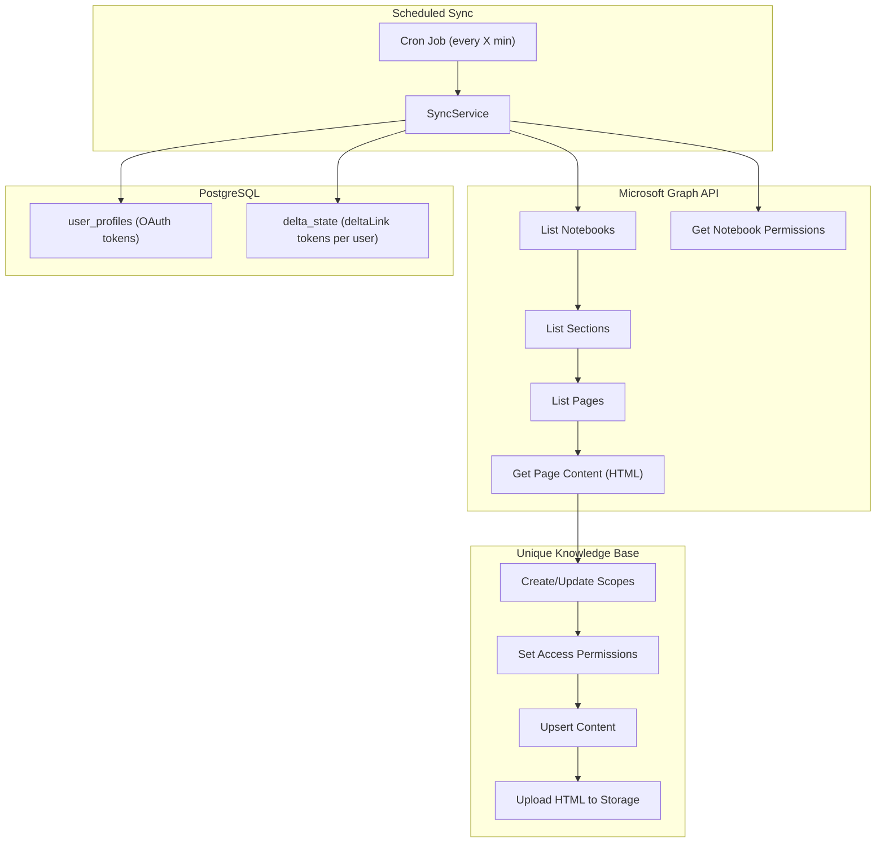

# OneNote Connector Service

## Architecture Overview

A new NestJS service under `services/onenote-mcp/` that combines patterns from:

- **teams-mcp**: Microsoft Graph client setup, OAuth authentication, token management, user resolution, Unique knowledge base ingestion
- **sharepoint-connector**: Scheduled periodic sync (cron-based), file-diff for incremental updates, scope/permissions management

**Key difference from teams-mcp**: No webhook subscriptions. Instead, a configurable cron job polls OneNote data at regular intervals. This is similar to how `sharepoint-connector` uses `@nestjs/schedule`.

**Key constraint**: OneNote Graph API does **not** support app-only authentication -- only delegated permissions work. This means we need per-user OAuth tokens (same as teams-mcp), not service-level credentials (unlike sharepoint-connector which uses MSAL client credentials).




## Data Model: OneNote Hierarchy

```
User
 └── Notebooks (via /me/onenote/notebooks)
      ├── Sections (via /notebooks/{id}/sections)
      │    └── Pages (via /sections/{id}/pages)
      └── Section Groups (via /notebooks/{id}/sectionGroups)
           └── Sections → Pages
```

Each **page** is the unit of content ingestion. Pages have HTML content, `createdDateTime`, `lastModifiedDateTime`, and `links` (with `oneNoteWebUrl` for browser opening).

## Scope Structure in Unique

```
{rootScopePath}/
 └── {notebookDisplayName}/
      └── {sectionDisplayName}/
           └── [pages as content items]
```

For section groups, nest an additional level:

```
{rootScopePath}/
 └── {notebookDisplayName}/
      └── {sectionGroupName}/
           └── {sectionDisplayName}/
                └── [pages as content items]
```

## Key Design Decisions

### 1. Authentication: Reuse teams-mcp OAuth pattern

- Reuse `@unique-ag/mcp-oauth` for user OAuth flow (Microsoft provider)
- Store encrypted tokens in PostgreSQL via Drizzle (same schema as teams-mcp)
- Use `GraphClientFactory` with per-user `TokenProvider` and token refresh middleware
- Required scopes: `openid`, `profile`, `email`, `offline_access`, `User.Read`, `Notes.ReadWrite.All` (read + write for pages/notebooks/sections), `Files.Read.All` (driveItem delta and permissions)

### 2. Sync Strategy: Two-level delta-based incremental sync

The sync uses a **two-level change detection** approach to minimize Graph API calls and avoid re-ingesting unchanged content:

**Level 1 -- Graph driveItem delta (coarse filter):**
OneNote notebooks are stored as driveItems in OneDrive. The `driveItem: delta` endpoint (`GET /me/drive/root/delta`) supports tracking changes across a user's entire drive. On each cron tick:

- First sync: call `GET /me/drive/root/delta` to get the full initial state and receive a `deltaLink`
- Subsequent syncs: call the stored `deltaLink` to get only items that changed since last sync
- Filter delta results for OneNote items (`.one` / `.onetoc2` files or items with a `package` facet of type `oneNote`)
- This tells us **which notebooks have changes** without crawling the full hierarchy

**Level 2 -- Unique file-diff (fine-grained filter):**
For notebooks flagged as changed by the delta, crawl their sections/pages and call `performFileDiff` from `@unique-ag/unique-api` (same pattern as [sharepoint-connector content-sync](services/sharepoint-connector/src/sharepoint-synchronization/content-sync.service.ts)). This compares page keys + `lastModifiedDateTime` against what Unique already has, yielding precise new/updated/deleted page lists.

**Persistence:**

- Store the `deltaLink` token per user in a `delta_state` DB table
- Use `@nestjs/schedule` with a configurable cron expression via env var `SYNC_INTERVAL_CRON` (default: `*/15` * * * *)
- If no `deltaLink` exists (first run or token expired), perform a full initial sync

**Why not OneNote-native delta?**
The OneNote API (`/me/onenote/notebooks`, `/sections`, `/pages`) does **not** support the `/delta` function. However, since notebooks are stored as OneDrive driveItems, we can use `driveItem: delta` to detect which notebooks changed, then only crawl the pages of those notebooks.

**Edge case -- delta token expiration:**
Microsoft may return `410 Gone` if a delta token is too old. In that case, discard the token and perform a full sync (same as initial sync).

### 3. Content Ingestion

- Fetch page HTML content via `GET /sections/{id}/pages/{id}/content`
- Upload HTML to Unique knowledge base using content upsert + storage upload pattern (same as teams-mcp and sharepoint-connector)
- Content key format: `onenote:{userId}:{pageId}` for unique identification
- Set `url` to the page's `oneNoteWebUrl` link so references open directly in OneNote

### 4. Metadata

- `createdDateTime` from the OneNote page
- `lastModifiedDateTime` from the OneNote page
- `notebookName`, `sectionName` for context
- `oneNoteWebUrl` as the direct link

### 5. Access/Permissions Resolution

- For each notebook, fetch permissions via the drive item permissions endpoint: `GET /drives/{driveId}/items/{itemId}/permissions` (notebooks are stored as items in OneDrive)
- Resolve shared users/groups to Unique users using the same email-based lookup as teams-mcp (`UniqueUserService.findUserByEmail`)
- For group permissions, expand group members via `GET /groups/{groupId}/members`
- Notebook owner gets Read/Write/Manage; shared users get Read
- Permissions are set at the notebook scope level and inherited by section sub-scopes

### 6. MCP Tools

The service exposes MCP tools (via `@unique-ag/mcp-server-module`) for AI assistants and users to interact with OneNote data. All tools follow the same pattern as teams-mcp: `@Tool` decorator with Zod input/output schemas, injected services, and `McpAuthenticatedRequest` for per-user auth.

**Tool 1: `search_onenote` -- Search OneNote Content**

Semantic search over ingested OneNote pages in the Unique knowledge base (same pattern as `FindTranscriptsTool` in teams-mcp).

- Input: `query` (string), optional filters: `notebookName`, `sectionName`, `dateFrom`/`dateTo` (ISO datetime), `limit` (1-100, default 10), `scoreThreshold` (0-1)
- Output: array of `{ id, chunkId, title, key, text, url, notebookName, sectionName, createdDateTime, lastModifiedDateTime, score }`
- Implementation: calls `UniqueContentService.scopedSearch()` with metadata filters built from the input, scoped to the user's OneNote root scope
- `url` returns the `oneNoteWebUrl` so results link directly to the page in OneNote
- Annotations: `readOnlyHint: true`, `destructiveHint: false`, `idempotentHint: true`

**Tool 2: `create_onenote_page` -- Create a OneNote Page**

Creates a new page in a specified section of a notebook via the Graph API.

- Input: `notebookName` (string, optional -- if omitted uses default notebook), `sectionName` (string), `title` (string), `contentHtml` (string -- HTML body of the page)
- Output: `{ success, pageId, title, oneNoteWebUrl, oneNoteClientUrl, createdDateTime }`
- Implementation:
  1. If `notebookName` provided, resolve notebook ID via `GET /me/onenote/notebooks?$filter=displayName eq '...'`
  2. Resolve section ID via `GET /notebooks/{id}/sections?$filter=displayName eq '...'`; if section doesn't exist, create it via `POST /notebooks/{id}/sections`
  3. Create page via `POST /sections/{sectionId}/pages` with `Content-Type: application/xhtml+xml` and the HTML body
  4. Return the created page metadata
- Annotations: `readOnlyHint: false`, `destructiveHint: false`, `idempotentHint: false`
- Required Graph scope: `Notes.ReadWrite` (or `Notes.Create`)

**Tool 3: `update_onenote_page` -- Update a OneNote Page**

Appends or replaces content on an existing OneNote page via the Graph API.

- Input: `pageId` (string), `action` (`append` | `prepend` | `replace`), `targetId` (string, optional -- element data-id to target, defaults to body), `contentHtml` (string -- HTML content)
- Output: `{ success, pageId, message }`
- Implementation: calls `PATCH /me/onenote/pages/{pageId}/content` with a JSON array of change objects: `[{ target, action, position, content }]`
- Annotations: `readOnlyHint: false`, `destructiveHint: false`, `idempotentHint: false`
- Required Graph scope: `Notes.ReadWrite`

**Tool 4: `create_onenote_notebook` -- Create a OneNote Notebook**

Creates a new notebook for the authenticated user.

- Input: `displayName` (string)
- Output: `{ success, notebookId, displayName, oneNoteWebUrl, createdDateTime }`
- Implementation: calls `POST /me/onenote/notebooks` with `{ displayName }`
- Annotations: `readOnlyHint: false`, `destructiveHint: false`, `idempotentHint: false`
- Required Graph scope: `Notes.Create` or `Notes.ReadWrite`

**Tool 5: `start_onenote_sync` / `stop_onenote_sync` / `verify_onenote_sync_status`**

Control tools to start/stop/check the sync integration for the current user (analogous to teams-mcp's KB integration tools).

- `start_onenote_sync`: triggers an immediate sync for the user and ensures they are included in future cron runs
- `stop_onenote_sync`: removes the user's delta state and excludes them from sync
- `verify_onenote_sync_status`: returns current sync status (active/inactive, last sync time, page count, any errors)

### 7. OAuth Scopes

Since write tools are included, the required Microsoft OAuth scopes expand to:

- `openid`, `profile`, `email`, `offline_access` (standard OIDC)
- `User.Read` (user profile)
- `Notes.ReadWrite.All` (read + create/update notebooks, sections, pages)
- `Files.Read.All` (driveItem delta and permissions)

### 8. Shared Packages to Reuse

- `@unique-ag/unique-api` -- content ingestion, scope management, user/group lookups, file diff
- `@unique-ag/aes-gcm-encryption` -- token encryption
- `@unique-ag/instrumentation` -- OpenTelemetry
- `@unique-ag/logger` -- logging
- `@unique-ag/mcp-oauth` -- OAuth flow for user authentication
- `@unique-ag/mcp-server-module` -- MCP server (for tools/configuration via MCP)
- `@unique-ag/probe` -- health checks

## File Structure

```
services/onenote-mcp/
├── src/
│   ├── main.ts
│   ├── app.module.ts
│   ├── config/
│   │   ├── index.ts
│   │   ├── app.config.ts
│   │   ├── auth.config.ts
│   │   ├── database.config.ts
│   │   ├── encryption.config.ts
│   │   ├── microsoft.config.ts
│   │   ├── sync.config.ts          # SYNC_INTERVAL_CRON, concurrency settings
│   │   └── unique.config.ts
│   ├── auth/
│   │   ├── mcp-oauth.store.ts
│   │   └── microsoft.provider.ts
│   ├── drizzle/
│   │   ├── drizzle.module.ts
│   │   ├── index.ts
│   │   ├── timestamps.columns.ts
│   │   └── schema/
│   │       ├── auth/               # Same as teams-mcp (oauth-clients, sessions, tokens, auth-codes)
│   │       ├── user-profiles.table.ts
│   │       └── delta-state.table.ts  # Store deltaLink token per user
│   ├── msgraph/
│   │   ├── graph-client.factory.ts  # Reuse pattern from teams-mcp
│   │   ├── msgraph.module.ts
│   │   ├── token.provider.ts
│   │   ├── token-refresh.middleware.ts
│   │   └── metrics.middleware.ts
│   ├── onenote/
│   │   ├── onenote.module.ts
│   │   ├── onenote-graph.service.ts        # Graph API calls for OneNote resources
│   │   ├── onenote-delta.service.ts        # driveItem delta tracking and delta token mgmt
│   │   ├── onenote-sync.service.ts         # Orchestrates per-user sync using delta + file-diff
│   │   ├── onenote-content.service.ts      # Page content fetching and HTML processing
│   │   ├── onenote-permissions.service.ts  # Notebook permission resolution
│   │   ├── onenote.types.ts                # Zod schemas for Graph API responses
│   │   └── tools/
│   │       ├── index.ts
│   │       ├── search-onenote.tool.ts          # Semantic search over ingested OneNote pages
│   │       ├── create-onenote-page.tool.ts     # Create a new page via Graph API
│   │       ├── update-onenote-page.tool.ts     # Append/replace content on a page via Graph API
│   │       ├── create-onenote-notebook.tool.ts # Create a new notebook via Graph API
│   │       ├── start-onenote-sync.tool.ts      # Start sync for current user
│   │       ├── stop-onenote-sync.tool.ts       # Stop sync for current user
│   │       └── verify-onenote-sync-status.tool.ts  # Check sync status
│   ├── scheduler/
│   │   ├── scheduler.module.ts
│   │   └── scheduler.service.ts     # Cron job setup (pattern from sharepoint-connector)
│   ├── unique/
│   │   ├── unique.module.ts
│   │   ├── unique.service.ts           # Orchestrates ingestion into KB
│   │   ├── unique-content.service.ts   # Content upsert/upload
│   │   ├── unique-scope.service.ts     # Scope creation and access mgmt
│   │   ├── unique-user.service.ts      # User resolution by email
│   │   └── unique.dtos.ts
│   └── utils/
│       ├── graph-error.filter.ts
│       └── normalize-error.ts
├── drizzle/                 # Migration files
├── deploy/
│   ├── helm-charts/
│   ├── terraform/
│   └── Dockerfile
├── .env.example
├── package.json
├── tsconfig.json
├── tsconfig.build.json
├── nest-cli.json
├── drizzle.config.ts
└── vitest.config.ts
```

## Key Environment Variables


| Variable                  | Default        | Description                           |
| ------------------------- | -------------- | ------------------------------------- |
| `SYNC_INTERVAL_CRON`      | `*/15 * * * *` | Cron expression for sync frequency    |
| `SYNC_PAGE_BATCH_SIZE`    | `20`           | Pages to process per batch            |
| `SYNC_CONCURRENCY`        | `3`            | Max concurrent user syncs             |
| `DATABASE_URL`            | --             | PostgreSQL connection                 |
| `MICROSOFT_CLIENT_ID`     | --             | Azure AD app client ID                |
| `MICROSOFT_CLIENT_SECRET` | --             | Azure AD app secret                   |
| `AUTH_HMAC_SECRET`        | --             | JWT signing secret                    |
| `ENCRYPTION_KEY`          | --             | Token encryption key                  |
| `UNIQUE_*`                | --             | Unique API config (same as teams-mcp) |


## Sync Flow (per cron tick)

```mermaid
flowchart TD
    Start["Cron Tick"] --> GetUsers["Get all user profiles with valid tokens"]
    GetUsers --> ForEachUser["For each user (concurrency-limited)"]
    ForEachUser --> CreateClient["Create Graph client for user"]
    CreateClient --> CheckDelta{"Has stored deltaLink?"}

    CheckDelta -->|No| FullSync["GET /me/drive/root/delta (initial full state)"]
    CheckDelta -->|Yes| IncrSync["GET deltaLink (only changes)"]

    FullSync --> StoreDelta["Store new deltaLink in DB"]
    IncrSync --> GoneCheck{"410 Gone?"}
    GoneCheck -->|Yes| FullSync
    GoneCheck -->|No| StoreDelta

    StoreDelta --> FilterOneNote["Filter delta items for OneNote content"]
    FilterOneNote --> ChangedNotebooks["Identify changed notebooks"]

    ChangedNotebooks --> ForEachNotebook["For each changed notebook"]
    ForEachNotebook --> FetchPerms["GET /drives/{driveId}/items/{itemId}/permissions"]
    FetchPerms --> ResolveUsers["Resolve shared users in Unique"]
    ResolveUsers --> CreateScope["Create/ensure notebook scope"]
    CreateScope --> SetAccess["Set scope accesses (owner + shared users)"]
    SetAccess --> ListSections["GET /notebooks/{id}/sections"]
    ListSections --> ForEachSection["For each section"]
    ForEachSection --> CreateSubScope["Create section sub-scope"]
    CreateSubScope --> ListPages["GET /sections/{id}/pages"]

    ListPages --> FileDiff["Unique performFileDiff (compare keys + lastModifiedDateTime)"]
    FileDiff --> ProcessNew["Process new/updated pages"]
    FileDiff --> DeleteRemoved["Delete removed pages from KB"]

    ProcessNew --> FetchHTML["GET /pages/{id}/content (HTML)"]
    FetchHTML --> UpsertContent["Register content in Unique"]
    UpsertContent --> UploadHTML["Upload HTML to storage"]
    UploadHTML --> Finalize["Finalize ingestion with oneNoteWebUrl"]
```




## Database Schema Additions

### `delta_state` table

Stores the Microsoft Graph delta token per user so that subsequent syncs only fetch changes.

- `id` (uuid, PK)
- `userProfileId` (FK to user_profiles, unique)
- `deltaLink` (text, not null) -- the `@odata.deltaLink` URL from the last successful delta call
- `lastSyncedAt` (timestamp) -- when the delta was last successfully consumed
- `lastSyncStatus` (text) -- `success` / `error` / `full_resync`
- `createdAt` / `updatedAt` (standard timestamps)

When `deltaLink` is missing or Graph returns `410 Gone`, the service performs a full initial sync and stores the fresh `deltaLink`.

The `user_profiles` table and auth-related tables (`oauth_clients`, `oauth_sessions`, `tokens`, `authorization_codes`) follow the same schema as teams-mcp.

## Permission Resolution Detail

For each notebook:

1. Get the notebook's `links.oneNoteWebUrl` and underlying drive info
2. Call `GET /drives/{driveId}/items/{itemId}/permissions` to get the permission list
3. For each permission entry:
  - If it has `grantedToV2.user` -> resolve by email in Unique
  - If it has `grantedToV2.group` -> call `GET /groups/{groupId}/members` to expand, then resolve each member by email
  - If it has `grantedToIdentitiesV2` (link sharing) -> resolve each identity
4. Owner (from notebook metadata) gets Read/Write/Manage on the notebook scope
5. All resolved shared users get Read on the notebook scope
6. Sub-scopes (sections) inherit access from the notebook scope

