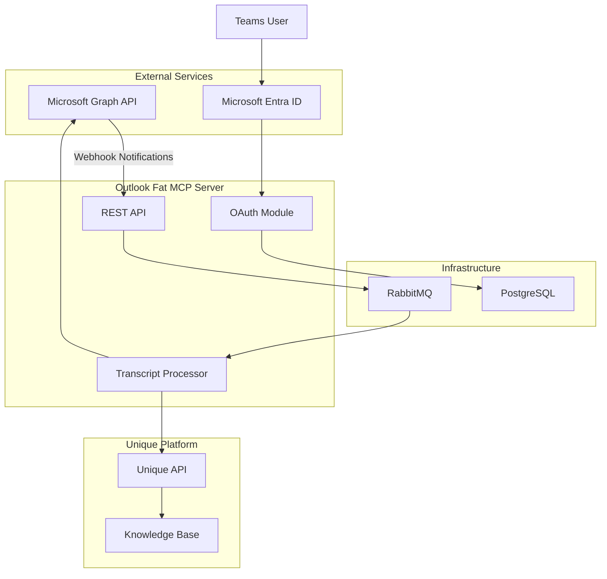
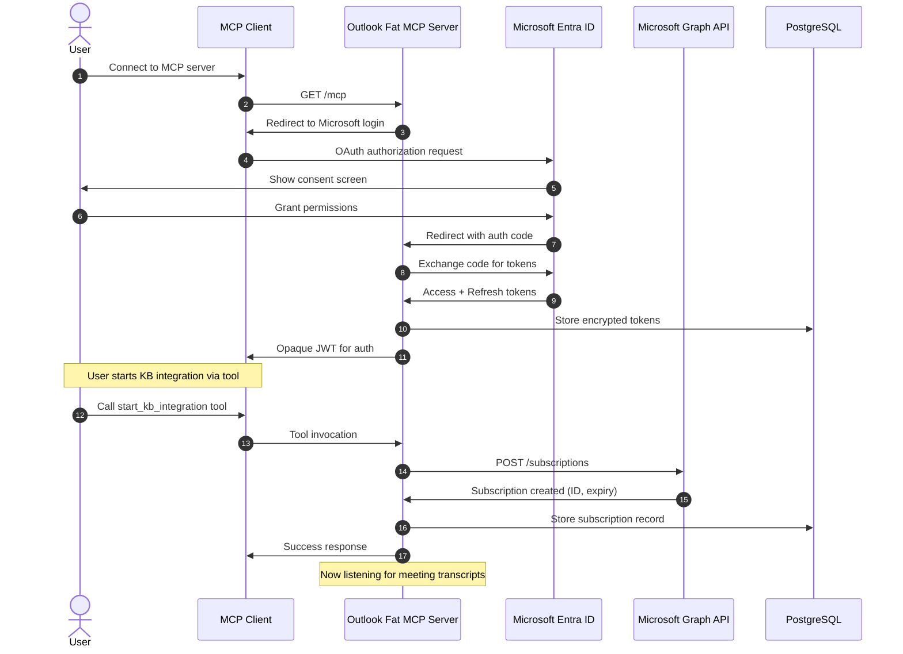
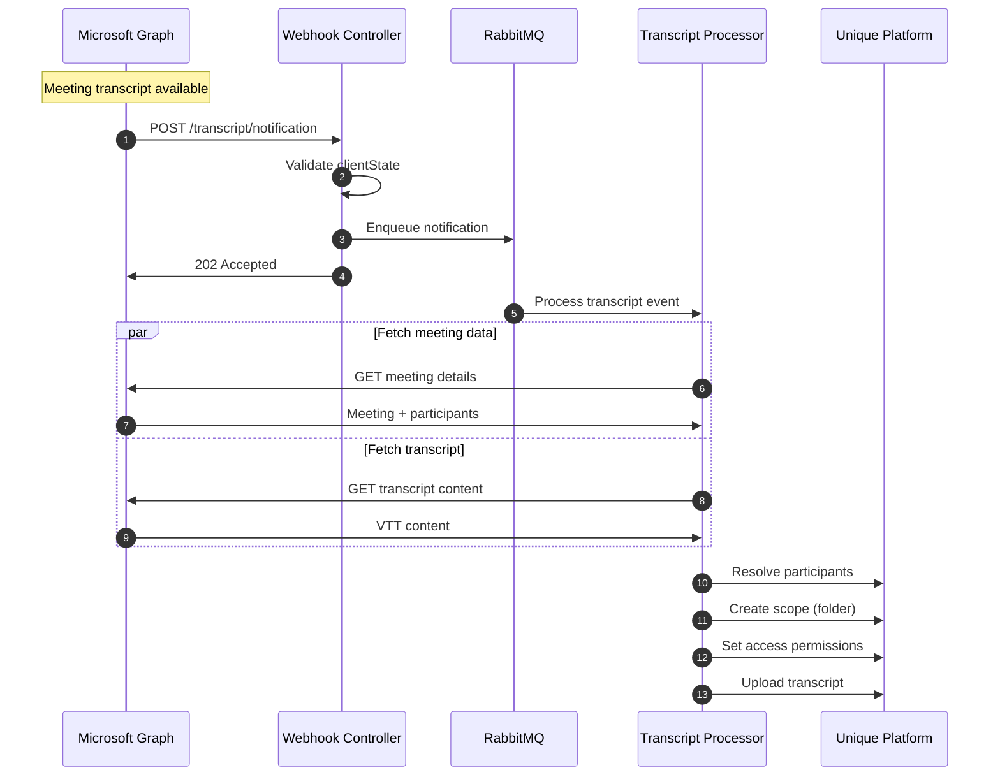
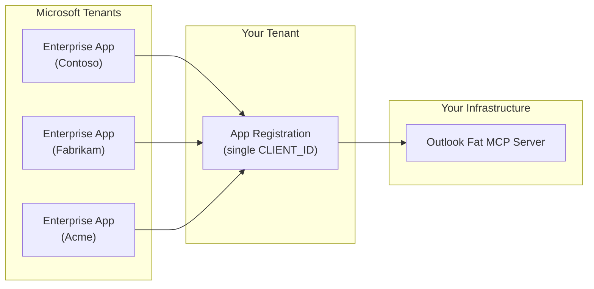

<!-- confluence-page-id: 1802633229 -->
<!-- confluence-space-key: PUBDOC -->

!!! danger "Pre-Release Disclaimer"
    **`outlook-fat-mcp` is pre-release software.**

    - **No SLA/SSLA**: No service level agreements or support level agreements apply
    - **No Support**: No guaranteed support, response times, or issue resolution
    - **Breaking Changes**: APIs, configurations, and behavior may change without notice between versions
    - **No Stability Guarantees**: Features may be incomplete, modified, or removed at any time
    - **Data Loss Risk**: Bugs or changes may result in data loss or corruption
    - **Use at Your Own Risk**: This software is provided "as-is" without warranties of any kind

    Pre-release software is intended for evaluation and testing purposes only. Do not rely on this software for production workloads without understanding these limitations.

## Overview

The Outlook Fat MCP Server is a cloud-native application that automatically captures meeting transcripts from Microsoft Teams and ingests them into the Unique knowledge base. This guide provides administrators with essential information about requirements, features, and limitations.

**Note:** This is a connector-style MCP server, not a traditional MCP server. It does not provide tools, prompts, resources, or other MCP capabilities. Once connected, it automatically ingests meeting transcripts into the Unique knowledge base without requiring any additional interaction or tool calls.

For deployment, configuration, and operational details, see the [IT Operator Guide](./operator/README.md).

## Quick Summary

**What it does:** Automatically captures meeting transcripts from Microsoft Teams and ingests them into Unique's AI knowledge base with participant-based access controls

**Deployment:** Kubernetes-based NestJS microservice

**Authentication:** Uses delegated OAuth2 with Microsoft Entra ID (user signs in and consents)

**Processing:** Real-time webhook-driven (notifications received immediately when transcripts are available)

## Requirements

### Microsoft 365 / Teams

| Requirement | Details |
|-------------|---------|
| **Microsoft Teams** | Active tenant with transcription enabled for meetings |
| **Microsoft Entra ID** | Tenant with Application Administrator rights for app registration |
| **License** | Microsoft 365 license with Teams meeting transcription capabilities |

**Prerequisites:**

- Access to Microsoft Entra ID for app registration
- Microsoft Teams meetings with transcription enabled by policy
- Users must be able to consent to delegated permissions (or admin consent granted)

### Permissions

All permissions are **Delegated** (not Application), meaning they act on behalf of the signed-in user and can only access data that user has access to.

| Permission | Type | Admin Consent | Required |
|------------|------|---------------|----------|
| `User.Read` | Delegated | No | Yes |
| `OnlineMeetings.Read` | Delegated | No | Yes |
| `OnlineMeetingTranscript.Read.All` | Delegated | Yes | Yes |
| `offline_access` | Delegated | No | Yes |

For detailed permission justifications, see [Microsoft Graph Permissions](./technical/permissions.md#least-privilege-justification).

## Features

### Core Capabilities

**Real-time Transcript Capture**

- Webhook-based notifications from [Microsoft Graph API](https://learn.microsoft.com/en-us/graph/overview)
- Automatic capture when meeting transcripts become available
- VTT format transcript content ingested into Unique

**Participant-Based Access Control**

- Meeting organizer receives **write + read** access in Unique
- Meeting participants receive **read** access in Unique
- Users resolved by email or username in Unique platform

**Self-Service User Connection**

- Users connect their own Microsoft account via [OAuth 2.1](https://oauth.net/2.1/) with [PKCE](https://datatracker.ietf.org/doc/html/rfc7636)
- No IT administrator involvement required for individual connections

**Automatic Subscription Management**

- Microsoft Graph webhook subscriptions created automatically on user connection
- Subscriptions renewed automatically before expiration
- Failed renewals handled gracefully with user reconnection required

### Advanced Features

**Security**

- OAuth 2.1 with PKCE for authentication ([RFC 7636](https://datatracker.ietf.org/doc/html/rfc7636))
- Microsoft tokens encrypted at rest using AES-256-GCM
- Refresh token rotation with family-based revocation
- Short-lived access tokens (60 seconds default)
- See [Security Documentation](./technical/security.md#token-security) for details

**Reliability**

- RabbitMQ message queue for asynchronous webhook processing
- Dead Letter Exchange (DLX) for failed message inspection and retry
- Meets Microsoft's strict webhook response requirements (< 10 seconds)
- See [FAQ - Why use RabbitMQ for webhook processing?](./faq.md#why-use-rabbitmq-for-webhook-processing) for details

**Observability**

- Detailed logging with trace IDs

**Configuration**

- Configurable token TTLs
- Automatic subscription renewal via Microsoft lifecycle webhooks
- Rate limiting support

## How It Works

### High-Level Architecture

See [Architecture Documentation](./technical/architecture.md#components) for detailed component diagrams.

### User Connection Flow

See [User Connection Flow](./technical/flows.md#user-connection-flow) for additional details.

### Transcript Processing Flow

See [Transcript Processing Flow](./technical/flows.md#transcript-processing-flow) for additional details.

### User Workflow

1. **User Setup** (One-time)
   - Open MCP client and connect to Outlook Fat MCP Server
   - Sign in with Microsoft account
   - Grant required permissions

2. **Automatic Processing** (Ongoing)
   - Attend Microsoft Teams meetings with transcription enabled
   - Meeting ends and transcript becomes available
   - Outlook Fat MCP automatically receives webhook notification
   - Transcript captured and uploaded

3. **Access in Unique** (Ongoing)
   - Meeting content available in Unique knowledge base
   - Organizer has write + read access
   - Participants have read access
   - Content searchable and queryable via Unique AI

## Limitations and Constraints

### Authentication Constraints

| Constraint | Reason |
|------------|--------|
| **Delegated permissions only** | Requires user sign-in; application-only access would need admin-configured policies per user |
| **No certificate auth** | Certificate auth only works with Client Credentials flow, incompatible with delegated permissions |
| **Single app registration** | Each MCP server deployment uses one Entra ID app registration (multi-tenant capable) |
| **Admin consent required** | `OnlineMeetingTranscript.Read.All` needs admin approval |

See [Authentication Architecture - Single App Registration Architecture](./technical/architecture.md#single-app-registration-architecture) for details.

### Operational Constraints

| Constraint | Impact | Mitigation |
|------------|--------|------------|
| **90-day token expiry** | User must reconnect after ~90 days of inactivity | Monitor for disconnected users |
| **Webhook timeout** | Microsoft requires response in <10 seconds | RabbitMQ decouples reception from processing |
| **Subscription expiry** | Graph subscriptions expire after 3 days max | Automatic renewal via lifecycle notifications |
| **Encryption key change** | All stored tokens become unreadable | Users must reconnect; plan for maintenance window |

### Scaling Considerations

| Factor | Limit | Notes |
|--------|-------|-------|
| **Microsoft Graph rate limits** | ~10,000 requests/10 min per app | Shared across all users of the app registration |
| **Concurrent user lookups** | Configurable (default: 5) | Set via `UNIQUE_USER_FETCH_CONCURRENCY` |
| **Database connections** | PostgreSQL pool size | Monitor connection usage under load |

### Not Supported

- **Real-time transcription**: Only processes completed transcripts, not live captions
- **Meeting creation**: Read-only access; cannot create or modify meetings
- **Selective meeting capture**: All meetings with transcription enabled are captured
- **Token introspection**: Tokens validated locally with short TTLs for performance

### Single App Registration Architecture

Each Outlook Fat MCP Server deployment uses **one Microsoft Entra ID app registration**:

- **Multi-tenant support**: Configure app as "Accounts in any organizational directory"
- **Enterprise Application**: Created in each tenant when admin grants consent
- **Shared infrastructure**: One deployment serves all tenants
- **Data isolation**: Each user's data scoped by their Microsoft user ID

See [Authentication Architecture - Single App Registration Architecture](./technical/architecture.md#single-app-registration-architecture) for details.

## Future Versions

Planned enhancements will be documented here.

## Related Documentation

- [FAQ](./faq.md) - Frequently asked questions

### For IT Operators

- [Operator Guide](./operator/README.md) - Deployment, configuration, and operations
  - [Deployment](./operator/deployment.md) - Kubernetes and Helm setup
  - [Configuration](./operator/configuration.md) - Environment variables and settings
  - [Authentication](./operator/authentication.md) - Microsoft Entra ID setup
  - [FAQ](./faq.md) - Frequently asked questions

### Technical Reference

- [Technical Reference](./technical/README.md) - Architecture, flows, and design decisions
  - [Architecture](./technical/architecture.md) - System components and infrastructure
  - [Flows](./technical/flows.md) - User connection, subscription lifecycle, transcript processing
  - [Permissions](./technical/permissions.md) - Microsoft Graph permissions with justification
  - [Security](./technical/security.md) - Encryption, authentication, and threat model

## Standard References

- [Microsoft Graph API](https://learn.microsoft.com/en-us/graph/overview) - Microsoft Graph documentation
- [Microsoft Graph Permissions Reference](https://learn.microsoft.com/en-us/graph/permissions-reference) - Permission details
- [Microsoft Entra ID Documentation](https://learn.microsoft.com/en-us/entra/identity/) - Authentication and authorization
- [OAuth 2.1](https://oauth.net/2.1/) - OAuth 2.1 specification
- [RFC 7636 - PKCE](https://datatracker.ietf.org/doc/html/rfc7636) - Proof Key for Code Exchange
- [RFC 6749 - OAuth 2.0](https://datatracker.ietf.org/doc/html/rfc6749) - OAuth 2.0 Authorization Framework
- [Model Context Protocol](https://modelcontextprotocol.io/) - MCP specification
- [MCP Authorization](https://modelcontextprotocol.io/specification/2025-03-26/basic/authorization) - MCP authorization spec
