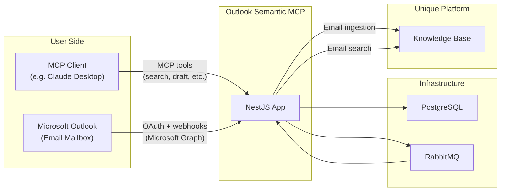
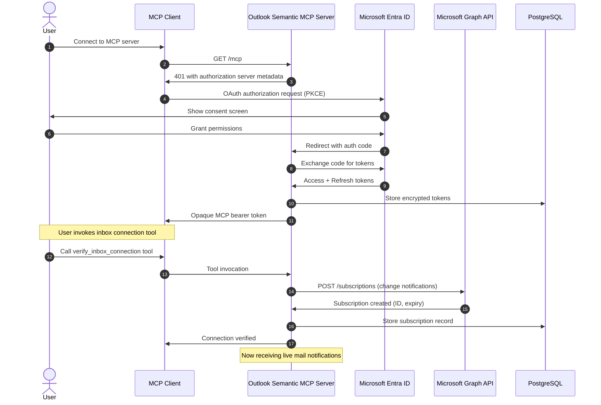
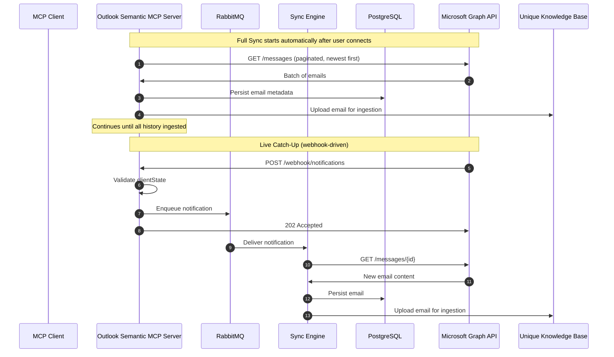

<!-- confluence-page-id: 2061664285 -->
<!-- confluence-space-key: PUBDOC -->

!!! danger "Pre-Release Disclaimer"
    **`outlook-semantic-mcp` is pre-release software.**

    - **No SLA/SSLA**: No service level agreements or support level agreements apply
    - **No Support**: No guaranteed support, response times, or issue resolution
    - **Breaking Changes**: APIs, configurations, and behavior may change without notice between versions
    - **No Stability Guarantees**: Features may be incomplete, modified, or removed at any time
    - **Data Loss Risk**: Bugs or changes may result in data loss or corruption
    - **Use at Your Own Risk**: This software is provided "as-is" without warranties of any kind

    Pre-release software is intended for evaluation and testing purposes only. Do not rely on this software for production workloads without understanding these limitations.

## Overview

The Outlook Semantic MCP Server is a cloud-native MCP server that gives AI assistants direct access to a user's Microsoft Outlook mailbox. Users connect their Microsoft account once, after which the server performs a full historical email sync and maintains a live, webhook-driven view of new mail. AI clients can then search emails, compose drafts, look up contacts, and manage folders through 10 MCP tools (plus 4 additional debug-mode tools).

**Note:** This is a hybrid MCP server. It exposes tools for AI clients to invoke on demand, and it also automatically ingests the user's email history and live mail into the Unique knowledge base in the background after connection.

For deployment, configuration, and operational details, see the [IT Operator Guide](./operator/README.md).

## Quick Summary

**What it does:** Provides AI clients with 10 MCP tools (plus 4 debug-mode tools) for searching emails, composing drafts, looking up contacts, managing folders, and monitoring sync status against a user's Microsoft Outlook mailbox

**Deployment:** Kubernetes-based NestJS microservice

**Authentication:** MCP OAuth 2.1 with PKCE for MCP clients; delegated Microsoft OAuth 2.0 for Microsoft Graph API access

**Processing:** Dual-mode — batch full sync for historical email ingestion into the Unique knowledge base, and real-time webhook-driven live catch-up for new mail

## Requirements

### Microsoft 365 / Outlook

| Requirement | Details |
|-------------|---------|
| **Microsoft 365** | Active tenant with Exchange Online (Outlook) mailboxes |
| **Microsoft Entra ID** | Tenant with Application Administrator rights for app registration |
| **License** | Any Microsoft 365 license that includes Exchange Online |

**Prerequisites:**

- Access to Microsoft Entra ID for app registration
- Users must consent to the required delegated permissions (or admin consent can be pre-granted for organisational rollout)

### Permissions

All permissions are **Delegated** (not Application), meaning they act on behalf of the signed-in user and can only access data that user has access to.

| Permission | Type | Admin Consent | Required | Purpose |
|------------|------|---------------|----------|---------|
| `User.Read` | Delegated | No | Yes | Resolve user identity and profile |
| `Mail.ReadWrite` | Delegated | No | Yes | Read emails for sync and search; create draft emails |
| `MailboxSettings.Read` | Delegated | No | Yes | Read mailbox settings and folder structure |
| `People.Read` | Delegated | No | Yes | Look up contacts and people for address resolution |
| `offline_access` | Delegated | No | Yes | Obtain refresh tokens for background sync |

For detailed permission justifications, see [Microsoft Graph Permissions](./technical/permissions.md).

## Features

### Core Capabilities

**Email Search**

- Unique semantic search across the user's mailbox via the `search_emails` tool
- Open individual emails by message ID via `open_email_by_id`
- Searches are executed against the Unique knowledge base, where emails are indexed during sync — no live Microsoft Graph API call is made per query

**Draft Creation**

- Create draft emails with subject, body, recipients, and attachments via `create_draft_email`
- Drafts are written directly to the user's Outlook Drafts folder via Microsoft Graph

**Contact Lookup**

- Search the user's Microsoft contacts directory via `lookup_contacts`
- Returns display names, email addresses, and job titles for address resolution

**Mailbox Utilities**

- List all mail folders and subfolders via `list_folders` to obtain folder IDs for use with `search_emails`
- Retrieve email categories via `list_categories` to obtain category names for filtering searches

**Subscription Management**

- Check mailbox connection and webhook subscription status via `verify_inbox_connection` (returns: active, expiring_soon, expired, not_configured)
- Reconnect a mailbox after token expiry or webhook failure via `reconnect_inbox`
- Remove a mailbox connection entirely via `remove_inbox_connection`
- Microsoft Graph webhook subscriptions created automatically on connection and renewed before expiration

**Full Sync (Historical Batch Ingestion)**

- After connecting, the server automatically begins a full sync to ingest your complete email history
- Sync progress can be monitored via the `sync_progress` tool, which reports the current state, counters, and date range being processed
- `sync_progress` returns the current sync state (`ready`, `running`, `paused`, `waiting-for-ingestion`, `failed`), the number of emails ingested, the date window being processed, and a warning if results may be incomplete

**Live Catch-Up (Real-Time Webhook-Driven)**

- Receives Microsoft Graph change notifications the moment new mail arrives
- New emails processed asynchronously via RabbitMQ to meet Microsoft's strict webhook response deadline

### Advanced Features

**Security**

- OAuth 2.1 with PKCE for MCP client authentication ([RFC 7636](https://datatracker.ietf.org/doc/html/rfc7636))
- Microsoft tokens encrypted at rest using AES-256-GCM
- Refresh token rotation with family-based revocation
- Webhook payloads validated via `clientState` secret
- See [Security Documentation](./technical/security.md) for details

**Reliability**

- RabbitMQ message queue for asynchronous webhook processing
- Dead Letter Exchange (DLX) for failed message inspection and retry
- Meets Microsoft's strict webhook response requirements (< 10 seconds)
- See [Live Catch-Up Documentation](./technical/live-catchup.md) for details

**Observability**

- Detailed logging with trace IDs
- Sync progress reporting via `sync_progress` tool

**Configuration**

- Automatic subscription renewal via Microsoft Graph lifecycle notifications

## How It Works

### High-Level Architecture

See [Architecture Documentation](./technical/architecture.md) for detailed component diagrams.

### User Connection Flow

See [User Connection Flow](./technical/flows.md) for additional details.

### Email Sync Flow

See [Full Sync Documentation](./technical/full-sync.md) and [Live Catch-Up Documentation](./technical/live-catchup.md) for additional details.

### User Workflow

1. **User Setup** (One-time)
   - Open MCP client and connect to Outlook Semantic MCP Server
   - Sign in with Microsoft account and grant required permissions
   - Verify inbox connection via `verify_inbox_connection` tool

2. **Initial Sync** (Automatic)
   - After connecting, the server automatically begins syncing your email history into the Unique knowledge base
   - Use `sync_progress` to monitor sync status — results will be partial until the sync completes

3. **Live Mail** (Ongoing)
   - New emails arrive in Outlook
   - Server receives Microsoft Graph webhook notification automatically
   - Email is processed and available for search immediately

4. **AI-Assisted Email Tasks** (On-demand)
   - Search emails with `search_emails`
   - Open specific messages with `open_email_by_id`
   - Compose drafts with `create_draft_email`
   - Look up contacts with `lookup_contacts`
   - Use `list_folders` and `list_categories` to obtain folder IDs and category names for filtering searches

## Limitations and Constraints

### Authentication Constraints

| Constraint | Reason |
|------------|--------|
| **Delegated permissions only** | Requires user sign-in; application-only access is not supported |
| **Single app registration per deployment** | Each server deployment uses one Entra ID app registration (multi-tenant capable) |

See [Authentication Architecture](./technical/architecture.md) for details.

### Operational Constraints

| Constraint | Impact | Mitigation |
|------------|--------|------------|
| **90-day token expiry** | User must reconnect after ~90 days of inactivity | Monitor for disconnected users; reconnect via `reconnect_inbox` |
| **Webhook timeout** | Microsoft requires response in < 10 seconds | RabbitMQ decouples notification receipt from email processing |
| **Subscription expiry** | Graph subscriptions expire after max 3 days | Automatic renewal via Microsoft Graph lifecycle notifications |
| **Encryption key change** | All stored tokens become unreadable | Users must reconnect; plan key rotation as a maintenance window |

### Feature Constraints

| Constraint | Details |
|------------|---------|
| **Delegated access scope** | Server can only access mail and contacts the signed-in user can access; no cross-mailbox or shared mailbox access beyond user permissions |
| **Draft only, no direct send** | `create_draft_email` creates drafts; sending requires a separate action by the user or a future tool |

### Scaling Considerations

| Factor | Limit | Notes |
|--------|-------|-------|
| **Microsoft Graph rate limits** | ~10,000 requests / 10 min per app | Shared across all users of the app registration |
| **Database connections** | PostgreSQL pool size | Monitor connection usage under load |

### Not Supported

- **Application permissions**: All access is delegated; no daemon/background-only access model
- **Shared mailboxes**: Access to shared mailboxes depends entirely on the signed-in user's own delegated rights
- **Calendar or task data**: Only mail and contacts are in scope
- **Token introspection**: MCP tokens validated locally with short TTLs for performance

## Related Documentation

- [FAQ](./faq.md) - Frequently asked questions

### For IT Operators

- [Operator Guide](./operator/README.md) - Deployment, configuration, and operations
  - [Deployment](./operator/deployment.md) - Kubernetes and Helm setup
  - [Configuration](./operator/configuration.md) - Environment variables and settings
  - [Authentication](./operator/authentication.md) - Microsoft Entra ID setup
  - [Local Development](./operator/local-development.md) - Running the server locally

### Technical Reference

- [Technical Reference](./technical/README.md) - Architecture, flows, and design decisions
  - [Architecture](./technical/architecture.md) - System components and infrastructure
  - [Flows](./technical/flows.md) - User connection, subscription lifecycle, and sync flows
  - [Full Sync](./technical/full-sync.md) - Historical batch email ingestion details
  - [Live Catch-Up](./technical/live-catchup.md) - Real-time webhook-driven sync details
  - [Tools](./technical/tools.md) - MCP tool reference and behavior
  - [Permissions](./technical/permissions.md) - Microsoft Graph permissions with justification
  - [Security](./technical/security.md) - Encryption, authentication, and threat model

## Standard References

- [Microsoft Graph API](https://learn.microsoft.com/en-us/graph/overview) - Microsoft Graph documentation
- [Microsoft Graph Permissions Reference](https://learn.microsoft.com/en-us/graph/permissions-reference) - Permission details
- [Microsoft Entra ID Documentation](https://learn.microsoft.com/en-us/entra/identity/) - Authentication and authorization
- [Microsoft Graph Webhooks](https://learn.microsoft.com/en-us/graph/change-notifications-overview) - Change notifications overview
- [OAuth 2.1](https://oauth.net/2.1/) - OAuth 2.1 specification
- [RFC 7636 - PKCE](https://datatracker.ietf.org/doc/html/rfc7636) - Proof Key for Code Exchange
- [RFC 6749 - OAuth 2.0](https://datatracker.ietf.org/doc/html/rfc6749) - OAuth 2.0 Authorization Framework
- [Model Context Protocol](https://modelcontextprotocol.io/) - MCP specification
- [MCP Authorization](https://modelcontextprotocol.io/specification/2025-03-26/basic/authorization) - MCP authorization spec
