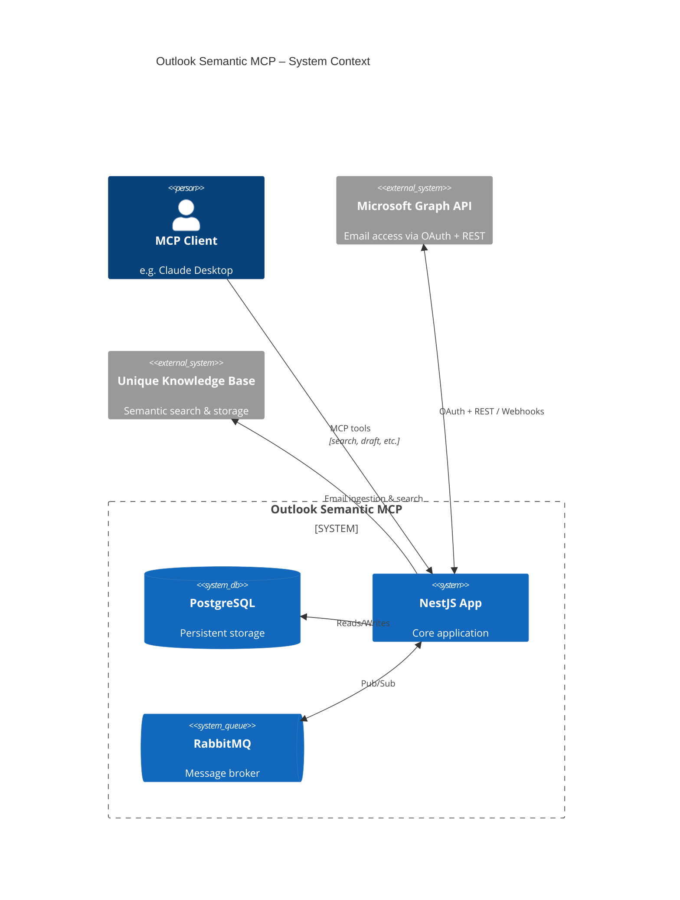

<!-- confluence-page-id: 2061664285 -->
<!-- confluence-space-key: PUBDOC -->

!!! danger "Pre-Release Disclaimer"
    **`outlook-semantic-mcp` is pre-release software.**

    - **No SLA/SSLA**: No service level agreements or support level agreements apply
    - **No Support**: No guaranteed support, response times, or issue resolution
    - **Breaking Changes**: APIs, configurations, and behavior may change without notice between versions
    - **No Stability Guarantees**: Features may be incomplete, modified, or removed at any time
    - **Data Loss Risk**: Bugs or changes may result in data loss or corruption
    - **Use at Your Own Risk**: This software is provided "as-is" without warranties of any kind

    Pre-release software is intended for evaluation and testing purposes only. Do not rely on this software for production workloads without understanding these limitations.

## Getting Started

- **IT Operators:** Start with the [Operator Guide](./operator/README.md) for deployment, configuration, and operations
- **Technical Reference:** See the [Technical Reference](./technical/README.md) for architecture, flows, and design decisions
- **FAQ:** See the [FAQ](./faq.md) for common questions

## Overview

The Outlook Semantic MCP Server is a cloud-native MCP server that gives AI assistants direct access to a user's Microsoft Outlook mailbox. Users connect their Microsoft account once, after which the server syncs emails within an operator-configured time frame (with additional content and sender filters) and maintains a live, webhook-driven view of new mail. AI clients can then search emails, compose drafts, look up contacts, and list folders through 10 MCP tools (plus 4 additional debug-mode tools).

**Note:** This service is both an MCP server and a connector. It exposes tools for AI clients to invoke on demand, and once a user connects their account, it automatically syncs their emails (within an operator-configured time frame and [filters](./technical/full-sync.md#Inbox-Filters)) into the Unique knowledge base in the background.

For deployment, configuration, and operational details, see the [IT Operator Guide](./operator/README.md).

## Documentation

- [FAQ](./faq.md) — Frequently asked questions
- [Operator Guide](./operator/README.md) — Deployment, configuration, and operations
- [Technical Reference](./technical/README.md) — Architecture, flows, and design decisions

## Quick Summary

**What it does:** Provides AI clients with 10 MCP tools (plus 4 debug-mode tools) for searching emails, composing drafts, looking up contacts, listing folders, and monitoring sync status against a user's Microsoft Outlook mailbox

**Deployment:** Kubernetes-based NestJS microservice

**Authentication:** MCP OAuth 2.1 with PKCE for MCP clients; delegated Microsoft OAuth 2.0 for Microsoft Graph API access

**Processing:** Dual-mode — batch full sync for historical email ingestion into the Unique knowledge base, and real-time webhook-driven live catch-up for new mail

## Requirements

### Microsoft 365 / Outlook

| Requirement | Details |
|-------------|---------|
| **Microsoft 365** | Active tenant with Exchange Online (Outlook) mailboxes |
| **Microsoft Entra ID** | Tenant with Application Administrator rights for app registration |
| **License** | Any Microsoft 365 license that includes Exchange Online |

**Prerequisites:**

- Access to Microsoft Entra ID for app registration
- Users must consent to the required delegated permissions (or admin consent can be pre-granted for organisational rollout)

### Permissions

All permissions are **Delegated** (not Application): `User.Read`, `Mail.ReadWrite`, `MailboxSettings.Read`, `People.Read`, `offline_access`. None require admin consent. For details, see [Permissions](technical/permissions.md).

## Features

### Core Capabilities

**Email Search**

- Unique semantic search across the user's mailbox via the `search_emails` tool
- Open individual emails by message ID via `open_email_by_id`
- Searches are executed against the Unique knowledge base, where emails are indexed during sync — no live Microsoft Graph API call is made per query

**Draft Creation**

- Create draft emails with subject, body, recipients, and attachments via `create_draft_email`
- Drafts are written directly to the user's Outlook Drafts folder via Microsoft Graph

**Contact Lookup**

- Search the user's Microsoft contacts directory via `lookup_contacts`
- Returns display names and email addresses for address resolution

**Mailbox Utilities**

- List all mail folders and subfolders via `list_folders` to obtain folder IDs for use with `search_emails`
- Retrieve email categories via `list_categories` to obtain category names for filtering searches

**Subscription Management**

- Check mailbox connection and webhook subscription status via `verify_inbox_connection` (returns: active, expiring_soon, expired, not_configured)
- Reconnect a mailbox after token expiry or webhook failure via `reconnect_inbox`
- Remove a mailbox connection entirely via `remove_inbox_connection`
- Microsoft Graph webhook subscriptions created automatically on connection and renewed before expiration

**Full Sync (Historical Batch Ingestion)**

- After connecting, the server automatically begins a full sync to ingest emails within the operator-configured time frame and filters (see [Inbox Filters](./technical/full-sync.md#Inbox-Filters))
- Sync progress can be monitored via the `sync_progress` tool, which reports the current state, counters, and date range being processed
- `sync_progress` returns a top-level `state` (`running`, `finished`, `error`) and a detailed `fullSyncState` (`ready`, `running`, `paused`, `waiting-for-ingestion`, `failed`), along with the number of emails ingested, the date window being processed, and a warning if results may be incomplete

**Live Catch-Up (Real-Time Webhook-Driven)**

- Receives Microsoft Graph change notifications the moment new mail arrives
- New emails processed asynchronously via RabbitMQ to meet Microsoft's strict webhook response deadline

### Advanced Features

**Security**

- OAuth 2.1 with PKCE for MCP client authentication ([RFC 7636](https://datatracker.ietf.org/doc/html/rfc7636))
- Microsoft tokens encrypted at rest using AES-256-GCM
- Refresh token rotation with family-based revocation
- Webhook payloads validated via `clientState` secret
- See [Security Documentation](./technical/security.md) for details

**Reliability**

- RabbitMQ message queue for asynchronous webhook processing
- Dead Letter Exchange (DLX) for failed message inspection and retry
- Meets Microsoft's strict webhook response requirements (< 10 seconds)

**Observability**

- Detailed logging with trace IDs
- Sync progress reporting via `sync_progress` tool

**Configuration**

- Automatic subscription renewal via Microsoft Graph lifecycle notifications

## How It Works

### High-Level Architecture

See [Architecture Documentation](./technical/architecture.md) for detailed component diagrams.

### User Connection Flow

The user opens their MCP client and connects to the server. The client initiates an OAuth 2.1 authorization flow with PKCE against Microsoft Entra ID. After the user grants permissions, the server exchanges the authorization code for Microsoft tokens, encrypts and stores them, and issues a separate short-lived MCP bearer token to the client. A Microsoft Graph webhook subscription and a full email sync are then triggered automatically — no further user action is needed.

See [User OAuth Connection Flow](./technical/flows.md#User-OAuth-Connection-Flow) for the detailed sequence diagram.

### Token Refresh

Microsoft access tokens expire after approximately one hour. The server intercepts `401` responses from the Graph API and transparently refreshes the token using the stored refresh token. If the refresh token itself has expired (~90 days of inactivity), the user must reconnect via `reconnect_inbox`.

See [Microsoft Token Refresh Flow](./technical/flows.md#Microsoft-Token-Refresh-Flow) for the detailed sequence diagram.

### Subscription Lifecycle

Microsoft Graph webhook subscriptions for messages last up to 7 days. The server creates subscriptions on user connection and renews them automatically via Microsoft lifecycle notifications (`reauthorizationRequired`). If Microsoft removes a subscription (`subscriptionRemoved`), the server cleans up the associated records.

See [Subscription Creation and Renewal Lifecycle](./technical/flows.md#Subscription-Creation-and-Renewal-Lifecycle) for the detailed sequence diagram.

### Email Sync

Email ingestion uses two concurrent pipelines:

- **Full Sync** — After connection, the server automatically fetches the user's historical emails (within the configured time frame and filters) from Microsoft Graph in paginated batches and uploads them to the Unique knowledge base. The sync is resumable across restarts and initializes a watermark for live catch-up. See [Full Sync](./technical/full-sync.md) for details.

- **Live Catch-Up** — Microsoft Graph sends webhook notifications when new mail arrives. The server enqueues them via RabbitMQ (to meet Microsoft's 10-second response deadline) and processes them asynchronously, fetching new messages since the last watermark and uploading them to the knowledge base. See [Live Catch-Up](./technical/live-catchup.md) for details.

Both pipelines run concurrently after connection. Live catch-up buffers notifications until full sync initializes the watermark, after which both ingest independently.

See [Flows](./technical/flows.md#Full-Sync:-Historical-Email-Ingestion) for the detailed sequence diagrams.

### Directory Sync

The server continuously syncs the user's Outlook folder structure via Microsoft Graph delta queries. This enables folder-based search filtering (`list_folders` tool) and tracks email movement to handle deletions — when an email moves to an excluded folder (e.g. Deleted Items), it is removed from the knowledge base.

See [Directory Sync Flow](./technical/flows.md#Directory-Sync-Flow) for the detailed sequence diagram.

### Draft Creation

The `create_draft_email` tool creates a draft in the user's Outlook Drafts folder via Microsoft Graph. The draft is not sent automatically — the response includes a `webLink` for the user to review and send from Outlook.

See [Email Draft Creation Flow](./technical/flows.md#Email-Draft-Creation-Flow) for the detailed sequence diagram.

### User Workflow

1. **User Setup** (One-time)
   - Open MCP client and connect to Outlook Semantic MCP Server
   - Sign in with Microsoft account and grant required permissions
   - The server automatically creates a webhook subscription and starts syncing emails — no user action is needed beyond granting permissions

2. **Initial Sync** (Automatic)
   - After connecting, the server automatically begins syncing emails (within the configured time frame and filters) into the Unique knowledge base
   - Use `sync_progress` to monitor sync status — results will be partial until the sync completes
   - Use `verify_inbox_connection` to check the status of the webhook subscription

3. **Live Mail** (Ongoing)
   - New emails arrive in Outlook
   - Server receives Microsoft Graph webhook notification automatically
   - It uploads the email to Unique Knowledge Base
   - Email is available for search once Knowledge Base ingests it

4. **AI-Assisted Email Tasks** (On-demand)
   - Search emails with `search_emails`
   - Open specific messages with `open_email_by_id`
   - Compose drafts with `create_draft_email`
   - Look up contacts with `lookup_contacts`
   - Use `list_folders` and `list_categories` to obtain folder IDs and category names for filtering searches

## Limitations and Constraints

### Authentication Constraints

| Constraint | Reason |
|------------|--------|
| **Delegated permissions only** | Requires user sign-in; application-only access is not supported |
| **Single app registration per deployment** | Each server deployment uses one Entra ID app registration (multi-tenant capable) |

See [Authentication Architecture](./technical/architecture.md) for details.

### Operational Constraints

| Constraint | Impact | Mitigation |
|------------|--------|------------|
| **90-day token expiry** (Microsoft limit) | User must reconnect after ~90 days of inactivity | Monitor for disconnected users; reconnect via `reconnect_inbox` |
| **Webhook timeout** (Microsoft limit) | Microsoft requires response in < 10 seconds | RabbitMQ decouples notification receipt from email processing |
| **Subscription expiry** (Microsoft limit: max 7 days for messages) | The service creates subscriptions that renew daily; Microsoft allows up to 7 days | Automatic renewal via Microsoft Graph lifecycle notifications |
| **Encryption key change** | All stored tokens become unreadable | Users must reconnect; plan key rotation as a maintenance window |

### Feature Constraints

| Constraint | Details |
|------------|---------|
| **Delegated access scope** | Server syncs and searches only the signed-in user's own inbox (what Microsoft Graph `/me/messages` returns) |
| **Draft only, no direct send** | `create_draft_email` creates drafts; sending requires a separate action by the user or a future tool |

### Scaling Considerations

| Factor | Limit | Notes |
|--------|-------|-------|
| **Microsoft Graph global rate limit** (Microsoft-imposed) | 130,000 requests / 10 seconds per app across all tenants | This limit is set by Microsoft and cannot be changed by operators. Additional per-mailbox and per-service limits may apply; see [Microsoft Graph throttling](https://learn.microsoft.com/en-us/graph/throttling) |
| **Database connections** | PostgreSQL pool size | Monitor connection usage under load |

### Not Supported

- **Application permissions**: The server uses delegated permissions only (acting on behalf of a signed-in user). It does not support application-level permissions, so it cannot run as a background daemon accessing mailboxes without user sign-in
- **Shared mailboxes**: The server syncs and searches only the emails returned by the Microsoft Graph `/me/messages` API — i.e. the signed-in user's own mailbox. Emails in shared mailboxes or other users' inboxes are not included, even if the user has access to them
- **Calendar or task data**: Only mail and contacts are in scope
- **Token introspection**: MCP tokens validated locally with short TTLs for performance

## Related Documentation

- [FAQ](./faq.md) - Frequently asked questions

### For IT Operators

- [Operator Guide](./operator/README.md) - Deployment, configuration, and operations
  - [Deployment](./operator/deployment.md) - Kubernetes and Helm setup
  - [Configuration](./operator/configuration.md) - Environment variables and settings
  - [Authentication](./operator/authentication.md) - Microsoft Entra ID setup
  - [Local Development](./operator/local-development.md) - Running the server locally

## Standard References

- [Microsoft Graph API](https://learn.microsoft.com/en-us/graph/overview) - Microsoft Graph documentation
- [Microsoft Graph Permissions Reference](https://learn.microsoft.com/en-us/graph/permissions-reference) - Permission details
- [Microsoft Entra ID Documentation](https://learn.microsoft.com/en-us/entra/identity/) - Authentication and authorization
- [Microsoft Graph Webhooks](https://learn.microsoft.com/en-us/graph/change-notifications-overview) - Change notifications overview
- [OAuth 2.1](https://oauth.net/2.1/) - OAuth 2.1 specification
- [RFC 7636 - PKCE](https://datatracker.ietf.org/doc/html/rfc7636) - Proof Key for Code Exchange
- [RFC 6749 - OAuth 2.0](https://datatracker.ietf.org/doc/html/rfc6749) - OAuth 2.0 Authorization Framework
- [Model Context Protocol](https://modelcontextprotocol.io/) - MCP specification
- [MCP Authorization](https://modelcontextprotocol.io/specification/2025-03-26/basic/authorization) - MCP authorization spec
