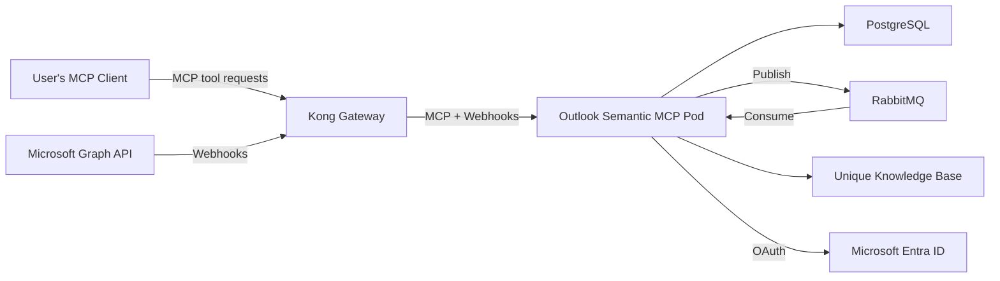

<!-- confluence-page-id: 2065694735 -->
<!-- confluence-space-key: PUBDOC -->

# Outlook Semantic MCP — Operator Manual

## Overview

The Outlook Semantic MCP Server exposes MCP tools that allow AI assistants to search and retrieve email content. In `MicrosoftGraphAndUniqueApi` mode (the default), it also runs background pipelines that ingest emails from connected Microsoft 365 accounts into the Unique knowledge base via Microsoft Graph webhooks and RabbitMQ. In `MicrosoftGraph` mode, no ingestion runs — emails are queried live from Microsoft Graph.

For end-user and administrator documentation, see the [Outlook Semantic MCP Overview](../README.md).

## Architecture

The diagram below shows the full **Mode A** (`MicrosoftGraphAndUniqueApi`) topology. In Mode B (`MicrosoftGraph`), all infrastructure components are identical — the Unique Knowledge Base is still required in both modes (for scope management and to attach email attachments to outgoing emails), but the ingestion arrows are inactive and no email content is written to it.

The Outlook Semantic MCP Server runs as a **single pod** that handles MCP tool requests, receives Microsoft Graph webhook notifications, processes email via RabbitMQ consumers, stores state in PostgreSQL, and ingests email content into the Unique knowledge base.

## Quick Start

### Unique SaaS

After [granting admin consent](https://login.microsoftonline.com/organizations/adminconsent?client_id=ba326974-edcf-49ef-bf7a-74b3e0ea450a) (see [Authentication](./authentication.md#unique-saas) for why this is needed), provide the following to Unique Support or Solution Engineering:

- [ ] **Backend mode** — controls how email search works; see [Deployment Modes](./configuration.md#Deployment-Modes) for the full trade-offs:
  - `MicrosoftGraph` — live KQL search directly against Microsoft Graph; no email ingestion into Unique KB; lighter deployment
  - `MicrosoftGraphAndUniqueApi` *(default)* — emails ingested into Unique KB; semantic search merged with live KQL results; heavier but richer

- [ ] **Delegated access scan** — only relevant if your organization uses Exchange mailbox delegation (i.e. users who have been granted access to another user's mailbox or folders); see [`DELEGATED_ACCESS_SCAN`](./configuration.md#DELEGATED_ACCESS_SCAN):
  - `disabled` *(default)* — no delegation scanning
  - `fullAccessOnly` — Full Access (Read & Manage) grants via Exchange admin
  - `granularAccess` — folder-level grants (e.g. shared Inbox or RFQ folder); subsumes `fullAccessOnly`

Unique will configure your deployment using the following process:

1. Create a Zitadel service account for the MCP in your organization — see [Zitadel Service Account](./configuration.md#Zitadel-Service-Account) for the required permissions
2. Deploy the MCP to your tenant and configure it according to your needs — see [Deployment Guide](./deployment.md)
3. The MCP server endpoint URL will be sent to you once everything is configured

For full configuration capabilities, see the [Configuration Guide](./configuration.md).

### Self-Hosted

Follow these steps to go from zero to a running deployment:

1. **Register Microsoft Entra ID application** — Create an app registration with the required delegated permissions. See [Authentication Guide](./authentication.md).
2. **Create Zitadel service account** — Create a service user and assign the required permissions. Required for both `cluster_local` and `external` auth modes in both Mode A and Mode B. See [Zitadel Service Account](./configuration.md#Zitadel-Service-Account) for setup and [required permissions](./configuration.md#Service-Account-Permissions).
3. **Provision infrastructure** — Set up PostgreSQL 17+, RabbitMQ 4+, and a Kubernetes namespace. See [Deployment — Prerequisites](./deployment.md#Prerequisites).
4. **Create Kubernetes secrets** — Generate cryptographic secrets and store them as Kubernetes Secrets. See [Deployment — Required Secrets](./deployment.md#Required-Secrets).
5. **Configure Helm values** — Create a `values.yaml` with your secrets, Microsoft client ID, and Unique API endpoints. See [Configuration Guide](./configuration.md).

   > **Key decisions:** Set `MCP_BACKEND` (see [Deployment Modes](./deployment.md#Deployment-Modes)) and optionally `DELEGATED_ACCESS_SCAN` (see [Configuration](./configuration.md#DELEGATED_ACCESS_SCAN)).

6. **Deploy with Helm** — Install the chart. See [Deployment — Install](./deployment.md#Install).
7. **Security checklist** — Before going to production, verify the following:

   - [ ] `ENCRYPTION_KEY` is a cryptographically random 64-character hex string
   - [ ] `AUTH_HMAC_SECRET` is a cryptographically random 64-character hex string
   - [ ] `MICROSOFT_WEBHOOK_SECRET` is a cryptographically random 128-character string
   - [ ] See [Configuration — Required Secrets](./configuration.md#Required-Secrets) for generation commands and format details
   - [ ] All secrets stored in Kubernetes Secrets (not ConfigMaps)
   - [ ] TLS termination configured at ingress
   - [ ] Network policies restrict pod-to-pod communication
   - [ ] Log aggregation in place (tokens are not logged)
   - [ ] Monitoring alerts configured for authentication failures

   For the full security architecture, see [Security Documentation](../technical/security.md). For a breakdown of what data is stored where, see [Data Classification and Flow](../technical/security.md#Data-Classification-and-Flow).

8. **Verify** the deployment is working:
   1. Check the OAuth metadata endpoint: `curl https://<your-domain>/.well-known/oauth-authorization-server`
   2. Connect with an MCP client and complete the OAuth flow
   3. *(Mode A only)* Call `verify_inbox_connection` to confirm the webhook subscription is `active`, draft a test email to the connected account, wait a moment, then use `search_emails` to confirm it appears
   5. *(Mode B only)* Draft a test email to the connected account, call `search_emails` with a simple KQL query to confirm it returns results from Microsoft Graph
9. **(Optional) Enable delegated access** — If your organization uses Exchange mailbox delegation (Full Access or folder-level), set `delegatedAccessScan` to `fullAccessOnly` or `granularAccess` in your Helm values. Both users (delegate and owner) must connect their accounts for delegated search to work. See [Configuration — DELEGATED_ACCESS_SCAN](./configuration.md#DELEGATED_ACCESS_SCAN).

## Scaling Considerations

- **Directory sync** processes a maximum of 10 users per scheduled run (every 5 minutes, configurable via `DIRECTORY_SYNC_CRON_SCHEDULE`). For large deployments with many connected users, account for the fact that folder sync updates are distributed across multiple runs.

## Documentation

| Document | Description |
|----------|-------------|
| [Deployment](./deployment.md) | Kubernetes deployment, Helm charts, database migration |
| [Configuration](./configuration.md) | Environment variables, Helm values, service auth modes |
| [Authentication](./authentication.md) | Microsoft Entra ID app registration, OAuth setup |
| [Local Development](./local-development.md) | Setting up a development environment |
| [Disaster Recovery](./disaster-recovery.md) | Recovery runbook for DB, RabbitMQ, and Knowledge Base failures |
| [FAQ](../faq.md) | Frequently asked questions and common mistakes |
