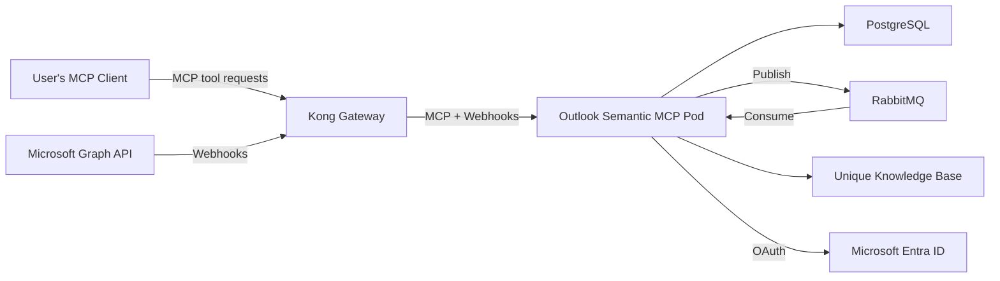

<!-- confluence-page-id: 2065694735 -->
<!-- confluence-space-key: PUBDOC -->

# Operator Manual

## Overview

This guide provides IT operators with the technical information needed to deploy, configure, and maintain the Outlook Semantic MCP Server.

**Note:** The Outlook Semantic MCP Server is a semantic MCP server. It exposes MCP tools that allow AI assistants to search and retrieve email content. It also runs background consumers that ingest emails from connected Microsoft 365 accounts into the Unique knowledge base via Microsoft Graph webhooks and RabbitMQ.

For end-user and administrator documentation, see the [Outlook Semantic MCP Overview](../README.md).

## Documentation

| Document | Description |
|----------|-------------|
| [Deployment](./deployment.md) | Kubernetes deployment, Helm charts, database migration |
| [Configuration](./configuration.md) | Environment variables, Helm values, service auth modes |
| [Authentication](./authentication.md) | Microsoft Entra ID app registration, OAuth setup |
| [Local Development](./local-development.md) | Setting up a development environment |
| [Disaster Recovery](./disaster-recovery.md) | Recovery runbook for DB, RabbitMQ, and Knowledge Base failures |
| [FAQ](../faq.md) | Frequently asked questions and common mistakes |

## Architecture Overview

The Outlook Semantic MCP Server runs as a **single pod** that handles MCP tool requests, receives Microsoft Graph webhook notifications, processes email via RabbitMQ consumers, stores state in PostgreSQL, and ingests email content into the Unique knowledge base.

## Quick Start

Follow these steps to go from zero to a running deployment:

1. **Register Microsoft Entra ID application** — Create an app registration with the required delegated permissions. See [Authentication Guide](./authentication.md).
2. **Create Zitadel service account** — Create a service user with the `KB_Admin` role in Zitadel. Required for both `cluster_local` and `external` auth modes. See [Zitadel Service Account](./configuration.md#zitadel-service-account).
3. **Provision infrastructure** — Set up PostgreSQL 17+, RabbitMQ 4+, and a Kubernetes namespace. See [Deployment — Prerequisites](./deployment.md#prerequisites).
4. **Create Kubernetes secrets** — Generate cryptographic secrets and store them as Kubernetes Secrets. See [Deployment — Required Secrets](./deployment.md#required-secrets).
5. **Configure Helm values** — Create a minimal `values.yaml` with your secrets, Microsoft client ID, and Unique API endpoints. See [Configuration Guide](./configuration.md).
6. **Deploy with Helm** — Install the chart. See [Deployment — Install](./deployment.md#install).
7. **Verify** the deployment is working:
   1. Check the OAuth metadata endpoint: `curl https://<your-domain>/.well-known/oauth-authorization-server`
   2. Connect with an MCP client and complete the OAuth flow
   3. Call `verify_inbox_connection` to confirm the webhook subscription is `active`
   4. Send a test email to the connected account, wait a moment, then use `search_emails` to confirm it appears

## Infrastructure Requirements

See [Deployment — Prerequisites](./deployment.md#prerequisites) for the full infrastructure requirements and version details.

## Deployment Checklist

1. **Infrastructure**

   - [ ] PostgreSQL database provisioned
   - [ ] RabbitMQ instance running
   - [ ] Kubernetes namespace created
   - [ ] Kong route configured for public access
   - [ ] DNS hostname configured

2. **Microsoft Entra ID**

   - [ ] App registration created ([Authentication Guide](./authentication.md))
   - [ ] Delegated permissions granted
   - [ ] Client secret generated

3. **Application**

   - [ ] Kubernetes secrets created
   - [ ] Helm values configured ([Configuration Guide](./configuration.md))
   - [ ] Helm chart deployed ([Deployment Guide](./deployment.md))
   - [ ] Database migration — runs automatically via Helm hook; verify post-deploy

4. **Verification**

   - [ ] OAuth flow works end-to-end
   - [ ] Webhook endpoint accessible from Microsoft
   - [ ] Test email appears in search results

## Security Checklist

Before going to production, verify the following:

- [ ] `ENCRYPTION_KEY` is a cryptographically random 64-character hex string
- [ ] `AUTH_HMAC_SECRET` is a cryptographically random 64-character hex string
- [ ] `MICROSOFT_WEBHOOK_SECRET` is a cryptographically random 128-character string
- [ ] See [Configuration — Required Secrets](./configuration.md#required-secrets) for generation commands and format details
- [ ] All secrets stored in Kubernetes Secrets (not ConfigMaps)
- [ ] TLS termination configured at ingress
- [ ] Network policies restrict pod-to-pod communication
- [ ] Log aggregation in place (tokens are not logged)
- [ ] Monitoring alerts configured for authentication failures

For the full security architecture, see [Security Documentation](../technical/security.md). For a breakdown of what data is stored where, see [Data Classification and Flow](../technical/security.md#data-classification-and-flow).

## Scaling Considerations

- **Directory sync** processes a maximum of 10 users per scheduled run (every 5 minutes). For large deployments with many connected users, account for the fact that folder sync updates are distributed across multiple runs.
