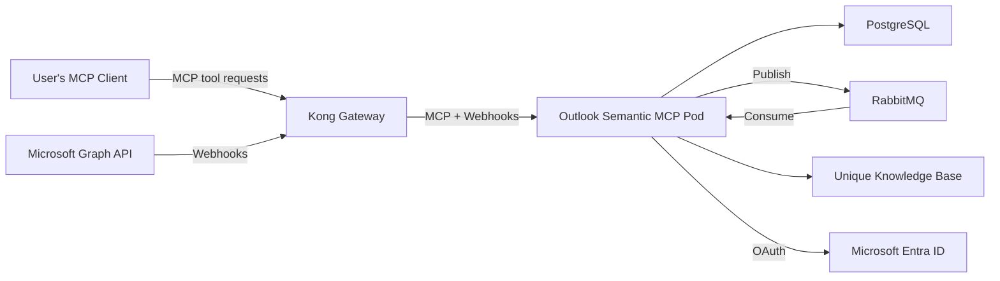

<!-- confluence-page-id: 2065694735 -->
<!-- confluence-space-key: PUBDOC -->

# Operator Manual

## Overview

This guide provides IT operators with the technical information needed to deploy, configure, and maintain the Outlook Semantic MCP Server.

**Note:** The Outlook Semantic MCP Server is a semantic MCP server. It exposes MCP tools that allow AI assistants to search and retrieve email content. It also runs background consumers that ingest emails from connected Microsoft 365 accounts into the Unique knowledge base via Microsoft Graph webhooks and RabbitMQ.

For end-user and administrator documentation, see the [Outlook Semantic MCP Overview](../README.md).

## Documentation

| Document | Description |
|----------|-------------|
| [Deployment](./deployment.md) | Kubernetes deployment, Helm charts, database migration |
| [Configuration](./configuration.md) | Environment variables, Helm values, service auth modes |
| [Authentication](./authentication.md) | Microsoft Entra ID app registration, OAuth setup |
| [Local Development](./local-development.md) | Setting up a development environment |
| [FAQ](../faq.md) | Frequently asked questions and common mistakes |

## Architecture Overview

The Outlook Semantic MCP Server runs as a **single pod** that handles MCP tool requests, receives Microsoft Graph webhook notifications, processes email via RabbitMQ consumers, stores state in PostgreSQL, and ingests email content into the Unique knowledge base.

## Infrastructure Requirements

| Component | Requirement | Notes |
|-----------|-------------|-------|
| **Kubernetes** | 1.25+ | Any Kubernetes distribution |
| **PostgreSQL** | 17+ | Managed service recommended |
| **RabbitMQ** | 4+ | With management plugin |
| **Kong Gateway** | 3+ | Handles ingress and TLS termination |
| **DNS** | Public hostname | Required for Microsoft webhook callbacks |

## Deployment Checklist

1. **Infrastructure**

   - [ ] PostgreSQL database provisioned
   - [ ] RabbitMQ instance running
   - [ ] Kubernetes namespace created
   - [ ] Kong route configured for public access
   - [ ] DNS hostname configured

2. **Microsoft Entra ID**

   - [ ] App registration created ([Authentication Guide](./authentication.md))
   - [ ] Delegated permissions granted
   - [ ] Client secret generated

3. **Application**

   - [ ] Kubernetes secrets created
   - [ ] Helm values configured ([Configuration Guide](./configuration.md))
   - [ ] Helm chart deployed ([Deployment Guide](./deployment.md))
   - [ ] Database migration run

4. **Verification**

   - [ ] OAuth flow works end-to-end
   - [ ] Webhook endpoint accessible from Microsoft
   - [ ] Test email appears in search results
