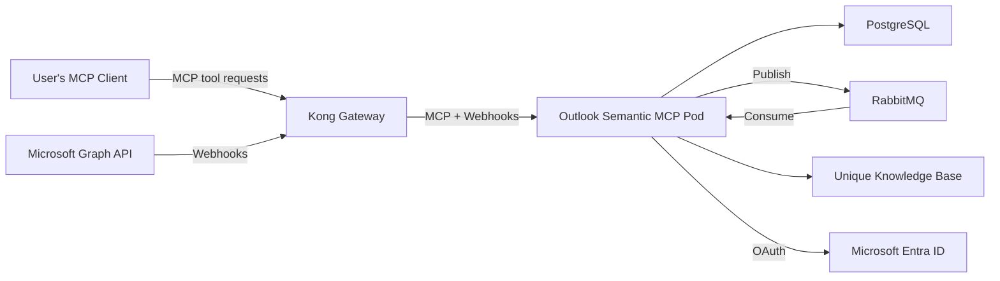

<!-- confluence-page-id: 2065694735 -->
<!-- confluence-space-key: PUBDOC -->

# Outlook Semantic MCP - Operator Manual

## Overview

This guide provides IT operators with the technical information needed to deploy, configure, and maintain the Outlook Semantic MCP Server.

**Note:** The Outlook Semantic MCP Server is a semantic MCP server. It exposes MCP tools that allow AI assistants to search and retrieve email content. In `MicrosoftGraphAndUniqueApi` mode (the default), it also runs background pipelines that ingest emails from connected Microsoft 365 accounts into the Unique knowledge base via Microsoft Graph webhooks and RabbitMQ. In `MicrosoftGraph` mode, no ingestion runs — emails are queried live from Microsoft Graph.

For end-user and administrator documentation, see the [Outlook Semantic MCP Overview](../README.md).

## Deployment Modes

The server supports two deployment modes set via `MCP_BACKEND`. **Choose your mode before following any other step in this guide** — prerequisites, configuration, and verification differ by mode.

| | `MicrosoftGraphAndUniqueApi` (default) | `MicrosoftGraph` |
|---|---|---|
| Search | Semantic (Unique KB) + KQL (Graph), merged | KQL (Graph) only |
| Ingestion | Full sync + live catch-up | None |
| Tools | 10 standard + 4 debug | 6 standard |
| Requires Unique KB | Yes | Yes |
| Requires RabbitMQ | Yes | Yes |
| Folder filtering | Supported | Not supported |

See [Configuration — MCP_BACKEND](./configuration.md#MCP_BACKEND) for details.

## Documentation

| Document | Description |
|----------|-------------|
| [Deployment](./deployment.md) | Kubernetes deployment, Helm charts, database migration |
| [Configuration](./configuration.md) | Environment variables, Helm values, service auth modes |
| [Authentication](./authentication.md) | Microsoft Entra ID app registration, OAuth setup |
| [Local Development](./local-development.md) | Setting up a development environment |
| [Disaster Recovery](./disaster-recovery.md) | Recovery runbook for DB, RabbitMQ, and Knowledge Base failures |
| [FAQ](../faq.md) | Frequently asked questions and common mistakes |

## Architecture Overview

The diagram below shows the full **Mode A** (`MicrosoftGraphAndUniqueApi`) topology. In Mode B (`MicrosoftGraph`), all infrastructure components are identical but the ingestion arrows to the Unique Knowledge Base are inactive — no email content is indexed.

The Outlook Semantic MCP Server runs as a **single pod** that handles MCP tool requests, receives Microsoft Graph webhook notifications, processes email via RabbitMQ consumers, stores state in PostgreSQL, and ingests email content into the Unique knowledge base.

## Quick Start

Follow these steps to go from zero to a running deployment:

### Mode A: MicrosoftGraphAndUniqueApi

1. **Register Microsoft Entra ID application** — Create an app registration with the required delegated permissions. See [Authentication Guide](./authentication.md).
2. **Create Zitadel service account** — Create a service user with the `KB_Admin` role in Zitadel. Required for both `cluster_local` and `external` auth modes. See [Zitadel Service Account](./configuration.md#Zitadel-Service-Account).
3. **Provision infrastructure** — Set up PostgreSQL 17+, RabbitMQ 4+, and a Kubernetes namespace. See [Deployment — Prerequisites](./deployment.md#Prerequisites).
4. **Create Kubernetes secrets** — Generate cryptographic secrets and store them as Kubernetes Secrets. See [Deployment — Required Secrets](./deployment.md#Required-Secrets).
5. **Configure Helm values** — Create a minimal `values.yaml` with your secrets, Microsoft client ID, and Unique API endpoints. See [Configuration Guide](./configuration.md).
6. **Deploy with Helm** — Install the chart. See [Deployment — Install](./deployment.md#Install).
7. **Verify** the deployment is working:
   1. Check the OAuth metadata endpoint: `curl https://<your-domain>/.well-known/oauth-authorization-server`
   2. Connect with an MCP client and complete the OAuth flow
   3. Call `verify_inbox_connection` to confirm the webhook subscription is `active`
   4. Send a test email to the connected account, wait a moment, then use `search_emails` to confirm it appears
8. **(Optional) Enable delegated access** — If your organization uses Exchange mailbox delegation (Full Access or folder-level), set `delegatedAccessScan` to `fullAccessOnly` or `granularAccess` in your Helm values. Both users (delegate and owner) must connect their accounts for delegated search to work. See [Configuration — DELEGATED_ACCESS_SCAN](./configuration.md#DELEGATED_ACCESS_SCAN).

### Mode B: MicrosoftGraph

1. **Register Microsoft Entra ID application** — same as Mode A. See [Authentication Guide](./authentication.md).
2. **Provision infrastructure** — PostgreSQL 17+, RabbitMQ 4+, and Unique Knowledge Base (all three are required, same as Mode A). See [Deployment — Prerequisites](./deployment.md#Prerequisites).
3. **Create Kubernetes secrets** — same as Mode A. `UNIQUE_ZITADEL_CLIENT_SECRET` is only needed when using `external` service auth mode.
4. **Configure Helm values** — set `mcpConfig.app.mcpBackend: MicrosoftGraph`. Include `mcpConfig.unique` (required). Omit `mcpConfig.ingestion` entirely. See [Mode B Minimal Values Example](./configuration.md#Mode-B-Minimal-Values-Example).
5. **Deploy with Helm** — same command as Mode A. See [Deployment — Install](./deployment.md#Install).
6. **Verify** the deployment is working:
   1. Check the OAuth metadata endpoint: `curl https://<your-domain>/.well-known/oauth-authorization-server`
   2. Connect with an MCP client and complete the OAuth flow
   3. Call `search_emails` with a simple KQL query to confirm it returns results from Microsoft Graph.

## Infrastructure Requirements

See [Deployment — Prerequisites](./deployment.md#Prerequisites) for the full infrastructure requirements and version details.

## Deployment Checklist

1. **Infrastructure**

   - [ ] PostgreSQL database provisioned *(Both modes)*
   - [ ] RabbitMQ instance running *(Both modes)*
   - [ ] Kubernetes namespace created *(Both modes)*
   - [ ] Kong route configured for public access *(Both modes)*
   - [ ] DNS hostname configured *(Both modes)*

2. **Microsoft Entra ID**

   - [ ] App registration created ([Authentication Guide](./authentication.md)) *(Both modes)*
   - [ ] Delegated permissions granted *(Both modes)*
   - [ ] Client secret generated *(Both modes)*

3. **Application**

   - [ ] Kubernetes secrets created *(Both modes)*
   - [ ] Helm values configured ([Configuration Guide](./configuration.md)) *(Both modes)*
   - [ ] Helm chart deployed ([Deployment Guide](./deployment.md)) *(Both modes)*
   - [ ] Database migration — runs automatically via Helm hook; verify post-deploy *(Both modes)*
   - [ ] `DELEGATED_ACCESS_SCAN` configured if using Exchange mailbox delegation *(Mode A optional)*

4. **Verification**

   - [ ] OAuth flow works end-to-end *(Both modes)*
   - [ ] Webhook endpoint accessible from Microsoft *(Mode A only)*
   - [ ] Test email appears in search results *(Mode A: via `sync_progress` after full sync. Mode B: immediately after OAuth.)*

## Security Checklist

Before going to production, verify the following:

- [ ] `ENCRYPTION_KEY` is a cryptographically random 64-character hex string
- [ ] `AUTH_HMAC_SECRET` is a cryptographically random 64-character hex string
- [ ] `MICROSOFT_WEBHOOK_SECRET` is a cryptographically random 128-character string
- [ ] See [Configuration — Required Secrets](./configuration.md#Required-Secrets) for generation commands and format details
- [ ] All secrets stored in Kubernetes Secrets (not ConfigMaps)
- [ ] TLS termination configured at ingress
- [ ] Network policies restrict pod-to-pod communication
- [ ] Log aggregation in place (tokens are not logged)
- [ ] Monitoring alerts configured for authentication failures

For the full security architecture, see [Security Documentation](../technical/security.md). For a breakdown of what data is stored where, see [Data Classification and Flow](../technical/security.md#Data-Classification-and-Flow).

## Scaling Considerations

- **Directory sync** processes a maximum of 10 users per scheduled run (every 5 minutes). For large deployments with many connected users, account for the fact that folder sync updates are distributed across multiple runs.
