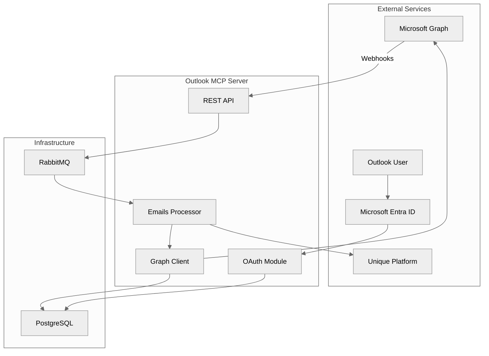
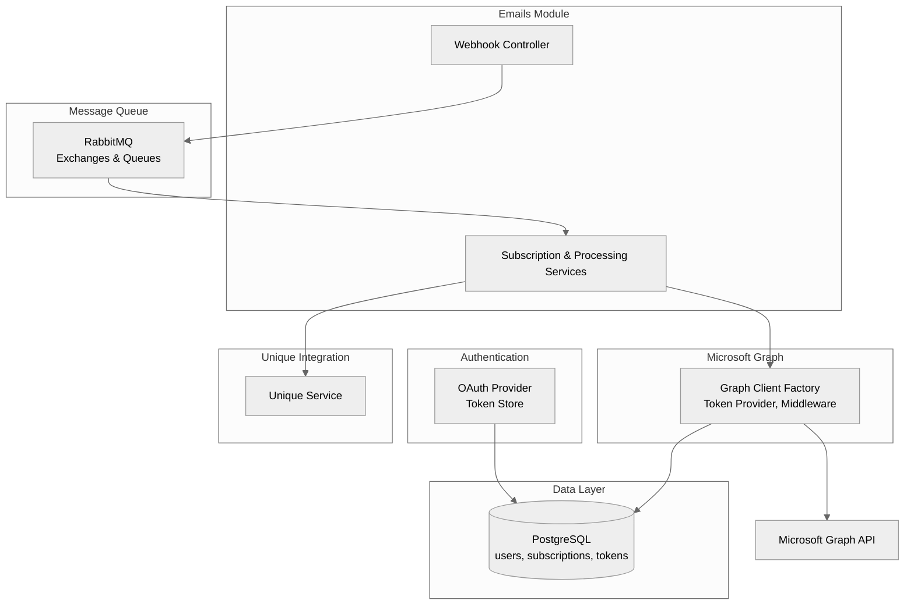
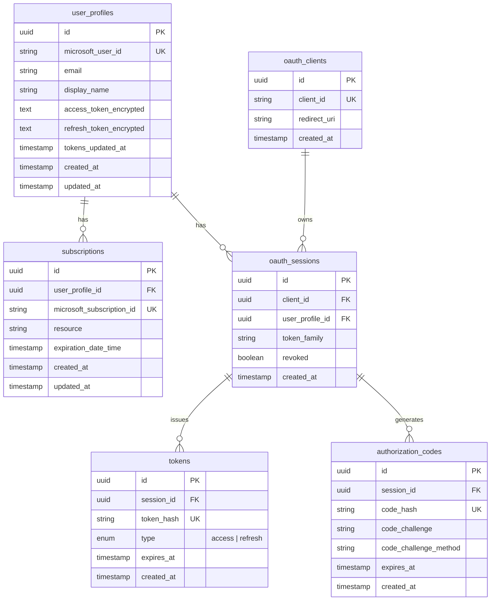
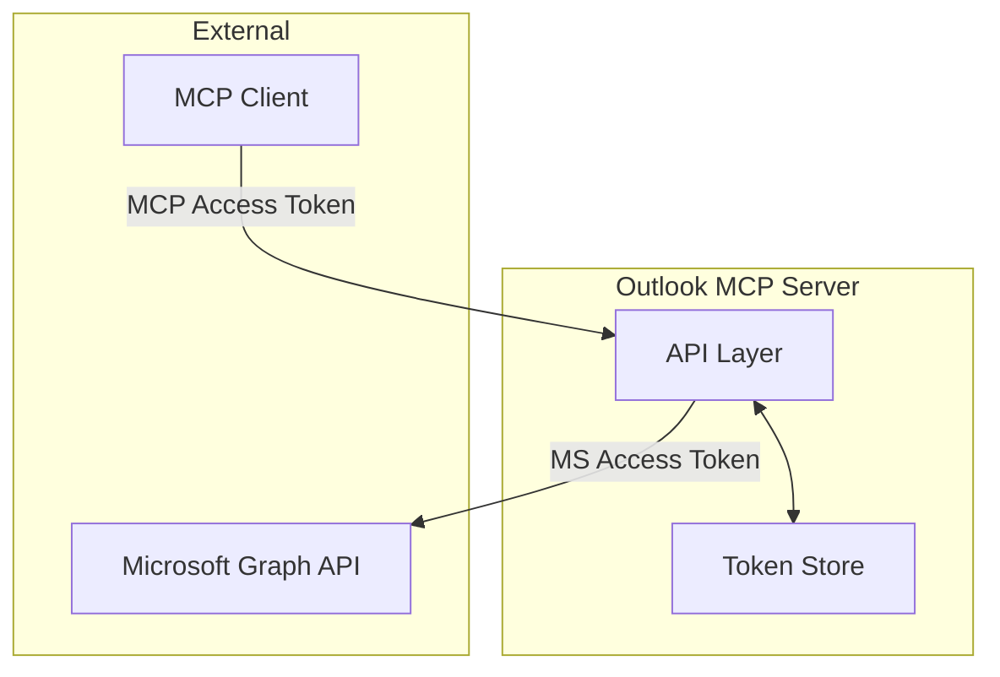

<!-- confluence-page-id: -1 -->
<!-- confluence-space-key: PUBDOC -->

The Outlook MCP Server is a NestJS-based microservice that integrates Microsoft Outlook elmails with the Unique platform through the Model Context Protocol (MCP).

**Core Capabilities:**

- Sync emails from Outlook
- Allow user to send emails
- Manages webhook subscriptions to Microsoft Graph API for notifications
- Handles OAuth2 authentication with Microsoft Entra ID
- Ingests content into the Unique platform with participant-based access controls
- Manages subscription lifecycle (create, renew, remove) with scheduled synchronization

## High-Level Architecture

## Components

### Component Descriptions

| Component | Purpose |
|-----------|---------|
| **Microsoft OAuth Provider** | Handles OAuth2 flow with Microsoft Entra ID |
| **MCP OAuth Store** | Stores encrypted JWT tokens in PostgreSQL |
| **Token Provider** | Manages access/refresh tokens with automatic refresh |
| **Graph Client Factory** | Creates authenticated Microsoft Graph API clients |
| **Webhook Controller** | Receives notifications from Microsoft Graph |
| **Subscription Services** | Manages Graph API subscription lifecycle |
| **Transcript Created Service** | Processes new transcripts |
| **Unique Service** | Interfaces with Unique Public API for content ingestion |
| **AMQP Module** | RabbitMQ integration for async message processing |

## Infrastructure

### PostgreSQL

Stores persistent data with the following schema:

| Table | Purpose |
|-------|---------|
| `user_profiles` | User identity and encrypted Microsoft tokens |
| `subscriptions` | Active Graph API webhook subscriptions |
| `oauth_clients` | Registered MCP OAuth clients |
| `oauth_sessions` | Active OAuth sessions with token family tracking |
| `tokens` | MCP access and refresh tokens (hashed) |
| `authorization_codes` | Temporary OAuth authorization codes with PKCE |

**Key Design Decisions:**

- **Token Family Tracking**: Each session has a `token_family` ID. If a refresh token is reused (indicating possible theft), the entire family is revoked.
- **Encrypted Microsoft Tokens**: Access and refresh tokens from Microsoft are encrypted at rest using AES-GCM.
- **Hashed MCP Tokens**: MCP tokens are stored as hashes, not plaintext, for cache-based validation.

### RabbitMQ

Enables asynchronous processing of webhook notifications. See [FAQ - Why use RabbitMQ for webhook processing?](../faq.md#why-use-rabbitmq-for-webhook-processing) for details.

| Exchange | Type | Purpose |
|----------|------|---------|
| `unique.outlook-semantic-mcp.main` | topic | Primary message routing |
| `unique.outlook-semantic-mcp.dead` | topic | Failed message storage (DLX) |

| Queue | Purpose |
|-------|---------|
| `unique.outlook-semantic-mcp.transcript.change-notifications` | Transcript processing |
| `unique.outlook-semantic-mcp.transcript.lifecycle-notifications` | Subscription management |
| `unique.outlook-semantic-mcp.dead` | Dead letter collection |

## Authentication Architecture

The Outlook MCP service handles **two layers of authentication**:

1. **MCP OAuth** - Authentication between MCP clients and this server
2. **Microsoft OAuth** - Authentication with Microsoft Entra ID for Graph API access

### Token Isolation

**Critical Security Design:** Microsoft OAuth tokens (access and refresh) are **never exposed to clients**. The OAuth flow happens entirely on the server:

1. **Microsoft OAuth Flow**: User authenticates with Microsoft Entra ID
2. **Token Exchange**: Server exchanges authorization code for Microsoft tokens (using `CLIENT_SECRET`)
3. **Token Storage**: Microsoft tokens are encrypted and stored on the server only
4. **Client Authentication**: Server issues separate opaque JWT tokens to the client for MCP API access

This design ensures that:
- Microsoft tokens never leave the server
- Clients cannot access Microsoft Graph API directly
- All Microsoft API calls are made by the server on behalf of authenticated users
- Client tokens are opaque JWTs that only authenticate with the MCP server

### Token Storage

| Token Type | Source | Storage Location | Client Access |
|------------|--------|------------------|---------------|
| Access Token | Microsoft Entra ID | Encrypted in `user_profiles` table | **Never** |
| Refresh Token | Microsoft Entra ID | Encrypted in `user_profiles` table | **Never** |

**Required Scopes:** See [Microsoft Graph Permissions](./permissions.md) for the complete list with least-privilege justification.

### Token Encryption

All Microsoft tokens are encrypted at rest using **AES-GCM** (authenticated encryption) with a 256-bit key stored in environment variables.

### Single App Registration Architecture

Each MCP server deployment uses **one Microsoft Entra ID app registration**:

- **Single App Registration**: One `CLIENT_ID`/`CLIENT_SECRET` pair per deployment
- **Multi-Tenant Capable**: The app registration can be configured to accept users from multiple Microsoft tenants
- **Cross-Tenant Authentication**: Users from different organizations authenticate via Enterprise Applications in their tenant that reference the original app registration
- **Enterprise Application Creation**: When tenant admin grants consent, Microsoft creates an Enterprise Application in their tenant as a proxy to the original app registration

This design uses a single OAuth application that can serve users across multiple tenants, rather than requiring separate app registrations per organization.

For detailed explanation, see [Permissions - Why Delegated (Not Application)](./permissions.md#why-delegated-not-application-permissions).

### Required App Registration Components

| Component | Purpose | Security Function |
|-----------|---------|-------------------|
| `CLIENT_ID` | Application identifier | Identifies which app is requesting access |
| `CLIENT_SECRET` | Application credential | Proves the server is the legitimate app (not an imposter) |
| **Redirect URI** | OAuth callback endpoint | Prevents authorization code interception |
| **API Permissions** | Graph scopes | Limits what data the app can access |
| **Admin Consent** | Privileged scopes | Required for transcript access |

Without proper app registration, Microsoft Graph API will reject all authentication attempts with `invalid_client` errors.

### Unsupported Authentication Methods

| Method | Supported | Reason |
|--------|-----------|--------|
| Client Secret + Delegated | **Yes** | Standard OAuth2 flow for user-specific access |
| Client Credentials (OIDC) | **No** | No user context; requires admin policy setup |
| Certificate Authentication | **No** | Only works with Client Credentials flow |
| Federated Identity | **No** | Only works with Client Credentials flow |
| Multiple App Registrations | **No** | Each MCP server deployment uses one Entra ID app registration |

The Outlook MCP service requires **delegated permissions** to access user-specific resources. Client Credentials flow only supports application permissions, which would require tenant admins to create Application Access Policies via PowerShell—impractical for self-service MCP connections.

**See also:**

- [Microsoft Entra ID - Authentication flows](https://learn.microsoft.com/en-us/entra/identity-platform/msal-authentication-flows)
- [Microsoft Graph - Get access on behalf of a user](https://learn.microsoft.com/en-us/graph/auth-v2-user)

### MCP OAuth (Internal)

The MCP OAuth layer implements the [MCP Authorization specification](https://modelcontextprotocol.io/specification/2025-03-26/basic/authorization):

- **OAuth 2.1 Authorization Code + PKCE** flow
- **Refresh token rotation** with family-based revocation for theft detection
- **Cache-first token validation** (no introspection endpoint)
- **Token cleanup** for expired tokens

| Token Type | Default TTL | Purpose |
|------------|-------------|---------|
| Access Token | 60 seconds | Short-lived API access |
| Refresh Token | 30 days | Obtain new access tokens |

### Configuration Reference

| Variable | Default | Description |
|----------|---------|-------------|
| `AUTH_ACCESS_TOKEN_EXPIRES_IN_SECONDS` | 60 | MCP access token TTL |
| `AUTH_REFRESH_TOKEN_EXPIRES_IN_SECONDS` | 2592000 | MCP refresh token TTL (30 days) |
| `AUTH_HMAC_SECRET` | (required) | 64-char hex for JWT signing |
| `ENCRYPTION_KEY` | (required) | 64-char hex for AES-GCM encryption |

## Related Documentation

- [Flows](./flows.md) - User connection, subscription lifecycle, transcript processing
- [Security](./security.md) - Encryption, authentication, and threat model
- [Microsoft Graph Permissions](./permissions.md) - Required scopes and least-privilege justification

## Standard References

- [Microsoft Graph API](https://learn.microsoft.com/en-us/graph/overview) - Graph API overview
- [PostgreSQL Documentation](https://www.postgresql.org/docs/) - PostgreSQL official docs
- [RabbitMQ Documentation](https://www.rabbitmq.com/documentation.html) - RabbitMQ official docs
- [NestJS Documentation](https://docs.nestjs.com/) - NestJS framework docs
