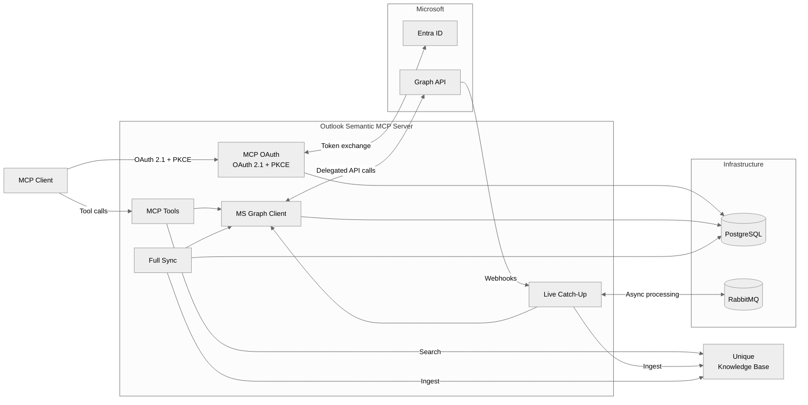
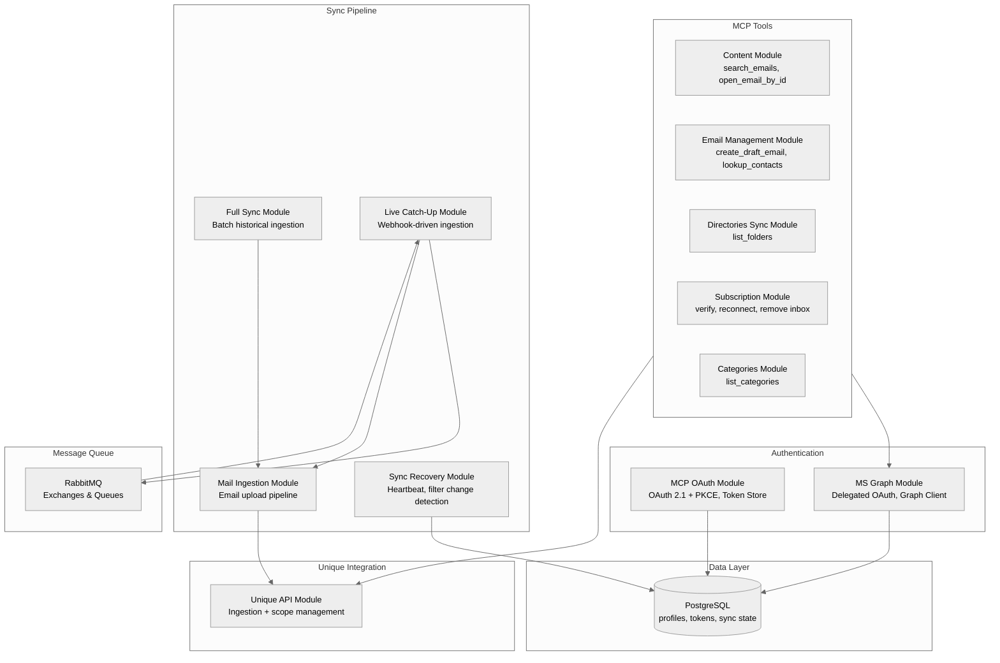
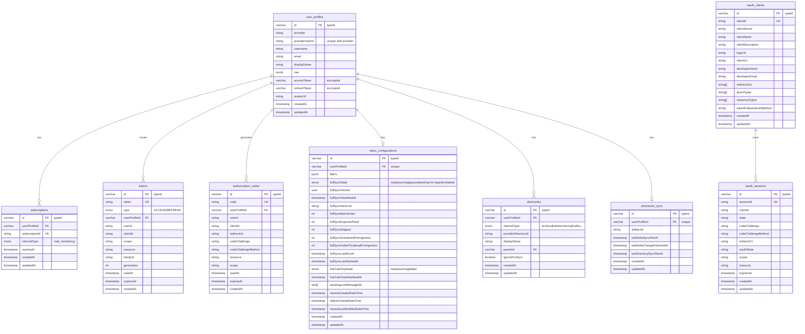
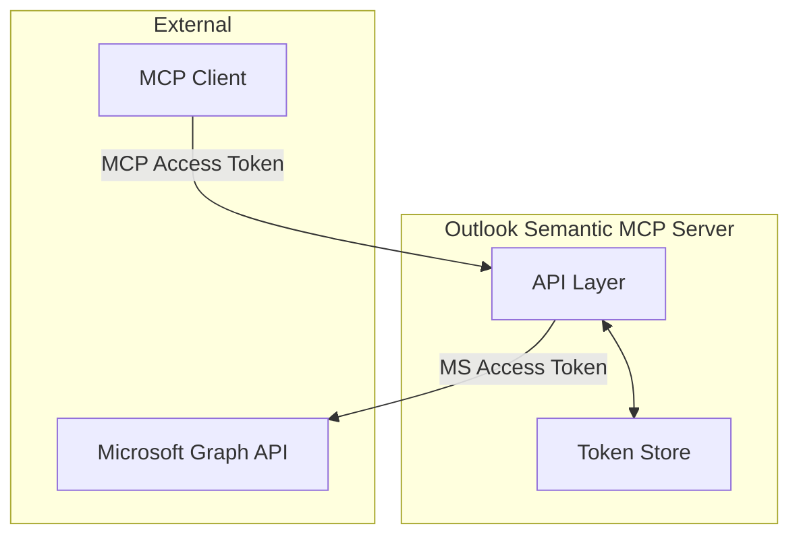
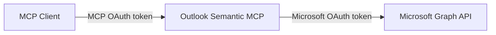

<!-- confluence-page-id: 2062254116 -->
<!-- confluence-space-key: PUBDOC -->

# Architecture

The Outlook Semantic MCP Server is a NestJS-based microservice that integrates Microsoft Outlook email with the Unique platform through the Model Context Protocol (MCP). It syncs emails from connected mailboxes into the Unique knowledge base and exposes 10 MCP tools (plus 4 debug-mode tools) for AI-assisted email search, draft creation, and contact lookup.

**Core Capabilities:**

- Syncs historical and live email from Microsoft Outlook via Microsoft Graph API
- Manages webhook subscriptions for real-time email notifications
- Handles OAuth 2.1 + PKCE authentication for MCP clients (MCP OAuth layer)
- Handles delegated Microsoft OAuth for Graph API access
- Ingests email content into the Unique platform with folder-based scope management
- Provides 10 MCP tools (plus 4 debug-mode tools): email search, draft creation, contact lookup, folder listing, inbox management, and sync monitoring

## High-Level Architecture

```mermaid
%%{init: {'theme': 'neutral', 'themeVariables': { 'fontSize': '14px' }}}%%
flowchart LR
    MCPClient["MCP Client"]

    subgraph OutlookMCP["Outlook Semantic MCP Server"]
        McpOAuth["MCP OAuth\nOAuth 2.1 + PKCE"]
        McpTools["MCP Tools"]
        GraphClient["MS Graph Client"]
        FullSync["Full Sync"]
        LiveCatchUp["Live Catch-Up"]
    end

    subgraph Infra["Infrastructure"]
        DB[("PostgreSQL")]
        MQ[("RabbitMQ")]
    end

    subgraph Microsoft["Microsoft"]
        EntraID["Entra ID"]
        MSGraph["Graph API"]
    end

    UniqueKB["Unique\nKnowledge Base"]

    MCPClient -->|"OAuth 2.1 + PKCE"| McpOAuth
    MCPClient -->|"Tool calls"| McpTools

    McpOAuth <-->|"Token exchange"| EntraID
    McpOAuth --> DB

    McpTools --> GraphClient
    McpTools -->|"Search"| UniqueKB

    GraphClient <-->|"Delegated API calls"| MSGraph
    GraphClient --> DB

    MSGraph -->|"Webhooks"| LiveCatchUp
    LiveCatchUp <-->|"Async processing"| MQ
    LiveCatchUp --> GraphClient
    LiveCatchUp -->|"Ingest"| UniqueKB

    FullSync --> GraphClient
    FullSync -->|"Ingest"| UniqueKB
    FullSync --> DB
```

## Components

```mermaid
%%{init: {'theme': 'neutral', 'themeVariables': { 'fontSize': '14px' }}}%%
flowchart TB
    subgraph Auth["Authentication"]
        McpOAuthMod["MCP OAuth Module<br/>OAuth 2.1 + PKCE, Token Store"]
        MsGraphMod["MS Graph Module<br/>Delegated OAuth, Graph Client"]
    end

    subgraph Tools["MCP Tools"]
        ContentMod["Content Module<br/>search_emails, open_email_by_id"]
        EmailMgmt["Email Management Module<br/>create_draft_email, lookup_contacts"]
        DirSync["Directories Sync Module<br/>list_folders"]
        SubMod["Subscription Module<br/>verify, reconnect, remove inbox"]
        CatMod["Categories Module<br/>list_categories"]
    end

    subgraph Sync["Sync Pipeline"]
        FullSync["Full Sync Module<br/>Batch historical ingestion"]
        LiveCatchUp["Live Catch-Up Module<br/>Webhook-driven ingestion"]
        MailIngestion["Mail Ingestion Module<br/>Email upload pipeline"]
        SyncRecovery["Sync Recovery Module<br/>Heartbeat, filter change detection"]
    end

    subgraph Data["Data Layer"]
        DB[("PostgreSQL<br/>profiles, tokens, sync state")]
    end

    subgraph Queue["Message Queue"]
        RabbitMQ["RabbitMQ<br/>Exchanges & Queues"]
    end

    subgraph UniqueIntegration["Unique Integration"]
        UniqueApi["Unique API Module<br/>Ingestion + scope management"]
    end

    McpOAuthMod --> DB
    MsGraphMod --> DB

    Tools --> MsGraphMod
    Tools --> UniqueApi

    LiveCatchUp --> RabbitMQ
    RabbitMQ --> LiveCatchUp
    FullSync --> MailIngestion
    LiveCatchUp --> MailIngestion
    MailIngestion --> UniqueApi
    SyncRecovery --> DB
```

### Module Descriptions

**Core Infrastructure Modules:**

| Module | Purpose |
|--------|---------|
| `ConfigModule` | Global configuration via env vars with Zod validation |
| `DrizzleModule` | Drizzle ORM database integration |
| `AMQPModule` | RabbitMQ connection and message routing |
| `MsGraphModule` | Microsoft Graph API authenticated client |
| `McpOAuthModule` | MCP OAuth 2.1 + PKCE auth layer for MCP clients |
| `UniqueApiModule` | Unique ingestion + scope management API client |
| `AesGcmEncryptionModule` | AES-256-GCM encryption service (global) |
| `CacheModule` | In-memory token cache (global) |
| `ProbeModule` | Health check endpoint (`/probe`) |
| `OpenTelemetryModule` | Distributed tracing and Prometheus metrics |

**Feature Modules:**

| Module | Purpose |
|--------|---------|
| `OutlookMcpToolsModule` | Aggregates all MCP tool modules |
| `CategoriesModule` | `list_categories` tool — fetches Outlook categories via Graph API |
| `ContentModule` | `search_emails`, `open_email_by_id` — searches Unique knowledge base |
| `EmailManagementModule` | `create_draft_email`, `lookup_contacts` — creates drafts and looks up people |
| `DirectoriesSyncModule` | `list_folders` — syncs folder structure from Graph; manages root scopes in Unique |
| `SubscriptionModule` | `verify_inbox_connection`, `reconnect_inbox`, `remove_inbox_connection` — Graph subscription lifecycle |
| `FullSyncModule` | Batch historical email ingestion (debug tools only) |
| `LiveCatchUpModule` | Webhook-driven real-time email ingestion |
| `MailIngestionModule` | Core email upload pipeline to Unique knowledge base |
| `SyncRecoveryModule` | Detects filter changes, schedules recovery sync, heartbeat monitoring |

## Infrastructure

### PostgreSQL

Stores persistent data with the following schema:

```mermaid
erDiagram
    user_profiles ||--o{ subscriptions : "has"
    user_profiles ||--o{ tokens : "issues"
    user_profiles ||--o{ authorization_codes : "generates"
    user_profiles ||--o| inbox_configurations : "has"
    user_profiles ||--o{ directories : "has"
    user_profiles ||--o| directories_sync : "has"
    oauth_clients ||--o{ oauth_sessions : "owns"

    user_profiles {
        varchar id PK "typeid"
        string provider
        string providerUserId "unique with provider"
        string username
        string email
        string displayName
        jsonb raw
        varchar accessToken "encrypted"
        varchar refreshToken "encrypted"
        string avatarUrl
        timestamp createdAt
        timestamp updatedAt
    }

    subscriptions {
        varchar id PK "typeid"
        varchar userProfileId FK
        string subscriptionId UK
        enum internalType "mail_monitoring"
        timestamp expiresAt
        timestamp createdAt
        timestamp updatedAt
    }

    oauth_clients {
        varchar id PK "typeid"
        string clientId UK
        string clientSecret
        string clientName
        string clientDescription
        string logoUri
        string clientUri
        string developerName
        string developerEmail
        string[] redirectUris
        string[] grantTypes
        string[] responseTypes
        string tokenEndpointAuthMethod
        timestamp createdAt
        timestamp updatedAt
    }

    oauth_sessions {
        varchar id PK "typeid"
        string sessionId UK
        string clientId
        string state
        string codeChallenge
        string codeChallengeMethod
        string redirectUri
        string oauthState
        string scope
        string resource
        timestamp expiresAt
        timestamp createdAt
        timestamp updatedAt
    }

    tokens {
        varchar id PK "typeid"
        string token UK
        enum type "ACCESS|REFRESH"
        varchar userProfileId FK
        string userId
        string clientId
        string scope
        string resource
        string familyId
        int generation
        timestamp usedAt
        timestamp expiresAt
        timestamp createdAt
    }

    authorization_codes {
        varchar id PK "typeid"
        string code UK
        varchar userProfileId FK
        string userId
        string clientId
        string redirectUri
        string codeChallenge
        string codeChallengeMethod
        string resource
        string scope
        timestamp usedAt
        timestamp expiresAt
        timestamp createdAt
    }

    inbox_configurations {
        varchar id PK "typeid"
        varchar userProfileId FK "unique"
        jsonb filters
        enum fullSyncState "ready|running|paused|waiting-for-ingestion|failed"
        uuid fullSyncVersion
        timestamp fullSyncHeartbeatAt
        string fullSyncNextLink
        int fullSyncBatchIndex
        int fullSyncExpectedTotal
        int fullSyncSkipped
        int fullSyncScheduledForIngestion
        int fullSyncFailedToUploadForIngestion
        timestamp fullSyncLastRunAt
        timestamp fullSyncLastStartedAt
        enum liveCatchUpState "ready|running|failed"
        timestamp liveCatchUpHeartbeatAt
        text[] pendingLiveMessageIds
        timestamp newestCreatedDateTime
        timestamp oldestCreatedDateTime
        timestamp newestLastModifiedDateTime
        timestamp createdAt
        timestamp updatedAt
    }

    directories {
        varchar id PK "typeid"
        varchar userProfileId FK
        enum internalType "Archive|Deleted Items|Drafts|..."
        string providerDirectoryId
        string displayName
        varchar parentId FK
        boolean ignoreForSync
        timestamp createdAt
        timestamp updatedAt
    }

    directories_sync {
        varchar id PK "typeid"
        varchar userProfileId FK "unique"
        string deltaLink
        timestamp lastDeltaSyncRanAt
        timestamp lastDeltaChangeDetectedAt
        timestamp lastDirectorySyncRanAt
        timestamp createdAt
        timestamp updatedAt
    }
```

| Table | Purpose |
|-------|---------|
| `user_profiles` | User identity, encrypted Microsoft OAuth tokens |
| `subscriptions` | Active Microsoft Graph webhook subscriptions per user |
| `oauth_clients` | Registered MCP OAuth clients (dynamically registered) |
| `oauth_sessions` | Active OAuth sessions tracking PKCE state |
| `tokens` | MCP access and refresh tokens (opaque random values), with token-family revocation |
| `authorization_codes` | Temporary PKCE authorization codes |
| `inbox_configurations` | Per-user sync state: full sync progress, live catch-up state, mail filters |
| `directories` | Outlook folder structure synced from Graph API |
| `directories_sync` | Delta sync tracking for folder changes |

**Key Design Decisions:**

- **Token Family Tracking**: `tokens.familyId` + `tokens.generation` — if a refresh token is reused (possible theft), the entire family is revoked.
- **Encrypted Microsoft Tokens**: Microsoft access/refresh tokens are AES-256-GCM encrypted at rest in `user_profiles`.
- **Opaque MCP Tokens**: MCP tokens are 512-bit cryptographically random values stored directly in the `tokens` table with TTL-based expiration. Their unguessability (not hashing) is the security property.

### RabbitMQ

Enables asynchronous processing of webhook notifications and sync tasks.

| Exchange | Type | Purpose |
|----------|------|---------|
| `unique.outlook-semantic-mcp.main` | topic | Primary message routing |
| `unique.outlook-semantic-mcp.dead` | topic | Dead Letter Exchange for failed messages |

| Queue | Routing Key | Purpose |
|-------|-------------|---------|
| `unique.outlook-semantic-mcp.mail-events` | `unique.outlook-semantic-mcp.mail-event.*` | Microsoft Graph webhook notifications (live catch-up) |
| `unique.outlook-semantic-mcp.full-sync` | `unique.outlook-semantic-mcp.full-sync.*` | Full sync task messages |
| `unique.outlook-semantic-mcp.live-catch-up` | `unique.outlook-semantic-mcp.live-catch-up.*` | Live catch-up processing messages |
| `unique.outlook-semantic-mcp.dead` | `#` | Dead letter collection for failed messages |

**Known Events:**

- `unique.outlook-semantic-mcp.auth.user-authorized` — published when a user completes OAuth; triggers subscription creation and sync start

## Authentication Architecture

The Outlook Semantic MCP service handles **two layers of authentication**:

1. **MCP OAuth** — Authentication between MCP clients and this server
2. **Microsoft OAuth** — Authentication with Microsoft Entra ID for Graph API access

```mermaid
flowchart TB
    subgraph External["External"]
        Client["MCP Client"]
        Graph["Microsoft Graph API"]
    end

    subgraph OutlookMCP["Outlook Semantic MCP Server"]
        API["API Layer"]
        TokenStore["Token Store"]
    end

    Client -->|"MCP Access Token"| API
    API -->|"MS Access Token"| Graph
    API <--> TokenStore
```

### Token Isolation

**Critical Security Design:** Microsoft OAuth tokens (access and refresh) are **never exposed to MCP clients**. The OAuth flow happens entirely on the server:

1. **Microsoft OAuth Flow**: User authenticates with Microsoft Entra ID
2. **Token Exchange**: Server exchanges authorization code for Microsoft tokens (using `CLIENT_SECRET`)
3. **Token Storage**: Microsoft tokens are encrypted and stored server-side only
4. **Client Authentication**: Server issues separate MCP OAuth tokens to the MCP client for MCP API access

```mermaid
flowchart LR
    AIClient["MCP Client"] -->|"MCP OAuth token"| OutlookMCP["Outlook Semantic MCP"]
    OutlookMCP -->|"Microsoft OAuth token"| MSGraph["Microsoft Graph API"]
```

This design ensures that:

- Microsoft tokens never leave the server
- MCP clients cannot access Microsoft Graph API directly
- All Microsoft API calls are made by the server on behalf of authenticated users
- Client tokens only authenticate with the MCP server

### Token TTL

| Token Type | Default TTL | Source | Purpose |
|------------|-------------|--------|---------|
| MCP Access Token | 60 seconds | Service limit (configurable) | Short-lived API access |
| MCP Refresh Token | 30 days | Service limit (configurable) | Obtain new access tokens |
| Microsoft Access Token | ~1 hour | Microsoft limit (not configurable) | Graph API calls |
| Microsoft Refresh Token | ~90 days | Microsoft limit (not configurable) | Renew Graph access |

### Unsupported Authentication Methods

| Method | Supported | Reason |
|--------|-----------|--------|
| Client Secret + Delegated | **Yes** | Standard OAuth2 flow for user-specific access |
| Client Credentials (OIDC) | **No** | No user context; requires admin policy setup |
| Certificate Authentication | **No** | Only works with Client Credentials flow |
| Federated Identity | **No** | Only works with Client Credentials flow |

The Outlook Semantic MCP service requires **delegated permissions** to access user-specific mailbox resources. Client Credentials flow only supports application permissions, which would require tenant admins to create Application Access Policies via PowerShell — impractical for self-service MCP connections.

### MCP OAuth (Internal)

The MCP OAuth layer implements the [MCP Authorization specification](https://modelcontextprotocol.io/specification/2025-03-26/basic/authorization):

- **OAuth 2.1 Authorization Code + PKCE** flow
- **Refresh token rotation** with family-based revocation for theft detection
- **Cache-first token validation** (no introspection endpoint)
- **Token cleanup** for expired tokens

Implemented by `McpOAuthModule` and `McpOAuthStore`.

**See also:**

- [Microsoft Entra ID - Authentication flows](https://learn.microsoft.com/en-us/entra/identity-platform/msal-authentication-flows)
- [Microsoft Graph - Get access on behalf of a user](https://learn.microsoft.com/en-us/graph/auth-v2-user)

## Related Documentation

- [Flows](./flows.md) - User connection, subscription lifecycle, email sync flows
- [Security](./security.md) - Encryption, authentication, and threat model
- [Permissions](./permissions.md) - Required Microsoft Graph scopes and least-privilege justification

## Standard References

- [Microsoft Graph API](https://learn.microsoft.com/en-us/graph/overview) - Graph API overview
- [PostgreSQL Documentation](https://www.postgresql.org/docs/) - PostgreSQL official docs
- [RabbitMQ Documentation](https://www.rabbitmq.com/documentation.html) - RabbitMQ official docs
- [NestJS Documentation](https://docs.nestjs.com/) - NestJS framework docs
