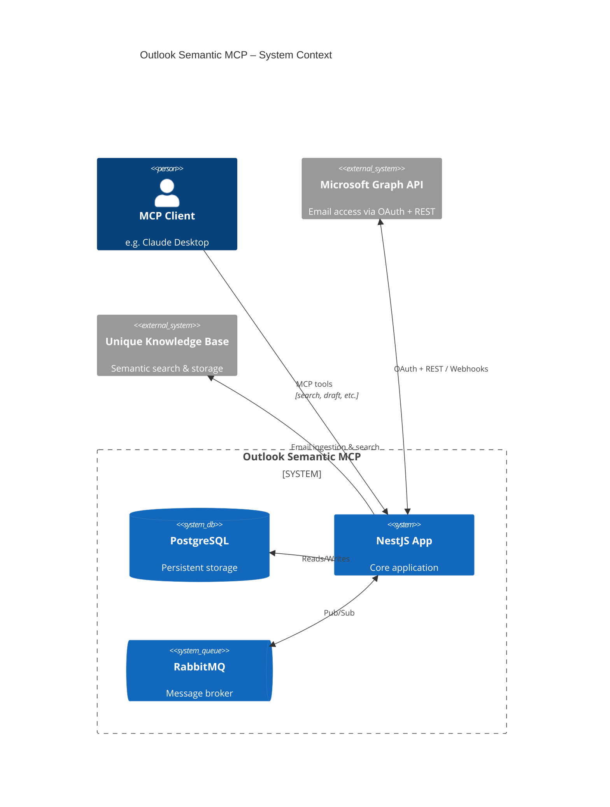
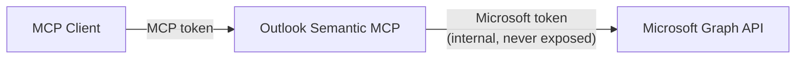

<!-- confluence-page-id: 2062254116 -->
<!-- confluence-space-key: PUBDOC -->

# Architecture

The Outlook Semantic MCP Server is a NestJS-based microservice that connects Microsoft Outlook email with the Unique platform through the Model Context Protocol (MCP). It syncs emails from connected mailboxes into the Unique knowledge base and exposes MCP tools for AI-assisted email search, draft creation, and contact lookup.

## High-Level Architecture

```mermaid
C4Context
    title Outlook Semantic MCP – System Context

    Person(client, "MCP Client", "e.g. Claude Desktop")

    System_Boundary(server, "Outlook Semantic MCP") {
        SystemDb(pg, "PostgreSQL", "Persistent storage")
        System(app, "NestJS App", "Core application")
        SystemQueue(mq, "RabbitMQ", "Message broker")
    }

    System_Ext(graph, "Microsoft Graph API", "Email access via OAuth + REST")
    System_Ext(kb, "Unique Knowledge Base", "Semantic search & storage")

    Rel(client, app, "MCP tools", "search, draft, etc.")
    BiRel(app, graph, "OAuth + REST / Webhooks")
    Rel(app, pg, "Reads/Writes")
    BiRel(app, mq, "Pub/Sub")
    Rel(app, kb, "Email ingestion & search")

    UpdateLayoutConfig($c4ShapeInRow="3", $c4BoundaryInRow="1")
```

## System Components

### Authentication

The server manages two separate authentication layers:

- **MCP OAuth** — Authenticates MCP clients (e.g. Claude Desktop) using OAuth 2.1 with PKCE. Issues short-lived MCP tokens that clients use for all subsequent tool calls.
- **Microsoft OAuth** — Authenticates with Microsoft Entra ID using delegated permissions to obtain Graph API tokens on behalf of the signed-in user. These tokens are encrypted and stored server-side — they are never exposed to MCP clients.

The user authenticates once through a browser-based flow. The server exchanges the authorization code for Microsoft tokens (using a confidential client secret), stores them encrypted, and issues a separate MCP token to the client. From that point on, the MCP client authenticates with its MCP token, and the server uses the stored Microsoft tokens internally.

```mermaid
flowchart LR
    AIClient["MCP Client"] -->|"MCP token"| OutlookMCP["Outlook Semantic MCP"]
    OutlookMCP -->|"Microsoft token\n(internal, never exposed)"| MSGraph["Microsoft Graph API"]
```

**Token Lifetimes:** MCP tokens (60-second access, 30-day refresh) are configurable. Microsoft tokens (~1-hour access, ~90-day refresh) are set by Microsoft. The server automatically refreshes expired Microsoft access tokens. If the refresh token itself expires (~90 days of inactivity), the user must reconnect. See [Security — Token TTLs](./security.md#MCP-Tokens-(Opaque-Random-Values)) for the full reference.

### MCP Tools

The tools layer exposes capabilities to AI clients over the Model Context Protocol. Each tool call is authenticated via MCP OAuth and, where needed, delegates to Microsoft Graph using the stored Microsoft token.

Tools fall into these categories:

- **Email search** — Queries the Unique knowledge base (no live Graph API call per search)
- **Draft creation** — Creates drafts in the user's Outlook Drafts folder via Graph API
- **Contact lookup** — Searches the user's Microsoft contacts directory via Graph API
- **Mailbox utilities** — Lists folders and categories via Graph API for search filtering
- **Connection management** — Checks webhook status, reconnects, or removes the mailbox connection

See [Tools Reference](./tools.md) for the full list and behavior details.

### Sync Pipeline

After a user connects, two concurrent pipelines keep the knowledge base in sync with the user's mailbox:

- **Full Sync** — Fetches historical emails (within configured time frame and filters) from Microsoft Graph in paginated batches and uploads them to the Unique knowledge base. Runs once after connection and is resumable across restarts. See [Full Sync](./full-sync.md).
- **Live Catch-Up** — Receives Microsoft Graph webhook notifications when new mail arrives, enqueues them via RabbitMQ for asynchronous processing, then fetches and ingests new messages. See [Live Catch-Up](./live-catchup.md).
- **Directory Sync** — Keeps the local folder structure in sync with Outlook via Graph delta queries, enabling folder-based search filtering and detecting when emails move to excluded folders. See [Directory Sync](./directory-sync.md).

Both email pipelines run concurrently. Live catch-up buffers notifications until full sync initializes a watermark, after which both ingest independently.

### Data Storage (PostgreSQL)

PostgreSQL stores all persistent state:

- **User profiles** — Identity, encrypted Microsoft OAuth tokens
- **MCP OAuth state** — Client registrations, sessions, authorization codes, access/refresh tokens with family-based revocation
- **Webhook subscriptions** — Active Microsoft Graph subscriptions per user
- **Sync state** — Full sync progress, live catch-up state, mail filters per user
- **Folder structure** — Outlook directory tree synced from Graph API for folder-based filtering

Microsoft tokens are encrypted at rest using AES-256-GCM. MCP tokens use 512-bit cryptographically random values with TTL-based expiration.

### Message Queue (RabbitMQ)

RabbitMQ decouples webhook receipt from email processing to meet Microsoft's strict webhook response deadline (< 10 seconds). When a webhook notification arrives, it is acknowledged immediately and enqueued for asynchronous processing.

Failed messages are routed to a Dead Letter Exchange for inspection and retry.

### Unique Integration

The server integrates with the Unique platform to:

- **Ingest emails** — Uploads email content to the Unique knowledge base during both full sync and live catch-up
- **Search emails** — Queries the knowledge base for semantic email search (the `search_emails` tool)
- **Manage scopes** — Creates and manages the knowledge base scope to which emails are synced

## Related Documentation

- [Flows](./flows.md) - User connection, subscription lifecycle, email sync flows
- [Security](./security.md) - Encryption, authentication, and threat model
- [Permissions](./permissions.md) - Required Microsoft Graph scopes and least-privilege justification

## Standard References

- [Microsoft Graph API](https://learn.microsoft.com/en-us/graph/overview) - Graph API overview
- [Microsoft Entra ID](https://learn.microsoft.com/en-us/entra/identity/) - Authentication and authorization
- [Model Context Protocol](https://modelcontextprotocol.io/) - MCP specification
