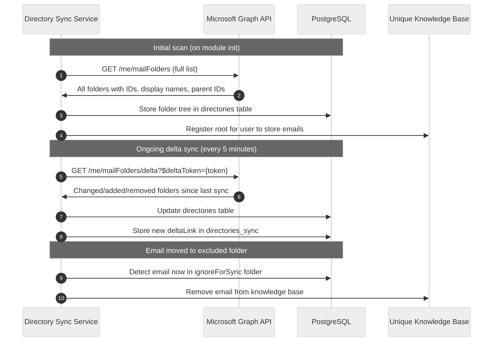

<!-- confluence-page-id: 2065858574 -->
<!-- confluence-space-key: PUBDOC -->

# Directory Sync

Directory sync keeps the server's local copy of the user's Outlook folder structure in sync with Microsoft Graph. It runs on a 5-minute schedule (processing up to 10 users per run) using Graph delta queries. Directory sync is also triggered at the start of each full sync and live catch-up execution.

It serves two purposes: enabling folder-based email search filtering, and tracking email movement between folders to handle soft and hard email deletion without relying on Graph delete notifications.

## Why Directory Sync Exists

The server discards `deleted` Microsoft Graph change notifications and instead handles email removal through two mechanisms:

**Individual email deletion:**
When a user deletes an email, Microsoft moves it to Deleted Items before permanent removal. This generates a `created` change notification for the Deleted Items folder (not a `deleted` notification for the original folder). Because Deleted Items is marked `ignoreForSync = true`, the server detects on this `created` event that the email has landed in an ignored folder and removes it from the Unique knowledge base.

**Entire folder deletion:**
When a folder is moved or deleted, Microsoft does not fire individual `deleted` notifications for the messages inside that folder. This means the server has no real-time signal for what happened to those messages. The directory sync cron job (running every 5 minutes) compensates for this gap — it detects folder removals via delta sync and cleans up the associated messages from the Unique knowledge base.

This design means the server only needs to subscribe to `created` change notifications and rely on directory sync for structural changes — no `deleted` subscription is required.

## Search Filtering

The synced folder tree also powers the `list_folders` tool. The folder IDs it returns can be passed to the `directories` filter in `search_emails` to narrow results to a specific mailbox folder.

## How It Works

## Schedule

| Event | Trigger |
|-------|---------|
| Initial scan | On module init after user connects |
| Ongoing delta sync | Every 5 minutes (cron), limited to 10 users per run |
| On full sync start | Triggered at the beginning of each full sync execution |
| On live catch-up start | Triggered at the beginning of each live catch-up execution |

The `deltaLink` from each Graph delta response is stored in the `directories_sync` table and used on the next run to fetch only changed folders, keeping the sync efficient.

## Data Model

| Table | Purpose |
|-------|---------|
| `directories` | Folder tree — ID, display name, parent, `ignoreForSync` flag |
| `directories_sync` | Delta sync state — `deltaLink`, last sync timestamps |

## Relation to Subscription Management

Directory sync runs as long as the user has an active inbox connection. When `remove_inbox_connection` is called, directory sync data and the associated root scopes are removed from the Unique knowledge base along with the subscription.

## Related Documentation

- [Subscription Management](./subscription-management.md) - Inbox connection and subscription lifecycle
- [Live Catch-Up](./live-catchup.md) - Webhook-driven ingestion that runs alongside directory sync
- [Flows](./flows.md#Directory-Sync-Flow) - Directory sync sequence diagram
- [Tools](./tools.md#list_folders) - `list_folders` tool reference
