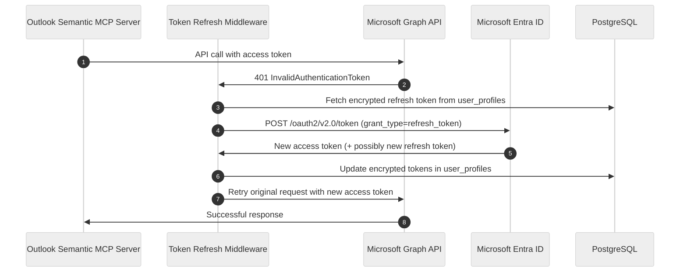
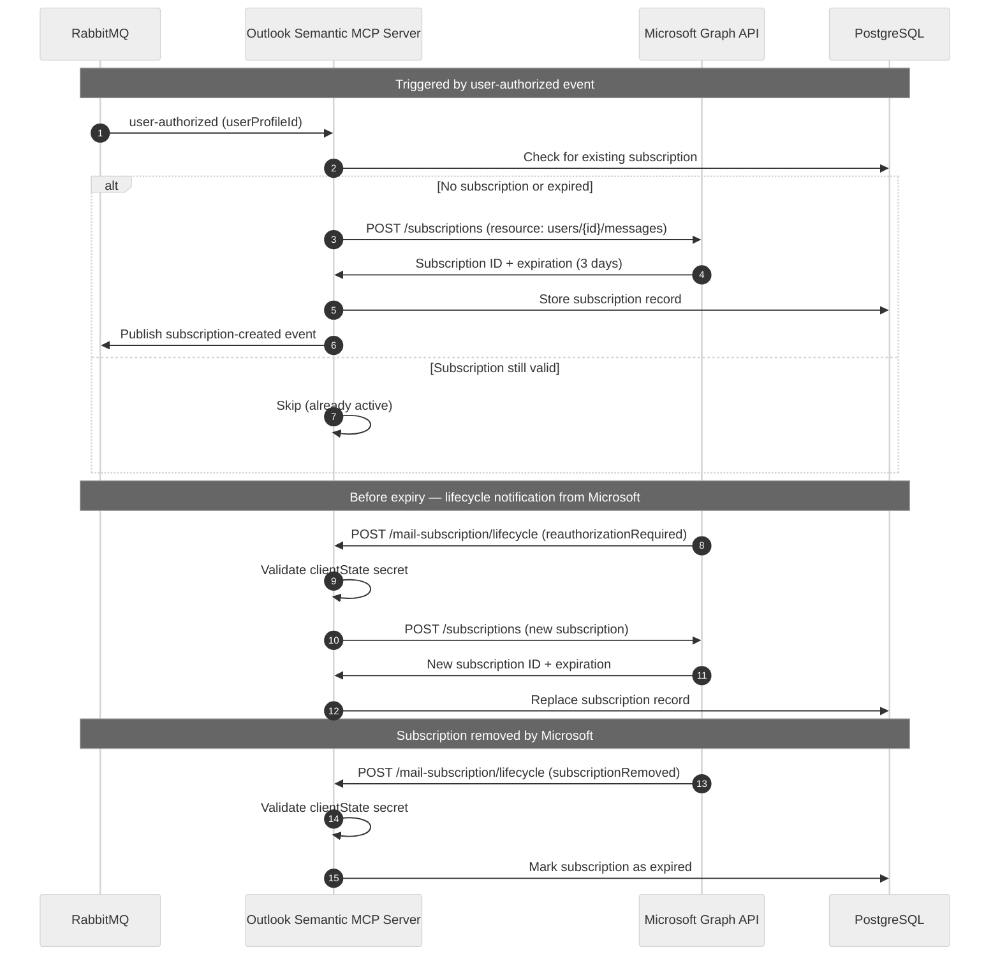
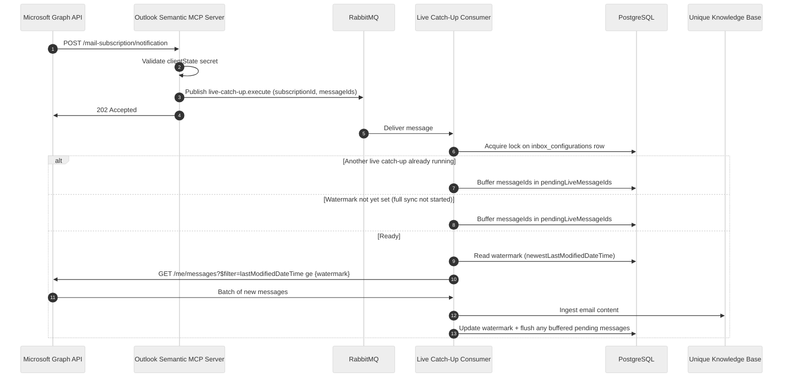
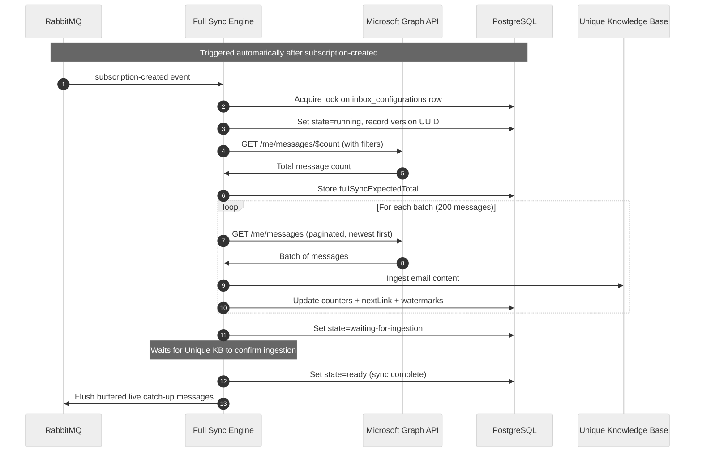
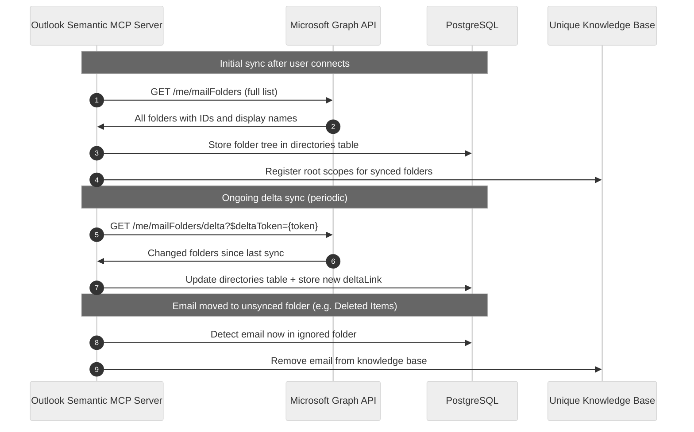
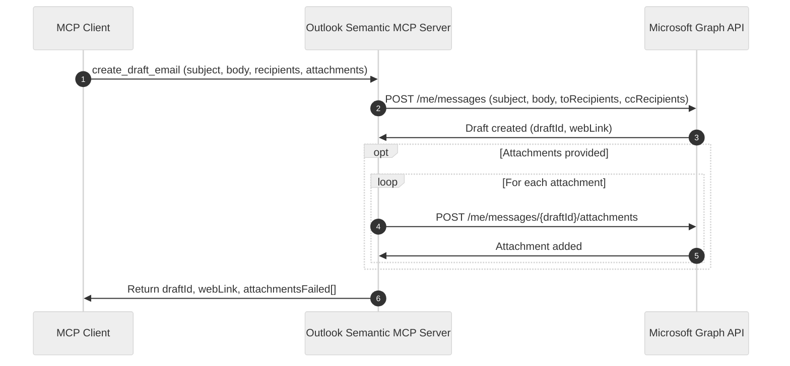

<!-- confluence-page-id:  -->
<!-- confluence-space-key: PUBDOC -->

# Flows

This page documents the key flows in the Outlook Semantic MCP Server: how users connect, how emails are synced in real time and historically, how subscriptions stay alive, and how email drafts are created.

## User OAuth Connection Flow

When a user opens their MCP client and connects to the Outlook Semantic MCP Server for the first time, the following flow executes:

After the `user-authorized` event is published, the server automatically creates a Microsoft Graph webhook subscription and starts a full email sync — no further user action is needed.

**Key points:**

- Microsoft tokens (access + refresh) are encrypted at rest using AES-256-GCM and **never** exposed to the MCP client.
- The MCP client receives a separate, short-lived MCP bearer token for all subsequent tool calls.
- The PKCE code verifier prevents authorization code interception even if the redirect is observed.

## Microsoft Token Refresh Flow

Microsoft access tokens expire after approximately one hour. The server refreshes them transparently:

**Key points:**

- Refresh is automatic — no user intervention required.
- If the refresh token itself is expired (~90 days of inactivity), the user must reconnect via `reconnect_inbox`.
- The server stores the new refresh token if Microsoft rotates it; otherwise the existing refresh token is kept.

## Subscription Creation and Renewal Lifecycle

Microsoft Graph webhook subscriptions expire after a maximum of 3 days. The server manages their full lifecycle:

**Subscription states** (as returned by `verify_inbox_connection`):

| State | Meaning |
|-------|---------|
| `active` | Subscription exists and is not near expiry |
| `expiring_soon` | Subscription expires within 15 minutes |
| `expired` | Subscription has expired; call `reconnect_inbox` |
| `not_configured` | No subscription exists for this user |

**Key points:**

- Microsoft sends lifecycle notifications before a subscription expires (`reauthorizationRequired`) and when it removes one (`subscriptionRemoved`).
- All lifecycle notifications are validated against the `MICROSOFT_WEBHOOK_SECRET` via the `clientState` field.
- `reconnect_inbox` forces creation of a new subscription regardless of current state.

## Live Catch-Up: Webhook-Driven Email Ingestion

When a new email arrives in the user's Outlook mailbox, Microsoft Graph sends a webhook notification:

**Key points:**

- Microsoft requires a response within 10 seconds. The server enqueues the notification immediately and returns `202 Accepted` — actual email processing happens asynchronously.
- Buffering applies when another live catch-up consumer is already processing, or when the watermark has not been set yet (full sync has not started). Messages are flushed once the blocker clears.
- The watermark (`newestLastModifiedDateTime`) is **initialized by full sync** the first time it runs and **maintained by live catch-up** on every subsequent notification.
- Deleted email notifications do not require explicit handling: when a user moves an email to a folder that is not synced (e.g. Deleted Items), the directory sync detects this. When emails are permanently deleted, they are already removed from the Unique knowledge base.
- **Attachment limitation**: Email attachments are uploaded to Unique KB using content ID-based references (not base64). This only works in `cluster_local` service auth mode where the Unique ingestion service can resolve internal URLs. In external mode, attachments are not ingested.

## Full Sync: Historical Email Ingestion

After a subscription is created, the server automatically begins ingesting the user's complete email history:

**Full sync states:**

| State | Meaning |
|-------|---------|
| `running` | Actively fetching and uploading email batches |
| `waiting-for-ingestion` | All batches uploaded; waiting for Unique KB to confirm |
| `paused` | Manually paused (debug mode only) |
| `failed` | Error occurred; check `sync_progress` for details |
| `ready` | Sync complete or not yet started |

**Key points:**

- Full sync is triggered automatically when a subscription is created — users do not need to invoke it manually.
- The sync is resumable: `fullSyncNextLink` stores the Graph pagination cursor so a crash or restart picks up where it left off.
- Stale syncs (no heartbeat for 20+ minutes) are automatically restarted by the sync recovery module.
- Inbox filters (`ignoredBefore`, `ignoredSenders`, `ignoredContents`) are applied server-side before ingestion.
- Full sync **initializes** the watermark (`newestLastModifiedDateTime`). Live catch-up takes over from that point and updates it on every subsequent notification.
- **Attachment limitation**: Email attachments are uploaded using content ID-based references, which only work in `cluster_local` service auth mode. In external mode, email bodies are ingested but attachments are not.

## Directory Sync Flow

The server continuously syncs the user's Outlook folder structure from Microsoft Graph. This serves two purposes: enabling folder-based search filtering via the `list_folders` tool, and tracking email movement between folders to handle "deleted" emails without relying on delete notifications.

**Why directory sync exists:**

Microsoft Graph does not provide a direct "email deleted" change notification for permanently deleted messages. Instead the server tracks the folder each email belongs to:

- Folders such as Deleted Items and Junk Email are excluded from sync (`ignoreForSync = true` in the `directories` table).
- When the delta sync detects that an email has moved into an excluded folder, the server removes it from the Unique knowledge base.
- When an email is permanently deleted, it has already been removed from Unique when it was moved to Deleted Items.

**Search integration:**

The `list_folders` tool returns the folder tree synced here. The folder IDs it returns can be passed as a `folderId` filter to `search_emails` to narrow results to a specific mailbox folder.

## Email Draft Creation Flow

When the user calls the `create_draft_email` tool:

**Key points:**

- The draft is created in the user's Outlook Drafts folder via Microsoft Graph — it is **not** sent automatically.
- The `webLink` in the response lets the user open the draft directly in Outlook to review and send.
- If one or more attachments fail to upload, the draft is still returned with a list of failed attachments.

## Related Documentation

- [Architecture](./architecture.md) - System components and module descriptions
- [Full Sync](./full-sync.md) - Full sync mechanics, states, and filters in detail
- [Live Catch-Up](./live-catchup.md) - Webhook-driven sync, subscription lifecycle, and directory sync in detail
- [Security](./security.md) - Token encryption, PKCE, and token rotation
