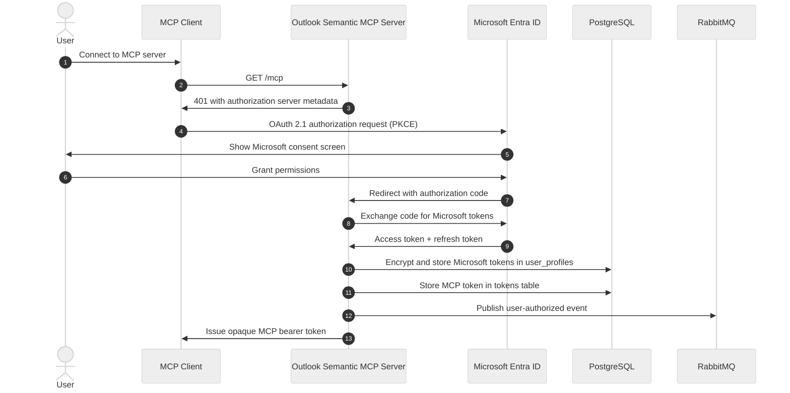
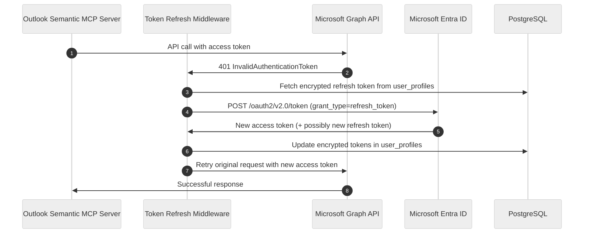
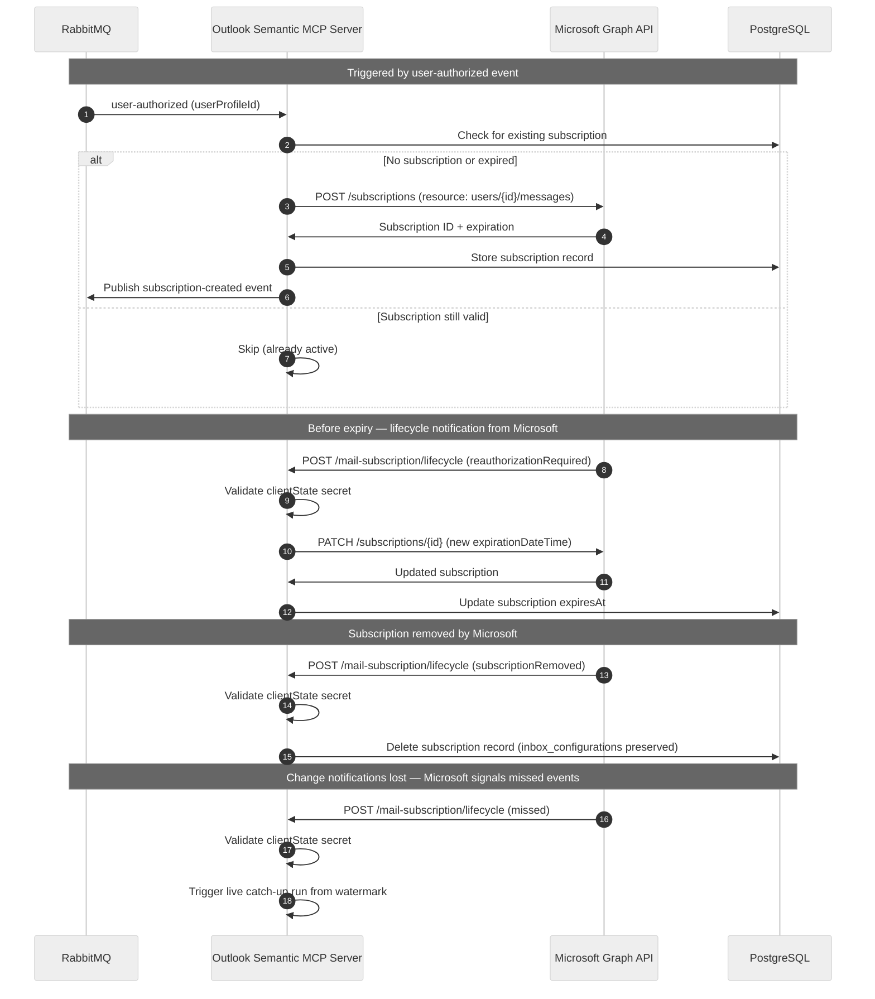
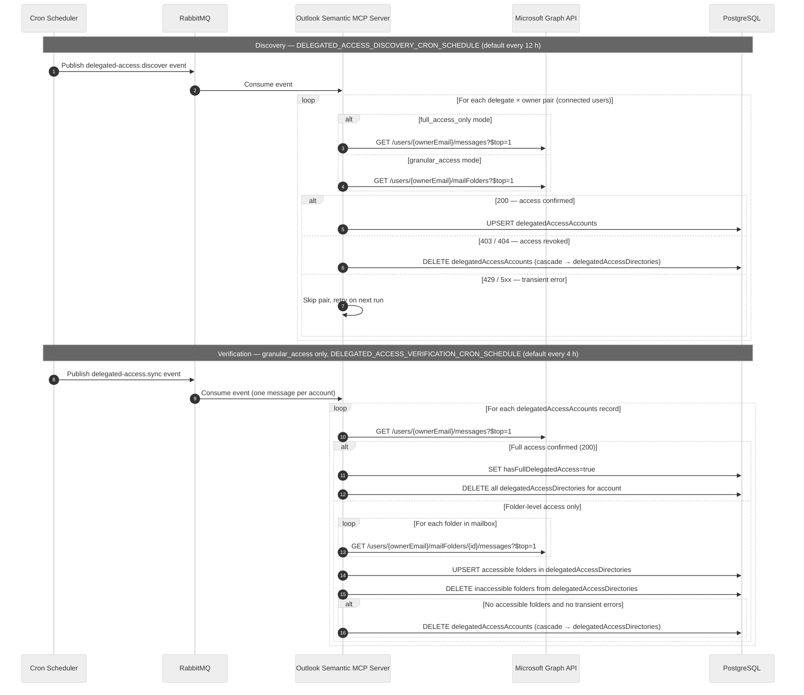
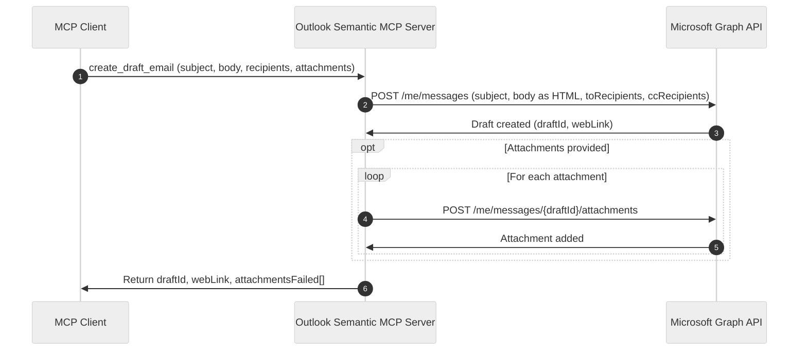

<!-- confluence-page-id: 2062942216 -->
<!-- confluence-space-key: PUBDOC -->

# Outlook Semantic MCP - Flows

This page documents the key flows in the Outlook Semantic MCP Server: how users connect, how emails are synced in real time and historically, how subscriptions stay alive, and how email drafts are created.

## User OAuth Connection Flow

When a user opens their MCP client and connects to the Outlook Semantic MCP Server for the first time, the following flow executes:

After the `user-authorized` event is published, the server automatically creates a Microsoft Graph webhook subscription and starts a full email sync — no further user action is needed.

**Key points:**

- Microsoft tokens (access + refresh) are encrypted at rest using AES-256-GCM and **never** exposed to the MCP client.
- The MCP client receives a separate, short-lived MCP bearer token for all subsequent tool calls.
- The PKCE code verifier prevents authorization code interception even if the redirect is observed.

## Microsoft Token Refresh Flow

Microsoft access tokens expire after approximately one hour. The server refreshes them transparently:

**Key points:**

- Refresh is automatic — no user intervention required.
- If the refresh token itself is expired (~90 days of inactivity), the user must reconnect via `reconnect_inbox`.
- The server stores the new refresh token if Microsoft rotates it; otherwise the existing refresh token is kept.

## Subscription Creation and Renewal Lifecycle

Microsoft Graph webhook subscriptions for messages can last up to 7 days (Microsoft limit). The service creates subscriptions that renew daily at the configured UTC hour. The server manages the full lifecycle:

**Subscription states:**

| Status | Meaning | Action |
|--------|---------|--------|
| `active` | Subscription valid, more than 15 minutes until expiry | None required |
| `expiring_soon` | Less than 15 minutes until expiry | Renewal is automatic; no action needed |
| `expired` | Subscription has lapsed | Call `reconnect_inbox` |
| `not_configured` | No subscription exists | Call `reconnect_inbox` |

**Key points:**

- Microsoft sends lifecycle notifications before a subscription expires (`reauthorizationRequired`), when it removes one (`subscriptionRemoved`), and when change notifications were lost (`missed`).
- All lifecycle notifications are validated against the `MICROSOFT_WEBHOOK_SECRET` via the `clientState` field.
- `reconnect_inbox` is idempotent: it creates a new subscription only if none exists or the existing one has expired. If the subscription is `already_active` or `expiring_soon`, no changes are made.

## Live Catch-Up: Webhook-Driven Email Ingestion

When a new email arrives in the user's Outlook mailbox, Microsoft Graph sends a webhook notification. The server enqueues the notification in RabbitMQ and returns `202 Accepted` immediately. The consumer then fetches and ingests new messages inline within the same execution.

**Key points:**

- Microsoft requires a response within 10 seconds (Microsoft limit, not configurable). The server enqueues the notification immediately and returns `202 Accepted` — actual email fetching and ingestion happen inline in the consumer, after the webhook response is already sent.
- The watermark (`newestLastModifiedDateTime`) is set and maintained by live catch-up on every notification, independently of full sync.
- `deleted` change notifications are discarded. Deletions are handled by [directory sync](#Directory-Sync-Flow) and by detecting emails moved to ignored folders.

## Full Sync: Historical Email Ingestion

After a subscription is created, the server automatically begins ingesting the user's historical emails. It fetches messages from Microsoft Graph in paginated batches (newest first), applies the configured mail filters, and uploads them to the Unique Knowledge Base. The sync is resumable across restarts.

**Key points:**

- Full sync is triggered asynchronously: subscription creation publishes a `subscription-created` event to RabbitMQ, which the server consumes to begin the sync — users do not need to invoke it manually.
- The sync is resumable: the Graph pagination cursor is persisted so a crash or restart picks up where it left off.
- Stale syncs (no heartbeat for 20+ minutes) are automatically restarted by the sync recovery module.
- The retention window (`retentionWindowInDays`) is applied as a Graph API query filter (computed daily as `today - retentionWindowInDays`). `ignoredSenders` and `ignoredContents` are applied in-memory after each batch is fetched.
- Full sync **initializes** the watermark (`newestLastModifiedDateTime`). Once initialized, live catch-up takes ownership and updates it on every subsequent notification.

## Directory Sync Flow

The server continuously syncs the user's Outlook folder structure from Microsoft Graph. This serves two purposes: enabling folder-based search filtering via the `list_mailboxes_and_directories` tool, and tracking email movement between folders to handle "deleted" emails without relying on delete notifications.

**Key points:**

- Directory sync runs on a 5-minute schedule (configurable via `DIRECTORY_SYNC_CRON_SCHEDULE`) using Graph delta queries, plus on-demand at the start of each full sync and live catch-up execution.
- System folders such as Deleted Items, Junk Email, Recoverable Items Deletions, and Conversation History are excluded from sync (`ignoreForSync = true`). When an email is moved to an excluded folder, it is removed from the knowledge base.
- The `list_mailboxes_and_directories` tool returns the folder tree synced here. The folder IDs it returns can be passed in the `conditions[].directories` field of `search_emails` to narrow results to a specific mailbox folder.

## Delegated Access Discovery Flow

When `DELEGATED_ACCESS_SCAN` is not `disabled`, two background jobs maintain
delegated access state. The **discovery job** identifies which connected users
have access to other connected users' mailboxes. The **verification job**
(`granular_access` mode only) runs more frequently and confirms which specific
folders within each delegated mailbox are still readable.

Neither job triggers email ingestion. They write permission records that
`search_emails` reads at query time to include the owner's scope alongside the
delegate's own scope.

**Key points:**

- Discovery iterates over all connected user pairs (delegate × owner). It probes one Graph endpoint per pair — `GET /users/{ownerEmail}/messages` in `full_access_only` mode, `GET /users/{ownerEmail}/mailFolders` in `granular_access` mode.
- A 403 or 404 response immediately deletes the access record and all associated folder grants (cascading delete). The owner's scope is excluded from the delegate's next `search_emails` call.
- Transient errors (429, 5xx) cause the pair to be skipped; the next scheduled run retries.
- The verification job (`granular_access` only) tests each folder individually, rebuilds `delegatedAccessDirectories` from confirmed-accessible folders, and deletes the account record if no folders remain accessible and no transient errors occurred.
- In Mode B (`microsoft_graph`), only full-access delegations are searchable — honouring folder-level grants would require querying every accessible folder individually, which is not implemented due to API rate limits. Folder-level grants detected by verification have no effect on Mode B search results.
- A recovery scheduler (configurable via `DELEGATED_ACCESS_RECOVERY_CRON_SCHEDULE`, default `*/30 * * * *`) monitors both jobs. If either stalls (state `running` for > 10 minutes with no progress), it is automatically restarted.

## Email Draft Creation Flow

When the user calls the `create_draft_email` tool:

**Key points:**

- The draft is created in the user's Outlook Drafts folder via Microsoft Graph — it is **not** sent automatically.
- The `webLink` in the response lets the user open the draft directly in Outlook to review and send.
- If one or more attachments fail to upload, the draft is still returned with a list of failed attachments.

## Related Documentation

- [Architecture](./architecture.md) - System components and module descriptions
- [Security](./security.md) - Token encryption, PKCE, and token rotation
