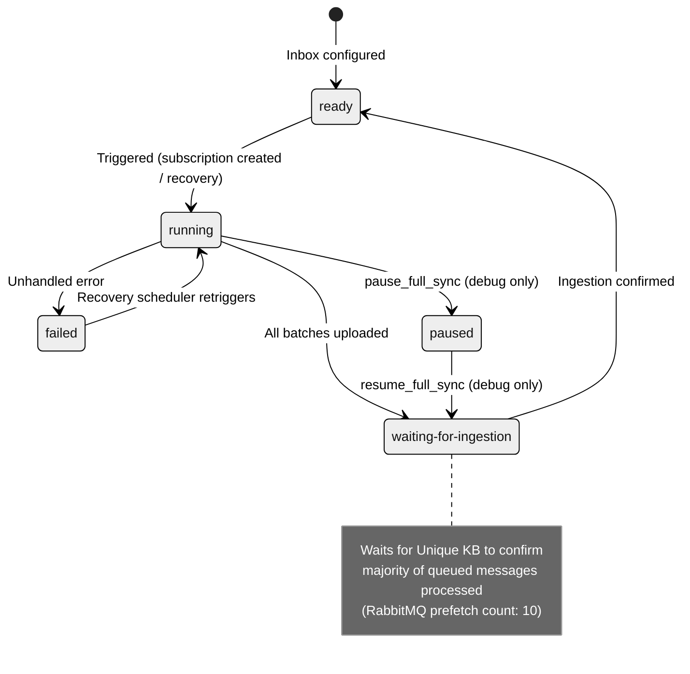
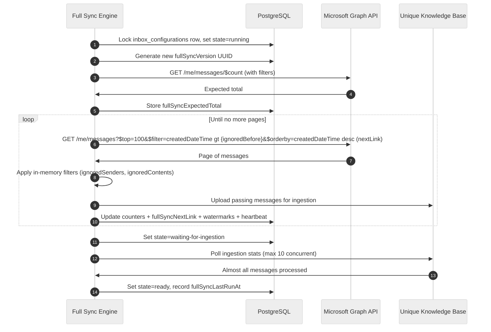

<!-- confluence-page-id: 2060746813 -->
<!-- confluence-space-key: PUBDOC -->

# Full Sync

Full sync is the process of ingesting a user's emails from Microsoft Outlook into the Unique knowledge base, scoped to an operator-configured time frame and filtered by sender and content rules. It runs automatically after a user connects their mailbox and is resumable across restarts.

> **Operator summary:** Full sync progresses through states: `ready` → `running` → `waiting-for-ingestion` → `ready`. If it fails, the recovery scheduler retriggers after 20 minutes. Monitor via `sync_progress`. Emails are filtered by `DEFAULT_MAIL_FILTERS` (date, sender, content). See [Stale Sync Recovery](#stale-sync-recovery) for recovery details.

## What Full Sync Does

1. Fetches the user's emails from Microsoft Graph in paginated batches (newest first)
2. Applies inbox filters to skip unwanted messages
3. Uploads each email to the Unique knowledge base for indexing
4. Tracks progress so it can resume from the last processed page if interrupted
5. Initializes a watermark (a timestamp — `newestLastModifiedDateTime` — marking the most recent email processed, used by live catch-up to fetch only newer emails)

Full sync and live catch-up run concurrently after connection. Live catch-up buffers notifications until the full sync has initialized its watermark — after that, both pipelines ingest independently.

## Trigger Conditions

| Trigger | When |
|---------|------|
| Subscription created | Automatically after a user calls `reconnect_inbox` or connects for the first time |
| Recovery scheduler | Every 2 minutes — restarts syncs that have a stale heartbeat |
| `run_full_sync` tool | Debug mode only — manual trigger with a 5-minute cooldown |

Full sync does **not** resume automatically on server restart. The recovery scheduler (running every 2 minutes) detects stale heartbeats and re-triggers as needed.

## Sync States



| State | Meaning |
|-------|---------|
| `ready` | Idle — no sync running. A 5-minute cooldown prevents immediate re-trigger after completion. |
| `running` | Actively fetching pages from Microsoft Graph and uploading to Unique KB |
| `waiting-for-ingestion` | All batches uploaded; waiting for the Unique ingestion service to confirm that almost all queued messages are processed |
| `paused` | Manually paused via `pause_full_sync` (debug mode only) |
| `failed` | An error occurred; recovery scheduler will re-trigger after 20 minutes |

## How Batching Works

Full sync fetches emails from Microsoft Graph in pages of **100 messages**, processing in order from newest to oldest. After uploading **50 messages** (uploaded + failed), the batch yields so the scheduler can give other users a turn. This means a single batch may process less than a full page, or span multiple pages if many messages are skipped by filters.



**Resume on interruption:**

The sync persists both the Graph API cursor (`nextLink`) and the index within the current page (`batchIndex`) after every message. On restart, it resumes from the exact position rather than starting over. If the cursor has expired (HTTP 410), the sync falls back to a fresh query filtered from the last recorded `oldestCreatedDateTime` and resets the batch index — this may re-process some already-uploaded messages, which the ingestion layer handles idempotently.

**Optimistic locking:**

Each sync attempt generates a new `fullSyncVersion` UUID. All state-modifying database updates are guarded with `WHERE fullSyncVersion = ?` — if the version doesn't match (e.g. a concurrent recovery attempt fired), the operation is skipped gracefully.

## Inbox Filters

Filters control which emails are ingested. They are set globally via the `DEFAULT_MAIL_FILTERS` environment variable and applied to all users at deployment time.

| Filter | Type | Applied Where | Description |
|--------|------|--------------|-------------|
| `ignoredBefore` | ISO 8601 date | Graph API query filter | Emails created before this date are excluded from the Graph API response |
| `ignoredSenders` | RegExp[] | In-memory after fetch | Emails whose sender address matches any pattern are skipped. Patterns must use `/pattern/flags` format. |
| `ignoredContents` | RegExp[] | In-memory after fetch | Emails whose subject or body matches any pattern are skipped. Patterns must use `/pattern/flags` format. |

**Example `DEFAULT_MAIL_FILTERS` value:**

```json
{
  "ignoredBefore": "2023-01-01",
  "ignoredSenders": ["/^noreply@/i", "/^no-reply@/i"],
  "ignoredContents": ["/unsubscribe/i", "/out of office/i"]
}
```

**Filter change behaviour:**

When `DEFAULT_MAIL_FILTERS` is updated and the service is redeployed, all user inbox configurations are updated to the new filters on startup. The next full sync for each user will use the updated filters. Previously ingested emails that would now be filtered are not automatically removed from the knowledge base.

## Progress Tracking

The `sync_progress` tool (and the `inbox_configurations` table) exposes these counters:

| Field | Description |
|-------|-------------|
| `expectedTotal` | Total message count at sync start (from Graph `$count`) |
| `scheduledForIngestion` | Messages successfully uploaded to Unique KB |
| `skippedMessages` | Messages excluded by inbox filters |
| `failedToUploadForIngestion` | Messages that failed after 3 upload retries |
| `ingestionStats.finished` | Messages confirmed processed by the knowledge base |
| `ingestionStats.inProgress` | Messages currently being processed |
| `dateWindow.newestCreatedDateTime` | Most recent email creation date seen |
| `dateWindow.oldestCreatedDateTime` | Oldest email creation date seen so far |

Search results may be incomplete while `fullSyncState` is `running` or `waiting-for-ingestion`. The `search_emails` tool returns a `syncWarning` field in this case.

## Stale Sync Recovery

A background scheduler runs every 2 minutes (service limit) and checks for syncs that have stopped updating their heartbeat:

| Condition | Threshold | Action |
|-----------|-----------|--------|
| `state=running`, heartbeat stale | 20 minutes (service limit) | Re-trigger full sync |
| `state=waiting-for-ingestion`, heartbeat stale | 5 minutes (service limit) | Re-trigger ingestion check |
| `state=failed`, heartbeat stale | 20 minutes (service limit) | Re-trigger full sync |

The scheduler publishes a `full-sync.retrigger` event which the full sync consumer processes the same way as any other trigger.

## Relation to Live Catch-Up

Full sync and live catch-up run **concurrently** after a user connects. They are independent pipelines that both contribute to the Unique knowledge base ingestion queue.

- **Watermark initialisation**: Full sync initializes `newestLastModifiedDateTime` (the watermark) at the start of the first sync run. Once initialized, live catch-up can use it for delta queries and both pipelines ingest in parallel.
- **Impact on `waiting-for-ingestion`**: When full sync finishes uploading all its batches, it enters `waiting-for-ingestion` and waits for the Unique KB to confirm that almost all queued messages are processed. Because live catch-up is uploading its own batches to the same ingestion queue, full sync may remain in `waiting-for-ingestion` longer when live catch-up activity is high.
- **Watermark ownership**: Once full sync has initialized the watermarks, live catch-up takes ownership of `newestLastModifiedDateTime` and updates it on every notification going forward.

## Related Documentation

- [Live Catch-Up](./live-catchup.md) - Webhook-driven real-time ingestion and watermark handoff
- [Subscription Management](./subscription-management.md) - Subscription creation that triggers full sync
- [Directory Sync](./directory-sync.md) - Folder sync that tracks email movement and deletions
- [Tools](./tools.md#sync_progress) - `sync_progress` tool reference
- [Tools](./tools.md#debug-mode-tools) - Debug-mode sync control tools
- [Flows](./flows.md#full-sync-historical-email-ingestion) - Full sync sequence diagram
- [Configuration](../operator/configuration.md) - `DEFAULT_MAIL_FILTERS` and related env vars
