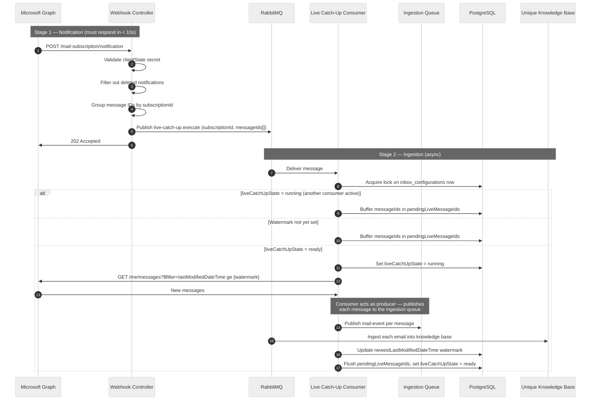

<!-- confluence-page-id:  -->
<!-- confluence-space-key: PUBDOC -->

# Live Catch-Up

Live catch-up is the real-time email ingestion pipeline. It receives Microsoft Graph change notifications the moment new mail arrives and processes them asynchronously via RabbitMQ to meet Microsoft's strict 10-second response deadline.

## How It Works

Live catch-up operates in two stages: a **notification stage** (fast, synchronous) and an **ingestion stage** (async, RabbitMQ-driven).

**Stage 1 — Notification (synchronous):**

- The controller validates the `clientState` secret against `MICROSOFT_WEBHOOK_SECRET`
- `deleted` change notifications are discarded. Deletions are handled in two ways: when an entire folder is deleted, the [Directory Sync](./directory-sync.md) detects this via delta sync; when an individual email is deleted, the user first moves it to a folder marked `ignoreForSync` (e.g. Deleted Items), which generates a `created` event for that folder — the server detects the email is in an ignored folder and removes it from the knowledge base.
- Remaining message IDs are grouped by `subscriptionId` and published to RabbitMQ as a single batch
- `202 Accepted` is returned immediately — no email fetching happens in this stage

**Stage 2 — Ingestion (asynchronous):**

- The consumer acquires a row-level lock on `inbox_configurations` to prevent concurrent processing
- It uses `newestLastModifiedDateTime` (the watermark) as the lower bound for a Graph query, ensuring only new or recently modified emails are fetched
- The consumer acts as a **producer** for the ingestion queue — it publishes one `mail-event` message per email to RabbitMQ, which are then consumed and uploaded to the Unique knowledge base
- After ingestion, the watermark is advanced and any buffered pending messages are flushed

## Live Catch-Up States

| State | Meaning |
|-------|---------|
| `ready` | Idle — ready to process the next notification |
| `running` | Actively fetching from Graph and publishing to the ingestion queue |
| `failed` | An unhandled error occurred during processing |

**State transitions:**

- `ready` → `running`: Consumer acquires lock and watermark is set
- `running` → `ready`: Processing complete, pending messages flushed
- `running` / `ready` → `failed`: Unhandled error during execution
- `failed` → `ready`: Recovery scheduler resets state and retriggers (every 5 minutes)

**Pending message buffer:**

When `liveCatchUpState = running`, new incoming notifications are appended to `pendingLiveMessageIds` instead of being dropped. After the active consumer finishes, it flushes the buffer in the same database transaction before releasing the lock. This ensures no notifications are lost during high-frequency mail delivery.

**Watermark not yet set:**

If `newestLastModifiedDateTime` is `null` (full sync has not initialized the watermarks yet), incoming notifications are also buffered. They are flushed once the watermarks are initialized.

## Relation to Full Sync

Live catch-up and full sync run **concurrently** after a user connects:

- Live catch-up buffers notifications until full sync has initialized the watermarks (`newestLastModifiedDateTime`). After that, both pipelines ingest in parallel.
- Once full sync initializes `newestLastModifiedDateTime`, live catch-up takes ownership of that watermark and updates it on every notification.
- Live catch-up ingestion activity contributes to the Unique KB queue alongside full sync, which can extend the time full sync spends in `waiting-for-ingestion`.

## Recovery

| Condition | Recovery |
|-----------|---------|
| `liveCatchUpState = failed` | Recovery scheduler resets to `ready` and retriggers every 5 minutes |

For subscription-level failures (e.g. `subscriptionRemoved`), see [Subscription Management](./subscription-management.md#recovery).

## Related Documentation

- [Subscription Management](./subscription-management.md) - Subscription lifecycle, `reconnect_inbox`, `remove_inbox_connection`
- [Directory Sync](./directory-sync.md) - Folder sync and email delete detection
- [Full Sync](./full-sync.md) - Historical batch ingestion and watermark initialisation
- [Flows](./flows.md#live-catch-up-webhook-driven-email-ingestion) - Live catch-up sequence diagram
- [Configuration](../operator/configuration.md) - `MICROSOFT_WEBHOOK_SECRET` and related env vars
