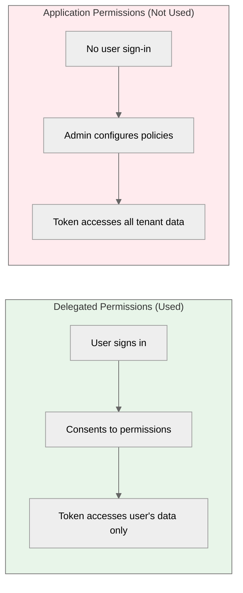

<!-- confluence-page-id:  -->
<!-- confluence-space-key: PUBDOC -->

# Permissions

All permissions are **Delegated** (not Application), meaning they act on behalf of the signed-in user and can only access data that user has access to.

## Permission Summary

| Permission | Type | Admin Consent | Required | Purpose |
|------------|------|---------------|----------|---------|
| `User.Read` | Delegated | No | Yes | Resolve user identity and profile |
| `Mail.Read` | Delegated | No | Yes | Read emails for sync and search |
| `Mail.ReadBasic` | Delegated | No | Yes | Read basic email metadata |
| `Mail.ReadWrite` | Delegated | No | Yes | Create draft emails in the user's mailbox |
| `MailboxSettings.Read` | Delegated | No | Yes | Read mailbox settings and folder structure |
| `People.Read` | Delegated | No | Yes | Look up contacts and people for address resolution |
| `offline_access` | Delegated | No | Yes | Obtain refresh tokens for background sync |

**No permission requires admin consent.** Users can connect their own accounts without IT intervention.

## Understanding Consent Requirements

**This is standard Microsoft behavior, not Outlook Semantic MCP specific.** All Microsoft 365 apps use the same consent model.

### Standard Microsoft Consent Process

1. **User connects their account**

   - User opens their MCP client and clicks "Connect"
   - Microsoft shows a standard consent screen listing the permissions above
   - User approves — no admin action required

2. **Admin consent (optional, for organisational rollout)**

   - An admin can pre-grant all permissions tenant-wide so users are not prompted individually
   - Done via the `service_principal_configuration` Terraform variable or the Azure Portal
   - See [Authentication Guide](../operator/authentication.md) for the admin consent URL pattern

**Microsoft Documentation:**

- [User and admin consent overview](https://learn.microsoft.com/en-us/entra/identity/enterprise-apps/user-admin-consent-overview) - Standard Microsoft consent flows
- [Grant admin consent](https://learn.microsoft.com/en-us/entra/identity/enterprise-apps/grant-admin-consent) - Step-by-step guide

## Least-Privilege Justification

Each permission is the minimum required for its function. No narrower alternative exists.

### `User.Read`

| Aspect | Detail |
|--------|--------|
| **Purpose** | Retrieve the signed-in user's profile (ID, email, display name) |
| **Used For** | Identifying the user when storing tokens and creating Graph subscriptions |
| **Why Not Less** | This is the minimum permission to read any user data |
| **Why Not `User.ReadBasic.All`** | That permission reads other users; we only need the signed-in user |

### `Mail.Read`

| Aspect | Detail |
|--------|--------|
| **Purpose** | Read the full content of the user's email messages |
| **Used For** | Fetching email bodies, headers, and metadata during full sync and live catch-up |
| **Why Not Less** | `Mail.ReadBasic` does not include message body content |
| **Why Not `Mail.ReadWrite`** | `Mail.Read` is sufficient for reading; `Mail.ReadWrite` is requested separately only for draft creation |

### `Mail.ReadBasic`

| Aspect | Detail |
|--------|--------|
| **Purpose** | Read basic email metadata (subject, sender, date, recipients) without body content |
| **Used For** | Lightweight metadata queries such as folder listing and message counts |
| **Why Not Less** | This is already a reduced-scope subset of `Mail.Read` |
| **Why Both `Mail.Read` and `Mail.ReadBasic`** | Some Graph API operations accept `Mail.ReadBasic` as sufficient; requesting both ensures compatibility across all endpoints |

### `Mail.ReadWrite`

| Aspect | Detail |
|--------|--------|
| **Purpose** | Create and modify email messages in the user's mailbox |
| **Used For** | Creating draft emails via the `create_draft_email` tool (POST `/me/messages`) |
| **Why Not Less** | `Mail.Read` does not allow creating messages; `Mail.ReadWrite` is the minimum for draft creation |
| **Why Not `Mail.Send`** | The server only creates drafts — sending is a deliberate user action in Outlook. `Mail.Send` is not requested. |

### `MailboxSettings.Read`

| Aspect | Detail |
|--------|--------|
| **Purpose** | Read mailbox configuration and folder structure settings |
| **Used For** | Reading the user's mail folder hierarchy for directory sync and `list_folders` tool |
| **Why Not Less** | No narrower permission covers folder structure access |
| **Why Not `MailboxSettings.ReadWrite`** | The server never modifies mailbox settings |

### `People.Read`

| Aspect | Detail |
|--------|--------|
| **Purpose** | Read the user's relevant people list (contacts, colleagues, frequent contacts) |
| **Used For** | The `lookup_contacts` tool — searching for email addresses and display names for draft recipients |
| **Why Not Less** | This is the minimum permission for the People API |
| **Why Not `Contacts.Read`** | `People.Read` provides the Microsoft People API which returns a richer relevance-ranked result set. `Contacts.Read` only covers the Contacts folder, not the full people graph. |

### `offline_access`

| Aspect | Detail |
|--------|--------|
| **Purpose** | Obtain refresh tokens for long-lived sessions |
| **Used For** | Refreshing expired Microsoft access tokens without user re-authentication |
| **Why Required** | Without this, users would need to re-authenticate every ~1 hour when access tokens expire, interrupting background email sync |

## Why Delegated (Not Application) Permissions

| Factor | Delegated | Application |
|--------|-----------|-------------|
| User involvement | User signs in and consents | No user; admin pre-configures |
| Data access scope | Only the signed-in user's data | All users' data in tenant |
| Setup requirement | None (self-service) | Admin creates Application Access Policies via PowerShell |
| Least privilege | Yes — user controls their own data | No — broad tenant access |

The MCP model requires **self-service user connections** where each user:

1. Connects their own account
2. Controls what data they share
3. Can disconnect at any time via `remove_inbox_connection`

Application permissions would require tenant administrators to create Application Access Policies for each user via PowerShell — impractical for self-service MCP connections. See [Microsoft Entra ID - Authentication flows](https://learn.microsoft.com/en-us/entra/identity-platform/msal-authentication-flows) for details.

## OIDC Scopes

In addition to the Graph permissions above, the OAuth flow also requests the standard OIDC scopes `openid`, `profile`, and `email`. These are not Microsoft Graph permissions — they are used to obtain the user's identity (ID token) during sign-in and are not subject to admin consent.

## Permission Reference Links

- [Microsoft Graph Permissions Reference](https://learn.microsoft.com/en-us/graph/permissions-reference) - Official permission documentation
- [Mail.Read](https://graphpermissions.merill.net/permission/Mail.Read) - Third-party permission explorer
- [Mail.ReadWrite](https://graphpermissions.merill.net/permission/Mail.ReadWrite) - Third-party permission explorer
- [People.Read](https://graphpermissions.merill.net/permission/People.Read) - Third-party permission explorer

## Related Documentation

- [Authentication](../operator/authentication.md) - Entra ID app registration and consent flows
- [Architecture](./architecture.md) - Token isolation and authentication layers
- [Security](./security.md) - Encryption, PKCE, and threat model
