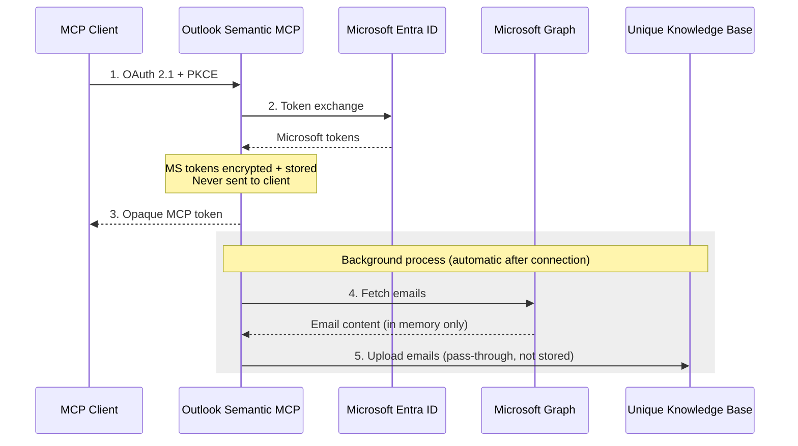
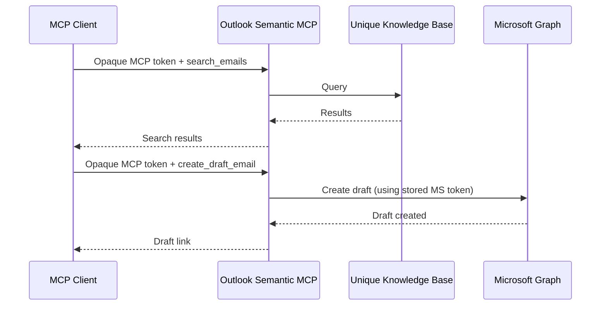
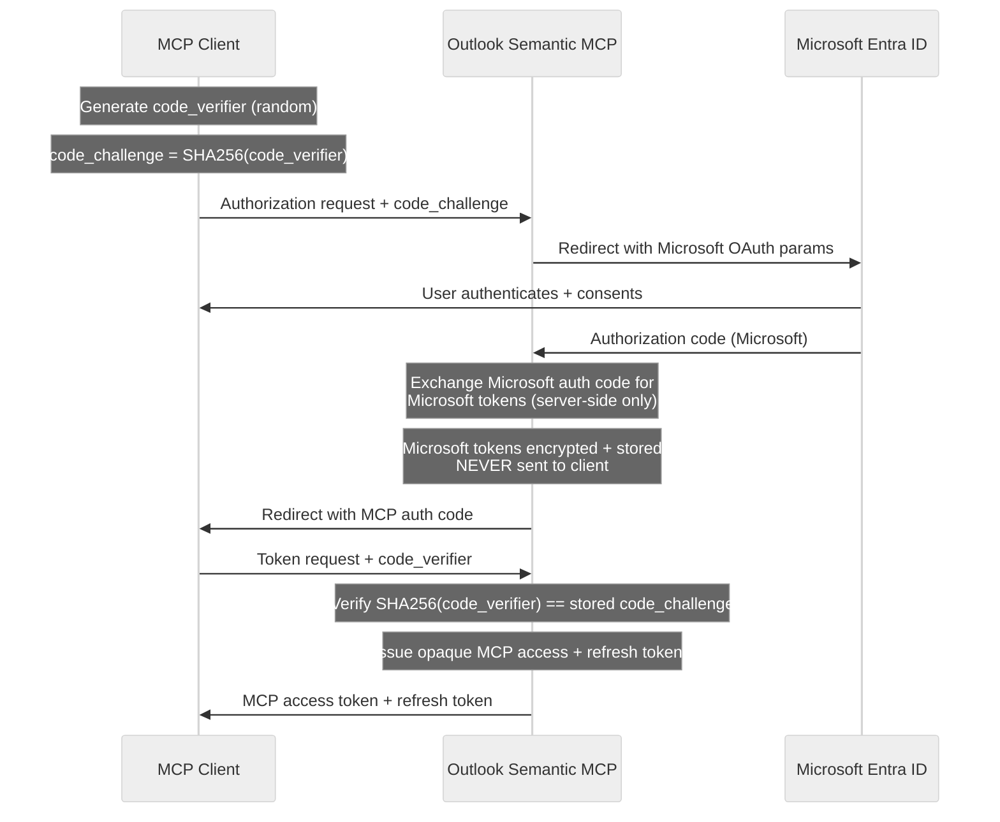
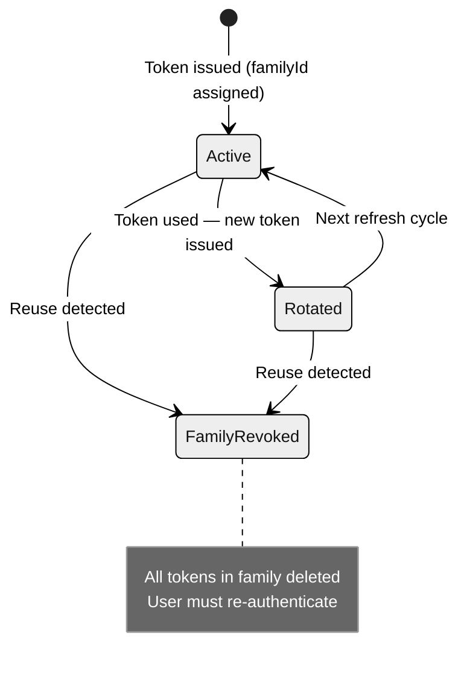
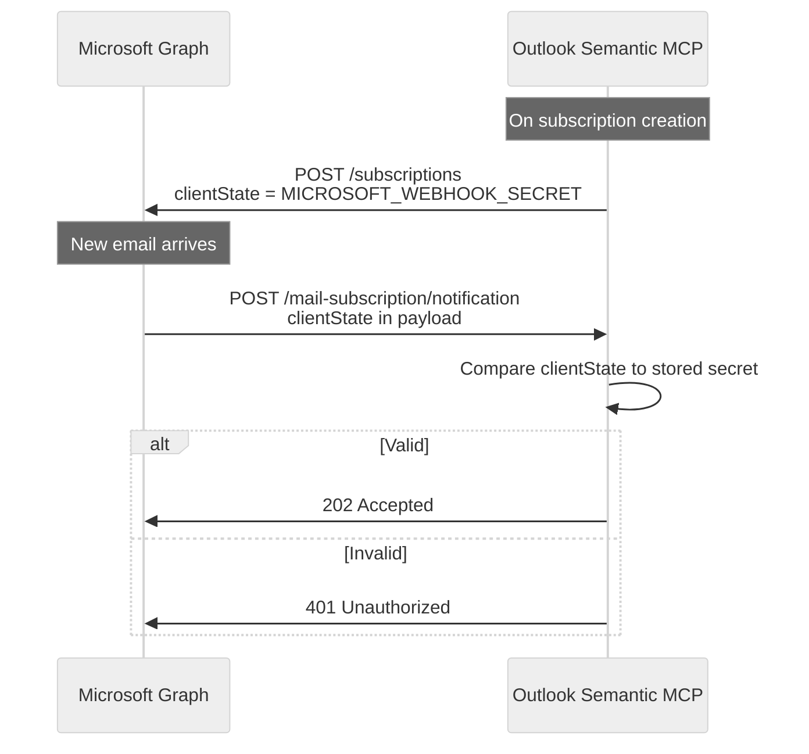

<!-- confluence-page-id: 2065399822 -->
<!-- confluence-space-key: PUBDOC -->

# Security

This document describes the security architecture, cryptographic decisions, and threat model for the Outlook Semantic MCP Server.

**Security at a Glance:**

- No email content stored in the MCP server's database — it acts as a secure pass-through to the Unique knowledge base
- Microsoft OAuth tokens encrypted at rest with AES-256-GCM
- OAuth 2.1 with mandatory PKCE for all MCP client authentication
- MCP tokens are 512-bit cryptographically random opaque values with TTL-based expiration
- Refresh token rotation with family-based revocation detects token theft
- Webhook notifications validated via `clientState` secret

## Data Classification and Flow

### What Is Stored Where

The Outlook Semantic MCP Server stores **no email content** in its own database. It acts as a secure pass-through: emails are fetched from Microsoft Graph into memory and uploaded directly to the Unique knowledge base. Nothing from the email body, subject, or attachments is written to the MCP server's PostgreSQL database.


| Data                                      | Stored In                         | Protection                   | Contains Email Content? |
| ----------------------------------------- | --------------------------------- | ---------------------------- | ----------------------- |
| Microsoft OAuth tokens (access + refresh) | PostgreSQL `user_profiles`        | AES-256-GCM encrypted        | No                      |
| MCP bearer tokens                         | PostgreSQL `tokens`               | Opaque 512-bit random values | No                      |
| Sync state and progress counters          | PostgreSQL `inbox_configurations` | Plaintext metadata           | No                      |
| Outlook folder structure (names + IDs)    | PostgreSQL `directories`          | Plaintext metadata           | No                      |
| Microsoft Graph subscription IDs          | PostgreSQL `subscriptions`        | Plaintext metadata           | No                      |
| Email subject, body, sender, recipients   | Unique Knowledge Base             | Indexed for semantic search  | **Yes**                 |


### Data Flow

**Connection and Sync** — The user authenticates once. The server obtains Microsoft tokens (kept server-side, encrypted), issues an opaque MCP token to the client, and begins syncing emails into the Unique knowledge base. No email content is stored in the MCP server's database.



**Tool Usage** — The MCP client uses its opaque token to call tools. The server handles all Microsoft Graph interaction internally — the client never sees Microsoft tokens.



### Data Removal


| Action                               | What Is Removed                                                                                        |
| ------------------------------------ | ------------------------------------------------------------------------------------------------------ |
| User calls `delete_inbox_data` | Microsoft Graph subscription, per-user root scopes and all ingested email content in Unique KB, inbox configuration, folder sync data |
| MCP tokens                           | Expire naturally (access: 60 seconds, refresh: 30 days); not automatically removed from KB             |


When a user calls `delete_inbox_data`, the per-user root scopes are removed from the Unique knowledge base, which also removes all ingested email content for that user.

## Knowledge Base Data Isolation

Each connected user's emails are stored in a **dedicated root scope** (a top-level isolation boundary in the Unique knowledge base that logically separates one user's data from another's) within the Unique knowledge base. Scopes are created automatically when the user connects (by `DirectoriesSyncModule`) and are removed when `delete_inbox_data` is called.

**Logical isolation:**

- All emails from a connected mailbox are stored under that user's root scope
- `search_emails` only queries the scope belonging to the authenticated user — the MCP server prevents one user's session from searching another user's emails
- Scope boundaries are enforced by the Unique scope management service

**Unique platform-level access:**

Access to email data at the Unique platform layer is governed by Unique's own access control model, not by the MCP server. Relevant access principals are:

| Principal                         | Access Level                                                           |
| --------------------------------- | ---------------------------------------------------------------------- |
| Authenticated MCP user            | Can search their own emails via `search_emails` tool                   |
| MCP server service account        | Write access to ingestion and scope management APIs (used during sync) |
| Unique platform administrators    | Can access email scopes via the Unique API (e.g. `scopesByCompany`) — scopes are not surfaced in the Unique UI and require direct API or database access |
| Direct PostgreSQL access (MCP DB) | Encrypted tokens and sync state only — no email content                |

Email scopes created by the MCP server are not visible in the Unique Knowledge Base UI. Accessing them requires direct Unique API calls or database access. Organizations with strict email privacy requirements should control who has API and database access to the Unique platform.

## Security Layers

### Webhook Requests

Webhook requests pass through each layer from top to bottom. Each layer must pass before the next is reached.

| Layer | Mechanism | Protects Against |
|-------|-----------|------------------|
| **Transport** | TLS 1.2+ via Kong Gateway | Eavesdropping, man-in-the-middle |
| **Rate Limiting** | IP-based throttling at ingress layer (e.g., Kong) | Brute-force, abuse |
| **Webhook Integrity** | `clientState` validation | Forged webhook notifications |

### MCP Requests

MCP requests pass through each layer from top to bottom. Each layer must pass before the next is reached.

| Layer | Mechanism | Protects Against |
|-------|-----------|------------------|
| **Transport** | TLS 1.2+ via Kong Gateway | Eavesdropping, man-in-the-middle |
| **Rate Limiting** | IP-based throttling at ingress layer (e.g., Kong) | Brute-force, abuse |
| **Authentication** | OAuth 2.1 + PKCE | Unauthorized access, authorization code interception |
| **Session Integrity** | HMAC-SHA256 on OAuth session state | Session hijacking via forged callbacks |
| **Token Design** | 512-bit cryptographically random opaque values | Token guessing |
| **Data at Rest** | AES-256-GCM encryption for Microsoft tokens | Token theft from database |


## Token Security

### Microsoft Tokens (Encrypted at Rest)

Microsoft access and refresh tokens are stored encrypted using **AES-256-GCM**:


| Aspect        | Implementation                                         |
| ------------- | ------------------------------------------------------ |
| Algorithm     | AES-256-GCM (authenticated encryption)                 |
| Key Size      | 256 bits (32 bytes, provided as 64 hex characters)     |
| IV            | Random 12 bytes generated per encryption operation     |
| Stored Format | `{iv}.{tag}.{data}` — all components base64 encoded (handled by the `@unique-ag/mcp-oauth` package) |
| Key Storage   | `ENCRYPTION_KEY` environment variable                  |


**Why AES-GCM:**

- Provides both confidentiality and integrity — ciphertext tampering is detected before decryption
- Industry standard for symmetric token encryption
- GCM authentication tag prevents oracle attacks

**Token lifecycle:**

1. Microsoft issues tokens during OAuth flow
2. Tokens encrypted immediately before database write into `user_profiles`
3. Tokens decrypted only when needed for Graph API calls
4. Re-encrypted after a successful refresh

### MCP Tokens (Opaque Random Values)

MCP access and refresh tokens are cryptographically random opaque values:


| Aspect            | Implementation                                              |
| ----------------- | ----------------------------------------------------------- |
| Generation        | `randomBytes(64)` encoded as base64url (512-bit)            |
| Storage           | Stored directly in `tokens` table with TTL-based expiration |
| Validation        | Cache-first lookup, then database check                     |
| Security property | Unguessability (512-bit random) — not hashing               |


**Token TTLs:**


| Token Type              | Default TTL | Source | Configurable Via                        |
| ----------------------- | ----------- | ------ | --------------------------------------- |
| MCP Access Token        | 60 seconds  | Service limit | `AUTH_ACCESS_TOKEN_EXPIRES_IN_SECONDS`  |
| MCP Refresh Token       | 30 days     | Service limit | `AUTH_REFRESH_TOKEN_EXPIRES_IN_SECONDS` |
| Microsoft Access Token  | ~1 hour     | Microsoft limit | Not configurable — issued by Microsoft  |
| Microsoft Refresh Token | ~90 days    | Microsoft limit | Not configurable — issued by Microsoft  |


### Session State Integrity (AUTH_HMAC_SECRET)

During the OAuth callback, the server validates session state using HMAC-SHA256:

```
HMAC-SHA256(AUTH_HMAC_SECRET, "{sessionId}:{sessionNonce}") → base64url
```

This prevents an attacker from injecting a forged OAuth callback that could hijack another user's session.

## OAuth 2.1 with PKCE

The MCP OAuth implementation follows [OAuth 2.1](https://oauth.net/2.1/) with mandatory PKCE. The tokens issued to the client are **opaque MCP tokens** — Microsoft tokens remain on the server and are never sent to any client.




**PKCE protection:**

- Prevents authorization code interception attacks
- Mandatory for all clients
- `S256` method: `SHA256(code_verifier)` encoded as base64url
- Authorization codes are single-use — consumed immediately after exchange

**Token separation:**


| Token                   | Stays On    | Used For                  |
| ----------------------- | ----------- | ------------------------- |
| Microsoft access token  | Server only | Graph API calls           |
| Microsoft refresh token | Server only | Renewing Graph access     |
| MCP access token        | Client      | Authenticating tool calls |
| MCP refresh token       | Client      | Renewing MCP access       |


## Refresh Token Rotation

MCP refresh tokens are rotated on every use with family-based revocation:




**How family revocation works:**

Each token pair shares a `familyId` (format: `tkfam_...`) and a `generation` counter. On every refresh:

1. Server checks `usedAt` — if already set, the token was reused
2. If **reused** → entire family revoked immediately (all tokens with same `familyId` deleted)
3. If **valid** → token marked used, new token issued with incremented `generation`

This detects scenarios where an attacker obtains a refresh token and uses it while the legitimate client still holds the original. Whichever uses it second triggers the revocation.

## Webhook Validation

Microsoft Graph webhook notifications are validated using the `clientState` field:




**Validation details:**

- `MICROSOFT_WEBHOOK_SECRET` is a 128-character random string (`openssl rand -hex 64`)
- Set as `clientState` when creating Graph subscriptions
- Returned unchanged in every webhook payload from Microsoft
- Notifications with an invalid `clientState` are rejected before any processing

## Rate Limiting

Rate limiting is expected to be handled at the infrastructure/ingress layer (e.g., Kong ingress controller), not within the application itself. The following limits are recommended:


| Scope                  | Recommended Limit        | Layer | Purpose                                |
| ---------------------- | ------------------------ | ----- | -------------------------------------- |
| Global (all endpoints) | 10 requests / 60 seconds | Ingress (Kong) | General brute-force protection         |
| Authorization endpoint | 3 requests / 60 seconds  | Ingress (Kong) | Tighter protection for auth initiation |


## Secret Management

### Required Secrets

For the full secrets reference (format, generation, and description), see [Configuration — Required Secrets](../operator/configuration.md#Required-Secrets).

| Secret                     | Rotation Impact                     |
| -------------------------- | ----------------------------------- |
| `ENCRYPTION_KEY`           | All users must reconnect            |
| `AUTH_HMAC_SECRET`         | Only mid-OAuth-flow sessions invalidated |
| `MICROSOFT_CLIENT_SECRET`  | Update + restart only (zero-downtime) |
| `MICROSOFT_WEBHOOK_SECRET` | All subscriptions must be recreated |

### Rotation Procedures

For detailed secret rotation procedures, see [Authentication — Secret Rotation](../operator/authentication.md#Secret-Rotation).

Key security considerations for rotation:

- **`ENCRYPTION_KEY`** and **`MICROSOFT_WEBHOOK_SECRET`** have no zero-downtime rotation path — plan these as maintenance windows and notify users in advance.
- **`AUTH_HMAC_SECRET`** is the lowest-impact secret to rotate — existing connections are unaffected and only mid-OAuth-flow users are affected.
- **`MICROSOFT_CLIENT_SECRET`** supports zero-downtime rotation because Microsoft allows multiple active client secrets simultaneously.

## Security Checklist for Operators

See [Operator Manual — Security Checklist](../operator/README.md#Security-Checklist) for the full pre-production checklist.

## Related Documentation

- [Architecture](./architecture.md) - Token isolation, storage, and authentication layers
- [Flows](./flows.md) - OAuth connection and token refresh flows
- [Permissions](./permissions.md) - Microsoft Graph permissions and consent
- [Configuration](../operator/configuration.md) - Secret configuration reference

## Standard References

- [RFC 7636 - PKCE](https://datatracker.ietf.org/doc/html/rfc7636) - Proof Key for Code Exchange
- [RFC 6749 - OAuth 2.0](https://datatracker.ietf.org/doc/html/rfc6749) - OAuth 2.0 Authorization Framework
- [OAuth 2.1](https://oauth.net/2.1/) - OAuth 2.1 specification
- [NIST SP 800-38D](https://csrc.nist.gov/publications/detail/sp/800-38d/final) - AES-GCM specification
