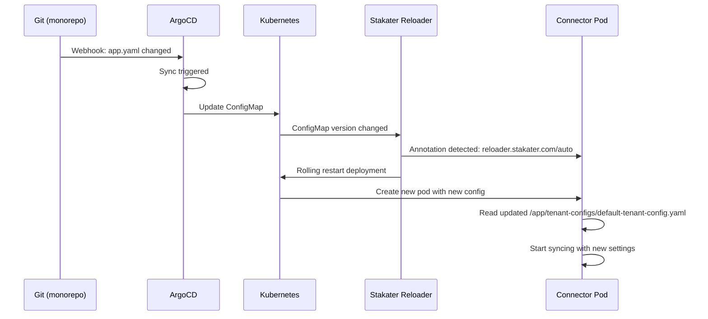

# SharePoint Connector Configuration Flow

## Mermaid Diagram

```mermaid
graph TB
    subgraph "1. GitOps Repository (monorepo)"
        A[app.yaml in monorepo] --> |Contains valuesObject| B{ArgoCD Detects Change}
    end
    
    subgraph "2. ArgoCD Processing"
        B --> C[Fetch Helm Chart from connectors repo]
        C --> D[Extract valuesObject from app.yaml]
        D --> E[Execute: helm template with values]
    end
    
    subgraph "3. Helm Template Engine"
        E --> F[Load tenant-config.yaml template]
        F --> G[Replace {{ .Values.xxx }} placeholders]
        G --> H{Evaluate Conditionals}
        H --> |if statements| I[Include/Exclude Sections]
        I --> J[Generate Final ConfigMap YAML]
    end
    
    subgraph "4. Kubernetes Cluster"
        J --> K[kubectl apply ConfigMap]
        K --> L[ConfigMap Resource Created]
        L --> |name: sharepoint-connector-tenant-config| M[ConfigMap Stored in etcd]
    end
    
    subgraph "5. Pod Runtime"
        M --> |Volume Mount| N[Mount ConfigMap as File]
        N --> O[/app/tenant-configs/default-tenant-config.yaml]
        O --> P[Application Reads File]
        P --> Q[Validate with TypeScript Schemas]
        Q --> R[Connector Starts Syncing]
    end
    
    style A fill:#e1f5ff
    style J fill:#fff4e1
    style L fill:#e8f5e9
    style O fill:#fce4ec
    style R fill:#f3e5f5
```

## Detailed Flow Diagram

```
┌──────────────────────────────────────────────────────────────────────────────┐
│                     STEP 1: GITOPS CONFIGURATION                             │
│                    (monorepo/gitops-resources/argocd)                        │
├──────────────────────────────────────────────────────────────────────────────┤
│                                                                              │
│  📁 clusters/unique/qa/application-specs/connectors/sharepoint-connector/   │
│     └── app.yaml                                                            │
│         ┌────────────────────────────────────────────────────────┐         │
│         │ spec:                                                  │         │
│         │   sources:                                             │         │
│         │     - repoURL: github.com/Unique-AG/connectors.git    │         │
│         │       path: services/sharepoint-connector/deploy/...  │         │
│         │       helm:                                            │         │
│         │         valuesObject:                                  │         │
│         │           connectorConfig:                             │         │
│         │             sharepoint:                                │         │
│         │               tenantId: "f96a6b77-..."                │         │
│         │               baseUrl: "https://dogfood..."           │         │
│         │               sitesSource: "sharepoint_list"          │         │
│         │               sharepointList:                          │         │
│         │                 siteId: "af2b5be6-..."                │         │
│         │                 listDisplayName: "Sites to Sync"       │         │
│         │               apiRateLimitPerMinuteThousands: 180     │         │
│         │             unique:                                    │         │
│         │               authMode: "cluster_local"                │         │
│         │               serviceExtraHeaders:                     │         │
│         │                 x-company-id: "225319369..."          │         │
│         └────────────────────────────────────────────────────────┘         │
│                                  │                                           │
│                                  │ Git Push                                  │
│                                  ▼                                           │
└──────────────────────────────────────────────────────────────────────────────┘

┌──────────────────────────────────────────────────────────────────────────────┐
│                     STEP 2: ARGOCD ORCHESTRATION                             │
├──────────────────────────────────────────────────────────────────────────────┤
│                                                                              │
│  🔄 ArgoCD Controller                                                        │
│  ┌─────────────────────────────────────────────────────────────┐           │
│  │ 1. Poll Git repository every 3 minutes                       │           │
│  │ 2. Detect change in app.yaml                                │           │
│  │ 3. Compare desired state vs actual state                     │           │
│  │ 4. Trigger Sync Operation:                                   │           │
│  │    - Clone connectors repo                                   │           │
│  │    - Navigate to helm chart path                             │           │
│  │    - Execute Helm with values                                │           │
│  └─────────────────────────────────────────────────────────────┘           │
│                                  │                                           │
│                                  │ helm template command                     │
│                                  ▼                                           │
└──────────────────────────────────────────────────────────────────────────────┘

┌──────────────────────────────────────────────────────────────────────────────┐
│                   STEP 3: HELM TEMPLATE RENDERING                            │
├──────────────────────────────────────────────────────────────────────────────┤
│                                                                              │
│  ⚙️ Helm Template Engine                                                     │
│  ┌─────────────────────────────────────────────────────────────┐           │
│  │ INPUT: templates/tenant-config.yaml                          │           │
│  │ ┌───────────────────────────────────────────────────────┐   │           │
│  │ │ {{- if .Values.connectorConfig.enabled }}             │   │           │
│  │ │ apiVersion: v1                                        │   │           │
│  │ │ kind: ConfigMap                                       │   │           │
│  │ │ metadata:                                             │   │           │
│  │ │   name: sharepoint-connector-tenant-config           │   │           │
│  │ │ data:                                                 │   │           │
│  │ │   default-tenant-config.yaml: |                      │   │           │
│  │ │     sharepoint:                                       │   │           │
│  │ │       tenantId: {{ .Values...tenantId | quote }}     │   │           │
│  │ │       baseUrl: {{ .Values...baseUrl | quote }}       │   │           │
│  │ │       {{- if .Values...apiRateLimitPerMinute... }}   │   │           │
│  │ │       graphApiRateLimitPerMinuteThousands: {{ ... }} │   │           │
│  │ │       {{- end }}                                      │   │           │
│  │ │       sitesSource: {{ .Values...sitesSource }}       │   │           │
│  │ │       {{- if eq .Values...sitesSource "sharepoint... │   │           │
│  │ │       sharepointList:                                 │   │           │
│  │ │         {{- with .Values...sharepointList }}          │   │           │
│  │ │         siteId: {{ .siteId | quote }}                │   │           │
│  │ │         listDisplayName: {{ .listDisplayName }}      │   │           │
│  │ │         {{- end }}                                     │   │           │
│  │ │       {{- end }}                                      │   │           │
│  │ └───────────────────────────────────────────────────────┘   │           │
│  │                                                              │           │
│  │ PROCESSING STEPS:                                           │           │
│  │  ✓ Replace {{ .Values.xxx }} with actual values            │           │
│  │  ✓ Evaluate {{- if ... }} conditionals                     │           │
│  │  ✓ Apply filters: | quote, | nindent                       │           │
│  │  ✓ Loop {{- range }} over arrays                           │           │
│  │  ✓ Execute {{- with }} context switches                    │           │
│  │                                                              │           │
│  │ OUTPUT: Rendered Kubernetes Manifest                        │           │
│  │ ┌───────────────────────────────────────────────────────┐   │           │
│  │ │ apiVersion: v1                                        │   │           │
│  │ │ kind: ConfigMap                                       │   │           │
│  │ │ metadata:                                             │   │           │
│  │ │   name: sharepoint-connector-tenant-config           │   │           │
│  │ │   namespace: finance-gpt                             │   │           │
│  │ │   labels:                                             │   │           │
│  │ │     helm.sh/chart: sharepoint-connector-2.0.0-beta.8 │   │           │
│  │ │     app.kubernetes.io/name: sharepoint-connector     │   │           │
│  │ │ data:                                                 │   │           │
│  │ │   default-tenant-config.yaml: |                      │   │           │
│  │ │     sharepoint:                                       │   │           │
│  │ │       tenantId: "f96a6b77-d28b-491a-8bad-607af..."   │   │           │
│  │ │       baseUrl: "https://dogfoodindustries..."        │   │           │
│  │ │       graphApiRateLimitPerMinuteThousands: 180       │   │           │
│  │ │       sitesSource: "sharepoint_list"                  │   │           │
│  │ │       sharepointList:                                 │   │           │
│  │ │         siteId: "af2b5be6-a37d-4992-ab8f-988..."     │   │           │
│  │ │         listDisplayName: "Sites to Sync"              │   │           │
│  │ │       auth:                                           │   │           │
│  │ │         mode: "certificate"                           │   │           │
│  │ │         clientId: "81154c31-c543-4458-811b-152..."   │   │           │
│  │ │         privateKeyPath: "/app/key.pem"                │   │           │
│  │ │         thumbprintSha1: "38E031FCDE64A24D9FF68..."    │   │           │
│  │ │     unique:                                           │   │           │
│  │ │       serviceAuthMode: "cluster_local"                │   │           │
│  │ │       serviceExtraHeaders:                            │   │           │
│  │ │         x-company-id: "225319369280852798"            │   │           │
│  │ │         x-user-id: "335951437550850059"               │   │           │
│  │ │       ingestionServiceBaseUrl: "http://node-ing..."   │   │           │
│  │ │       scopeManagementServiceBaseUrl: "http://nod..." │   │           │
│  │ │       apiRateLimitPerMinute: 20                       │   │           │
│  │ │     processing:                                       │   │           │
│  │ │       stepTimeoutSeconds: 300                         │   │           │
│  │ │       concurrency: 1                                  │   │           │
│  │ │       allowedMimeTypes:                               │   │           │
│  │ │         - "application/pdf"                           │   │           │
│  │ │         - "text/plain"                                │   │           │
│  │ │         - "application/vnd.openxmlformats-..."       │   │           │
│  │ │       scanIntervalCron: "*/15 * * * *"                │   │           │
│  │ └───────────────────────────────────────────────────────┘   │           │
│  └─────────────────────────────────────────────────────────────┘           │
│                                  │                                           │
│                                  │ kubectl apply                             │
│                                  ▼                                           │
└──────────────────────────────────────────────────────────────────────────────┘

┌──────────────────────────────────────────────────────────────────────────────┐
│                   STEP 4: KUBERNETES RESOURCE STORAGE                        │
├──────────────────────────────────────────────────────────────────────────────┤
│                                                                              │
│  ☸️ Kubernetes API Server                                                    │
│  ┌─────────────────────────────────────────────────────────────┐           │
│  │ 1. Receive ConfigMap manifest from ArgoCD                   │           │
│  │ 2. Validate against ConfigMap API schema                    │           │
│  │ 3. Store in etcd (key-value store)                          │           │
│  │ 4. Trigger ConfigMap watch events                           │           │
│  └─────────────────────────────────────────────────────────────┘           │
│                                                                              │
│  💾 etcd (Cluster State Database)                                           │
│  ┌─────────────────────────────────────────────────────────────┐           │
│  │ /registry/configmaps/finance-gpt/sharepoint-connector-...   │           │
│  │ ┌───────────────────────────────────────────────────────┐   │           │
│  │ │ ConfigMap Object:                                     │   │           │
│  │ │   metadata:                                           │   │           │
│  │ │     name: sharepoint-connector-tenant-config         │   │           │
│  │ │     namespace: finance-gpt                           │   │           │
│  │ │   data:                                               │   │           │
│  │ │     default-tenant-config.yaml: |                    │   │           │
│  │ │       <entire YAML content as a string>              │   │           │
│  │ └───────────────────────────────────────────────────────┘   │           │
│  └─────────────────────────────────────────────────────────────┘           │
│                                  │                                           │
│                                  │ Kubelet mounts volume                     │
│                                  ▼                                           │
└──────────────────────────────────────────────────────────────────────────────┘

┌──────────────────────────────────────────────────────────────────────────────┐
│                   STEP 5: POD VOLUME MOUNTING                                │
├──────────────────────────────────────────────────────────────────────────────┤
│                                                                              │
│  🐳 Pod: sharepoint-connector-7d9b8c5f6-xk2p9                               │
│  ┌─────────────────────────────────────────────────────────────┐           │
│  │ Deployment Definition (from values.yaml):                    │           │
│  │ ┌───────────────────────────────────────────────────────┐   │           │
│  │ │ volumes:                                              │   │           │
│  │ │   - name: tenant-config                              │   │           │
│  │ │     configMap:                                        │   │           │
│  │ │       name: sharepoint-connector-tenant-config       │   │           │
│  │ │                                                       │   │           │
│  │ │ volumeMounts:                                         │   │           │
│  │ │   - name: tenant-config                              │   │           │
│  │ │     mountPath: /app/tenant-configs                           │   │           │
│  │ │     readOnly: true                                    │   │           │
│  │ └───────────────────────────────────────────────────────┘   │           │
│  │                                                              │           │
│  │ Kubelet Process:                                            │           │
│  │  1. Read ConfigMap from API Server                          │           │
│  │  2. Extract data["default-tenant-config.yaml"]             │           │
│  │  3. Write to tmpfs (in-memory filesystem)                   │           │
│  │  4. Mount at /app/tenant-configs as read-only                       │           │
│  │                                                              │           │
│  │ Container Filesystem View:                                  │           │
│  │ ┌───────────────────────────────────────────────────────┐   │           │
│  │ │ /                                                     │   │           │
│  │ │ ├── app/                                              │   │           │
│  │ │ │   ├── config/  ◄── Volume Mount Point              │   │           │
│  │ │ │   │   └── default-tenant-config.yaml  ◄── THE FILE │   │           │
│  │ │ │   ├── key.pem  (from secret volume)                 │   │           │
│  │ │ │   ├── dist/    (application code)                   │   │           │
│  │ │ │   └── node_modules/                                 │   │           │
│  │ │ └── tmp/                                              │   │           │
│  │ └───────────────────────────────────────────────────────┘   │           │
│  │                                                              │           │
│  │ File Contents (/app/tenant-configs/default-tenant-config.yaml):     │           │
│  │ ┌───────────────────────────────────────────────────────┐   │           │
│  │ │ sharepoint:                                           │   │           │
│  │ │   tenantId: "f96a6b77-d28b-491a-8bad-607af412b850"   │   │           │
│  │ │   baseUrl: "https://dogfoodindustries.sharepoint.com"│   │           │
│  │ │   graphApiRateLimitPerMinuteThousands: 180           │   │           │
│  │ │   sitesSource: "sharepoint_list"                      │   │           │
│  │ │   sharepointList:                                     │   │           │
│  │ │     siteId: "af2b5be6-a37d-4992-ab8f-988b0134007e"   │   │           │
│  │ │     listDisplayName: "Sites to Sync"                  │   │           │
│  │ │   auth:                                               │   │           │
│  │ │     mode: "certificate"                               │   │           │
│  │ │     clientId: "81154c31-c543-4458-811b-15245f48205b" │   │           │
│  │ │     privateKeyPath: "/app/key.pem"                    │   │           │
│  │ │     thumbprintSha1: "38E031FCDE64A24D9FF68B8783..."   │   │           │
│  │ │ unique:                                               │   │           │
│  │ │   serviceAuthMode: "cluster_local"                    │   │           │
│  │ │   serviceExtraHeaders:                                │   │           │
│  │ │     x-company-id: "225319369280852798"                │   │           │
│  │ │     x-user-id: "335951437550850059"                   │   │           │
│  │ │   ingestionServiceBaseUrl: "http://node-ingestion..." │   │           │
│  │ │   scopeManagementServiceBaseUrl: "http://node-scop..."│   │           │
│  │ │   apiRateLimitPerMinute: 20                           │   │           │
│  │ │ processing:                                           │   │           │
│  │ │   stepTimeoutSeconds: 300                             │   │           │
│  │ │   concurrency: 1                                      │   │           │
│  │ │   allowedMimeTypes:                                   │   │           │
│  │ │     - "application/pdf"                               │   │           │
│  │ │     - "text/plain"                                    │   │           │
│  │ │   scanIntervalCron: "*/15 * * * *"                    │   │           │
│  │ └───────────────────────────────────────────────────────┘   │           │
│  └─────────────────────────────────────────────────────────────┘           │
│                                  │                                           │
│                                  │ Application startup                       │
│                                  ▼                                           │
└──────────────────────────────────────────────────────────────────────────────┘

┌──────────────────────────────────────────────────────────────────────────────┐
│                   STEP 6: APPLICATION RUNTIME                                │
├──────────────────────────────────────────────────────────────────────────────┤
│                                                                              │
│  🚀 SharePoint Connector Application (NestJS)                               │
│  ┌─────────────────────────────────────────────────────────────┐           │
│  │ Environment Variables:                                       │           │
│  │   TENANT_CONFIG_PATH_PATTERN=/app/tenant-configs/*-tenant-config.yaml          │
│  │                                                              │           │
│  │ Bootstrap Sequence:                                          │           │
│  │ ┌───────────────────────────────────────────────────────┐   │           │
│  │ │ 1. main.ts starts NestJS application                  │   │           │
│  │ │ 2. ConfigModule loads environment variables           │   │           │
│  │ │ 3. glob(TENANT_CONFIG_PATH_PATTERN) searches for files│   │           │
│  │ │    → Finds: /app/tenant-configs/default-tenant-config.yaml   │   │           │
│  │ │ 4. fs.readFileSync() reads YAML content               │   │           │
│  │ │ 5. yaml.parse() converts string to JavaScript object  │   │           │
│  │ │ 6. Validate against Zod schemas:                      │   │           │
│  │ │    - sharepoint.schema.ts                             │   │           │
│  │ │    - unique.schema.ts                                 │   │           │
│  │ │    - processing.schema.ts                             │   │           │
│  │ │ 7. If validation passes, store in ConfigService       │   │           │
│  │ │ 8. If validation fails, throw error & crash pod       │   │           │
│  │ └───────────────────────────────────────────────────────┘   │           │
│  │                                                              │           │
│  │ Runtime Behavior:                                            │           │
│  │ ┌───────────────────────────────────────────────────────┐   │           │
│  │ │ GraphApiService.authenticate()                        │   │           │
│  │ │   → Uses: config.sharepoint.tenantId                  │   │           │
│  │ │   → Uses: config.sharepoint.auth.clientId            │   │           │
│  │ │   → Reads: /app/key.pem (certificate)                │   │           │
│  │ │   → Creates JWT with thumbprint                       │   │           │
│  │ │                                                       │   │           │
│  │ │ SiteConfigService.getSites()                          │   │           │
│  │ │   → If sitesSource="sharepoint_list":                │   │           │
│  │ │       Fetches from SharePoint API using:              │   │           │
│  │ │       - config.sharepoint.sharepointList.siteId       │   │           │
│  │ │       - config.sharepoint.sharepointList.listDisplayName│   │       │
│  │ │   → If sitesSource="config_file":                    │   │           │
│  │ │       Returns: config.sharepoint.sites[]              │   │           │
│  │ │                                                       │   │           │
│  │ │ CronScheduler starts:                                 │   │           │
│  │ │   → Schedule: config.processing.scanIntervalCron      │   │           │
│  │ │   → Every 15 minutes (default):                       │   │           │
│  │ │       1. Get sites list                               │   │           │
│  │ │       2. For each site:                               │   │           │
│  │ │          - Fetch files from SharePoint                │   │           │
│  │ │          - Submit to Unique Ingestion API             │   │           │
│  │ │          - Rate limit with apiRateLimitPerMinute      │   │           │
│  │ └───────────────────────────────────────────────────────┘   │           │
│  └─────────────────────────────────────────────────────────────┘           │
│                                                                              │
│  ✅ Connector is now actively syncing SharePoint sites to Unique            │
└──────────────────────────────────────────────────────────────────────────────┘
```

## Key Transformation Summary

| Stage | Format | Location |
|-------|--------|----------|
| 1. GitOps | YAML (in git) | `monorepo/.../app.yaml` |
| 2. Helm Values | Go template variables | In-memory during `helm template` |
| 3. Rendered Manifest | YAML (ConfigMap) | Sent to Kubernetes API |
| 4. Stored Resource | YAML string (in data field) | etcd database |
| 5. Volume Mount | YAML file | `/app/tenant-configs/default-tenant-config.yaml` |
| 6. Application | JavaScript object | `ConfigService` in memory |

## Auto-Reload Mechanism

When you update `app.yaml` and push to Git:



The entire flow ensures that configuration is:
- ✅ Version controlled (Git)
- ✅ Validated (Helm schema + TypeScript Zod)
- ✅ Encrypted at rest (etcd)
- ✅ Immutable (ConfigMap is read-only)
- ✅ Automatically applied (ArgoCD + Reloader)
