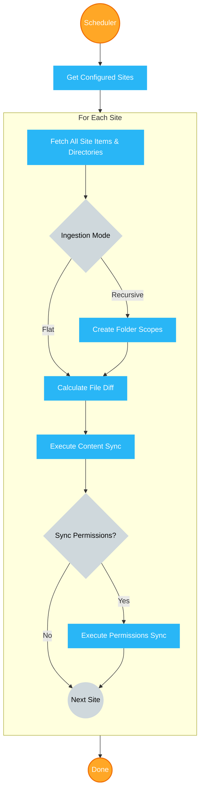
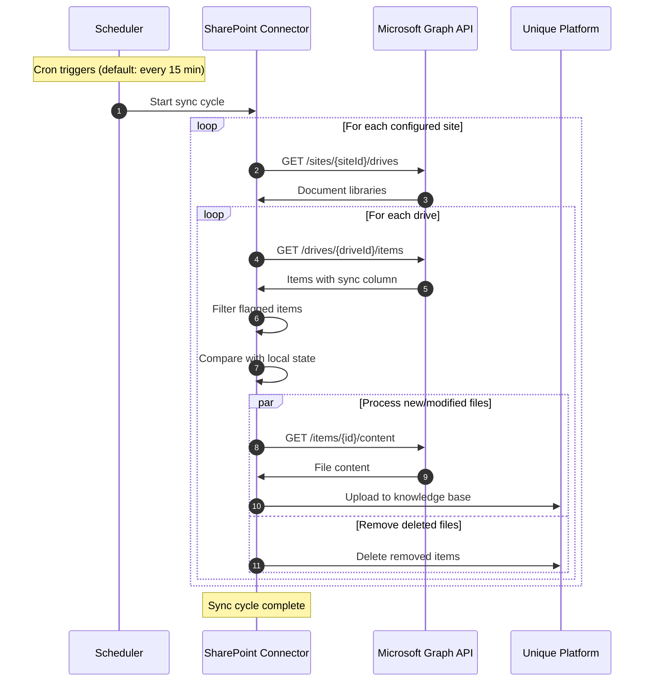

<!-- confluence-space-key: PUBDOC -->

## Overview

The SharePoint Connector is a cloud-native application that automatically synchronizes documents from SharePoint Online to the Unique knowledge base. This guide provides administrators with essential information about requirements, features, and limitations.

For deployment, configuration, and operational details, see the [IT Operator Guide](./operator/README.md).

## Quick Summary

**What it does:** Automatically syncs flagged documents from SharePoint Online to Unique's AI knowledge base

**Deployment:** Kubernetes-based containerized application

**Authentication:** Uses Azure AD application permissions (no user accounts needed)

**Scheduling:** Configurable automated scans (default: every 15 minutes)

## Requirements

### Microsoft 365 / SharePoint Online

| Requirement | Details |
|-------------|---------|
| **SharePoint Online** | Active tenant with document libraries |
| **Azure AD** | Tenant with Global Administrator or Application Administrator rights |
| **License** | Standard SharePoint Online license (included in most Microsoft 365 plans) |

**Prerequisites:**

- Access to Azure AD for app registration
- SharePoint sites with document libraries
- Ability to add custom columns to document libraries

### Permissions

**Content sync:**

Microsoft Graph:

- `Sites.Selected` - Fetch sites, folders and effective content of granted sites (if site-specific access is granted)
- `Lists.SelectedOperations.Selected` - Fetch content from specifically granted document libraries (if library-specific access is granted)

**Permission sync** (only if permission sync is enabled):

Microsoft Graph:

- `GroupMember.Read.All` - Read members of the groups files were shared with
- `User.ReadBasic.All` - Read details of the groups files were shared with

SharePoint REST API:

- `Sites.Selected` - Read details and members of site groups files were shared with for granted sites

For detailed permission justifications, see [Microsoft Graph Permissions](./technical/permissions.md).

## Features

### Core Capabilities

**Automated Periodic Document Synchronization**

- Periodic scanning of designated SharePoint sites configurable without code change (default: every 15 min)
- User-controlled flagging via custom column in SharePoint
- Automatic detection of new, modified, and deleted files

**Sync Modes**

- **content_and_permissions:** Full sync of both content and SharePoint permissions to Unique
- **content_only:** Sync content without SharePoint permissions; uses configurable inheritance modes for scopes and files
- Configurable per site for flexible access control strategies

**Permission Sync**

- Access to specific SharePoint objects/files are synced periodically between SharePoint and Unique
- User mapping from SharePoint to Unique Users
- SharePoint Groups are reflected in Unique

**Selective Sync**

- Users flag documents for sync using a Yes/No column
- Only flagged documents are synchronized
- Administrators control which sites are scanned

**Ingestion Modes**

- **Flat mode:** All flagged files from a site are ingested into a single root scope
- **Recursive mode:** Maintains the SharePoint folder hierarchy as nested scopes in Unique
- Configurable per site for flexible organization

**Multiple Document Formats**

- Configurable via tenant configuration file
- Available MIME types:
  - PDF documents (`.pdf`)
  - Microsoft Word (`.docx`)
  - Microsoft Excel (`.xlsx`)
  - Microsoft PowerPoint (`.pptx`)
  - Text files (`.txt`)
  - SharePoint Sites (`.aspx`)

**Automatic Change Detection**

- File-diff mechanism compares local vs SharePoint state
- Only new or modified files are re-ingested
- Deleted files automatically removed from knowledge base

**Flexible Authentication**

- Certificate-based authentication (recommended for production)
- Client secret authentication (development/testing only)

### Advanced Features

**Security**

- Application-level authentication via Certificate
- Site-specific access (not tenant-wide)
- Each site must be explicitly granted access by SharePoint administrator

**Dynamic Site Configuration**

- Sites can be configured via a SharePoint list (dynamic) or YAML file (static)
- Per-site configuration: sync column, ingestion mode, permissions mode
- Manage site configurations without redeploying the connector

**Observability**

- Detailed logging with trace IDs
- Grafana dashboard templates
- Performance metrics
- Error tracking and alerting

**Configuration**

- Rate limiting (Graph API and Unique API)
- Concurrent file processing
- File size limits
- Custom MIME type filtering
- Scan interval scheduling

## How It Works

### High-Level Flow

See [Architecture Documentation](./technical/architecture.md) for detailed component diagrams.

### Content Sync Flow

See [Content Sync Flow](./technical/flows.md#content-sync-flow) for additional details.

### User Workflow

1. **Administrator Setup** (One-time)
   - Deploy connector to Kubernetes
   - Register Azure AD application
   - Grant site-specific permissions
   - Configure sync column name

2. **SharePoint Administrator** (Per Library)
   - Add sync column to document libraries
   - Set column visibility for users

3. **End Users** (Ongoing)
   - Check sync column for documents to sync
   - Connector automatically picks up flagged files

4. **Automated Processing**
   - Connector scans sites every 15 minutes (configurable)
   - Downloads flagged files
   - Uploads to Unique knowledge base
   - Updates metadata

## Limitations and Constraints

### Not Supported

- The version `2.0.0` has a limitation of maximum 100,000 objects to sync
- Multiple SharePoint tenants (requires separate deployments)
- Real-time synchronization (periodic scanning only)
- Detection of sensitivity/classification levels (can be configured via Ingestion Metadata Filter on the Unique side)

### Considerations

| Constraint | Impact | Mitigation |
|------------|--------|------------|
| **Files must be explicitly flagged** | No automatic sync | Document user workflow clearly |
| **Requires custom column per library** | Setup overhead per library | Provide setup guide |
| **One connector per SharePoint tenant** | Multiple deployments for multi-tenant | Document multi-origin workaround |
| **Horizontal scaling not supported** | Single pod deployment | Adequate resource allocation |
| **Permission sync group visibility** | App principal needs member/owner or Full Control | Document requirement |

## Future Versions

Planned enhancements:

| Enhancement | Rationale |
|-------------|-----------|
| Multi-SharePoint / Multi-Microsoft-Tenant Support | High priority on roadmap |
| Admin UI for configuration | Needs feature parity first |
| On-demand syncing mechanics | Business case not yet clear |

## Related Documentation

- [FAQ](./faq.md) - Frequently asked questions

### For IT Operators

- [Operator Guide](./operator/README.md) - Deployment, configuration, and operations
  - [Deployment](./operator/deployment.md) - Kubernetes and Helm setup
  - [Configuration](./operator/configuration.md) - Environment variables and settings
  - [Authentication](./operator/authentication.md) - Azure AD and certificate setup

### Technical Reference

- [Technical Reference](./technical/README.md) - Architecture, flows, and design decisions
  - [Architecture](./technical/architecture.md) - System components and infrastructure
  - [Flows](./technical/flows.md) - Content sync, permission sync, file diff mechanism
  - [Permissions](./technical/permissions.md) - Microsoft Graph and SharePoint REST permissions
  - [Security](./technical/security.md) - Security updates and SBOM

## Standard References

- [Microsoft Graph API](https://learn.microsoft.com/en-us/graph/overview) - Microsoft Graph documentation
- [Microsoft Graph Permissions Reference](https://learn.microsoft.com/en-us/graph/permissions-reference) - Permission details
- [Microsoft Entra ID Documentation](https://learn.microsoft.com/en-us/entra/identity/) - Authentication and authorization
- [SharePoint REST API](https://learn.microsoft.com/en-us/sharepoint/dev/sp-add-ins/get-to-know-the-sharepoint-rest-service) - SharePoint REST service
