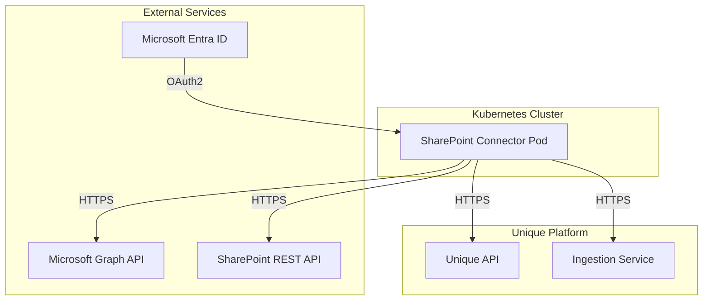
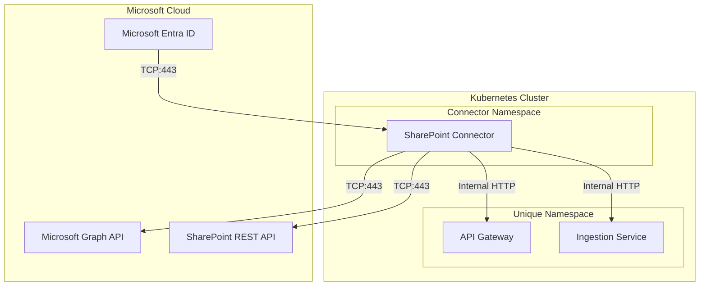

<!-- confluence-space-key: PUBDOC -->

## Overview

This guide provides IT operators with the technical information needed to deploy, configure, and maintain the SharePoint Connector.

For end-user and administrator documentation, see the [SharePoint Connector Overview](../README.md).

## Documentation

| Document | Description |
|----------|-------------|
| [Deployment](./deployment.md) | Container images, Helm charts, Terraform modules |
| [Configuration](./configuration.md) | Tenant configuration, site configuration, scheduling |
| [Authentication](./authentication.md) | Azure AD setup, certificates, service principals |
| [FAQ](../faq.md) | Frequently asked questions and common issues |

## Configuration Approach

The connector uses a **YAML-based tenant configuration file** that can source site configurations from:

| Source | Description |
|--------|-------------|
| `config_file` | Static YAML configuration for fixed site list |
| `sharepoint_list` | Dynamic configuration from a SharePoint list |

See [Configuration Guide](./configuration.md) for details.

## Architecture Overview

The SharePoint Connector runs as a **single pod** that periodically scans SharePoint sites and synchronizes flagged documents to the Unique knowledge base.

### Cluster-Internal Deployment

When deployed within the same Kubernetes cluster as Unique services:

In cluster-internal mode, Zitadel token validation is not needed as services communicate securely within the cluster using custom request headers for company and user scope.

## Infrastructure Requirements

| Component | Requirement | Notes |
|-----------|-------------|-------|
| **Kubernetes** | 1.25+ | Any Kubernetes distribution |
| **Container Runtime** | Docker/containerd | Standard container runtime |
| **Memory** | 2 GB | Minimum allocation |
| **CPU** | 1 core | Minimum allocation |

### Network Requirements

| Destination | Port | Protocol | Direction |
|-------------|------|----------|-----------|
| `login.microsoftonline.com` | 443 | HTTPS | Outbound |
| `graph.microsoft.com` | 443 | HTTPS | Outbound |
| `{tenant}.sharepoint.com` | 443 | HTTPS | Outbound |
| Unique API | 443/8080 | HTTPS/HTTP | Outbound/Internal |
| DNS | 53 | UDP/TCP | Outbound |

## Deployment Checklist

### 1. Infrastructure

- [ ] Kubernetes namespace created
- [ ] Network egress to Microsoft Graph allowed
- [ ] Network egress to SharePoint REST API allowed (if permission sync enabled)
- [ ] Connectivity to Unique API verified

### 2. Microsoft Entra ID

- [ ] App registration created
- [ ] API permissions granted
- [ ] Admin consent completed
- [ ] Certificate or client secret configured
- [ ] Site or library-specific access granted

### 3. Unique Platform

- [ ] Service user created with required permissions
- [ ] Company ID noted (for cluster-internal mode)
- [ ] Scope IDs created for each site to sync

### 4. Application

- [ ] Tenant configuration file created
- [ ] Certificate secrets created in Kubernetes
- [ ] Helm chart deployed
- [ ] Sites configured (YAML or SharePoint list)
- [ ] Sync column configured in SharePoint libraries

### 5. Verification

- [ ] Connector logs show successful authentication
- [ ] Sites are being scanned
- [ ] Flagged files are being synced
- [ ] Files appear in Unique knowledge base
