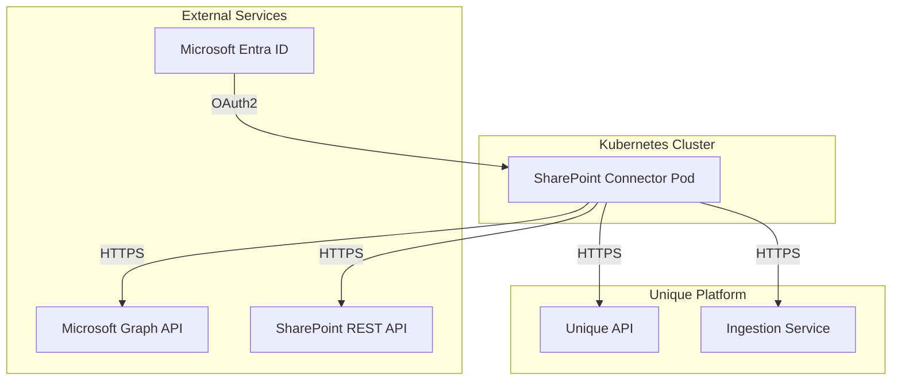
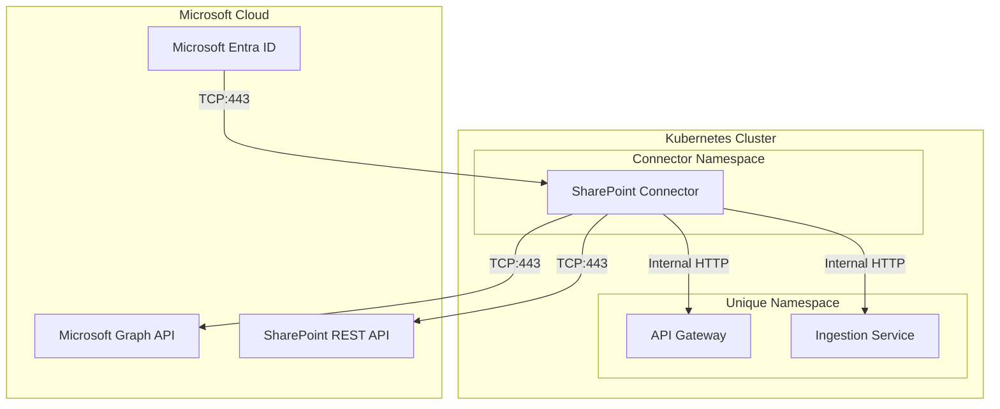

<!-- confluence-page-id: 1951858774 -->
<!-- confluence-space-key: PUBDOC -->

## Overview

This guide provides IT operators with the technical information needed to deploy, configure, and maintain the SharePoint Connector.

For end-user and administrator documentation, see the [SharePoint Connector Overview](../README.md).

## Documentation

| Document | Description |
|----------|-------------|
| [Deployment](./deployment.md) | Container images, Helm charts, Terraform modules, release/support policy |
| [Configuration](./configuration.md) | Tenant configuration, site configuration, scheduling |
| [Authentication](./authentication.md) | Azure AD setup, certificates, service principals |
| [FAQ](../faq.md) | Frequently asked questions and common issues |

## Configuration Approach

The connector uses a **YAML-based tenant configuration file** that can source site configurations from:

| Source | Description |
|--------|-------------|
| `config_file` | Static YAML configuration for fixed site list |
| `sharepoint_list` | Dynamic configuration from a SharePoint list |

See [Configuration Guide](./configuration.md) for details.

## Architecture Overview

```mermaid
flowchart TB
    subgraph External["External Services"]
        MSGraph["Microsoft Graph API"]
        SPREST["SharePoint REST API"]
        EntraID["Microsoft Entra ID"]
    end

    subgraph K8s["Kubernetes Cluster"]
        Connector["SharePoint Connector Pod"]
    end

    subgraph Unique["Unique Platform"]
        UniqueAPI["Unique API"]
        Ingestion["Ingestion Service"]
    end

    EntraID -->|"OAuth2"| Connector
    Connector -->|"HTTPS"| MSGraph
    Connector -->|"HTTPS"| SPREST
    Connector -->|"HTTPS"| UniqueAPI
    Connector -->|"HTTPS"| Ingestion
```

The SharePoint Connector runs as a **single pod** that periodically scans SharePoint sites and synchronizes flagged documents to the Unique knowledge base.

### Cluster-Internal Deployment

When deployed within the same Kubernetes cluster as Unique services:

```mermaid
flowchart TB
    subgraph External["Microsoft Cloud"]
        MSGraph["Microsoft Graph API"]
        SPREST["SharePoint REST API"]
        EntraID["Microsoft Entra ID"]
    end

    subgraph K8s["Kubernetes Cluster"]
        subgraph ConnectorNS["Connector Namespace"]
            Connector["SharePoint Connector"]
        end

        subgraph UniqueNS["Unique Namespace"]
            APIGateway["API Gateway"]
            IngestionSvc["Ingestion Service"]
        end
    end

    EntraID -->|"TCP:443"| Connector
    Connector -->|"TCP:443"| MSGraph
    Connector -->|"TCP:443"| SPREST
    Connector -->|"Internal HTTP"| APIGateway
    Connector -->|"Internal HTTP"| IngestionSvc
```

In cluster-internal mode, Zitadel token validation is not needed as services communicate securely within the cluster using custom request headers for company and user scope.

## Quick Start

### Unique SaaS

When Unique hosts the SharePoint Connector, Unique provisions the app registration, certificate, and deployment infrastructure. Your side of the setup is:

1. Provide the information below to Unique Support or Solution Engineering
2. [Grant admin consent](./authentication.md#unique-saas) using the URL Unique sends you
3. Grant site-specific access for Unique's app registration to each SharePoint site (see [Grant Site-Specific Access](./authentication.md#4-grant-site-specific-access)

**What to provide to Unique (all items are required):**

- [ ] **Microsoft Entra Tenant ID** — Azure Portal → Microsoft Entra ID → Overview → Directory (tenant) ID
  (e.g. `e7d7bf31-647b-47c2-a5e6-994918b4e07d`)
- [ ] **SharePoint base URL** — the root URL of your SharePoint Online tenant
  (e.g. `https://contoso.sharepoint.com`)
- [ ] **Site configuration source** — how the connector discovers which sites to sync:
  - **`sharepoint_list`** *(recommended)* — a SharePoint list controls which sites are synced dynamically; provide:
    - [ ] **Configuration site ID** — the ID of the SharePoint site that hosts the sync control list
    - [ ] **Configuration list ID** — the ID of the list within that site
  - **`config_file`** — a static list of site IDs baked into the deployment; provide:
    - [ ] The **Site IDs** to sync (and optionally Document Library IDs for library-level access)

For Multi Tenant deployments, grant site access to Unique's shared app ID `29a02f83-6586-429e-9a49-7af46db05f00`. For Single Tenant deployments, Unique will provide the dedicated app ID after provisioning.

## Infrastructure Requirements

| Component | Requirement | Notes |
|-----------|-------------|-------|
| **Kubernetes** | 1.25+ | Any Kubernetes distribution |
| **Container Runtime** | Docker/containerd | Standard container runtime |
| **Memory** | 2 GB | Minimum allocation |
| **CPU** | 1 core | Minimum allocation |

### Network Requirements

| Destination | Port | Protocol | Direction |
|-------------|------|----------|-----------|
| `login.microsoftonline.com` | 443 | HTTPS | Outbound |
| `graph.microsoft.com` | 443 | HTTPS | Outbound |
| `{tenant}.sharepoint.com` | 443 | HTTPS | Outbound |
| Unique API | 443/8080 | HTTPS/HTTP | Outbound/Internal |
| DNS | 53 | UDP/TCP | Outbound |

## Deployment Checklist

### 1. Infrastructure

- [ ] Kubernetes namespace created
- [ ] Network egress to Microsoft Graph allowed
- [ ] Network egress to SharePoint REST API allowed (if permission sync enabled)
- [ ] Connectivity to Unique API verified

### 2. Microsoft Entra ID

- [ ] App registration created
- [ ] API permissions granted
- [ ] Admin consent completed
- [ ] Certificate configured
- [ ] Site or library-specific access granted

### 3. Unique Platform

- [ ] Service user created with required permissions
- [ ] Company ID noted (for cluster-internal mode)
- [ ] Scope IDs created for each site to sync

### 4. Application

- [ ] Tenant configuration file created
- [ ] Certificate secrets created in Kubernetes
- [ ] Helm chart deployed
- [ ] Sites configured (YAML or SharePoint list)
- [ ] Sync column configured in SharePoint libraries

### 5. Verification

- [ ] Connector logs show successful authentication
- [ ] Sites are being scanned
- [ ] Flagged files are being synced
- [ ] Files appear in Unique knowledge base
- [ ] `GET /health` returns 200 with all checks passing
